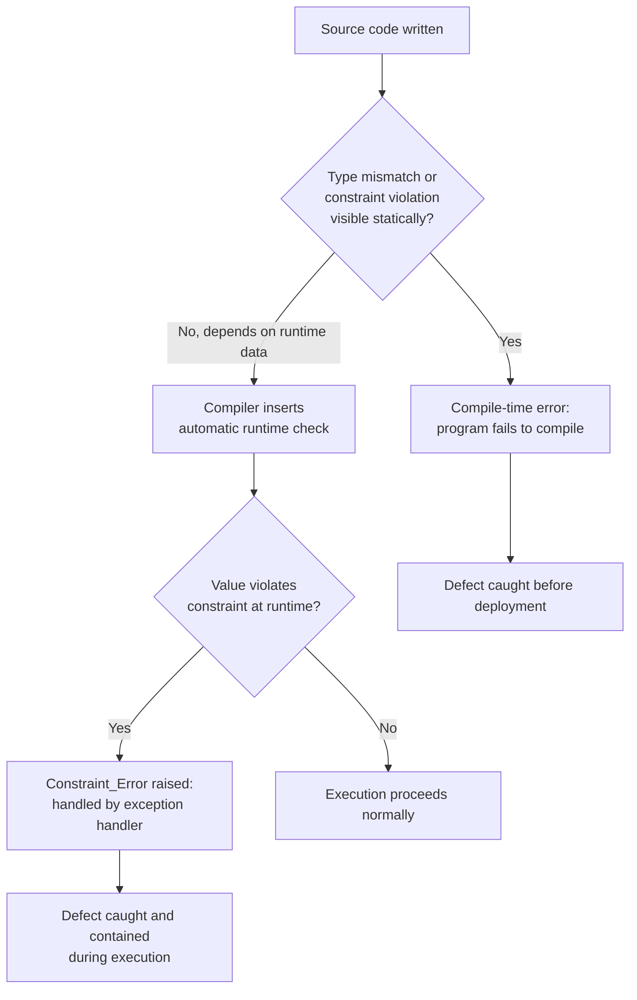

## Strong Typing and Compile-Time Safety Philosophy

### Overview

Ada's type system is not an incidental feature but a direct expression of the Steelman requirement for reliability in long-lived, safety-critical software. The underlying philosophy is that as many errors as possible should be caught by the compiler, before a program ever runs, rather than discovered at runtime in a deployed weapons system, aircraft, or spacecraft where failure is expensive or dangerous. This section covers the reasoning behind that philosophy and the mechanisms Ada uses to enforce it.

### The Core Philosophy

Ada's designers treated the type system as a primary defense mechanism against programmer error, not merely as a tool for organizing data.

**Key Points**

- The guiding principle is often summarized as "if it compiles, entire categories of errors cannot occur," shifting error detection as early as possible in the development lifecycle.
- This contrasts with languages of the same era (such as C) that favored programmer flexibility and minimal runtime overhead over strict compile-time enforcement, allowing implicit conversions and weaker bounds checking.
- The rationale was explicitly economic as well as technical: catching a defect at compile time is dramatically cheaper than catching it during integration testing, and far cheaper still than catching it after deployment in a fielded system with a multi-decade service life.
- Strong typing was intended to make incorrect programs *fail to compile* rather than compile and behave unpredictably, aligning with the Steelman goal of maintainability by teams other than the original authors, who cannot be expected to intuit undocumented type assumptions in someone else's code.

### Static, Strong Typing

Ada is statically typed (types are checked at compile time) and strongly typed (implicit, unsafe conversions between unrelated types are disallowed).

**Key Points**

- Every variable, constant, and expression has a type that is fixed at compile time; there is no dynamic type-changing of variables during execution.
- Unlike C, Ada does not allow implicit conversion between different numeric types or between numeric types and enumerations without an explicit conversion, reducing an entire class of subtle bugs caused by silent truncation or reinterpretation.
- Even two numerically compatible types, such as two different integer types representing conceptually different quantities, are treated as distinct and non-interchangeable unless explicitly converted, preventing accidental mixing of values that happen to share a representation but not a meaning.

### Named and Derived Types

Ada allows programmers to create new types that are distinct from any existing type, even when they share the same underlying representation.

**Key Points**

- A derived type creates a genuinely new type based on an existing one, inheriting its operations but not implicitly interchangeable with it, so `type Meters is new Float;` and `type Feet is new Float;` cannot be mixed in an expression without explicit conversion, even though both are floating-point numbers underneath.
- This directly targets a common class of real-world engineering failures where quantities of different units or meanings were accidentally combined; the philosophy is to make such mistakes a compile-time error rather than a runtime or logical one.
- [Inference] This design is frequently cited in the Ada community as a preventive measure against unit-confusion errors of the kind implicated in some historical engineering failures, though attributing specific incidents to the *absence* of such type systems is an inference about causation rather than a directly documented compiler behavior.

### Range Constraints and Subtypes

Beyond distinguishing types, Ada allows explicit range constraints to be attached to types and subtypes, enabling the compiler and runtime to detect out-of-bounds values.

**Key Points**

- A type or subtype can specify an explicit valid range, such as `type Percentage is range 0 .. 100;`, and any attempt to assign a value outside that range raises a runtime exception (`Constraint_Error`) if it cannot be caught at compile time.
- Where possible, the compiler performs range checking statically; where the value depends on runtime data, the check is deferred to a runtime check inserted automatically by the compiler.
- This ensures invalid states, such as a negative array index or an out-of-range sensor reading, are caught immediately at the point of assignment or use rather than silently propagating and causing failures elsewhere in the system.

### Array Bounds and Index Checking

Array accesses in Ada are automatically checked against declared bounds, contrasting with languages that leave bounds-checking as an optional or manual responsibility of the programmer.

**Key Points**

- Every array access is checked at runtime (unless the compiler can prove the check unnecessary), and an out-of-bounds access raises `Constraint_Error` rather than silently reading or writing adjacent memory.
- This directly addresses a class of defects, buffer overreads and overwrites, that has historically been a major source of security vulnerabilities and crashes in languages with unchecked array access.
- [Behavior may vary] The degree to which the compiler can eliminate redundant runtime bounds checks through static analysis depends on the specific compiler implementation and optimization settings, so actual runtime overhead differs across toolchains.

### Explicit Conversions and No Implicit Coercion

Ada requires explicit type conversion syntax wherever a value of one type is used in a context expecting another, rather than silently coercing values.

**Key Points**

- Where a conversion is genuinely intended, the programmer must write it explicitly, such as `Integer(My_Float_Value)`, making every type boundary crossing visible in the source code and subject to review.
- This is a deliberate readability and safety tradeoff: Ada code is often more verbose than equivalent C code at these boundaries, but the verbosity is intended to make intent explicit and catch accidental mismatches.
- Enumeration types are treated as fully distinct from integers; an enumeration value cannot be used as an integer or vice versa without explicit conversion, preventing bugs where an enumerated status code is accidentally treated as a raw number.

### Compile-Time vs. Runtime Enforcement

Ada's safety philosophy distinguishes between checks the compiler can perform statically and checks that must be deferred to runtime, but treats both as part of the same overall guarantee.

**Key Points**

- Where the compiler can prove a constraint violation is impossible or certain given static information, it performs the check (or flags an error) at compile time.
- Where the value is not known until runtime (such as user input or sensor data), the compiler inserts an automatic runtime check that raises a structured exception if the constraint is violated, rather than allowing undefined behavior.
- This combination means Ada rarely has genuinely undefined behavior in the way C does for things like signed integer overflow or out-of-bounds access; instead, violations are turned into a well-defined, catchable exception.
- [Behavior may vary] Runtime checks can be selectively suppressed by the programmer (via pragmas) in performance-critical sections, which trades safety guarantees for speed; the availability and exact syntax for suppression varies by compiler and language version, and using suppression reintroduces the possibility of undefined behavior in that specific region.

### Comparison with Contemporary Languages

Ada's compile-time safety philosophy stood in deliberate contrast to the dominant systems languages of its era.

**Key Points**

- C, widely used for systems programming at the time, favored minimal runtime checks and implicit conversions, prioritizing performance and programmer control over compile-time guarantees.
- Pascal, an influence on Ada's syntax, had some strong typing but lacked Ada's depth of range constraints, derived types, and mandatory runtime checking on array and scalar operations.
- [Inference] Ada's approach is often described as a philosophical ancestor to later "safety-first" systems languages such as Rust, which similarly emphasizes catching classes of memory and type errors at compile time, though Rust achieves this through a different mechanism (ownership and borrowing) rather than Ada's range-and-subtype model, and any direct lineage claim beyond general influence is an inference rather than a documented design dependency.

### Type Safety Flow Diagram

### Conclusion

Ada's type system reflects a coherent philosophy rather than a loose collection of features: catch as many defects as possible before a program runs, make every type-crossing decision explicit and visible in source code, and where runtime checking is unavoidable, make it automatic and well-defined rather than leaving behavior undefined. This philosophy traces directly back to the Steelman requirement for reliability in software that would be maintained for decades by teams distant from the original authors and deployed in contexts where failure carries serious safety consequences. The tradeoff, greater verbosity and some runtime overhead compared to more permissive languages, was treated by Ada's designers as an acceptable and even necessary cost given the domain the language was built for.

**Related Topics**

- Ada's exception handling model and structured error recovery
- Subtypes versus derived types in depth
- Pragma Suppress and controlled relaxation of runtime checks
- SPARK: formally verifiable subset of Ada for compile-time proof of absence of runtime errors
- Comparison of Ada's type safety model with Rust's ownership model
- Generic units and type-safe reusable components in Ada