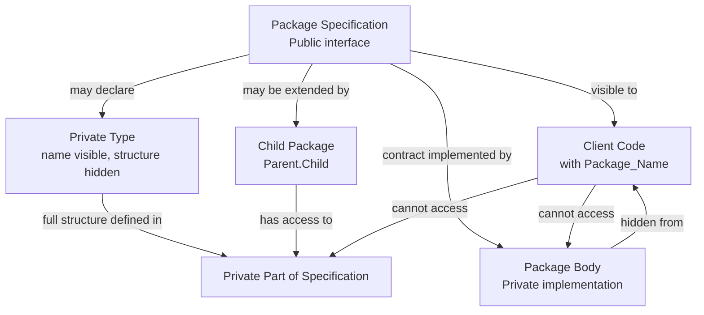

## Packages and Modular Program Structure

### Overview

Packages are Ada's primary mechanism for organizing large programs into maintainable, independently developed units. They directly address the Steelman requirement for modularity in systems built and maintained by multiple contractors over long lifecycles. A package separates *what* a module offers from *how* it is implemented, allowing the two to be developed, compiled, and even changed somewhat independently.

### The Core Idea: Specification and Body

Every Ada package is conceptually split into two parts: a specification (the public interface) and a body (the implementation).

**Key Points**

- The **package specification** declares what the package exposes to the outside world: types, constants, variables, and subprogram (procedure/function) signatures.
- The **package body** contains the actual implementation of the subprograms declared in the specification, along with any private helper logic not visible to clients of the package.
- Clients of a package interact only with the specification; they do not need to see, understand, or even have access to the body to use the package correctly.
- This separation allows one team to define and freeze an interface while another team implements it, and allows the implementation to change later without forcing client code to be rewritten, as long as the specification's contract is preserved.

### Package Specification Syntax

A package specification declares the public interface using the `package ... is ... end` structure.

**Key Points**

- A minimal specification might declare a type, a constant, and a procedure signature, for example:



```
package Stack_Manager is
   Max_Size : constant Integer := 100;
   procedure Push (Item : in Integer);
   procedure Pop (Item : out Integer);
   function Is_Empty return Boolean;
end Stack_Manager;
```

- Everything declared in the visible part of the specification is accessible to any unit that references the package, subject to Ada's visibility and `with`/`use` rules.
- Specifications can also declare private types, discussed further below, which are visible by name to clients but whose internal structure is hidden.

### Package Body Syntax

The package body provides the actual implementation corresponding to the specification.

**Key Points**

- The body must implement every subprogram declared in the specification, matching the declared signatures exactly.
- A body may also declare additional internal state, types, and helper subprograms that are not visible outside the package at all, not even by name, for example:



```
package body Stack_Manager is
   Data : array (1 .. Max_Size) of Integer;
   Top  : Integer := 0;

   procedure Push (Item : in Integer) is
   begin
      Top := Top + 1;
      Data (Top) := Item;
   end Push;

   procedure Pop (Item : out Integer) is
   begin
      Item := Data (Top);
      Top := Top - 1;
   end Pop;

   function Is_Empty return Boolean is
   begin
      return Top = 0;
   end Is_Empty;
end Stack_Manager;
```

- In this example, `Data` and `Top` are entirely invisible outside the package body; client code can only interact with the stack through `Push`, `Pop`, and `Is_Empty`, enforcing encapsulation.

### Separate Compilation

A key practical benefit of the specification/body split is that Ada supports genuinely separate compilation of interconnected units.

**Key Points**

- A package specification can be compiled on its own, allowing other units that depend on it (`with` it) to be compiled against the interface before the body is finished.
- This enables large teams to work in parallel: one group can finalize and compile a specification early, and other groups can begin writing and compiling client code against it immediately, without waiting for the implementation to be complete.
- The compiler checks that client code only uses what the specification exposes, and separately checks that the body correctly implements the specification, catching mismatches at compile time rather than at link time or runtime.
- [Behavior may vary] The exact incremental recompilation behavior when a package body changes without a specification change depends on the specific compiler and build system's dependency tracking, though the language rules guarantee that a body-only change does not require recompiling clients that depend only on the specification.

### Encapsulation via Private Types

Ada packages support genuine information hiding through private type declarations, allowing a type's existence to be public while its internal representation remains hidden.

**Key Points**

- A specification can declare a type as `private`, meaning clients can declare variables of that type and pass them to the package's subprograms, but cannot see or directly manipulate its internal fields.
- The private section of the specification, physically present in the same file but access-restricted, contains the actual internal representation, visible to the compiler for type-checking purposes but not usable directly by client code.
- This enforces a strict client-implementation boundary: clients must use the package's provided operations to interact with the data, since they have no way to reach into its internals even if they wanted to.
- Example structure:



```
package Bank_Account is
   type Account is private;
   procedure Deposit (Acc : in out Account; Amount : Float);
   procedure Withdraw (Acc : in out Account; Amount : Float);
private
   type Account is record
      Balance : Float := 0.0;
   end record;
end Bank_Account;
```

### Package Hierarchies and Child Packages

Ada supports organizing related packages into hierarchies using child packages, allowing large systems to be structured into logical, nested groupings.

**Key Points**

- A child package, declared as `package Parent.Child is ...`, has special visibility into the private parts of its parent package, enabling closely related functionality to be split across multiple files while still sharing implementation details that outside packages cannot access.
- This supports extending a package's functionality without modifying its original specification or body, useful when a library needs to be extended by different teams without altering shared, already-validated code.
- Child packages contribute to organizing very large systems, such as an entire avionics software suite, into a coherent namespace hierarchy rather than a flat collection of unrelated package names.

### The `with` and `use` Clauses

Access to another package's public interface is granted explicitly through `with` and, optionally, `use` clauses.

**Key Points**

- `with Package_Name;` makes a package's public specification visible to the current unit, required before referencing anything from that package.
- `use Package_Name;` additionally allows referencing the package's contents without qualifying them by package name (e.g., writing `Push` instead of `Stack_Manager.Push`), trading brevity for a small risk of naming ambiguity.
- Requiring explicit `with` clauses makes a unit's dependencies fully visible at the top of the file, supporting the maintainability goal by making it immediately clear what a given unit relies on.

### Modularity Diagram



### Encapsulation Boundary Diagram

<svg xmlns="http://www.w3.org/2000/svg" viewBox="0 0 820 380">
\<style\>
.title { font: bold 18px sans-serif; fill: #1a1a1a; }
.box-label { font: bold 13px sans-serif; fill: #1a1a1a; }
.sub-label { font: 12px sans-serif; fill: #333333; }
\</style\>
<text x="410" y="28" text-anchor="middle" class="title">Package Visibility Boundaries (svg_diagram)</text>
<rect x="40" y="60" width="300" height="120" rx="8" fill="#dbeafe" stroke="#2563eb" stroke-width="2" />
<text x="190" y="85" text-anchor="middle" class="box-label">Client Code</text>
<text x="190" y="105" text-anchor="middle" class="sub-label">with Bank_Account;</text>
<text x="190" y="125" text-anchor="middle" class="sub-label">Acc : Bank_Account.Account;</text>
<text x="190" y="145" text-anchor="middle" class="sub-label">Deposit (Acc, 50.0);</text>
<text x="190" y="165" text-anchor="middle" class="sub-label">(cannot see Balance field)</text>
<line x1="340" y1="120" x2="420" y2="120" stroke="#666" stroke-width="2" marker-end="url(#arrow)" />
<rect x="420" y="60" width="360" height="120" rx="8" fill="#eef2ff" stroke="#4338ca" stroke-width="2" />
<text x="600" y="85" text-anchor="middle" class="box-label">Package Specification (Visible Part)</text>
<text x="600" y="105" text-anchor="middle" class="sub-label">type Account is private;</text>
<text x="600" y="125" text-anchor="middle" class="sub-label">procedure Deposit (...);</text>
<text x="600" y="145" text-anchor="middle" class="sub-label">procedure Withdraw (...);</text>
<rect x="420" y="200" width="360" height="80" rx="8" fill="#fee2e2" stroke="#dc2626" stroke-width="2" />
<text x="600" y="225" text-anchor="middle" class="box-label">Private Part</text>
<text x="600" y="245" text-anchor="middle" class="sub-label">type Account is record</text>
<text x="600" y="262" text-anchor="middle" class="sub-label">Balance : Float := 0.0;</text>
<rect x="40" y="230" width="300" height="120" rx="8" fill="#fef3c7" stroke="#b45309" stroke-width="2" />
<text x="190" y="255" text-anchor="middle" class="box-label">Package Body</text>
<text x="190" y="275" text-anchor="middle" class="sub-label">procedure Deposit (...) is</text>
<text x="190" y="295" text-anchor="middle" class="sub-label">begin</text>
<text x="190" y="313" text-anchor="middle" class="sub-label">Acc.Balance := Acc.Balance + Amount;</text>
<text x="190" y="331" text-anchor="middle" class="sub-label">end Deposit;</text>
<line x1="420" y1="260" x2="340" y2="290" stroke="#666" stroke-width="2" marker-end="url(#arrow)" />
</svg>

### Conclusion

Packages give Ada a disciplined answer to the modularity requirement that originally motivated the language's creation: large defense software systems, built by multiple contractors over long timeframes, needed a way to define stable contracts between components without exposing implementation details that might change. The specification/body split, combined with private types and package hierarchies, gives Ada genuine compiler-enforced encapsulation rather than relying on convention or documentation alone. This makes packages one of the clearest examples of Ada's broader design philosophy: turning organizational and safety requirements directly into language features enforced by the compiler rather than left to programmer discipline.

**Related Topics**

- Generic packages and type-parameterized modules
- Child packages and private child units in depth
- Separate compilation units and compilation order in Ada
- Comparison of Ada packages with modules in Modula-2 and namespaces in C++
- Visibility rules: `with`, `use`, and use type clauses
- Limited private types and controlled types