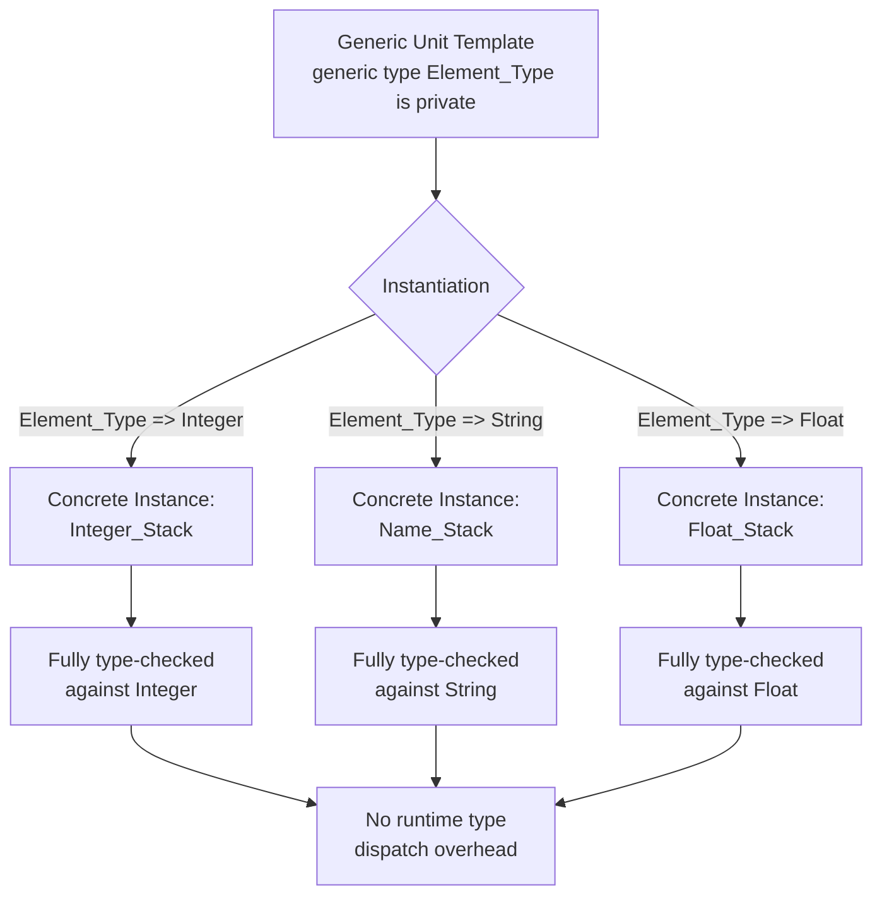

## Generics and Reusable Components

### Overview

Generics are Ada's mechanism for writing reusable code that works across multiple types without sacrificing the language's strong static typing. Rather than writing a separate sorting procedure for integers, floats, and records, a programmer writes one generic sorting procedure parameterized by type, which the compiler then instantiates as a fully type-checked, concrete unit for each specific type it is used with. This directly satisfies the Steelman requirement for reusable components without the runtime overhead or type-safety gaps associated with less strict genericity mechanisms.

### The Core Idea

A generic unit in Ada is a template for a package or subprogram, parameterized over types, values, or even subprograms, that must be instantiated with concrete arguments before it can be used.

**Key Points**

- Generics solve the problem of code duplication for logic that is structurally identical but needs to operate on different types, such as a stack, a sorting algorithm, or a mathematical utility.
- Unlike a purely dynamic or untyped approach to genericity, Ada generics are resolved entirely at compile time: each instantiation produces a distinct, fully type-checked unit, with no runtime type inspection or dynamic dispatch overhead required.
- This design reflects the same underlying philosophy as Ada's type system generally: maximize what the compiler can verify, and avoid deferring correctness guarantees to runtime.

### Generic Subprograms

A generic subprogram is parameterized over one or more types and can be instantiated for any type that satisfies the stated constraints.

**Key Points**

- A generic subprogram declaration specifies formal generic parameters before the subprogram itself, for example:



```
generic
   type Item_Type is private;
procedure Swap (X, Y : in out Item_Type);
```

- The implementation is written once, generically, and works for any type that matches the formal parameter's constraint (`private` here means any definite, assignable type):



```
procedure Swap (X, Y : in out Item_Type) is
   Temp : Item_Type;
begin
   Temp := X;
   X := Y;
   Y := Temp;
end Swap;
```

- To use it, the generic must be instantiated for a specific type, creating a concrete, callable subprogram:



```
procedure Swap_Integers is new Swap (Item_Type => Integer);
procedure Swap_Floats is new Swap (Item_Type => Float);
```

- Each instantiation is independently type-checked; `Swap_Integers` only accepts `Integer` arguments, and any attempt to pass a mismatched type at the call site is caught at compile time.

### Generic Packages

Generic packages extend the same idea to entire modules, allowing a whole set of related types and operations to be parameterized together.

**Key Points**

- A generic package might parameterize an entire data structure implementation, such as a stack or queue, over the element type it stores:



```
generic
   type Element_Type is private;
   Max_Size : Integer;
package Generic_Stack is
   procedure Push (Item : in Element_Type);
   procedure Pop (Item : out Element_Type);
   function Is_Empty return Boolean;
end Generic_Stack;
```

- Instantiating this generic package produces a fully concrete package, with its own independent state, for a specific type and size:



```
package Integer_Stack is new Generic_Stack (Element_Type => Integer, Max_Size => 100);
package Name_Stack is new Generic_Stack (Element_Type => String, Max_Size => 50);
```

- `Integer_Stack` and `Name_Stack` are entirely separate packages after instantiation, each with its own internal state; they do not share data even though they were generated from the same generic template.
- This pattern is the Ada equivalent of what is commonly called a "container library" in other languages, but built with compile-time type safety and no reliance on a common base type or runtime type erasure.

### Generic Parameters Beyond Types

Ada generics can be parameterized not only by types, but also by values, and by subprograms, allowing more sophisticated reusable components.

**Key Points**

- A generic can take a value parameter, such as `Max_Size : Integer` in the stack example above, allowing the same generic template to be instantiated with different fixed configuration values.
- A generic can also take a subprogram as a formal parameter, allowing customizable behavior to be injected into the generic unit, for example a generic sorting procedure parameterized by a comparison function:



```
generic
   type Element_Type is private;
   with function "<" (Left, Right : Element_Type) return Boolean;
procedure Generic_Sort (Data : in out array_type);
```

- This subprogram-parameterization pattern allows the same generic algorithm to be reused with entirely different comparison logic for different types or different sorting criteria on the same type, without modifying the algorithm's implementation.

### Constraints on Generic Formal Parameters

Ada allows generic formal type parameters to be constrained to only accept types with certain properties, ensuring the generic body can only be instantiated with compatible types.

**Key Points**

- A formal type parameter declared as `private` accepts any definite type that supports assignment and equality, the most permissive common constraint.
- More specific formal type categories exist for numeric types (`type T is range <>` for discrete types, `type T is digits <>` for floating-point types), array types, and access (pointer) types, restricting instantiation to types that genuinely support the operations the generic body relies on.
- This constraint checking happens at instantiation time: if a programmer attempts to instantiate a generic numeric algorithm with a non-numeric type, the compiler rejects the instantiation immediately, rather than allowing a mismatched type to slip through and fail unpredictably later.

### Compile-Time Expansion Model

Ada generics are typically implemented via compile-time expansion, meaning each instantiation conceptually produces its own independent copy of the code, specialized for the given parameters.

**Key Points**

- Conceptually, each `new` instantiation behaves as though the generic template were copy-pasted with the formal parameters substituted by the actual arguments, then compiled as an ordinary unit.
- This model avoids the runtime overhead associated with dynamic dispatch or type erasure found in some other languages' generics implementations, since the compiler has full concrete type information at each call site after instantiation.
- [Behavior may vary] The exact code-generation strategy, whether a compiler literally duplicates code per instantiation or applies optimizations to share common logic across instantiations with similar layouts, is implementation-defined and differs between Ada compilers and their optimization settings.

### Generics and Modularity Together

Generics are commonly combined with Ada's package system to build reusable, type-safe libraries that are still cleanly encapsulated.

**Key Points**

- A generic package can itself use private types internally, meaning an instantiated version of the generic package still enforces the same encapsulation guarantees described for ordinary packages.
- This combination, generics for reuse plus packages for encapsulation, is how much of the standard Ada library (containers, string handling, mathematical functions) is structured, allowing a small set of generic templates to serve a very wide range of concrete use cases.
- The result is that a data structure like a generic stack or list can be reused across an entire large defense software system for many different element types, without duplicating implementation code and without giving up any of Ada's compile-time safety guarantees.

### Generic Instantiation Flow Diagram



### Reuse Without Sacrificing Safety Diagram

<svg xmlns="http://www.w3.org/2000/svg" viewBox="0 0 820 320">
\<style\>
.title { font: bold 18px sans-serif; fill: #1a1a1a; }
.label { font: bold 13px sans-serif; fill: #1a1a1a; }
.sub { font: 12px sans-serif; fill: #333333; }
\</style\>
<text x="410" y="28" text-anchor="middle" class="title">One Generic Template, Many Safe Instantiations (svg_diagram)</text>
<rect x="320" y="60" width="180" height="60" rx="8" fill="#4338ca" />
<text x="410" y="95" text-anchor="middle" class="label" fill="#ffffff">Generic_Stack</text>
<line x1="360" y1="120" x2="150" y2="190" stroke="#666" stroke-width="2" />
<line x1="410" y1="120" x2="410" y2="190" stroke="#666" stroke-width="2" />
<line x1="460" y1="120" x2="670" y2="190" stroke="#666" stroke-width="2" />
<rect x="60" y="190" width="180" height="60" rx="8" fill="#dbeafe" stroke="#2563eb" stroke-width="2" />
<text x="150" y="215" text-anchor="middle" class="label">Integer_Stack</text>
<text x="150" y="235" text-anchor="middle" class="sub">Element_Type = Integer</text>
<rect x="320" y="190" width="180" height="60" rx="8" fill="#dcfce7" stroke="#16a34a" stroke-width="2" />
<text x="410" y="215" text-anchor="middle" class="label">Name_Stack</text>
<text x="410" y="235" text-anchor="middle" class="sub">Element_Type = String</text>
<rect x="580" y="190" width="180" height="60" rx="8" fill="#fef3c7" stroke="#b45309" stroke-width="2" />
<text x="670" y="215" text-anchor="middle" class="label">Float_Stack</text>
<text x="670" y="235" text-anchor="middle" class="sub">Element_Type = Float</text>

<text x="410" y="290" text-anchor="middle" class="sub">Each instance independently type-checked; no shared state, no runtime type errors</text>

</svg>

### Conclusion

Generics let Ada satisfy the competing goals of code reuse and compile-time type safety simultaneously, avoiding the tradeoff many other languages of the era forced between the two. By resolving all generic instantiation at compile time, and allowing formal parameters over types, values, and even subprograms, Ada enables highly reusable libraries, data structures, and algorithms while preserving the same strict static checking that defines the rest of the language. Combined with the package system for encapsulation, generics were central to enabling large, multi-contractor Ada projects to share common, verified components rather than repeatedly reimplementing the same logic for each new type, directly supporting the maintainability and reliability goals that shaped the language from its inception.

**Related Topics**

- Generic formal parameter categories: private, limited private, discrete, digits, array, access
- Ada's standard generic containers library
- Combining generics with child packages for extensible libraries
- Comparison of Ada generics with C++ templates and Java generics
- Generic subprogram parameters and injecting custom behavior
- Instantiation-time constraint checking and error diagnostics