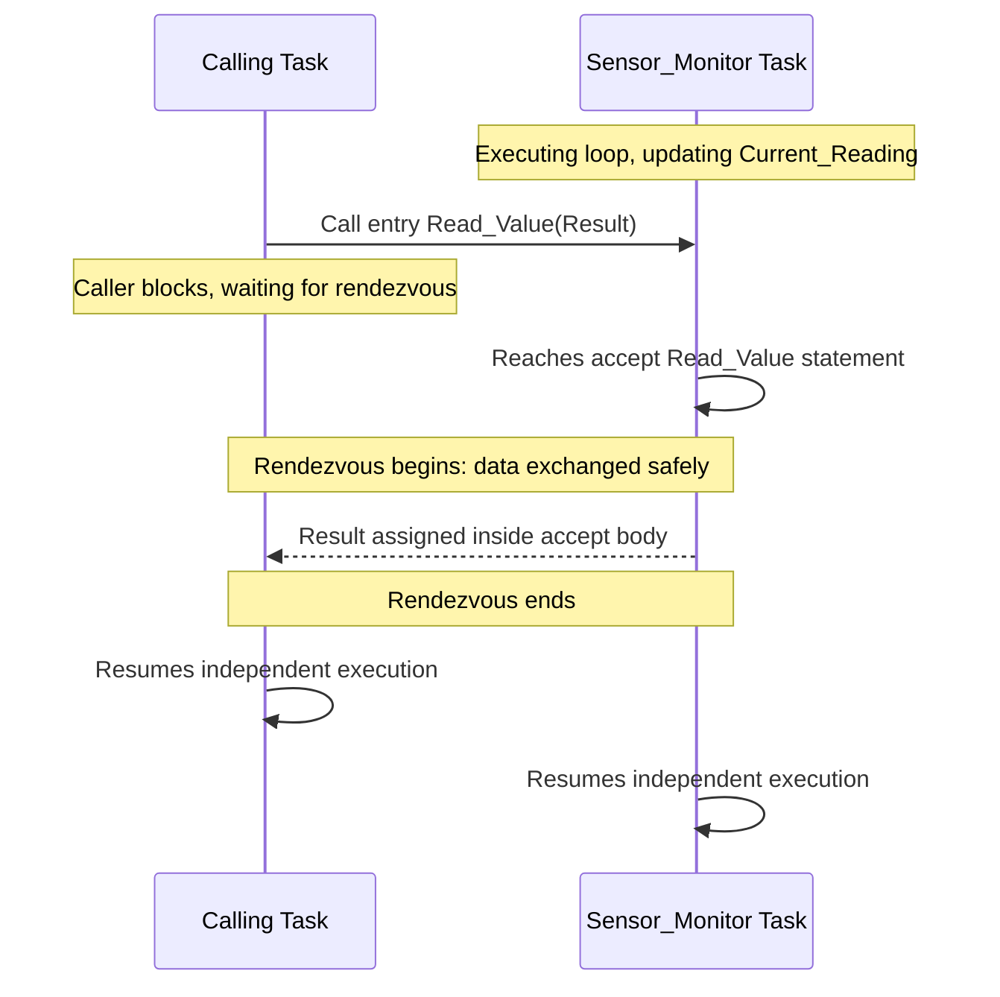

## Tasking Model and Concurrent Programming Support

### Overview

Ada was one of the first widely standardized languages to build concurrency directly into the language itself, rather than relying on operating-system-specific libraries or third-party threading APIs. This was a direct response to the Steelman requirement for real-time embedded systems, such as radar processors and avionics, that needed multiple independent activities to run predictably and communicate safely. Ada's tasking model provides tasks as first-class language constructs, with a built-in synchronization mechanism called the rendezvous, along with protected objects added in later revisions for more efficient shared-data access.

### The Core Idea: Tasks as Language Constructs

In Ada, a task is a unit of concurrent execution defined directly in the language syntax, conceptually similar to a package but representing an independently executing thread of control rather than a passive module.

**Key Points**

- A task has its own specification and body, structured similarly to a package, declaring what entries (synchronization points) it exposes and implementing its internal logic.
- Tasks begin executing automatically once elaborated (created), without requiring an explicit "start" call, distinguishing Ada's model from thread libraries where a thread must be explicitly launched.
- Because tasking is part of the language standard rather than a library, the compiler and runtime system are directly responsible for scheduling, synchronization semantics, and exception propagation across tasks, rather than leaving these concerns to external, potentially inconsistent library implementations.
- This design reflects the same underlying philosophy applied elsewhere in Ada: put safety-critical behavior under the compiler's control rather than programmer discipline or third-party tooling.

### Task Declaration and Structure

A task is declared with a specification (listing its entries) and a body (implementing its behavior), much like a package.

**Key Points**

- A minimal task declaration might look like:



```
task Sensor_Monitor is
   entry Read_Value (Result : out Integer);
end Sensor_Monitor;
```

- The corresponding body implements the task's internal behavior and handles calls to its declared entries:



```
task body Sensor_Monitor is
   Current_Reading : Integer := 0;
begin
   loop
      Current_Reading := Current_Reading + 1;  -- simulate sensor update
      accept Read_Value (Result : out Integer) do
         Result := Current_Reading;
      end Read_Value;
   end loop;
end Sensor_Monitor;
```

- Once declared, the task begins running concurrently with the rest of the program automatically; other parts of the program interact with it only through its declared entries.

### The Rendezvous Mechanism

The rendezvous is Ada's core synchronization primitive: a synchronous meeting point between a calling task and a task that accepts the call.

**Key Points**

- A calling task invokes another task's entry the same way it would call a procedure, for example `Sensor_Monitor.Read_Value (Value);`, and blocks until the target task reaches a corresponding `accept` statement for that entry.
- The target task's `accept` statement defines a body that executes while both tasks are synchronized, allowing safe data exchange (via `in`, `out`, or `in out` parameters) without a separate locking mechanism, since only one rendezvous with a given entry proceeds at a time.
- Once the `accept` body finishes executing, both tasks resume independent execution, having exchanged data safely during the synchronized window.
- [Behavior may vary] The precise scheduling behavior when multiple calling tasks are simultaneously queued on the same entry (such as ordering guarantees beyond first-in-first-out) can be influenced by task priorities and is subject to specific rules defined by the language standard and implementation, so exact queuing behavior should be verified against the relevant Ada Reference Manual version and compiler documentation.

### Select Statements and Conditional Rendezvous

Ada provides `select` statements to allow a task to wait on multiple possible entry calls, implement timeouts, or make an entry call conditional.

**Key Points**

- A **selective accept** allows a task to offer multiple entries simultaneously and respond to whichever is called first, useful for a server-like task handling several kinds of requests.
- A **timed entry call** allows a calling task to attempt a rendezvous but give up and proceed with alternative logic if the target task does not accept the call within a specified time, important for real-time systems where indefinite blocking is unacceptable.
- A **conditional entry call** allows a calling task to attempt a rendezvous only if the target is immediately ready to accept it, proceeding immediately otherwise without blocking at all.
- These constructs give real-time system designers explicit control over how long a task may wait for synchronization, directly supporting the predictable timing behavior required by embedded defense systems such as radar or flight control software.

### Protected Objects (Ada 95 and Later)

Protected objects, introduced in the Ada 95 revision, provide an alternative, often more efficient synchronization mechanism for simple shared-data access compared to full task rendezvous.

**Key Points**

- A protected object encapsulates shared data along with protected operations (protected procedures, functions, and entries) that automatically ensure mutually exclusive access, similar in spirit to a monitor in other concurrency models.
- Protected functions allow concurrent read-only access from multiple tasks simultaneously, while protected procedures and entries enforce exclusive access, giving finer-grained control than a full task-based rendezvous when the goal is simply safe shared-state access rather than complex synchronization logic.
- Protected objects are generally lighter-weight than full tasks for simple shared-resource scenarios (such as a shared counter or a bounded buffer), since they do not require their own independent thread of control; they exist specifically to coordinate access from tasks rather than to run active logic themselves.
- [Inference] Protected objects are often described as complementing rather than replacing the rendezvous model: rendezvous suits complex, multi-step synchronization and communication between active tasks, while protected objects suit simple, high-frequency shared-data access, though the specific choice between them in any given design is a matter of engineering judgment rather than a fixed language rule.

### Task Priorities and Real-Time Scheduling

Because Ada was designed for real-time embedded systems, the language provides mechanisms to control task scheduling priority, particularly refined in later revisions aimed at the real-time systems domain.

**Key Points**

- Tasks can be assigned explicit priorities, influencing how the underlying runtime scheduler allocates processor time among competing tasks.
- Later Ada standards, particularly Ada 95 and subsequent revisions with the Real-Time Systems Annex, introduced more sophisticated scheduling policies, including support for priority ceiling protocols to help prevent priority inversion when tasks share protected objects.
- [Behavior may vary] The specific scheduling algorithm, priority range, and real-time guarantees available depend on the underlying operating system or bare-metal runtime environment the Ada program is compiled for, since the language standard defines required semantics but actual timing behavior is also a function of the platform.

### Exception Handling Across Tasks

Ada's tasking model integrates with its exception handling system, defining how errors propagate when they occur inside a task or during a rendezvous.

**Key Points**

- An unhandled exception within a task body terminates that specific task but does not automatically terminate other tasks in the program, isolating failures to the task in which they occurred unless the design explicitly propagates the failure.
- An exception raised during the execution of an `accept` body can propagate to both the accepting task and, in some circumstances, back to the calling task, with specific propagation rules defined by the language standard governing exactly how this occurs.
- This structured propagation model is intended to prevent a failure in one concurrent activity from silently corrupting or invisibly crashing unrelated parts of a real-time system, supporting fault containment in safety-critical designs.

### Rendezvous Sequence Diagram



### Tasking Model Structure Diagram

<svg xmlns="http://www.w3.org/2000/svg" viewBox="0 0 860 380">
\<style\>
.title { font: bold 18px sans-serif; fill: #1a1a1a; }
.label { font: bold 13px sans-serif; fill: #ffffff; }
.sub { font: 12px sans-serif; fill: #1a1a1a; }
\</style\>
<text x="430" y="28" text-anchor="middle" class="title">Ada Concurrency Constructs Overview (svg_diagram)</text>
<rect x="40" y="60" width="220" height="60" rx="8" fill="#2563eb" />
<text x="150" y="95" text-anchor="middle" class="label">Task</text>
<rect x="320" y="60" width="220" height="60" rx="8" fill="#7c3aed" />
<text x="430" y="95" text-anchor="middle" class="label">Rendezvous</text>
<rect x="600" y="60" width="220" height="60" rx="8" fill="#16a34a" />
<text x="710" y="95" text-anchor="middle" class="label">Protected Object</text>

<text x="150" y="150" text-anchor="middle" class="sub">Independent thread</text>

<text x="150" y="168" text-anchor="middle" class="sub">of control, own</text>

<text x="150" y="186" text-anchor="middle" class="sub">entries and body</text>

<text x="430" y="150" text-anchor="middle" class="sub">Synchronous meeting</text>

<text x="430" y="168" text-anchor="middle" class="sub">point for two tasks</text>

<text x="430" y="186" text-anchor="middle" class="sub">to exchange data</text>

<text x="710" y="150" text-anchor="middle" class="sub">Encapsulated shared</text>

<text x="710" y="168" text-anchor="middle" class="sub">state with mutually</text>

<text x="710" y="186" text-anchor="middle" class="sub">exclusive operations</text>

<rect x="40" y="230" width="780" height="110" rx="8" fill="#fef3c7" stroke="#b45309" stroke-width="1.5" />
<text x="430" y="255" text-anchor="middle" class="sub" font-weight="bold">select statements: selective accept, timed entry call, conditional entry call</text>
<text x="430" y="280" text-anchor="middle" class="sub">Give tasks explicit control over how long to wait for synchronization,</text>
<text x="430" y="300" text-anchor="middle" class="sub">supporting predictable timing behavior required by real-time embedded systems</text>
<text x="430" y="322" text-anchor="middle" class="sub">such as radar processing and flight control software</text>
</svg>

### Conclusion

Ada's tasking model represents one of the earliest and most complete integrations of concurrency directly into a general-purpose, standardized programming language, driven by the specific need to support real-time embedded defense systems without relying on inconsistent, platform-specific threading libraries. The rendezvous mechanism provides a structured, compiler-verified way for tasks to synchronize and exchange data, while protected objects, added in Ada 95, offer a lighter-weight alternative for simple shared-state coordination. Combined with select statements for timeouts and conditional synchronization, and integration with Ada's structured exception handling, the tasking model reflects the same core philosophy found throughout the language: bring safety-critical behavior, in this case concurrent execution and synchronization, under compiler and language-level control rather than leaving it to external tooling or programmer discipline alone.

**Related Topics**

- Protected objects in depth: protected procedures, functions, and entries
- Priority ceiling protocols and prevention of priority inversion
- The Real-Time Systems Annex in Ada 95 and later revisions
- Select statements: selective accept, timed entry calls, and conditional entry calls
- Exception propagation rules across task boundaries
- Comparison of Ada tasking with POSIX threads and modern async/await models