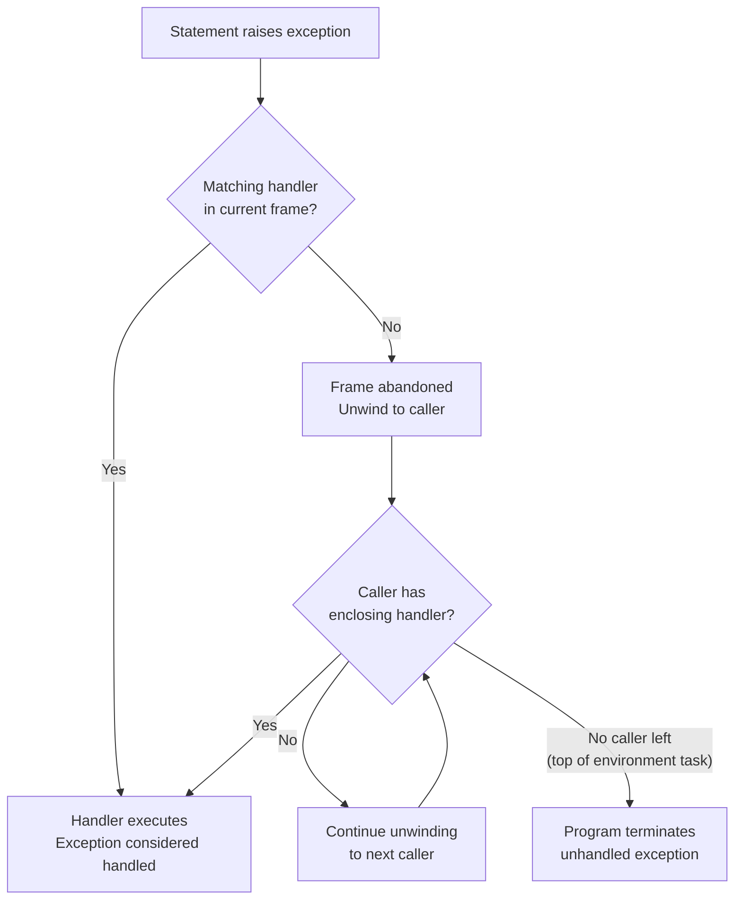

## Exception Handling Mechanisms

### Overview

Ada treats exception handling as a first-class, statically-checked language feature rather than a library convention. Exceptions are named entities declared much like variables or types, propagation follows a well-defined dynamic call-chain model, and handlers are attached to executable regions (blocks, subprograms, tasks, package bodies) via a dedicated `exception` part. This design reflects Ada's origins as a language for long-lived, safety-critical, and embedded systems, where predictable failure behavior is as important as predictable success behavior.

### Exception Declaration

Exceptions are declared with the reserved word `exception`, giving them a distinct name in the enclosing scope:

```ada
Invalid_Input   : exception;
Stack_Overflow  : exception;
Connection_Lost : exception;
```

An exception declaration introduces a new, distinct exception object. Two exceptions declared separately are always different exceptions even if they share a name in different scopes (normal Ada scoping/hiding rules apply).

### Predefined Exceptions

Ada defines a small set of language-level exceptions, declared in package `Standard`, that are raised automatically by runtime checks:

- **`Constraint_Error`** — raised by violations of range, index, discriminant, or null-access constraints (e.g., array index out of bounds, integer overflow, division by zero, dereferencing a null pointer).
- **`Program_Error`** — raised for control-flow anomalies such as falling off the end of a function without returning a value, or elaboration order violations.
- **`Storage_Error`** — raised when dynamic storage (heap or stack) is exhausted.
- **`Tasking_Error`** — raised for failures in task communication, such as a rendezvous with a task that has already terminated abnormally.

Since Ada 95, these live in `Standard`, and Ada.Exceptions (Ada 95 onward) provides additional facilities for querying and manipulating exception occurrences.

### Raising Exceptions

The `raise` statement explicitly signals an exception:

```ada
if Value < 0 then
   raise Invalid_Input;
end if;
```

Since Ada 2005, `raise` can carry a human-readable message via the `with` clause:

```ada
raise Invalid_Input with "Value must be non-negative, got:" & Integer'Image (Value);
```

A bare `raise;` statement (no exception name), used only inside a handler, re-raises the exception currently being handled — preserving its identity and, in implementations that support it, its original occurrence information.

### Handling Exceptions

An `exception` part attaches handlers to a block, subprogram body, or similar construct. Each handler lists one or more exception names (or `others`) and a sequence of statements to execute if that exception propagates to this point:

```ada
begin
   Process (Value);
exception
   when Invalid_Input =>
      Put_Line ("Rejected: bad input");
   when Constraint_Error | Program_Error =>
      Put_Line ("Runtime check failure");
   when Error : others =>
      Put_Line ("Unexpected: " & Ada.Exceptions.Exception_Name (Error));
end;
```

**Key Points**

- Handlers are matched in textual order; the first matching `when` clause is used.
- `others` must be the last choice in an exception part and catches any exception not explicitly named.
- Binding a name to `others` (as `Error : others` above) gives access to the exception occurrence object, queryable via `Ada.Exceptions.Exception_Name`, `Exception_Message`, and `Exception_Information`.
- A handler executes *after* the protected region has been abandoned — local declarations of that region are no longer in scope, and any partially completed work in that region is not automatically undone (Ada has no built-in transactional rollback).

### Propagation Model

When an exception is raised and no handler in the current construct matches, Ada propagates it dynamically outward through the chain of active calls — not through the static/lexical nesting of the source text. Propagation unwinds each enclosing frame in turn: the current subprogram is abandoned, control returns to its caller, and Ada checks whether that caller's enclosing construct has a matching handler, repeating until a handler is found or the environment task (main program) is reached, terminating the program if unhandled there.



This is dynamic call-chain propagation, which differs from purely lexical scoping: a deeply nested private helper subprogram's exception propagates through every intervening caller, regardless of how those callers are lexically related to the point of the original `raise`.

### Exceptions in Declarative Parts

An exception raised during the elaboration of declarations (e.g., a failed initialization expression) is *not* caught by the handlers of the same block — the block's `exception` part only protects its sequence of statements, not its own declarative region. Such an exception propagates immediately to the enclosing construct.

```ada
declare
   X : Integer := 1 / Divisor;  -- if Divisor = 0, Constraint_Error here
begin
   -- this exception part does NOT catch the line above
   null;
exception
   when Constraint_Error =>
      Put_Line ("This handler will not run for the Divisor=0 case");
end;
```

To guard declarative elaboration, wrap the whole block (including its declarative part) inside an outer block that does have an appropriate handler.

### Exceptions and Functions

A function must return a value on every normal path; if control reaches the end of a function body without executing a `return`, `Program_Error` is raised. `raise` is a legitimate way for a function to terminate abnormally instead of returning, which is useful for signaling that no meaningful value can be produced.

### Exceptions and Tasks

An unhandled exception in a task body does not propagate to any other task — it is not caught by handlers in the task that activated it, nor by any other task rendezvous partner. The task simply terminates. If the exception occurs during a rendezvous (inside an `accept` statement's body), it *is* propagated back to the calling task at the point of the entry call, in addition to terminating the accepting side of that statement's execution. Because failures are otherwise contained within the failing task, defensive designs typically implement supervisory tasks or status-checking protocols rather than relying on cross-task propagation.

### Exception Renaming and Reraising Elsewhere

`Ada.Exceptions.Save_Occurrence` / `Reraise_Occurrence` (available since Ada 95) allow capturing an exception occurrence in one context and re-raising it later or in a different call frame — useful for logging-then-propagating patterns or bridging exception information across task boundaries, since occurrence objects are not implicitly shared between tasks.

```ada
declare
   Saved : Ada.Exceptions.Exception_Occurrence;
begin
   begin
      Risky_Operation;
   exception
      when E : others =>
         Ada.Exceptions.Save_Occurrence (Saved, E);
   end;
   Log_Error (Saved);
   Ada.Exceptions.Reraise_Occurrence (Saved);
end;
```

### Suppressing Runtime Checks

The `pragma Suppress` directive (and its Ada 2005+ counterpart `pragma Unsuppress`) can disable specific predefined checks — such as `Index_Check` or `Overflow_Check` — for performance-critical regions. [Inference] Doing so is a deliberate trade-off: suppressed checks that would have raised `Constraint_Error` instead produce implementation-defined (potentially erroneous) behavior if the underlying condition occurs, so this is generally reserved for code that has been separately verified not to trigger those conditions.

### Design Rationale Compared to Other Languages

Ada's exception model differs from exception systems in languages like Java or Python in several structural ways:

- **No exception class hierarchy by default.** Exceptions are simple named entities, not objects with inheritance, though `Ada.Exceptions.Exception_Occurrence` provides introspection without needing a class hierarchy.
- **No `finally`/`ensure` construct in early Ada standards.** Cleanup-on-exit patterns traditionally relied on nested blocks with handlers that reraise, or on controlled types (`Ada.Finalization`) whose `Finalize` procedure runs deterministically on scope exit, exception or not.
- **Declarative-region exclusion**, described above, has no direct analogue in most mainstream exception systems, where a `try` block's initializers are typically covered by its own `catch`.

### Related Topics

- Controlled types and `Ada.Finalization` for deterministic cleanup
- `Ada.Exceptions` package facilities (`Exception_Name`, `Exception_Message`, `Exception_Information`)
- `pragma Suppress` / `pragma Unsuppress` and check suppression
- Task termination, abnormal task states, and supervisory task patterns
- Contracts and preconditions (`Ada 2012` `Pre`/`Post` aspects) as an alternative to exception-based validation