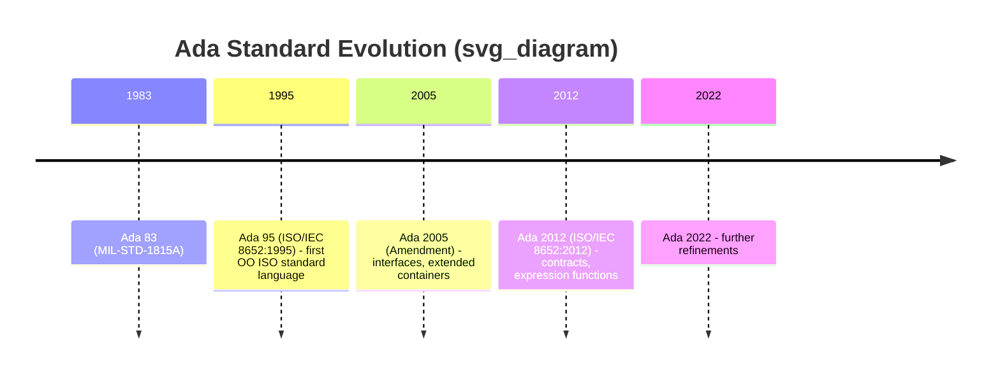

## Ada 83 to Ada 95 to Ada 2012 Evolution

### Overview

Ada's standardization history spans four major revisions — Ada 83, Ada 95, Ada 2005, and Ada 2012 (with Ada 2022 as the most recent) — each an ISO standard rather than a vendor-driven release. The language evolved from a single-paradigm, strongly-typed systems language into a multi-paradigm language incorporating object-oriented programming, expanded concurrency models, and contract-based programming, while preserving strong backward compatibility and its original emphasis on reliability, static verification, and long-lifecycle software.

### Ada 83: Origins and Foundations

Ada 83 (formally MIL-STD-1815A, later ANSI/MIL-STD-1815A) was the result of a U.S. Department of Defense initiative to consolidate the hundreds of programming languages then in use across defense projects into a single, standardized language. It was named after Ada Lovelace.

**Key Points**

- Established the core package system (specification/body separation) for modularity and encapsulation.
- Introduced strong static typing with user-definable types, subtypes, and range constraints checked at compile time and runtime.
- Provided built-in concurrency via the **tasking model** (tasks, rendezvous-based `entry`/`accept` communication) — unusual for a systems language of that era to standardize concurrency directly into the language rather than leaving it to libraries.
- Included generics (generic packages and subprograms) for compile-time parametric polymorphism.
- Established the exception handling model described in prior material (named exceptions, dynamic propagation, `exception` parts).
- Had no built-in object-oriented inheritance; extensibility relied on generics and composition rather than a class hierarchy.

### Ada 95: Object Orientation and ISO Standardization

Ada 95 (ISO/IEC 8652:1995) was the first ISO-standardized object-oriented programming language, predating widespread OO standardization in other mainstream languages' formal specs.

**Key Points**

- Introduced **tagged types**, Ada's mechanism for type extension and inheritance, supporting dynamic dispatch via `'Class`-wide types and dispatching operations — without requiring a single universal root class.
- Added **child packages** (public and private), allowing hierarchical decomposition of large package-based systems without exposing implementation details across the hierarchy.
- Introduced **protected types** as a second concurrency construct alongside tasks — a monitor-like mechanism offering mutual exclusion and condition synchronization with typically lower overhead than full rendezvous, intended for shared-data-oriented synchronization rather than task-to-task communication.
- Expanded the predefined library significantly, including `Ada.Exceptions` (exception occurrence introspection), `Ada.Finalization` (controlled types for deterministic destructor-like behavior), wide-character and string support, and standardized numeric/text I/O packages.
- Refined the real-time and low-level programming annexes (Specialized Needs Annexes), addressing systems programming, real-time scheduling, distributed systems, and interfacing to other languages in a standardized way.

### Ada 2005: Interfaces and Library Expansion

Ada 2005 was published as an amendment (ISO/IEC 8652:1995/Amd 1:2007) rather than a wholly new standard, but is commonly treated as its own generation.

**Key Points**

- Introduced **interface types**, enabling a form of multiple inheritance of specification (similar in spirit to Java interfaces), addressing limitations of Ada 95's single-inheritance tagged type model.
- Added synchronized interfaces, unifying task and protected type abstractions under a common interface concept.
- Substantially expanded the standard **container library** (`Ada.Containers`) — vectors, lists, maps, sets — bringing Ada's standard library closer in convenience to STL-like facilities in other languages.
- Refined real-time scheduling policies (e.g., Earliest Deadline First scheduling) for high-integrity real-time systems.

### Ada 2012: Contracts and Expression-Oriented Features

Ada 2012 (ISO/IEC 8652:2012) is widely regarded as a substantial evolution toward formal, verifiable specification directly in source code.

**Key Points**

- Introduced **preconditions and postconditions** via `Pre` and `Post` aspects attached directly to subprogram declarations, allowing contracts to be checked at runtime (or statically by external provers) rather than expressed only informally in comments.
- Added **type invariants** (`Type_Invariant`) and **subtype predicates** (`Static_Predicate`, `Dynamic_Predicate`), allowing constraints on valid values/states to be declared once and enforced automatically.
- Introduced **expression functions** — one-line function bodies expressed as a single expression — improving conciseness for simple accessor-style subprograms.
- Added **quantified expressions** (`for all`, `for some`) and **conditional expressions** (`if`/`case` as expressions rather than only as statements), enabling more declarative, expression-oriented code.
- Extended iteration with **generalized (user-defined) iterators**, allowing `for ... of` style iteration over custom container types.
- These contract features positioned Ada 2012 as a strong foundation for the **SPARK** subset/toolset, used for formal verification in high-assurance software.

### Comparative Summary

| Revision | Core Addition | Paradigm Shift |
| --- | --- | --- |
| Ada 83 | Packages, tasking, generics, exceptions | Modular, statically-typed systems language |
| Ada 95 | Tagged types, child packages, protected types | Object-oriented; first ISO OO language |
| Ada 2005 | Interface types, expanded containers | Multiple inheritance of specification |
| Ada 2012 | Pre/Post contracts, expression functions, quantified expressions | Contract-based, more declarative |

### Backward Compatibility Philosophy

[Inference] Each revision was designed with strong emphasis on backward compatibility with prior standards, reflecting Ada's use in long-lifecycle systems (avionics, defense, rail, space) where multi-decade code maintenance is common; new features were generally additive (new aspects, new pragma/attribute forms, new library packages) rather than requiring rewrites of Ada 83-era code, though some corner-case semantic clarifications across revisions could subtly affect existing programs' behavior in edge cases.

### Practical Implications for Codebases Today

**Key Points**

- Large legacy Ada 83/95 codebases (common in avionics and defense) often remain on older compiler modes for certification stability, even when compilers support newer standards.
- Ada 2012 contract features are heavily used in safety-critical development alongside SPARK for formal verification, particularly where certification standards (e.g., DO-178C) benefit from machine-checkable specifications.
- Compiler support (notably GNAT, the primary open-source Ada compiler) generally provides `-gnat83`, `-gnat95`, `-gnat2005`, `-gnat2012` mode switches, allowing incremental adoption or strict legacy compliance within a single toolchain.

### Related Topics

- SPARK: the formally verifiable Ada subset and its toolset
- Tagged types and dynamic dispatch mechanics in depth
- Protected types vs. task rendezvous: concurrency model comparison
- Ada 2022 standard changes
- GNAT compiler modes and cross-standard interoperability