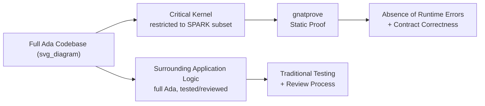

## Use in Safety-Critical and Embedded Systems

### Overview

Ada's design goals — strong static typing, explicit concurrency, deterministic exception handling, and compile-time verifiability — made it a language of choice for domains where software failure carries severe consequences: avionics, rail signaling, space systems, and defense. Its use in these domains is reinforced by certification standards that reward the kind of static analyzability Ada was built for, and by the SPARK subset, which extends Ada with formal verification capability.

### Why Ada for Safety-Critical Domains

**Key Points**

- **Strong typing catches errors at compile time.** Ada's type system (range-constrained subtypes, discriminated records, strict mode conversions) surfaces many classes of error — unit mismatches, out-of-range assignments, uninitialized access — before code ever runs, rather than relying solely on runtime checks or testing.
- **No implicit type coercion.** Unlike C's permissive implicit conversions, Ada requires explicit conversion between distinct types, which prevents an entire class of subtle bugs where mismatched units or representations silently combine.
- **Determinism in exception and concurrency semantics.** The dynamic-propagation model for exceptions and the well-defined rendezvous/protected-object semantics for concurrency reduce ambiguity about how a program will behave under fault conditions or concurrent access, aiding both manual review and automated analysis.
- **Explicit representation clauses.** Ada allows precise control over data layout, bit ordering, and memory-mapped hardware interfacing — attributes like `for Type'Size`, `for Type'Address`, and record representation clauses — which embedded work typically requires without dropping into unsafe, unchecked code.
- **Package-based encapsulation.** Clear separation of specification and implementation supports the kind of modular, independently reviewable units that certification processes for high-assurance software require.

### Certification Standards and Domains

Ada is used across several certification regimes tied to specific industries:

| Domain | Standard | Notes |
| --- | --- | --- |
| Civil avionics | DO-178C / DO-178B | Software considerations in airborne systems certification |
| Rail | EN 50128 | Software for railway control and protection systems |
| Space | ECSS-E-ST-40C (ESA) | European space software engineering standards |
| Defense | Various national MIL-STD / DEF-STAN derivatives | Historically the original driver for Ada's creation |

[Inference] Ada's static analyzability tends to reduce the cost of achieving the highest assurance levels in standards like DO-178C (e.g., Level A), since many required verification activities — such as demonstrating absence of certain classes of runtime error — are more tractable when the source language already restricts undefined and implementation-defined behavior compared to languages like C or C++.

### SPARK: Formal Verification Subset

SPARK is a restricted subset of Ada (built on Ada 2012's contract features — `Pre`, `Post`, `Type_Invariant`) paired with a toolset that performs static, mathematical proof of program properties rather than relying solely on testing.

**Key Points**

- SPARK code excludes constructs that are hard to formally reason about — such as certain aliasing patterns, unrestricted pointer/access type use, and some forms of dynamic dispatch — in favor of provable data and control flow.
- The SPARK toolset (notably `gnatprove`, part of the GNAT toolchain ecosystem) can prove **absence of runtime errors** (AoRTE) — no `Constraint_Error`, no buffer overrun, no division by zero — as a mathematical guarantee for the annotated subset, rather than as a probabilistic outcome of testing.
- SPARK supports proving that a subprogram's implementation satisfies its declared `Pre`/`Post` contracts, enabling functional correctness proofs for critical routines (e.g., control law computations, cryptographic primitives).
- [Inference] Because full formal proof can be resource-intensive to apply across an entire codebase, mixed approaches are common in practice: SPARK for the most safety- or security-critical kernel of a system, with full Ada (or Ada plus tested/reviewed code) for the surrounding application logic.

### Embedded and Real-Time Considerations

**Key Points**

- The **Ravenscar profile** (introduced formally in Ada 95 revisions and refined since) restricts the full tasking model to a deterministic, analyzable subset suitable for hard real-time systems — removing dynamic task creation, unbounded queuing, and other features that complicate worst-case timing analysis, while retaining protected objects and a defined set of task states.
- Ada supports direct **hardware interfacing** through representation clauses, `Interfaces` packages (`Interfaces.C`, bit-level integer types), and `Address` attributes, allowing memory-mapped I/O and register-level control without abandoning type safety at the boundary.
- The **Zero Footprint / Ravenscar-based small runtimes** used in some embedded contexts allow Ada code to run without a full-featured runtime system, reducing memory footprint and eliminating sources of non-determinism (e.g., unbounded heap allocation) that are problematic for certification.
- `pragma Restrictions` allows a project to explicitly forbid language features (e.g., `No_Exception_Propagation`, `No_Dynamic_Attachment`, `No_Allocators`) at the configuration level, letting a team enforce a reduced, analyzable subset of the language across an entire codebase and have that enforcement checked by the compiler.

### Ada vs. C/C++ in Safety-Critical Contexts

[Speculation] Comparative claims here reflect commonly cited engineering rationale rather than a single authoritative benchmark, since actual defect rates depend heavily on team practices, tooling, and domain — but the structural differences most frequently cited include:

- Ada's mandatory range/index/overflow checks (unless explicitly suppressed) catch classes of error that C/C++ leave as undefined behavior by default, requiring separate static analyzers (e.g., MISRA C tooling) to approximate what Ada enforces natively.
- Ada's stricter type system reduces reliance on external coding-standard enforcement (like MISRA C/C++) to prohibit dangerous patterns, since many of those patterns are simply inexpressible in standard Ada without explicit unchecked operations.
- C/C++ retain broader industry tooling ecosystems and larger available talent pools, which is frequently cited as a practical (non-technical) reason some safety-critical programs still choose C/C++ with heavy static analysis and coding-standard discipline (e.g., MISRA C) instead of Ada.

### Representative Application Areas

- **Avionics**: flight control software, engine control units, cockpit display systems.
- **Rail**: interlocking systems, train protection and signaling.
- **Space**: onboard flight software for satellites and launch vehicles, ground control software.
- **Defense**: weapons systems, radar and sensor processing, secure communications.
- [Unverified] Specific named projects and vendors are not enumerated here since program-level sourcing was not verified for this response; publicly documented case studies exist for several of the above domains and are worth consulting directly for current, attributable examples.

### Related Topics

- Ravenscar tasking profile in depth
- SPARK proof process and `gnatprove` workflow
- `pragma Restrictions` and language subsetting techniques
- DO-178C objectives and Ada's role in satisfying them
- Representation clauses and low-level hardware interfacing in Ada