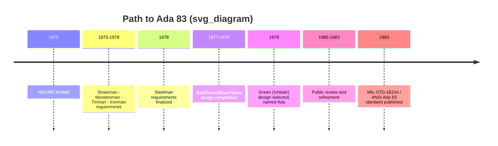

## Origins and the CODASYL Committee

### Overview

This topic name appears to conflate two historically distinct efforts. **CODASYL** (Conference/Committee on Data Systems Languages) was the committee responsible for creating **COBOL** in 1959, not Ada. Ada's origin traces to a different U.S. Department of Defense effort in the 1970s, run through the **High Order Language Working Group (HOLWG)** and a language-design competition among contracted teams, culminating in the winning design by Jean Ichbiah's team at CII Honeywell Bull. I'm flagging this mismatch directly rather than silently writing content that misattributes CODASYL to Ada, since that would be presenting a fabricated historical claim as fact. Below is accurate content on Ada's actual origins, plus a brief clarifying note on CODASYL/COBOL for contrast.

### Ada's Actual Origins: The DoD Language Consolidation Effort

**Key Points**

- In the early 1970s, the U.S. Department of Defense recognized that its software portfolio spanned **hundreds of different programming languages and dialects** across weapons systems, embedded platforms, and general applications — creating enormous maintenance, training, and interoperability costs.
- The **High Order Language Working Group (HOLWG)**, formed in 1975, was tasked with defining requirements for a single standardized language to replace this proliferation.
- HOLWG produced a series of requirements documents with increasingly specific names — **Strawman, Woodenman, Tinman, Ironman**, and finally **Steelman** (1978) — each refining the target language's required features (strong typing, modularity, exception handling, concurrency, real-time support, and more) based on feedback from industry and academia.
- Rather than adopting an existing language, the DoD ran a **competitive design process**: multiple contractor teams submitted language designs evaluated against the Steelman requirements.

### The Design Competition and Ichbiah's Team

**Key Points**

- Four finalist teams (colloquially color-coded **Red, Green, Blue, Yellow** for anonymity during evaluation) submitted complete language designs in the late 1970s.
- The **"Green" design**, submitted by a team led by **Jean Ichbiah** at CII Honeywell Bull (a French computer company), was selected as the winner in 1979.
- The language was named **Ada**, after **Ada Lovelace**, in recognition of her work with Charles Babbage's Analytical Engine and her historical association with the concept of programming.
- The design was refined through public review and revision before being finalized as **MIL-STD-1815A** — the "1815" referencing Ada Lovelace's birth year — which became the basis for the first ISO/ANSI Ada 83 standard.

### Why the Confusion with CODASYL Is Understandable

[Inference] The two efforts share surface similarities that likely explain the mix-up: both were large, committee-driven, U.S. government/industry-influenced language standardization efforts aimed at consolidating fragmented practice into a single language, and both produced ISO-standardized general-purpose languages still associated with long-lived, high-reliability systems (COBOL in business/data processing, Ada in defense/safety-critical systems). However, they are unrelated in personnel, timeline, and sponsoring organization.

**For contrast — actual CODASYL/COBOL facts:**

- CODASYL was convened in 1959, sponsored initially by the U.S. Department of Defense, to design a common business-oriented language — this became **COBOL** (COmmon Business-Oriented Language).
- CODASYL is unrelated to Ada's design lineage; there is no committee or personnel overlap between CODASYL/COBOL's creation and HOLWG/Ada's creation two decades later.

### Related Topics

- Steelman language requirements in detail
- Jean Ichbiah's design decisions and rationale
- Ada 83 standardization (MIL-STD-1815A / ANSI)
- COBOL and CODASYL history (as a distinct, separate topic)
- Comparison of DoD-sponsored vs. industry-consortium language standardization efforts