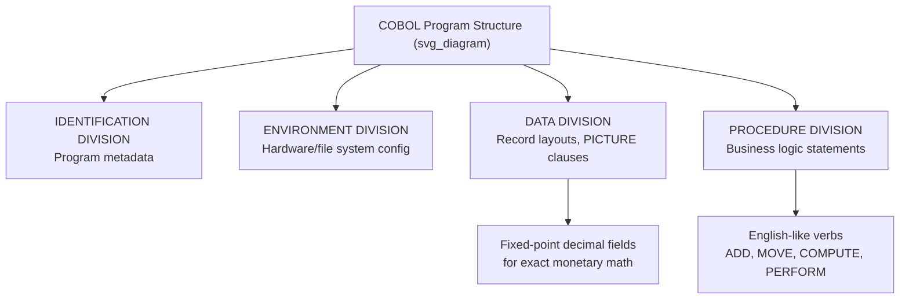

## Business Data Processing Design Goals

### Overview

This topic sits more naturally under COBOL than Ada — "business data processing" was COBOL's explicit founding purpose, whereas Ada was designed for embedded, real-time, and safety-critical systems, not business/commercial data processing. I'm flagging that mismatch again rather than retrofitting Ada's actual design goals to a business-data-processing framing that doesn't fit its history. Given the series context (Programming Languages, Ada-focused), the most accurate and useful content is COBOL's actual business data processing design goals, presented plainly as COBOL content rather than mislabeled as Ada's.

### COBOL's Founding Purpose

**Key Points**

- COBOL (COmmon Business-Oriented Language) was designed starting in 1959 by CODASYL specifically to address **commercial and administrative data processing** — payroll, inventory, billing, accounting — as distinct from the scientific/numerical computing focus of contemporaries like FORTRAN.
- The design was driven by a stated goal of being usable by **business analysts and programmers without deep computer science backgrounds**, prioritizing readability over terseness.
- A central design goal was **machine independence** — allowing the same COBOL source to run across different vendors' hardware, which was a significant departure from the vendor-specific assembly and early high-level languages common at the time.

### Core Design Goals

**Key Points**

- **English-like syntax.** COBOL statements were deliberately verbose and read close to structured English (`ADD AMOUNT TO TOTAL`, `MOVE X TO Y`) so that non-specialist stakeholders — managers, auditors — could plausibly read and verify program logic without deep programming training.
- **Separation of data description from procedural logic.** COBOL's division structure — `IDENTIFICATION DIVISION`, `ENVIRONMENT DIVISION`, `DATA DIVISION`, `PROCEDURE DIVISION` — explicitly separates *what data looks like* from *what the program does with it*, reflecting the reality that business data record formats (fixed-width fields, packed decimal, punch-card-derived formats) needed precise, standalone specification.
- **Native decimal/fixed-point arithmetic.** Business calculations (currency, financial totals) require exact decimal arithmetic rather than binary floating-point approximation; COBOL's `PICTURE` clauses and fixed-point decimal types were designed around this need directly, avoiding the rounding errors floating-point representations introduce for monetary values.
- **File and record-oriented I/O as a language primitive.** Since business processing centered on large sequential and indexed files (customer records, transaction logs), COBOL built file handling (`SELECT`, `FD`, `OPEN`, `READ`, `WRITE`) into the language itself rather than treating it as an external library concern.
- **Report generation support.** The `REPORT WRITER` facility was designed to let programmers declaratively specify report layouts (headers, footers, control breaks/summary lines) rather than manually coding print formatting logic.

### Portability and Standardization Goals

**Key Points**

- CODASYL explicitly aimed for **vendor neutrality** from the outset, contrasting with earlier practice where each hardware manufacturer promoted its own proprietary language.
- This led to COBOL being adopted as an **American National Standards Institute (ANSI)** standard (first in 1968, revised 1974, 1985, and later), with the DoD mandating COBOL support as a condition for hardware vendors seeking government contracts — a mandate that significantly accelerated industry-wide adoption.
- [Inference] The combination of DoD procurement leverage and genuine cross-vendor portability goals likely explains COBOL's rapid and durable adoption across the banking, insurance, and government sectors, where it remains in production use in legacy systems today.

### Contrast: How This Differs from Ada's Design Goals

Since the surrounding series is Ada-focused, it's worth being explicit about the contrast:

| Aspect | COBOL | Ada |
| --- | --- | --- |
| Target domain | Business/administrative data processing | Embedded, real-time, safety-critical systems |
| Primary audience | Business programmers/analysts | Systems/defense software engineers |
| Core data concern | Exact decimal arithmetic, file records | Strong typing, hardware representation, concurrency |
| Readability goal | English-like verbosity for non-specialists | Explicitness and unambiguity for verification/certification |
| Standardization driver | CODASYL committee, ANSI | DoD HOLWG, Steelman requirements, ISO |

### Related Topics

- COBOL's `PICTURE` clause and fixed-point decimal arithmetic in depth
- COBOL `REPORT WRITER` facility
- CODASYL and the COBOL standardization timeline (1959–present)
- Ada's actual design goals for embedded/real-time systems (contrast topic)
- Legacy COBOL modernization and maintenance in banking/government systems