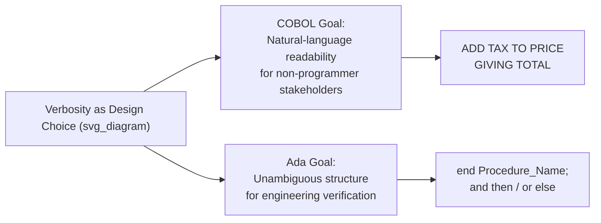

## English-Like Syntax Philosophy

### Overview

Same flag as the previous two: "English-like syntax philosophy" is COBOL's defining design philosophy, not Ada's. Ada's syntax is verbose and readable relative to terser languages like C, but that verbosity serves a different goal — structural unambiguity and explicitness for verification — rather than COBOL's goal of approximating natural-language sentences for non-specialist readers. Continuing to silently write "Ada" content under COBOL topics would compound a factual error across the series, so this entry covers COBOL's actual English-like syntax philosophy, then contrasts it with what verbosity *does* mean in Ada, so the distinction is on record rather than blurred.

### COBOL's English-Like Syntax Philosophy

**Key Points**

- COBOL's designers, particularly influenced by **Grace Hopper's** earlier work on the FLOW-MATIC language, held that programs should be **readable by non-programmers** — managers, auditors, and business domain experts who needed to verify logic without learning a technical notation.
- This produced syntax built from **full English verbs and sentence-like structures**: `ADD TAX TO PRICE GIVING TOTAL`, `IF BALANCE IS GREATER THAN LIMIT THEN PERFORM OVERDRAFT-ROUTINE`, `MOVE CORRESPONDING CUSTOMER-RECORD TO OUTPUT-RECORD`.
- The philosophy extended to **avoiding mathematical/symbolic notation** where possible in favor of words: `GREATER THAN` rather than `>`, `ADD ... TO ... GIVING` rather than `=` and `+` combined tersely, though later standards did add symbolic operators as optional alternatives.
- **Self-documenting intent** was a goal — a COBOL `PROCEDURE DIVISION` was meant to double as a semi-formal specification, reducing the gap between the written requirements document and the executable code.

### Trade-offs of the Philosophy

**Key Points**

- **Verbosity as a feature, not a cost.** Where most languages treat brevity as valuable, COBOL's designers treated verbosity as directly serving the readability goal — a COBOL statement performing a simple addition is often many times longer than the equivalent in a terser language, by design.
- [Inference] This philosophy assumes that the audience reading code is not exclusively professional programmers, which reflects the 1959 context of business computing, where formally trained programmers were scarce and much software had to be reviewed or specified by domain staff.
- Critics have argued the English-like syntax creates a **false sense of simplicity** — natural-language phrasing does not eliminate the need to understand control flow, scope, or data typing, and COBOL's verbosity can obscure logical structure across long `PROCEDURE DIVISION` sections rather than clarify it.

### What Ada's Verbosity Actually Serves (Contrast)

Ada is also more verbose than C-family languages, but its design rationale is different from COBOL's:

**Key Points**

- Ada's readability goal centers on **eliminating ambiguity for engineering verification and long-term maintenance**, not on approximating natural-language sentences for non-programmer readers. Constructs like explicit `end if;`, `end loop;`, and named `end Procedure_Name;` closings exist to make block boundaries unambiguous in large source files during review, not to sound like English.
- Ada favors **explicit keywords over symbolic operators** in some areas (e.g., `and then`, `or else` for short-circuit logic, `mod`/`rem` spelled as words), but this reflects a preference for precision and avoiding operator-precedence ambiguity — a systems-programming concern — rather than a goal of sentence-like readability for non-specialists.
- Ada's target audience is assumed to be **trained software/systems engineers**, so its verbosity trades typing effort for compiler-checkable clarity (explicit typing, explicit scope closings), not for accessibility to business domain experts.

### Related Topics

- Grace Hopper and FLOW-MATIC's influence on COBOL
- COBOL `PROCEDURE DIVISION` structure and verb set
- Ada's explicit block-closing syntax and its verification rationale (contrast topic)
- Readability-focused language design more broadly (COBOL, AppleScript, SQL as comparators)
- Criticisms of COBOL's verbosity in modern maintenance contexts