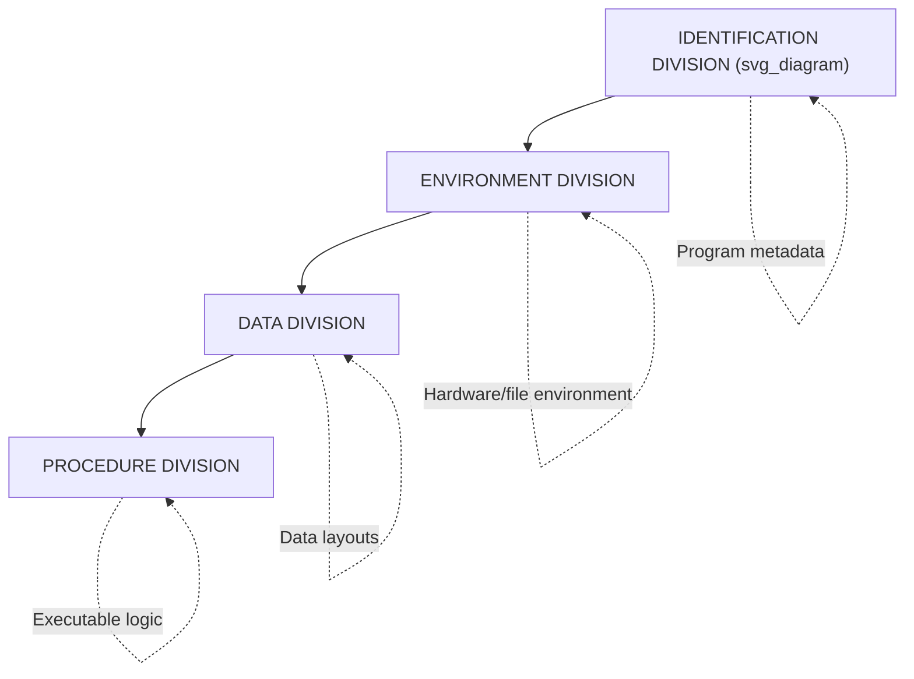

## Division Structure: Identification, Environment, Data, Procedure


### Overview

This is COBOL's four-division program structure, not Ada's — Ada has no equivalent "division" concept at all; its top-level organization is packages (specification/body), subprograms, and library units. Same pattern as the last three topics, so I'll keep flagging it rather than inventing an Ada mapping that doesn't exist. Content below covers COBOL's actual division structure accurately.

### The Four-Division Structure

Every standard COBOL program is organized into up to four divisions, in a fixed, mandatory order. Divisions not needed for a given program may sometimes be minimal or omitted (depending on the standard/compiler), but their relative order is fixed when present.



### IDENTIFICATION DIVISION

**Key Points**

- The mandatory first division; its primary required entry is `PROGRAM-ID`, naming the program.
- Historically also carried optional documentation-style clauses — `AUTHOR`, `INSTALLATION`, `DATE-WRITTEN`, `DATE-COMPILED`, `SECURITY` — intended as embedded metadata comments; most of these became obsolete/removed in later standards (e.g., COBOL 2002) in favor of ordinary comments.
- Functionally minimal — it does not affect program logic, only identifies and labels the compilation unit.



```
IDENTIFICATION DIVISION.
PROGRAM-ID. PAYROLL-CALC.
```

### ENVIRONMENT DIVISION

**Key Points**

- Describes the program's **interface to its physical/hardware environment** — the specific machine, file system, and device configuration the program expects, reflecting COBOL's era of significant hardware variation across vendors.
- Contains the **CONFIGURATION SECTION** (source/object computer specification) and the **INPUT-OUTPUT SECTION**, where the `FILE-CONTROL` paragraph uses `SELECT ... ASSIGN TO` clauses to bind logical file names used in the program to actual external files or devices.
- This division is the primary reason COBOL programs could be **ported across vendors** with modification concentrated in one place — environment-specific configuration was deliberately isolated here rather than scattered throughout program logic.



```
ENVIRONMENT DIVISION.
INPUT-OUTPUT SECTION.
FILE-CONTROL.
    SELECT EMPLOYEE-FILE ASSIGN TO "EMPFILE.DAT"
        ORGANIZATION IS INDEXED
        ACCESS MODE IS RANDOM.
```

### DATA DIVISION

**Key Points**

- Describes **all data used by the program** — file record layouts, working variables, and constants — entirely separately from the logic that manipulates them.
- Organized into sections, most centrally:
  - **FILE SECTION** — defines the record structure (`FD` entries) for each file named in the `ENVIRONMENT DIVISION`.
  - **WORKING-STORAGE SECTION** — defines variables and constants that persist for the life of the program run.
  - **LINKAGE SECTION** — defines data passed to the program from a calling program (used with subprograms/`CALL`).
- Uses **`PICTURE` (`PIC`) clauses** to precisely specify each field's type, length, and format — e.g., `PIC 9(5)` for a 5-digit unsigned integer, `PIC X(20)` for a 20-character alphanumeric field, `PIC 9(7)V99` for a fixed-point decimal with an implied decimal point.
- **Level numbers** (01, 05, 10, etc.) express hierarchical/nested record structure, allowing a top-level record to be decomposed into named sub-fields — analogous to nested structs/records in other languages, but central to how COBOL programs describe file layouts.



```
DATA DIVISION.
WORKING-STORAGE SECTION.
01  EMPLOYEE-RECORD.
    05  EMP-ID          PIC 9(5).
    05  EMP-NAME        PIC X(30).
    05  EMP-SALARY      PIC 9(7)V99.
```

### PROCEDURE DIVISION

**Key Points**

- Contains the program's **executable logic** — the actual business rules, expressed as a sequence of statements organized into named **paragraphs** and, in earlier style, **sections**.
- Uses COBOL's verb-based, English-like statement forms (`MOVE`, `ADD`, `COMPUTE`, `IF`, `PERFORM`, `READ`, `WRITE`) as covered under the English-like syntax philosophy topic.
- **`PERFORM`** is COBOL's primary control-flow verb for invoking named paragraphs/sections, including iterative forms (`PERFORM ... UNTIL`, `PERFORM ... VARYING`) that serve the role loops play in other languages.
- Historically, COBOL's original control flow relied heavily on `PERFORM` and `GO TO` between named paragraphs rather than block-structured control constructs; later standards (COBOL 85 onward) added explicit **scope terminators** (`END-IF`, `END-PERFORM`, `END-READ`) and better-structured in-line `PERFORM` blocks, reducing reliance on `GO TO`-heavy control flow.



```
PROCEDURE DIVISION.
MAIN-LOGIC.
    OPEN INPUT EMPLOYEE-FILE.
    PERFORM READ-AND-PROCESS UNTIL END-OF-FILE.
    CLOSE EMPLOYEE-FILE.
    STOP RUN.

READ-AND-PROCESS.
    READ EMPLOYEE-FILE
        AT END SET END-OF-FILE TO TRUE
        NOT AT END COMPUTE NET-PAY = EMP-SALARY * 0.8
    END-READ.
```

### Why This Structure Existed

[Inference] The rigid division separation reflects two goals working together: portability (isolating hardware/environment specifics in one division so the rest of the program travels across systems unchanged) and role separation (data description was often authored or reviewed separately from procedural logic in large business IT shops, so keeping them in physically distinct sections of the source matched organizational practice as well as technical need).

### Related Topics

- `PICTURE` clause syntax and data type specification in depth
- `PERFORM` variants and COBOL's control-flow evolution (COBOL 68 through COBOL 2014)
- `FILE SECTION` record layout and `FD` entries
- COBOL 85 structured programming additions (scope terminators, in-line `PERFORM`)
- Ada's package specification/body separation (contrast topic — different organizing principle entirely)