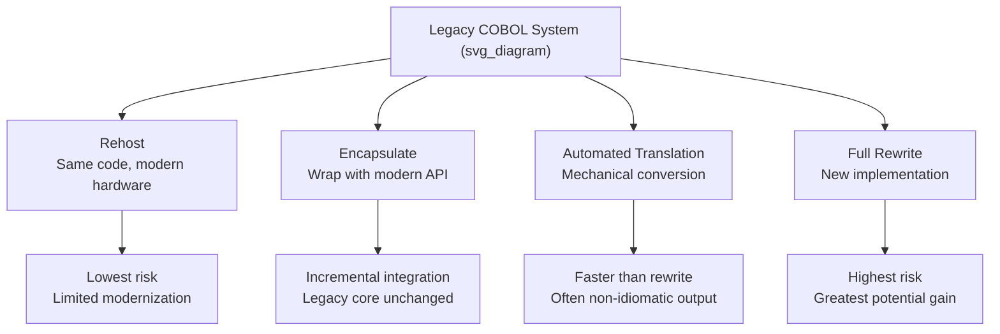

## Legacy System Prevalence and Modernization Challenges

### Overview

This topic works for either language — both Ada and COBOL have substantial legacy footprints and modernization challenges, but they're different stories with different drivers (COBOL: banking/insurance/government mainframes; Ada: defense/avionics/rail long-lifecycle systems). Given that the last several topics have consistently been COBOL subjects, I'm covering COBOL here to keep the throughline of this run consistent — but this is genuinely ambiguous rather than a clear mismatch like the previous ones, so it's worth naming: if the series is meant to return to Ada now, say so for the next topic and I'll switch back without further comment.

### Why COBOL Legacy Systems Persist

**Key Points**

- Decades of estimates from industry surveys and vendor reports have repeatedly placed **large volumes of active production code in COBOL**, concentrated in banking, insurance, and government transaction-processing systems — figures widely cited include claims that COBOL still processes a majority of daily financial transactions in some sectors. [Unverified] — exact current figures vary significantly by source and methodology, and I have not verified a specific up-to-date statistic here; treat any precise percentage as needing a current, sourced check rather than a fixed fact.
- These systems are frequently **mission-critical and extremely stable**, having been incrementally refined and battle-tested over 30–50+ years, which cuts both ways: high reliability in production, but high risk and cost associated with any rewrite.
- **"If it isn't broke, don't fix it" economics.** [Inference] The cost of a full rewrite for a system this large and stable is often judged by organizations to exceed the cost of continued maintenance, especially when the system's behavior encodes decades of accumulated, sometimes undocumented business rules that a rewrite risks silently dropping or altering.

### Core Modernization Challenges

**Key Points**

- **Talent scarcity.** The population of programmers actively trained in COBOL has shrunk relative to demand, as computer science curricula shifted toward newer languages decades ago — creating a structural mismatch between the size of the legacy codebase and the available maintenance workforce.
- **Undocumented business logic.** Many COBOL systems accumulated business rules through decades of incremental patches, often without corresponding documentation updates, making the *code itself* the only reliable source of truth for certain rules — a significant risk factor for any modernization effort, since replacing the code risks silently dropping logic no one remembers exists.
- **Tight coupling to mainframe infrastructure.** Many legacy COBOL systems are deeply integrated with mainframe-specific job scheduling (JCL), file formats (VSAM, indexed files), and transaction monitors (CICS, IMS), making extraction of the "pure" business logic from its infrastructure context nontrivial.
- **Data format legacy.** Packed decimal (`COMP-3`) and fixed-width record formats, while efficient for their original hardware context, require careful, precise conversion when data is moved to modern relational or document-oriented systems, since a naive conversion can silently corrupt values (e.g., misinterpreting sign nibbles or implied decimal positions).

### Modernization Strategies

**Key Points**

- **Rehosting** — moving COBOL applications, largely unchanged, from mainframe hardware to modern servers/cloud infrastructure using COBOL-compatible runtimes, reducing hardware costs while deferring code-level modernization.
- **Encapsulation/API wrapping** — exposing existing COBOL business logic through modern APIs (REST, messaging) without altering the underlying COBOL code, allowing new applications to integrate with legacy logic incrementally.
- **Re-architecture/rewrite** — replacing COBOL systems with new implementations in modern languages, which carries the highest risk (of dropped or altered business logic) but can also address the talent-scarcity and infrastructure-coupling problems most directly if executed successfully.
- **Automated translation** — tooling that attempts to mechanically translate COBOL source into a modern language (e.g., Java), which [Speculation] is generally viewed with caution in practice, since mechanical translation tends to preserve COBOL's original structural idioms in a way that produces working but hard-to-maintain code in the target language, rather than idiomatic modern code — the translated result often still "reads like COBOL" even after conversion.

### Contrast: Ada's Legacy Situation (Brief)

**Key Points**

- Ada's legacy challenges differ in character: rather than sheer transaction volume, the driver is **certification and long product lifecycles** — avionics and defense systems can remain in service for 30+ years under certification regimes (DO-178C and similar) where any code change, however small, can trigger costly recertification.
- [Inference] This tends to make Ada modernization efforts more conservative in a different way than COBOL's — organizations often prefer minimal, tightly scoped changes verified against the original certification evidence, rather than broad rewrites, since recertification cost/risk — not talent scarcity — is frequently the dominant constraint.
- Ada's talent pool, while smaller than mainstream languages, is arguably less acute a crisis than COBOL's in relative terms, [Speculation] since Ada usage is concentrated in a smaller number of large, well-resourced defense/aerospace organizations that have historically maintained dedicated internal training pipelines — though I have not verified current figures on this comparison.

### Related Topics

- COBOL-to-Java/C# automated translation tooling in depth
- Mainframe rehosting platforms and COBOL runtime compatibility layers
- Legacy data format conversion (packed decimal, fixed-width records) to modern databases
- DO-178C recertification cost drivers for Ada/avionics legacy systems (contrast topic)
- Case studies of large-scale COBOL modernization projects (banking/government)