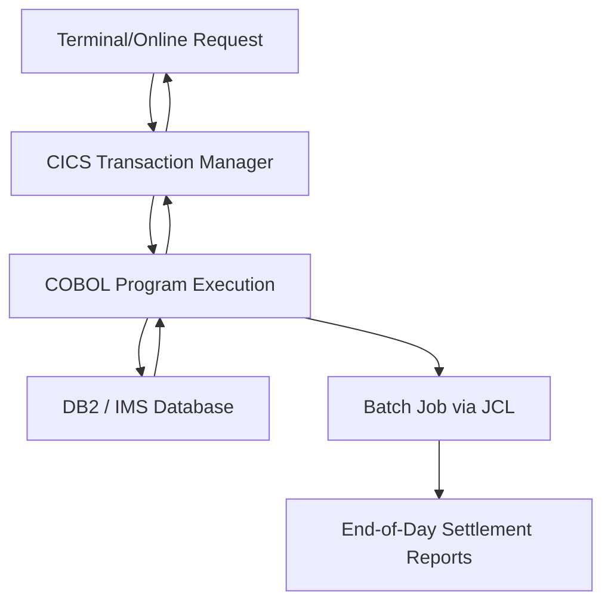
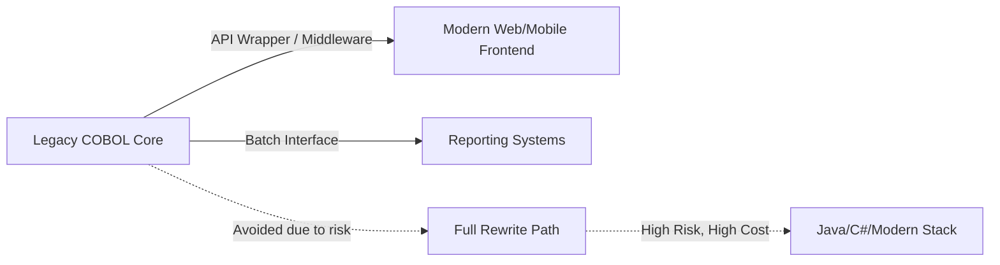

## COBOL's Continued Role in Mainframe and Financial Systems

**Key Points**

- COBOL (COmmon Business-Oriented Language) remains embedded in the world's core financial and government infrastructure despite being over 65 years old, originating from a 1959 CODASYL committee effort.
- Estimates commonly cited in industry reports suggest COBOL still processes a substantial share of daily financial transactions, though exact figures vary by source and are difficult to independently verify. [Unverified]
- Its persistence is driven by reliability, transactional integrity, and the sheer cost/risk of migration, not by lack of alternatives.
- The "COBOL problem" is less about the language's technical limitations and more about a shrinking pool of experienced maintainers.

### Why COBOL Still Runs the Back Office

COBOL was designed explicitly for business data processing: reading records, performing arithmetic on monetary values, and producing structured reports. Its `PICTURE` clause system allows exact decimal representation of currency, avoiding the binary floating-point rounding errors that plague languages using IEEE 754 floats for money.

```cobol
01  WS-ACCOUNT-BALANCE     PIC S9(9)V99  COMP-3.
01  WS-INTEREST-RATE       PIC S9(3)V9(4).
01  WS-TRANSACTION-AMOUNT  PIC S9(7)V99.
```

The `V` denotes an implied decimal point, and `COMP-3` (packed decimal) stores digits efficiently while preserving exact precision — critical when a bank cannot afford even a fractional cent of drift across billions of transactions.

### The Mainframe Ecosystem Dependency

COBOL rarely runs in isolation. It operates inside a tightly integrated mainframe stack:

- **z/OS** as the operating system (typically on IBM Z-series hardware)
- **CICS** (Customer Information Control System) for online transaction processing
- **IMS** or **DB2** for hierarchical or relational data storage
- **JCL** (Job Control Language) to orchestrate batch job execution

This tight coupling means COBOL's longevity is really mainframe longevity — the language, the transaction monitor, and the hardware were co-designed for throughput and reliability, which makes wholesale replacement a systems-architecture problem, not just a code-rewrite problem.



### Batch Processing: The Overnight Backbone

A large share of COBOL's real-world workload happens in **batch mode** — large-scale, scheduled processing of accumulated transactions, run overnight or at period-end.

```cobol
       PROCEDURE DIVISION.
       MAIN-PARA.
           PERFORM OPEN-FILES
           PERFORM UNTIL END-OF-FILE
               READ TRANSACTION-FILE
                   AT END SET END-OF-FILE TO TRUE
                   NOT AT END PERFORM PROCESS-TRANSACTION
               END-READ
           END-PERFORM
           PERFORM CLOSE-FILES
           STOP RUN.

       PROCESS-TRANSACTION.
           ADD TRANS-AMOUNT TO WS-ACCOUNT-BALANCE
           IF WS-ACCOUNT-BALANCE < 0
               PERFORM FLAG-OVERDRAFT
           END-IF
           WRITE OUTPUT-RECORD FROM ACCOUNT-RECORD.
```

This pattern — sequential file read, per-record processing, structured output — underlies core banking processes like interest accrual, statement generation, and interbank settlement (including ACH and Fedwire-adjacent processing in the U.S.).

### Financial Sector Reliance

Banks, insurers, and payment processors depend on COBOL systems for:

- **Core banking**: account ledgers, loan servicing, mortgage amortization
- **Payment rails**: ATM networks and card authorization backends often route through COBOL-based mainframe logic
- **Insurance**: policy administration and actuarial batch calculations
- **Government**: tax processing (e.g., systems historically associated with the U.S. IRS) and Social Security/benefits disbursement systems have long-documented COBOL dependencies

These systems were built incrementally over decades, meaning the "logic" isn't just the code — it's the accumulated, often undocumented business rules encoded into decades of patches. [Inference] Rewriting this logic risks silently dropping edge cases that took years to discover and fix.

### The Talent Gap Problem

The more pressing operational risk isn't the language itself but workforce demographics:

- Most COBOL programmers were trained in the 1970s–1990s and are retiring or have retired.
- University curricula largely dropped COBOL instruction decades ago in favor of modern languages.
- Organizations report difficulty hiring maintainers, which has led to a cottage industry of COBOL retraining programs, contractor firms, and even bootcamps aimed at new graduates. [Inference]

This gap creates pressure toward two divergent paths: **modernization via wrapping** (keeping COBOL core logic but exposing it through modern APIs) versus **full rewrite** (transpiling or manually reimplementing in Java, C#, or similar).



### Modernization Strategies in Practice

**Wrapping/Encapsulation**: The dominant conservative strategy — legacy COBOL transaction logic stays untouched, but middleware (often via CICS Web Services or IBM's z/OS Connect) exposes it as REST/JSON APIs, letting modern applications call into COBOL without touching the core.

**Language Interoperability**: Some organizations use tools to call COBOL routines from Java (via JNI-like bridges) or vice versa, allowing incremental modernization rather than a big-bang rewrite.

**Automated Transpilation**: Tools exist to convert COBOL source to Java or other languages automatically. Results are mixed — transpiled code often preserves COBOL's procedural structure awkwardly inside object-oriented syntax, producing code that compiles but is arguably harder to maintain than the original. [Inference]

**Full Rewrite**: Rarely chosen for core systems due to well-documented historical failures (some state government unemployment/benefits system rewrites have faced serious public issues), though smaller peripheral systems are sometimes migrated this way.

### A Minimal Illustrative Program

```cobol
       IDENTIFICATION DIVISION.
       PROGRAM-ID. INTEREST-CALC.

       DATA DIVISION.
       WORKING-STORAGE SECTION.
       01  WS-PRINCIPAL      PIC 9(9)V99 VALUE 10000.00.
       01  WS-RATE           PIC 9(3)V9(4) VALUE 0.0525.
       01  WS-INTEREST       PIC 9(9)V99.

       PROCEDURE DIVISION.
           COMPUTE WS-INTEREST = WS-PRINCIPAL * WS-RATE
           DISPLAY "Annual Interest: " WS-INTEREST
           STOP RUN.
```

This computes annual simple interest: $I = P \times r$, where $P$ is principal and $r$ is the annual rate — a trivial calculation, but representative of the thousands of small, deterministic computations chained together across a bank's daily batch cycle.

### Structural Diagram: COBOL's Position in the Stack

<svg xmlns="http://www.w3.org/2000/svg" viewBox="0 0 640 380">
  <text x="320" y="24" text-anchor="middle" font-size="15" font-weight="bold" fill="#1a1a1a">COBOL Within the Mainframe Financial Stack (svg_diagram)</text>

  <rect x="40" y="50" width="560" height="50" rx="6" fill="#e8eef7" stroke="#3a5a8c" stroke-width="1.5" />
  <text x="320" y="80" text-anchor="middle" font-size="13" fill="#1a1a1a">Client Layer: ATM, Web/Mobile Banking, Teller Terminals</text>

  <line x1="320" y1="100" x2="320" y2="120" stroke="#555" stroke-width="1.5" marker-end="url(#arrow)" />

  <rect x="40" y="120" width="560" height="50" rx="6" fill="#f7ecd9" stroke="#8c6a3a" stroke-width="1.5" />
  <text x="320" y="150" text-anchor="middle" font-size="13" fill="#1a1a1a">Middleware: z/OS Connect, CICS Web Services (API Exposure)</text>

  <line x1="320" y1="170" x2="320" y2="190" stroke="#555" stroke-width="1.5" marker-end="url(#arrow)" />

  <rect x="40" y="190" width="560" height="60" rx="6" fill="#e6f2e6" stroke="#3a7a3a" stroke-width="1.5" />
  <text x="320" y="216" text-anchor="middle" font-size="13" font-weight="bold" fill="#1a1a1a">COBOL Application Programs</text>
  <text x="320" y="236" text-anchor="middle" font-size="11" fill="#333">Transaction logic, batch jobs, business rules</text>

  <line x1="200" y1="250" x2="200" y2="280" stroke="#555" stroke-width="1.5" marker-end="url(#arrow)" />
  <line x1="440" y1="250" x2="440" y2="280" stroke="#555" stroke-width="1.5" marker-end="url(#arrow)" />

  <rect x="60" y="280" width="280" height="50" rx="6" fill="#f0e6f2" stroke="#7a3a7a" stroke-width="1.5" />
  <text x="200" y="310" text-anchor="middle" font-size="12" fill="#1a1a1a">DB2 / IMS Databases</text>

  <rect x="360" y="280" width="220" height="50" rx="6" fill="#f0e6f2" stroke="#7a3a7a" stroke-width="1.5" />
  <text x="470" y="310" text-anchor="middle" font-size="12" fill="#1a1a1a">JCL Batch Scheduling</text>

  <rect x="40" y="345" width="560" height="28" rx="6" fill="#eeeeee" stroke="#888" stroke-width="1" />
  <text x="320" y="363" text-anchor="middle" font-size="11" fill="#333">z/OS Operating System — IBM Z Mainframe Hardware</text>

  </svg>

### Reliability Characteristics That Sustain Adoption

- **ACID-compliant transaction processing** via CICS ensures atomicity across multi-step financial operations (e.g., debit-then-credit transfers don't leave accounts in an inconsistent state).
- **Deterministic execution**: COBOL programs, run in mature, decades-tested environments, produce highly predictable behavior for a given input — a property regulators and auditors value heavily in financial reporting.
- **Uptime**: Mainframes running COBOL applications are frequently cited for multi-year uptime records, though specific figures depend on hardware, workload, and maintenance practices and shouldn't be treated as universal guarantees. [Unverified]

### Common Objections and Counterpoints

| Objection | Counterpoint |
|---|---|
| "COBOL is dead" | Still actively maintained in production at major banks and government agencies |
| "No one can hire COBOL developers" | True challenge, but addressed via retraining programs, contractor firms, and wrapping strategies rather than replacement |
| "The code is unreadable" | Verbose syntax is a design choice for auditability, not a defect — English-like syntax was intended to make code reviewable by non-programmers |
| "It should be rewritten in [modern language]" | High-profile rewrite failures have made this a cautionary tale rather than a default recommendation |

### Conclusion

COBOL's continued dominance in mainframe and financial systems is not inertia alone — it reflects a rational calculation that the risk, cost, and multi-year timeline of replacing deeply embedded, business-critical logic outweighs the friction of maintaining it. The realistic trajectory for most large financial institutions is incremental encapsulation (API wrapping, middleware modernization) rather than full replacement, meaning COBOL is likely to remain operationally significant for years to come. [Inference]

**Related Topics**

- COBOL syntax fundamentals: divisions, sections, and paragraph structure
- CICS transaction processing internals
- JCL (Job Control Language) for batch job scheduling
- Packed decimal (`COMP-3`) and fixed-point arithmetic in legacy systems
- Case studies in legacy system modernization failures and successes
- COBOL-to-Java interoperability and transpilation tools
- Mainframe hardware architecture (IBM Z-series) and z/OS fundamentals
- Comparing COBOL to modern business-logic languages (e.g., Java, C#) for transactional systems