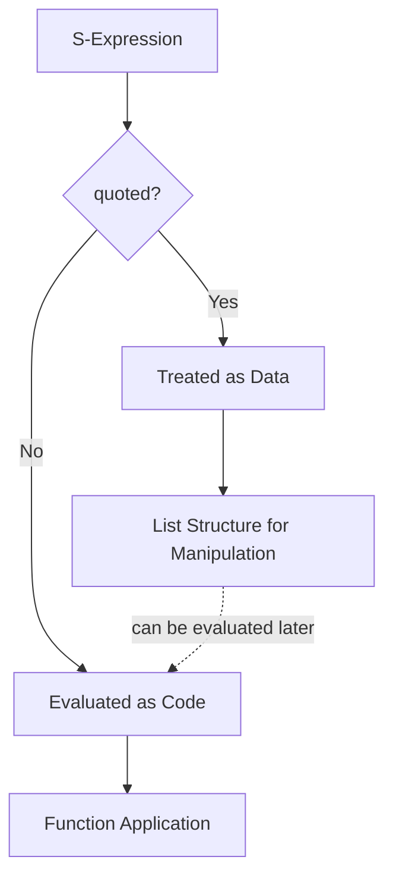
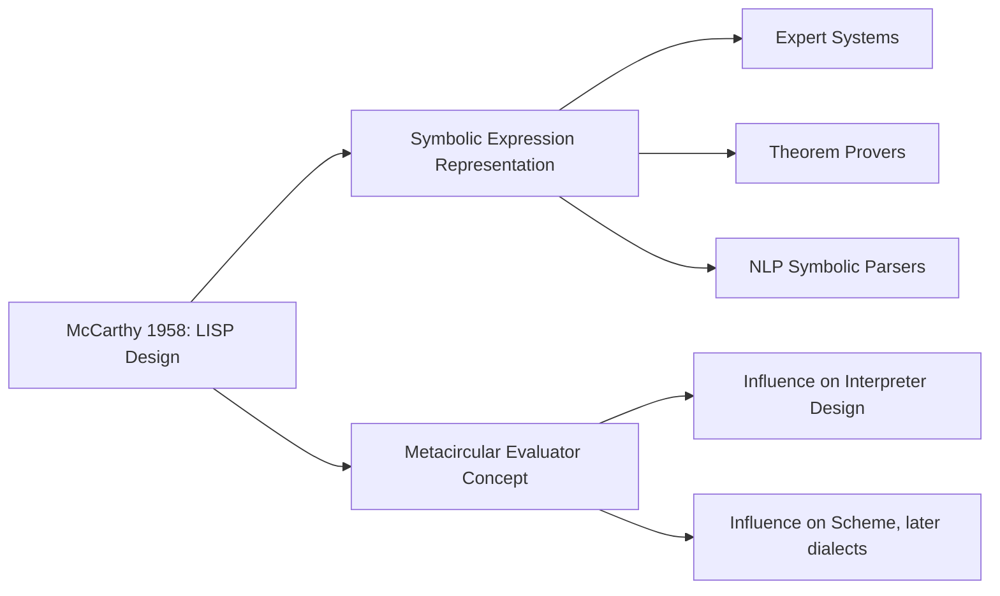

## John McCarthy and the Origins of Symbolic Computation

**Key Points**

- John McCarthy (1927–2011) created LISP in 1958 at MIT, introducing symbolic computation as a first-class programming paradigm rather than treating programs as purely numeric calculators.
- McCarthy's core insight was representing both code and data using the same underlying structure (S-expressions), enabling programs that could manipulate other programs as data.
- He coined the term "Artificial Intelligence" in 1955 for the Dartmouth Conference proposal, positioning symbolic computation as the natural substrate for AI research.
- LISP introduced garbage collection, recursion as a primary control structure, and conditional expressions in forms that became foundational to later language design.

### Historical Context: From Numeric to Symbolic Machines

Early computers (ENIAC, early FORTRAN-era machines) were designed around numeric computation — arithmetic on floating-point and integer values for scientific and engineering problems. McCarthy, working in the late 1950s at MIT, was motivated by a different question: how can a machine manipulate *symbols* and *expressions* representing logical statements, mathematical proofs, or linguistic structures, not just numbers?

This shift reflected the goals of the emerging AI field: representing knowledge, performing logical inference, and manipulating abstract structures required a computational model built around symbols and their relationships, not arithmetic.

### The Lambda Calculus Connection

McCarthy drew heavily on Alonzo Church's **lambda calculus**, a formal system from the 1930s for expressing computation through function abstraction and application. Where lambda calculus defines functions abstractly as:

$$\lambda x. (x + 1)$$

McCarthy translated this into a practical, executable notation:

```lisp
(lambda (x) (+ x 1))
```

This function takes `x` and returns `x + 1`. The parenthesized prefix notation — an operator followed by its operands — became LISP's defining syntactic signature.

### S-Expressions: The Core Innovation

McCarthy's most consequential design decision was representing everything — code, data, and lists — as **S-expressions** (symbolic expressions), typically written as nested parenthesized lists.

```lisp
(+ 1 2)          ; a function call: apply + to 1 and 2
(1 2 3)          ; a list of data: the numbers 1, 2, 3
(quote (1 2 3))  ; explicitly treat (1 2 3) as data, not code
```

Because code and data share the same structural representation, a LISP program can construct, inspect, and even execute other LISP expressions at runtime. This property — often summarized as **homoiconicity** — meant that writing programs that generate or transform other programs became a natural, first-class capability rather than a special case.



### EVAL and APPLY: The Metacircular Evaluator

In his 1960 paper "Recursive Functions of Symbolic Expressions and Their Computation by Machine," McCarthy defined LISP's semantics using two mutually recursive functions: `eval` (evaluates an expression in an environment) and `apply` (applies a function to its arguments). Writing an interpreter for LISP *in LISP itself* — the so-called **metacircular evaluator** — demonstrated that the language was powerful enough to define its own semantics, a property that deeply influenced later work in programming language theory and interpreter design.

```lisp
(define (eval expr env)
  (cond ((atom? expr) (lookup expr env))
        ((eq? (car expr) 'quote) (cadr expr))
        ((eq? (car expr) 'if) (eval-if expr env))
        ((eq? (car expr) 'lambda) (make-closure expr env))
        (else (apply (eval (car expr) env)
                      (evlist (cdr expr) env)))))
```

This is a simplified illustration of the structure McCarthy's paper described, not verbatim historical source code — early LISP implementations varied in exact syntax and detail. [Inference]

### Key Language Features Introduced

- **Conditional expressions**: McCarthy introduced `cond`, a generalization of if-then-else that returns a value, allowing conditionals to be used as expressions rather than only as control-flow statements — influential well beyond LISP itself.
- **Recursion as primary iteration mechanism**: Rather than relying on loop constructs, LISP treated recursive function calls as the natural way to process recursively-structured data (lists, trees).
- **Garbage collection**: Because LISP programs dynamically allocate list cells (`cons` cells) during execution, McCarthy's team implemented automatic memory reclamation — one of the earliest production uses of garbage collection in a programming language.
- **Higher-order functions**: Functions could be passed as arguments and returned as values, a direct consequence of treating functions as data via the lambda notation.

```lisp
(define (map f lst)
  (if (null? lst)
      '()
      (cons (f (car lst)) (map f (cdr lst)))))

(map (lambda (x) (* x x)) '(1 2 3 4))
; => (1 4 9 16)
```

### McCarthy, AI, and Symbolic Reasoning

McCarthy's motivation for symbolic computation was inseparable from his AI research goals. He believed that intelligent behavior required manipulating symbolic representations of facts and rules — an approach now retrospectively labeled "symbolic AI" or "Good Old-Fashioned AI" (GOFAI), in contrast to later statistical/connectionist approaches.

LISP became the dominant implementation language for early AI systems, including:

- **Expert systems** encoding domain rules as symbolic assertions
- **Theorem provers** manipulating logical formulas as data structures
- **Natural language processing** systems parsing sentences into symbolic tree structures



### Structural Diagram: S-Expression Tree

<svg xmlns="http://www.w3.org/2000/svg" viewBox="0 0 640 320">
  <text x="320" y="24" text-anchor="middle" font-size="15" font-weight="bold" fill="#1a1a1a">S-Expression as a Tree Structure (svg_diagram)</text>

  <text x="320" y="50" text-anchor="middle" font-size="12" font-family="monospace" fill="#333">(+ (* 2 3) (- 5 1))</text>

  <circle cx="320" cy="90" r="22" fill="#e8eef7" stroke="#3a5a8c" stroke-width="1.5" />
  <text x="320" y="95" text-anchor="middle" font-size="13" fill="#1a1a1a">+</text>

  <line x1="300" y1="108" x2="200" y2="150" stroke="#555" stroke-width="1.5" />
  <line x1="340" y1="108" x2="440" y2="150" stroke="#555" stroke-width="1.5" />

  <circle cx="200" cy="170" r="22" fill="#f7ecd9" stroke="#8c6a3a" stroke-width="1.5" />
  <text x="200" y="175" text-anchor="middle" font-size="13" fill="#1a1a1a">*</text>

  <circle cx="440" cy="170" r="22" fill="#f7ecd9" stroke="#8c6a3a" stroke-width="1.5" />
  <text x="440" y="175" text-anchor="middle" font-size="13" fill="#1a1a1a">-</text>

  <line x1="185" y1="188" x2="140" y2="230" stroke="#555" stroke-width="1.5" />
  <line x1="215" y1="188" x2="260" y2="230" stroke="#555" stroke-width="1.5" />
  <line x1="425" y1="188" x2="380" y2="230" stroke="#555" stroke-width="1.5" />
  <line x1="455" y1="188" x2="500" y2="230" stroke="#555" stroke-width="1.5" />

  <circle cx="140" cy="250" r="18" fill="#e6f2e6" stroke="#3a7a3a" stroke-width="1.5" />
  <text x="140" y="255" text-anchor="middle" font-size="12" fill="#1a1a1a">2</text>

  <circle cx="260" cy="250" r="18" fill="#e6f2e6" stroke="#3a7a3a" stroke-width="1.5" />
  <text x="260" y="255" text-anchor="middle" font-size="12" fill="#1a1a1a">3</text>

  <circle cx="380" cy="250" r="18" fill="#e6f2e6" stroke="#3a7a3a" stroke-width="1.5" />
  <text x="380" y="255" text-anchor="middle" font-size="12" fill="#1a1a1a">5</text>

  <circle cx="500" cy="250" r="18" fill="#e6f2e6" stroke="#3a7a3a" stroke-width="1.5" />
  <text x="500" y="255" text-anchor="middle" font-size="12" fill="#1a1a1a">1</text>

  <text x="320" y="295" text-anchor="middle" font-size="11" fill="#555">Same tree structure represents both the code and, if quoted, the data</text>
</svg>

### Influence on Later Languages

McCarthy's symbolic computation model propagated through decades of language design:

| Language | Inherited Concept from LISP |
|---|---|
| Scheme (1975) | Lexical scoping, minimalism, tail-call optimization |
| Common Lisp (1984) | Macro system, condition system, broad standardization |
| Prolog | Symbolic representation of logic, though via unification rather than S-expressions |
| Python | List comprehensions and functional idioms (`map`, `filter`, `reduce`) trace conceptually to LISP's higher-order functions |
| JavaScript | First-class functions and closures reflect LISP's function-as-data philosophy |
| Clojure (2007) | Direct modern descendant, explicitly homoiconic, built on immutable data structures |

### Macros: Code That Writes Code

Because LISP code is represented as manipulable list data, McCarthy's design enabled **macros** — functions that transform unevaluated code before execution, effectively letting programmers extend the language's own syntax.

```lisp
(defmacro my-if (condition then-branch else-branch)
  `(cond (,condition ,then-branch)
         (t ,else-branch)))
```

This macro expands into a `cond` form at compile time rather than being evaluated as a regular function call — a capability that remains distinctive to LISP-family languages and stems directly from treating code as data.

### Common Misconceptions

- **"LISP is just for AI."** While historically dominant in AI research, LISP's underlying ideas (recursion, higher-order functions, garbage collection) are now standard across virtually all modern languages, independent of AI application.
- **"Parentheses are the main innovation."** The parentheses are a syntactic consequence of S-expressions, not the innovation itself — the real contribution is the unification of code and data representation.
- **"McCarthy fully designed the first working implementation himself."** Steve Russell and others at MIT implemented the first working LISP interpreter based on McCarthy's theoretical `eval` function, which McCarthy had originally intended as a mathematical description rather than an implementation target. [Inference]

### Conclusion

John McCarthy's contribution was not merely inventing a language, but establishing symbolic computation — the idea that programs could represent, manipulate, and reason about symbolic structures (including other programs) — as a foundational paradigm in computer science. This conceptual shift, formalized through S-expressions and the `eval`/`apply` model, underlies modern functional programming, metaprogramming, and large portions of programming language theory, extending far beyond LISP's original AI research context.

**Related Topics**

- Lambda calculus and its formalization by Alonzo Church
- Scheme and the minimalist LISP dialect tradition
- Homoiconicity and metaprogramming across language families
- Garbage collection algorithms and memory management history
- Functional programming paradigms and higher-order functions
- The Dartmouth Conference (1956) and the founding of AI as a field
- Common Lisp's macro system and condition/restart system
- Comparing symbolic AI (GOFAI) to modern statistical/neural approaches