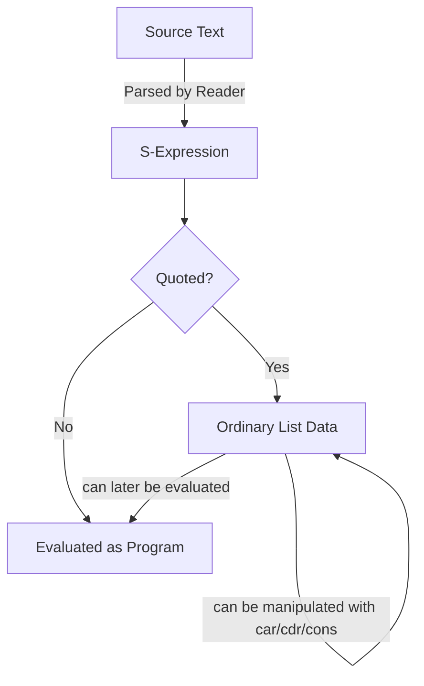

## S-Expressions and Homoiconicity

**Key Points**

- An S-expression (symbolic expression) is a notation for representing nested list structures using parentheses, originally introduced by John McCarthy for LISP in 1958.
- Homoiconicity is the property of a language where programs are represented as data structures the language itself can natively manipulate, using its own primary representational form.
- S-expressions are the mechanism through which LISP-family languages achieve homoiconicity — code and data share one uniform syntax.
- This uniformity enables powerful metaprogramming: programs that generate, transform, or reason about other programs using ordinary data-manipulation operations.

### What an S-Expression Actually Is

An S-expression is either an **atom** (a symbol or a primitive value like a number) or a **list** of S-expressions enclosed in parentheses. This is a recursive definition — lists can contain lists, to arbitrary depth.

```lisp
42                  ; atom (number)
foo                 ; atom (symbol)
(a b c)             ; list of three atoms
(a (b c) d)         ; list containing a nested list
(+ 1 (* 2 3))       ; nested list representing an arithmetic expression
```

Formally, the grammar can be expressed as:

```
<s-expr> ::= <atom> | "(" <s-expr>* ")"
```

This minimal grammar is sufficient to represent arbitrarily complex data structures, function calls, and — critically — entire programs.

### Code as Data: The Central Idea

In most languages, source code is text that gets parsed into an internal representation (an abstract syntax tree) invisible to the running program. In LISP-family languages, the AST *is* the S-expression, and it remains directly accessible and manipulable at runtime using the same list operations (`car`, `cdr`, `cons`) used for ordinary data.

```lisp
(+ 1 2)
```

This is simultaneously:
1. A valid piece of data — a list containing the symbol `+`, the number `1`, and the number `2`.
2. A valid piece of code — when evaluated, it applies `+` to `1` and `2`, producing `3`.

Whether it is treated as code or data depends only on whether it is evaluated or quoted:

```lisp
(+ 1 2)          ; evaluates to 3 (treated as code)
(quote (+ 1 2))  ; evaluates to the list (+ 1 2) (treated as data)
'(+ 1 2)         ; shorthand for the same quoting
```

### Defining Homoiconicity Precisely

Homoiconicity (from Greek *homo*, "same," and *icon*, "representation") means a language's code, when read into the language's own runtime, takes the same structural form as the language's native data structures — not merely that source code can be represented as a string.

This distinction matters: many languages allow treating source code as a string (e.g., `eval` on a string in Python or JavaScript), but that's not homoiconicity — the string has no structural relationship to the language's data types until parsed. True homoiconicity requires that the parsed form of code *is* an ordinary data structure of the language.



### The Reader, Eval, and the Homoiconic Loop

LISP's execution model separates three stages: the **reader** (parses text into S-expressions), **eval** (executes S-expressions as code), and ordinary data manipulation functions that work identically on both.

```lisp
(define expr '(+ 1 2))       ; expr is data: a 3-element list
(car expr)                    ; => + (the first element)
(cdr expr)                    ; => (1 2)
(eval expr)                    ; => 3 (now treated as code, evaluated)

(define modified
  (cons '* (cdr expr)))       ; build a new list: (* 1 2)
(eval modified)                ; => 2
```

This example demonstrates the core homoiconic capability: a program built ordinary list data (`cons`, `car`, `cdr`), then evaluated it as executable code — no special "code-generation API" was needed, since code and data share the same manipulation primitives.

### Macros: Homoiconicity's Signature Application

Because code is data, LISP-family languages support **macros** — functions that receive unevaluated code as S-expression data, transform it, and return new code to be evaluated in place of the original call. This differs fundamentally from simple text-substitution macros (like C's preprocessor), since LISP macros operate on structured data, not raw text.

```lisp
(defmacro unless (condition body)
  `(if (not ,condition) ,body))

(unless (> 3 5) (display "3 is not greater than 5"))
; expands to:
(if (not (> 3 5)) (display "3 is not greater than 5"))
```

The backtick (`` ` ``) and comma (`,`) syntax (quasiquotation) allow constructing S-expression templates with selective evaluation — a direct consequence of code being manipulable as structured data rather than text.

### Structural Comparison: Homoiconic vs Non-Homoiconic Representation

<svg xmlns="http://www.w3.org/2000/svg" viewBox="0 0 660 340">
  <text x="330" y="24" text-anchor="middle" font-size="15" font-weight="bold" fill="#1a1a1a">Homoiconic vs Non-Homoiconic Code Representation (svg_diagram)</text>

  <rect x="20" y="50" width="290" height="260" rx="8" fill="#e6f2e6" stroke="#3a7a3a" stroke-width="1.5" />
  <text x="165" y="75" text-anchor="middle" font-size="13" font-weight="bold" fill="#1a1a1a">LISP (Homoiconic)</text>

  <text x="165" y="105" text-anchor="middle" font-size="11" font-family="monospace" fill="#333">(+ 1 2)</text>
  <line x1="165" y1="115" x2="165" y2="140" stroke="#555" stroke-width="1.5" marker-end="url(#arrow1)" />
  <text x="165" y="160" text-anchor="middle" font-size="10" fill="#555">parsed by reader</text>

  <rect x="60" y="170" width="210" height="45" rx="6" fill="#ffffff" stroke="#3a7a3a" stroke-width="1" />
  <text x="165" y="197" text-anchor="middle" font-size="11" font-family="monospace" fill="#1a1a1a">List: (+ 1 2)</text>

  <text x="165" y="235" text-anchor="middle" font-size="10" fill="#555">same structure used as</text>

  <rect x="60" y="245" width="95" height="35" rx="6" fill="#ffffff" stroke="#3a7a3a" stroke-width="1" />
  <text x="107" y="267" text-anchor="middle" font-size="10" fill="#1a1a1a">Data (list)</text>

  <rect x="175" y="245" width="95" height="35" rx="6" fill="#ffffff" stroke="#3a7a3a" stroke-width="1" />
  <text x="222" y="267" text-anchor="middle" font-size="10" fill="#1a1a1a">Code (eval)</text>

  <rect x="350" y="50" width="290" height="260" rx="8" fill="#f7ecd9" stroke="#8c6a3a" stroke-width="1.5" />
  <text x="495" y="75" text-anchor="middle" font-size="13" font-weight="bold" fill="#1a1a1a">Python (Non-Homoiconic)</text>

  <text x="495" y="105" text-anchor="middle" font-size="11" font-family="monospace" fill="#333">1 + 2</text>
  <line x1="495" y1="115" x2="495" y2="140" stroke="#555" stroke-width="1.5" marker-end="url(#arrow1)" />
  <text x="495" y="160" text-anchor="middle" font-size="10" fill="#555">parsed into internal AST</text>

  <rect x="390" y="170" width="210" height="45" rx="6" fill="#ffffff" stroke="#8c6a3a" stroke-width="1" />
  <text x="495" y="197" text-anchor="middle" font-size="10" fill="#1a1a1a">Opaque AST (not a Python list)</text>

  <text x="495" y="240" text-anchor="middle" font-size="10" fill="#555">not directly manipulable</text>
  <text x="495" y="255" text-anchor="middle" font-size="10" fill="#555">as ordinary Python data</text>
  <text x="495" y="270" text-anchor="middle" font-size="10" fill="#555">without special libraries (e.g. `ast` module)</text>

  </svg>

### Homoiconicity Across Languages

| Language | Homoiconic? | Notes |
|---|---|---|
| Common Lisp / Scheme / Clojure | Yes | Canonical examples; S-expressions are both syntax and native list data |
| Prolog | Partially | Terms represent both code and data uniformly, though the mechanism differs from S-expressions |
| Rebol / Red | Yes | Explicitly designed around homoiconic "blocks" |
| Python | No | Has an `ast` module to inspect parsed code, but the AST is not the language's ordinary data representation used elsewhere |
| JavaScript | No | Code can be manipulated as strings or via separate parser libraries, but not natively as core data types |
| Julia | Partially | Supports metaprogramming with expression objects that resemble homoiconic manipulation, though its syntax is not S-expression based |

Languages without homoiconicity can still support metaprogramming (Python's `ast` module, JavaScript's various AST-manipulation libraries), but they require dedicated tooling to bridge the gap between source text and manipulable structure — a gap that simply doesn't exist in S-expression-based languages. [Inference]

### Practical Implications

**Advantages:**
- Macros allow extending language syntax without modifying the compiler/interpreter itself.
- Domain-specific languages (DSLs) can be embedded directly using the host language's own S-expression syntax.
- Program transformation, analysis, and code generation tools are simpler to build since no separate parsing step is needed to get manipulable structure.

**Trade-offs:**
- Heavy parenthesization is often cited as a readability barrier for newcomers, though many practitioners report this concern diminishes substantially with familiarity. [Inference]
- Powerful macro systems can make code harder to reason about if macros are used to alter fundamental language semantics unpredictably.
- Tooling (syntax highlighting, refactoring tools) historically had less mature support for deeply macro-transformed code compared to mainstream imperative languages, though this has improved with modern LISP-family tooling. [Unverified]

### Conclusion

S-expressions provide the uniform, recursively-structured syntax that makes homoiconicity possible: because every program is itself an ordinary nested list, LISP-family languages can inspect, generate, and transform code using the exact same primitives used for everyday data manipulation. This property, largely absent from mainstream imperative and object-oriented languages, remains one of the most distinctive and enduring architectural decisions in programming language history, directly enabling macro systems and deeply reflective metaprogramming.

**Related Topics**

- LISP macro systems and quasiquotation in depth
- Abstract syntax trees (ASTs) in non-homoiconic languages
- Domain-specific language (DSL) design and embedding
- Clojure's approach to homoiconicity and immutable data structures
- Metaprogramming techniques across language paradigms
- Reflection versus homoiconicity: distinguishing related but distinct concepts
- The `eval`/`apply` model and metacircular evaluators
- Comparing LISP macros to C preprocessor macros and Rust's macro system