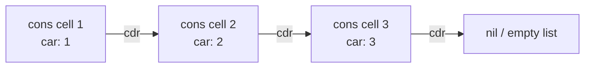

## Lists as the Universal Data Structure

**Key Points**

- In LISP-family languages, the singly-linked list built from `cons` cells serves as the foundational structure from which virtually all other data types — trees, sets, associative maps, even programs themselves — can be constructed.
- A `cons` cell is a minimal pair-of-pointers structure; lists are chains of `cons` cells, and more complex structures are simply specific patterns of nested `cons` cells.
- This universality is distinct from homoiconicity: homoiconicity concerns code-as-data, while list-universality concerns *all data* being reducible to one uniform structural primitive.
- The trade-off for this uniformity is that some operations (e.g., random access) are asymptotically slower than in array-based structures, since lists are optimized for sequential/recursive traversal, not indexed access.

### The Cons Cell: The Atomic Building Block

Everything begins with a single primitive: the **cons cell**, a pair of two pointers, conventionally called `car` (the first element) and `cdr` (the rest).

```lisp
(cons 1 2)        ; => (1 . 2)   a single cons cell (a "dotted pair")
(car (cons 1 2))  ; => 1
(cdr (cons 1 2))  ; => 2
```

A list is simply a chain of cons cells where each `cdr` points to the next cons cell, terminated by a special empty-list marker (`nil` or `'()`).

```lisp
(cons 1 (cons 2 (cons 3 '())))
; => (1 2 3)
```

This reveals that `(1 2 3)` is not a primitive list type — it's syntactic sugar for a specific nested chain of cons cells.



### Building Complex Structures from Cons Cells

**Nested lists (trees):** Since `car` can itself be a list, cons cells naturally build tree structures.

```lisp
'((1 2) (3 4) 5)
; a list containing two sublists and an atom
```

**Association lists (maps):** A list of pairs simulates a key-value map.

```lisp
(define person '((name . "Ana") (age . 30) (city . "Manila")))
(cdr (assoc 'age person))   ; => 30
```

**Sets:** Represented simply as lists with an implicit invariant of no duplicate elements, checked at insertion time by functions like `adjoin` rather than enforced by a distinct underlying type.

```lisp
(define (adjoin x lst)
  (if (member x lst) lst (cons x lst)))
```

**Trees (explicit):** Binary trees can be represented as three-element lists: value, left subtree, right subtree.

```lisp
(define (make-tree value left right) (list value left right))
(define (tree-value t) (car t))
(define (tree-left t) (cadr t))
(define (tree-right t) (caddr t))

(make-tree 5 (make-tree 3 '() '()) (make-tree 8 '() '()))
```

### Structural Diagram: One Primitive, Many Structures

<svg xmlns="http://www.w3.org/2000/svg" viewBox="0 0 660 380">
  <text x="330" y="24" text-anchor="middle" font-size="15" font-weight="bold" fill="#1a1a1a">Cons Cells as the Universal Building Block (svg_diagram)</text>

  <rect x="260" y="45" width="140" height="45" rx="6" fill="#e8eef7" stroke="#3a5a8c" stroke-width="1.5" />
  <text x="330" y="72" text-anchor="middle" font-size="12" font-weight="bold" fill="#1a1a1a">cons cell (car . cdr)</text>

  <line x1="330" y1="90" x2="150" y2="140" stroke="#555" stroke-width="1.5" marker-end="url(#arrowU)" />
  <line x1="330" y1="90" x2="330" y2="140" stroke="#555" stroke-width="1.5" marker-end="url(#arrowU)" />
  <line x1="330" y1="90" x2="510" y2="140" stroke="#555" stroke-width="1.5" marker-end="url(#arrowU)" />

  <rect x="60" y="140" width="180" height="45" rx="6" fill="#e6f2e6" stroke="#3a7a3a" stroke-width="1.5" />
  <text x="150" y="167" text-anchor="middle" font-size="11" fill="#1a1a1a">Linear List</text>

  <rect x="250" y="140" width="160" height="45" rx="6" fill="#f7ecd9" stroke="#8c6a3a" stroke-width="1.5" />
  <text x="330" y="167" text-anchor="middle" font-size="11" fill="#1a1a1a">Tree / Nested List</text>

  <rect x="430" y="140" width="180" height="45" rx="6" fill="#f0e6f2" stroke="#7a3a7a" stroke-width="1.5" />
  <text x="520" y="167" text-anchor="middle" font-size="11" fill="#1a1a1a">Association List</text>

  <line x1="150" y1="185" x2="150" y2="220" stroke="#555" stroke-width="1.5" marker-end="url(#arrowU)" />
  <line x1="330" y1="185" x2="330" y2="220" stroke="#555" stroke-width="1.5" marker-end="url(#arrowU)" />
  <line x1="520" y1="185" x2="520" y2="220" stroke="#555" stroke-width="1.5" marker-end="url(#arrowU)" />

  <rect x="60" y="220" width="180" height="40" rx="6" fill="#ffffff" stroke="#3a7a3a" stroke-width="1" />
  <text x="150" y="244" text-anchor="middle" font-size="10" fill="#1a1a1a">Stack / Queue behavior</text>

  <rect x="250" y="220" width="160" height="40" rx="6" fill="#ffffff" stroke="#8c6a3a" stroke-width="1" />
  <text x="330" y="244" text-anchor="middle" font-size="10" fill="#1a1a1a">Binary Trees, S-Expressions</text>

  <rect x="430" y="220" width="180" height="40" rx="6" fill="#ffffff" stroke="#7a3a7a" stroke-width="1" />
  <text x="520" y="244" text-anchor="middle" font-size="10" fill="#1a1a1a">Maps / Records</text>

  <rect x="180" y="290" width="300" height="60" rx="8" fill="#fdecec" stroke="#8c3a3a" stroke-width="1.5" />
  <text x="330" y="315" text-anchor="middle" font-size="12" font-weight="bold" fill="#1a1a1a">Even source code (S-expressions)</text>
  <text x="330" y="335" text-anchor="middle" font-size="10" fill="#333">is built from the same cons cell structure</text>

  <line x1="330" y1="260" x2="330" y2="290" stroke="#555" stroke-width="1.5" stroke-dasharray="4,3" marker-end="url(#arrowU)" />

  </svg>

### Fundamental List Operations

The entire list-processing paradigm reduces to a small set of primitives, from which all higher-level list functions are built:

```lisp
(car '(1 2 3))        ; => 1          first element
(cdr '(1 2 3))        ; => (2 3)      rest of the list
(cons 0 '(1 2 3))     ; => (0 1 2 3)  prepend an element
(null? '())            ; => #t         test for empty list
```

From these four primitives, recursive functions build the entire standard library of list operations:

```lisp
(define (length lst)
  (if (null? lst) 0 (+ 1 (length (cdr lst)))))

(define (append lst1 lst2)
  (if (null? lst1)
      lst2
      (cons (car lst1) (append (cdr lst1) lst2))))

(define (reverse lst)
  (if (null? lst)
      '()
      (append (reverse (cdr lst)) (list (car lst)))))

(define (map f lst)
  (if (null? lst)
      '()
      (cons (f (car lst)) (map f (cdr lst)))))
```

This pattern — base case on the empty list, recursive case decomposing into `car`/`cdr` — is the canonical recursive traversal structure for any list-based algorithm.

### Recursive Structure Mirrors Recursive Data

Because lists are inherently recursive (a list is either empty or a cons cell whose `cdr` is itself a list), functions processing them naturally take a recursive form, following what is sometimes called **structural recursion** — the shape of the function mirrors the shape of the data.

$$\text{length}(L) = \begin{cases} 0 & \text{if } L = \emptyset \\ 1 + \text{length}(\text{cdr}(L)) & \text{otherwise} \end{cases}$$

This correspondence between data structure and algorithm structure is a defining characteristic of functional list processing, distinguishing it from iterative, index-based approaches common in array-oriented languages.

### Performance Trade-offs

Lists built from cons cells optimize for specific access patterns at the cost of others:

| Operation | Singly-Linked List | Array |
|---|---|---|
| Access first element (`car`) | $O(1)$ | $O(1)$ |
| Access arbitrary index | $O(n)$ | $O(1)$ |
| Prepend element | $O(1)$ | $O(n)$ (requires shifting, or reallocation) |
| Append element (at end) | $O(n)$ | Amortized $O(1)$ |
| Memory layout | Non-contiguous, pointer-chasing | Contiguous |

This means algorithms should be designed around the list's strengths — sequential traversal and prepending — rather than treating it as an array substitute; repeatedly indexing into a list by position is a common performance anti-pattern in LISP-style code. [Inference]

### Beyond Pure Cons Cells: Vectors and Modern Extensions

Recognizing the indexed-access limitation, LISP-family languages introduced **vectors** as a complementary structure for $O(1)$ random access, while retaining cons-cell lists for recursive/sequential processing:

```lisp
(define v (vector 1 2 3 4))
(vector-ref v 2)   ; => 3, O(1) access
```

Modern LISP descendants like Clojure go further, offering **persistent vectors** and **hash maps** implemented internally via structures like hash array mapped tries (HAMTs) rather than plain cons-cell chains — achieving near-constant-time operations while preserving immutability and structural sharing. This represents an evolution beyond the "everything is a cons cell" model, while still honoring the broader philosophy of a small set of uniform, composable persistent data structures. [Inference]

### Structural Sharing and Immutability

Because cons cells are typically immutable in idiomatic use, operations like `cons` (prepending) can share structure with the original list rather than copying it — a property foundational to functional programming's efficient handling of persistent (unmodified-original) data structures.

```lisp
(define original '(2 3 4))
(define extended (cons 1 original))
; extended = (1 2 3 4)
; original is unchanged and its cons cells are shared, not duplicated, by extended
```

This sharing is only safe because the underlying cons cells aren't mutated after creation — a discipline that generalizes to more sophisticated persistent data structures in modern functional languages.

### Conclusion

The reduction of all data — sequences, trees, maps, sets, and even source code itself — to chains and combinations of a single primitive, the cons cell, reflects a foundational design philosophy in LISP-family languages: build complexity from a minimal, uniform, composable primitive rather than proliferating specialized built-in types. This uniformity simplifies the core language and enables elegant recursive algorithms, though it trades away constant-time indexed access, a gap later addressed through complementary structures like vectors and, in modern descendants, persistent hash-based collections.

**Related Topics**

- Cons cells, dotted pairs, and proper vs. improper lists
- Association lists versus hash tables for key-value storage
- Persistent data structures and structural sharing in Clojure
- Tail recursion and tail-call optimization for list processing
- Vectors and arrays as complementary structures to linked lists
- Structural recursion as a general functional programming technique
- Big-O analysis of common list operations
- Zippers and other functional data structure navigation techniques