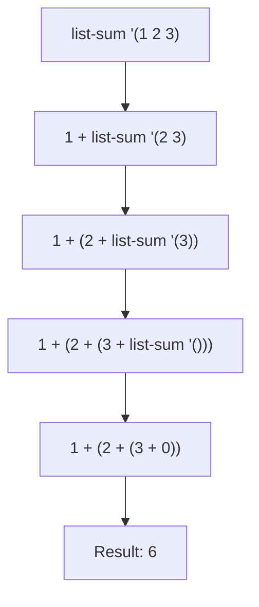
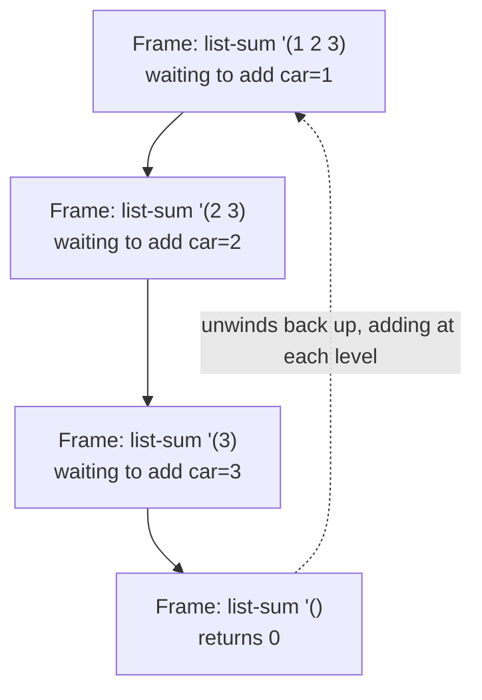
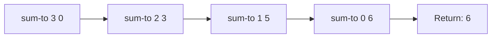

## Recursion as the Primary Control Mechanism

**Key Points**

- LISP-family languages, along with much of the functional programming tradition, treat recursion — not iterative looping constructs like `for` or `while` — as the fundamental mechanism for repetition and control flow.
- This choice follows directly from the recursive nature of the primary data structure (the list): a recursive data structure is naturally processed by a recursive function.
- Naive recursion carries a real cost — unbounded call-stack growth — which is addressed through **tail-call optimization (TCO)**, a language/implementation guarantee that certain recursive calls execute in constant stack space.
- Understanding the distinction between general recursion, tail recursion, and iteration is essential to reasoning about performance and stack safety in recursion-centric languages.

### Why Recursion, Not Loops

Imperative languages provide `for` and `while` loops as primitive control structures, relying on mutable loop counters and mutable accumulator variables. Early functional languages, following the mathematical tradition of recursive function definitions (and lambda calculus, which has no built-in looping construct at all), instead express repetition as a function calling itself with modified arguments.

```lisp
; imperative-style thinking (pseudocode, not idiomatic LISP)
sum = 0
for i in 1..n: sum = sum + i

; recursive equivalent
(define (sum-to n)
  (if (= n 0)
      0
      (+ n (sum-to (- n 1)))))
```

The recursive version has no mutable state — `sum-to` doesn't update a variable across iterations. Each call is a self-contained computation that depends only on its argument, aligning with functional programming's preference for immutability and referential transparency.

### The Structural Match Between Recursion and Recursive Data

Lists, as established by their cons-cell construction, are inherently recursive: a list is either empty, or an element followed by another list. Recursive functions mirror this structure directly.

```lisp
(define (list-sum lst)
  (if (null? lst)
      0
      (+ (car lst) (list-sum (cdr lst)))))
```

$$\text{list-sum}(L) = \begin{cases} 0 & \text{if } L = \emptyset \\ \text{car}(L) + \text{list-sum}(\text{cdr}(L)) & \text{otherwise} \end{cases}$$

This one-to-one correspondence between a recursive data definition and a recursive function definition — known as **structural recursion** — is the dominant pattern for processing lists, trees, and other recursively-defined structures.



### The Call Stack Cost of General Recursion

Each recursive call in the example above must wait for its recursive sub-call to return before it can complete its own addition (`+`). This means the call stack must retain a pending frame for every level of recursion — for `list-sum` on a list of length $n$, the stack grows to depth $n$ before any addition happens.



For sufficiently large `n`, this can exhaust available stack space — a **stack overflow** — making naive recursive functions unsuitable for processing very long lists without further optimization.

### Tail Recursion: Recursion Without Stack Growth

A recursive call is in **tail position** when it is the very last operation performed in a function — there is no pending work (like an addition) to do after the recursive call returns. Because nothing remains to be done in the calling frame, the language implementation can discard the current frame entirely and reuse its space for the next call, rather than stacking a new frame on top.

```lisp
(define (sum-to n acc)
  (if (= n 0)
      acc
      (sum-to (- n 1) (+ n acc))))    ; tail call: nothing happens after this returns

(sum-to 1000000 0)   ; runs in constant stack space, given TCO
```

Here, `(+ n acc)` is computed *before* the recursive call, and passed in as an argument — the recursive call itself is the last action, with no pending addition afterward. This restructuring, moving the "work" into an accumulator parameter, is the standard technique for converting general recursion into tail recursion.



Note the contrast with the earlier diagram: each call here fully replaces the previous frame rather than nesting inside it — no frame needs to remain pending.

### Tail-Call Optimization (TCO) as a Language Guarantee

**TCO** is the implementation technique (and, in Scheme's case, a language specification requirement) where the compiler/interpreter detects tail calls and compiles them as direct jumps rather than stack-growing function calls, effectively transforming tail recursion into a loop at the machine level.

The **Scheme** standard formally mandates proper tail calls — a Scheme implementation is required to execute tail-recursive functions in constant stack space, regardless of recursion depth. Other LISP dialects and functional languages vary in this guarantee:

| Language | TCO Guarantee |
|---|---|
| Scheme | Required by language specification |
| Common Lisp | Not required by spec, but supported by most major implementations (e.g., SBCL) |
| Clojure | Not automatic (JVM lacks native TCO); requires explicit `recur` form |
| Haskell | Compilers (e.g., GHC) reliably optimize tail calls, though not formally mandated by the language report |
| Python | Deliberately not implemented, a design decision attributed to preserving informative stack traces [Unverified] |
| JavaScript | Specified in ES6 for strict mode, but adoption across engines has been inconsistent [Unverified] |

Because JVM lacks native tail-call elimination, Clojure requires an explicit `recur` special form to signal a self-tail-call the compiler should optimize, rather than relying on implicit detection of ordinary recursive calls:

```clojure
(defn sum-to [n acc]
  (if (= n 0)
      acc
      (recur (dec n) (+ n acc))))
```

### Recursive Patterns Beyond Simple Accumulation

**Mutual recursion**, where two or more functions call each other, is a natural extension of the recursion-as-control-flow paradigm, commonly used for state-machine-like logic:

```lisp
(define (even? n) (if (= n 0) #t (odd? (- n 1))))
(define (odd? n)  (if (= n 0) #f (even? (- n 1))))
```

**Tree recursion**, where a function makes more than one recursive call per invocation (as opposed to the single self-call in tail/linear recursion), naturally expresses branching structures like tree traversal, though it does not benefit from simple tail-call optimization since multiple pending calls exist at each level:

```lisp
(define (tree-sum t)
  (if (null? t)
      0
      (+ (tree-value t) (tree-sum (tree-left t)) (tree-sum (tree-right t)))))
```

### Named-Let and Loop Constructs Built Atop Recursion

Even when LISP dialects provide syntactic looping constructs (like Scheme's `do` or Common Lisp's `loop` macro), these are frequently implemented as macros expanding into recursive function calls underneath, rather than being primitive control structures distinct from recursion. Scheme's **named let** exemplifies this directly, providing loop-like syntax that is explicitly recursive:

```scheme
(let loop ((i 0) (acc 0))
  (if (= i 10)
      acc
      (loop (+ i 1) (+ acc i))))
```

This is syntactically loop-like but semantically a self-recursive function (`loop`) defined and immediately invoked — reinforcing that recursion remains the underlying mechanism even when surface syntax resembles iteration.

### Trade-offs of Recursion-Centric Control Flow

**Advantages:**
- Aligns naturally with recursively-defined data (lists, trees), producing code whose structure mirrors the data's structure.
- Avoids mutable loop counters, supporting referential transparency and easier reasoning about correctness.
- Generalizes cleanly to non-linear traversal patterns (trees, graphs) where iterative loop constructs are comparatively awkward.

**Trade-offs:**
- Requires understanding tail-call transformation to avoid stack overflow on large inputs — a conceptual burden not present with straightforward iterative loops.
- In languages without guaranteed TCO (Common Lisp implementations without it, most non-Scheme runtimes), deeply recursive non-tail calls remain genuinely risky for large inputs.
- Debugging deeply recursive stack traces can be less immediately intuitive than following a single loop's iteration count, particularly for mutual or tree recursion. [Inference]

### Conclusion

Recursion's status as the primary control mechanism in LISP-family and broader functional languages is not an arbitrary stylistic choice — it follows directly from the recursive structure of the data these languages were designed to process, and from a philosophical preference for immutable, referentially transparent computation over mutable state. The practical viability of this approach at scale depends critically on tail-call optimization, which transforms specific recursive patterns into constant-stack-space loops, making the distinction between general recursion, tail recursion, and language-level TCO guarantees essential knowledge for writing safe, performant recursive code.

**Related Topics**

- Tail-call optimization implementation details across compilers
- Mutual recursion and state-machine modeling
- Trampolining as a technique for stack-safe recursion without native TCO
- Accumulator-passing style and continuation-passing style (CPS)
- Tree recursion and traversal algorithms (pre-order, in-order, post-order)
- Scheme's `named let` and Common Lisp's `loop` macro internals
- Structural recursion versus generative recursion
- Stack overflow errors and memory model implications across language runtimes