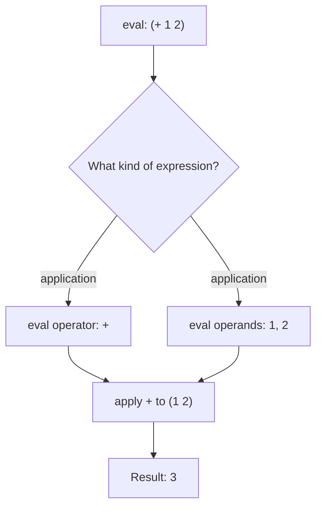
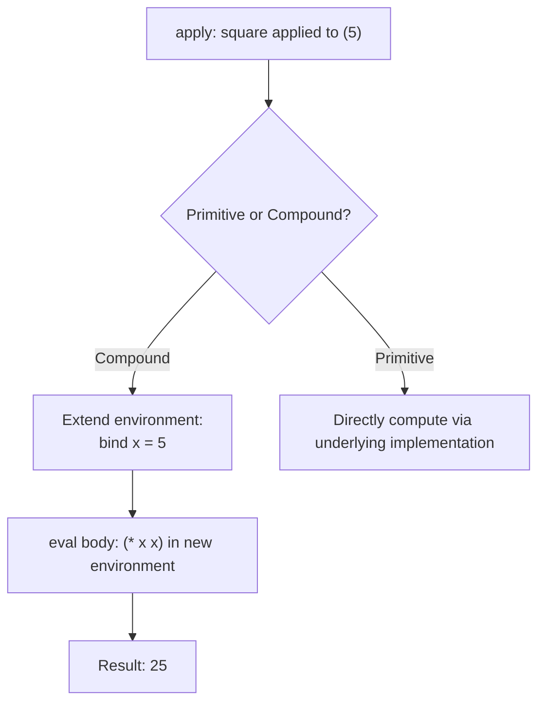
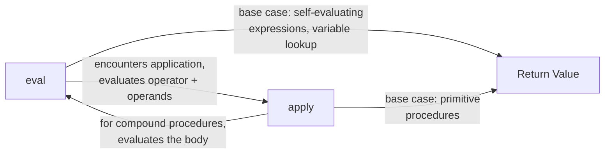
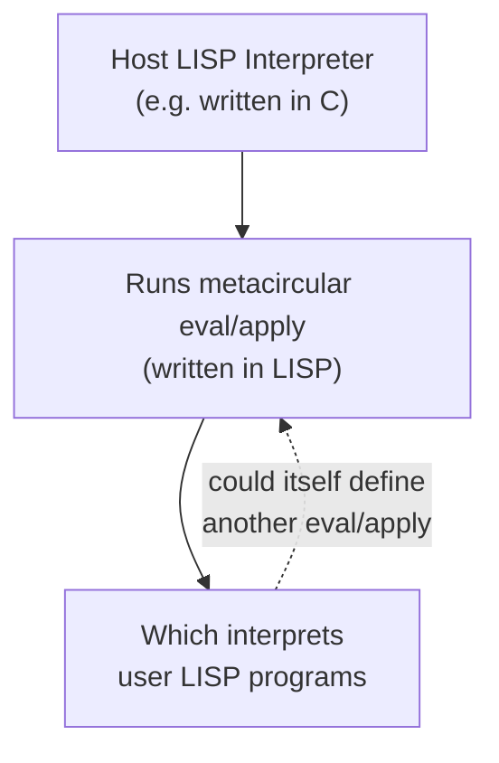

## The Eval-Apply Cycle

**Key Points**

- The eval-apply cycle is the core interpretation loop underlying LISP-family languages: `eval` evaluates an expression in an environment, and `apply` applies a function to a list of already-evaluated arguments.
- These two functions are mutually recursive — evaluating a function-call expression requires `eval` to invoke `apply`, and `apply` in turn invokes `eval` to evaluate the function body.
- This model was formalized by John McCarthy in his 1960 paper describing LISP, and the "metacircular evaluator" (a LISP interpreter written in LISP) is the classic demonstration of the cycle.
- Understanding eval-apply clarifies how variable lookup, function application, and special forms (like `if` or `lambda`) are actually processed, rather than treated as opaque black boxes.

### The Two Core Functions

**`eval`** takes an expression and an environment (a mapping from variable names to values) and returns the value the expression evaluates to.

**`apply`** takes a function (or procedure) and a list of arguments, and returns the result of applying that function to those arguments.

```lisp
(eval '(+ 1 2) global-environment)     ; => 3
(apply + '(1 2))                        ; => 3
```

Though these appear similar in effect for simple cases, they serve distinct roles: `eval` handles arbitrary unevaluated expressions (including special forms like `if`, `lambda`, `quote`), while `apply` handles the specific, narrower case of invoking an already-identified function on already-evaluated arguments.

### How Eval Dispatches on Expression Type

`eval`'s behavior depends entirely on what kind of expression it receives. A simplified structure, following McCarthy's original description:

```lisp
(define (eval expr env)
  (cond
    ((self-evaluating? expr) expr)             ; numbers, strings evaluate to themselves
    ((symbol? expr) (lookup-variable expr env)) ; symbols look up their bound value
    ((quoted? expr) (cadr expr))                 ; (quote x) returns x unevaluated
    ((if? expr) (eval-if expr env))              ; special handling for conditionals
    ((lambda? expr) (make-procedure expr env))   ; lambda creates a closure
    ((application? expr)
     (apply (eval (operator expr) env)
            (map (lambda (operand) (eval operand env)) (operands expr))))
    (else (error "Unknown expression type" expr))))
```

This is illustrative pseudocode reflecting the structure McCarthy's paper and later expositions (notably in *Structure and Interpretation of Computer Programs*) describe — exact function names and structure vary across specific implementations and textbooks. [Inference]

The critical branch is the last one: when `expr` is a function application (like `(+ 1 2)`), `eval` first evaluates the operator and each operand (recursively calling `eval` on each), then hands the results to `apply`.



### How Apply Dispatches on Procedure Type

`apply` distinguishes between **primitive procedures** (built-in operations like `+`, implemented directly in the underlying implementation language, e.g., C for many LISP runtimes) and **compound procedures** (user-defined functions created via `lambda`, represented as closures).

```lisp
(define (apply proc args)
  (cond
    ((primitive-procedure? proc)
     (apply-primitive-procedure proc args))
    ((compound-procedure? proc)
     (eval (procedure-body proc)
           (extend-environment (procedure-parameters proc) args (procedure-environment proc))))
    (else (error "Unknown procedure type" proc))))
```

For a compound procedure, `apply`'s job is to construct a new environment — binding the procedure's parameter names to the supplied argument values, layered on top of the environment where the procedure was originally defined — and then hand the procedure's body back to `eval` for evaluation in that new environment.



### The Mutual Recursion Visualized

The eval-apply cycle is fundamentally a back-and-forth: `eval` calls `apply` to handle function invocation, and `apply` calls `eval` to process the function body — each level of nested function calls in a program corresponds to another cycle through this loop.



This mutual recursion terminates because each cycle either reaches a **self-evaluating expression** (a number, string) or a **primitive procedure** — the two base cases that don't require further recursive descent into `eval` or `apply`.

### Environments: The Third Essential Component

Neither `eval` nor `apply` can function without an **environment** — a data structure mapping variable names to values, typically implemented as a chain of frames (each frame a table of bindings, with a pointer to an enclosing frame).

```lisp
; conceptual environment structure
(define global-env
  (make-frame '((+ . primitive-plus) (* . primitive-times))))

(define local-env
  (extend-environment '(x) '(5) global-env))
; local-env has x bound to 5, and falls back to global-env for anything else
```

Variable lookup (`lookup-variable`) searches the current frame first, then walks outward through enclosing frames until the variable is found or the chain is exhausted (triggering an "unbound variable" error). This chain structure is precisely what implements **lexical scoping** — a variable reference resolves according to where the code is textually defined, not where it happens to be called from.

### The Metacircular Evaluator: LISP Interpreting LISP

Because `eval` and `apply` can themselves be written in LISP (using the language's own conditionals, recursion, and list operations), it's possible to write a LISP interpreter *in LISP* — a **metacircular evaluator**. This is not merely a novelty; it served (notably in MIT's *Structure and Interpretation of Computer Programs*) as a pedagogical device to demonstrate that the entire semantics of a programming language can be made explicit and inspectable, rather than existing only as an opaque property of some underlying implementation.



### Special Forms: Why Not Everything Goes Through Apply

A crucial subtlety: not every parenthesized expression can be handled by evaluating its operands and calling `apply`. Forms like `if`, `lambda`, and `quote` are **special forms** — `eval` must recognize and handle them directly, because their operands should not simply all be evaluated the ordinary way.

```lisp
(if (> x 0) (display "positive") (display "negative"))
```

If `eval` naively evaluated all three operands of `if` before deciding which branch to take, both the "then" and "else" branches would execute unconditionally — clearly wrong. Instead, `eval` must special-case `if`: evaluate only the condition, then selectively evaluate just one of the two branches based on the result. This is why the `cond` dispatch inside `eval` explicitly checks for `if?`, `quoted?`, and `lambda?` before falling through to the general "evaluate operator and operands, then apply" case.

### Practical Relevance Beyond Theory

Understanding the eval-apply cycle clarifies otherwise-mysterious language behaviors:

- Why `(quote x)` doesn't evaluate `x` — `quote` is intercepted by `eval` before any operand evaluation occurs.
- Why closures capture their defining environment — `apply`, when invoking a compound procedure, extends the environment the procedure was created in (`procedure-environment`), not the caller's environment.
- Why macros must operate on unevaluated expressions — they act at the `eval` dispatch stage, before operands would normally be evaluated, which is precisely why they can transform code structurally rather than just computing on values.

### Conclusion

The eval-apply cycle is the conceptual (and often literal, in interpreter implementations) heartbeat of LISP-family languages: `eval` classifies and processes expressions — handling special forms directly and delegating ordinary function calls to `apply` — while `apply` invokes procedures by extending environments and handing control back to `eval`. This mutually recursive relationship, formalized by McCarthy and popularized through the metacircular evaluator tradition, provides a precise, inspectable model of what "running a program" actually means, distinguishing it from treating language execution as an unexaminable black box.

**Related Topics**

- Lexical scoping and environment-chain implementation
- Special forms versus ordinary procedure calls
- Writing a metacircular evaluator (as in SICP)
- Closures and how they capture defining environments
- Macro expansion's relationship to the eval dispatch stage
- Continuation-passing style as an alternative evaluation model
- Primitive versus compound procedures in interpreter design
- Dynamic scoping versus lexical scoping: historical LISP variations