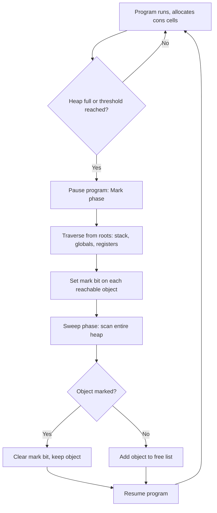

## Garbage Collection

### Why Lisp Needed It

Lisp, from its earliest implementation (Lisp 1.5, 1958–1960, John McCarthy), was among the first languages to make heap-allocated, dynamically-sized data structures (primarily cons cells) a core part of the language rather than an occasional feature. Every call to `cons` allocates a new pair on the heap. Because Lisp programs routinely built and discarded lists, trees, and closures at a rapid pace, manual memory management (explicit allocation and freeing, as in early Fortran or assembly-adjacent styles) was impractical:

- Cons cells are small and allocated extremely frequently.
- The same cell may be referenced from multiple places (shared list tails, circular structures via `rplacd`/`setf`).
- Determining when a cell was truly unreachable required tracing the entire live data graph, not just tracking one owner.

This forced the invention of **automatic garbage collection**: a runtime mechanism that periodically identifies memory no longer reachable from any live reference and reclaims it, without the programmer issuing an explicit "free" call.

### Core Concept

At any point during program execution, the **heap** contains allocated objects (cons cells, vectors, symbols, closures, etc.). Some objects are **reachable** — accessible by following pointers starting from a set of **roots** (the stack, registers, global/special variable bindings, active closures). Objects not reachable from any root are **garbage**: no future computation can observe or use them, so their memory can be safely reused.

A garbage collector's job has two parts:

1. **Identify** which objects are still reachable (live).
2. **Reclaim** the memory of everything else, making it available for future allocation.

This is fundamentally a graph reachability problem: the heap is a directed graph of objects and pointers, and roots are starting nodes.

### Mark-and-Sweep

The classic algorithm used in early Lisp systems is **mark-and-sweep**, working in two phases:

**Mark phase**: Starting from the roots, traverse every reachable object (typically via depth-first search), setting a "mark bit" on each object visited.

**Sweep phase**: Scan the entire heap linearly. Any object without a mark bit is garbage; its memory is added back to a free list. Marked objects have their mark bit cleared in preparation for the next cycle.



**Key Points**
- Mark-and-sweep does not move objects, so pointers into the heap remain valid across a collection.
- The pause during collection ("stop-the-world") can be noticeable in interactive Lisp environments, which motivated later refinements.
- Time cost is proportional to the size of the live set (mark phase) plus the size of the entire heap (sweep phase), not just the garbage.

### Reference Counting (a Contrasting Approach)

An alternative strategy, used in some early Lisp-family and Lisp-influenced systems, is **reference counting**: each object stores a count of how many pointers reference it. Incrementing occurs when a new reference is made; decrementing occurs when a reference is dropped. When the count reaches zero, the object is immediately reclaimed.

- **Key Points**
  - Reclamation is incremental and immediate, avoiding large collection pauses.
  - Fails to reclaim **circular structures** (e.g., a cons cell whose `cdr` eventually points back to itself via `rplacd`), since mutually-referencing objects never reach a zero count on their own.
  - Every pointer assignment carries bookkeeping overhead, even when no collection is imminent.

Because circular list structures are easy to construct in Lisp, pure reference counting was historically considered insufficient on its own, and tracing collectors (mark-and-sweep and its descendants) became the dominant approach.

### Stop-and-Copy (Cheney's Algorithm)

To reduce sweep-phase cost and combat heap fragmentation, **copying collectors** divide the heap into two equal semispaces ("from-space" and "to-space"). Allocation happens only in from-space. When from-space fills:

1. The collector traverses live objects starting from the roots.
2. Each live object is copied into to-space.
3. The original location is overwritten with a "forwarding pointer" to the new location, so other references to the same object are redirected correctly.
4. Once all live objects are copied, the roles of from-space and to-space swap; the old from-space (now entirely garbage, since only live objects were copied out) is available for reuse without a separate sweep step.

**Key Points**
- Collection time is proportional to the size of the **live** data only, not the whole heap — advantageous when most objects die quickly (a common allocation pattern in Lisp).
- Costs twice the memory footprint, since half the heap is idle at any time.
- Compacts memory as a side effect, improving locality and eliminating fragmentation.

### Generational Collection

[Inference] Empirically, in Lisp and similar languages, most objects "die young" — a cons cell built as an intermediate result in a `mapcar` or recursive computation is often garbage almost immediately, while a small number of objects (top-level data structures, long-lived closures) survive for the program's entire lifetime. **Generational garbage collection** exploits this pattern:

- The heap is divided into generations (commonly "young"/nursery and "old").
- New objects are allocated in the young generation.
- Young-generation collections run frequently and are cheap, since the young generation is small.
- Objects surviving several young-generation collections are **promoted** to the old generation.
- The old generation is collected much less frequently, since it changes slowly.

This reduces average pause time substantially compared to always scanning the full heap.

### A Worked Example

Consider this Lisp-style code:

```lisp
(defun sum-of-squares (lst)
  (if (null lst)
      0
      (+ (* (car lst) (car lst))
         (sum-of-squares (cdr lst)))))

(sum-of-squares '(1 2 3))
```

Each recursive call does not allocate new cons cells (it only reads `car`/`cdr` of the existing list and computes with numbers), so this particular example generates little garbage. Contrast with:

```lisp
(defun doubled-list (lst)
  (if (null lst)
      nil
      (cons (* 2 (car lst))
            (doubled-list (cdr lst)))))

(doubled-list '(1 2 3))
```

Here, `cons` allocates a brand-new cell on every recursive call to build the result list `(2 4 6)`. Once `doubled-list` returns and nothing else references the original input list `'(1 2 3)` (assuming it was a temporary literal with no other bindings), those three original cons cells become unreachable and are reclaimed on the next collection cycle. The newly built list `(2 4 6)`, if bound to a variable and still in scope, remains part of the live set.

### Heap Before and After Collection

<svg xmlns="http://www.w3.org/2000/svg" viewBox="0 0 720 320">
  <text x="360" y="30" text-anchor="middle" font-size="18" font-weight="bold" fill="#222">Heap: Before and After Mark-and-Sweep (svg_diagram)</text>

  <text x="160" y="60" text-anchor="middle" font-size="14" fill="#444">Before Collection</text>
  <rect x="20" y="75" width="280" height="200" fill="none" stroke="#888" stroke-width="1.5" />

  <rect x="35" y="90" width="60" height="30" fill="#8fd19e" stroke="#333" />
  <text x="65" y="110" text-anchor="middle" font-size="11">Live A</text>

  <rect x="120" y="90" width="60" height="30" fill="#e0e0e0" stroke="#333" />
  <text x="150" y="110" text-anchor="middle" font-size="11">Garbage</text>

  <rect x="205" y="90" width="60" height="30" fill="#8fd19e" stroke="#333" />
  <text x="235" y="110" text-anchor="middle" font-size="11">Live B</text>

  <rect x="35" y="140" width="60" height="30" fill="#e0e0e0" stroke="#333" />
  <text x="65" y="160" text-anchor="middle" font-size="11">Garbage</text>

  <rect x="120" y="140" width="60" height="30" fill="#8fd19e" stroke="#333" />
  <text x="150" y="160" text-anchor="middle" font-size="11">Live C</text>

  <rect x="205" y="140" width="60" height="30" fill="#e0e0e0" stroke="#333" />
  <text x="235" y="160" text-anchor="middle" font-size="11">Garbage</text>

  <line x1="30" y1="200" x2="270" y2="200" stroke="#999" stroke-dasharray="4,3" />
  <text x="150" y="220" text-anchor="middle" font-size="11" fill="#666">Roots (stack/globals)</text>
  <line x1="65" y1="105" x2="90" y2="200" stroke="#2a7" stroke-width="1.2" />
  <line x1="235" y1="105" x2="180" y2="200" stroke="#2a7" stroke-width="1.2" />
  <line x1="150" y1="155" x2="210" y2="200" stroke="#2a7" stroke-width="1.2" />

  <text x="360" y="150" text-anchor="middle" font-size="20" fill="#555">→</text>
  <text x="360" y="170" text-anchor="middle" font-size="11" fill="#555">mark &amp; sweep</text>

  <text x="560" y="60" text-anchor="middle" font-size="14" fill="#444">After Collection</text>
  <rect x="420" y="75" width="280" height="200" fill="none" stroke="#888" stroke-width="1.5" />

  <rect x="435" y="90" width="60" height="30" fill="#8fd19e" stroke="#333" />
  <text x="465" y="110" text-anchor="middle" font-size="11">Live A</text>

  <rect x="520" y="90" width="60" height="30" fill="#8fd19e" stroke="#333" />
  <text x="550" y="110" text-anchor="middle" font-size="11">Live B</text>

  <rect x="435" y="140" width="60" height="30" fill="#8fd19e" stroke="#333" />
  <text x="465" y="160" text-anchor="middle" font-size="11">Live C</text>

  <rect x="520" y="140" width="145" height="30" fill="#f5f5f5" stroke="#aaa" stroke-dasharray="3,2" />
  <text x="592" y="160" text-anchor="middle" font-size="11" fill="#888">Free (reclaimed)</text>

  <rect x="435" y="190" width="230" height="30" fill="#f5f5f5" stroke="#aaa" stroke-dasharray="3,2" />
  <text x="550" y="210" text-anchor="middle" font-size="11" fill="#888">Free (reclaimed)</text>
</svg>

### Modern Lisp Implementations

[Unverified] Contemporary Lisp implementations generally use more sophisticated hybrids rather than pure mark-and-sweep. For example, SBCL (Steel Bank Common Lisp) is commonly described as using a generational, mostly-copying collector with a separate large-object space, and many Scheme implementations use generational or incremental collectors to bound pause times. Exact algorithm choices, tuning parameters, and version-specific behavior vary across implementations and releases, so implementation-specific details should be checked against current documentation for the specific system in use.

**Key Points**
- Some systems expose manual GC control (e.g., a `(gc)` or `(sb-ext:gc)`-style call) to let programmers force a collection at a predictable point, such as after a large batch operation completes.
- Real-time and embedded Lisp variants may favor incremental or concurrent collectors to avoid unpredictable stop-the-world pauses. [Inference] This is a general design tendency across garbage-collected languages under real-time constraints, not a claim about any single specific product's current implementation.

### Conclusion

Garbage collection in Lisp arose directly from the language's foundational reliance on dynamically allocated, shared, and potentially circular heap structures like cons cells. Mark-and-sweep provided the first practical automatic solution; reference counting offered an incremental alternative but could not handle cycles; copying collectors improved throughput for short-lived data at the cost of memory overhead; and generational collection combined these ideas to exploit the common pattern of short object lifetimes. This lineage of techniques, first driven by Lisp's needs in the late 1950s and 1960s, underlies memory management in most modern managed-runtime languages today.

**Related Topics**
- Reachability analysis and root set identification
- Tri-color marking and incremental/concurrent garbage collection
- Weak references and finalization in Lisp
- Memory allocation strategies: free lists vs. bump allocation
- Tail call optimization and stack vs. heap allocation in Lisp
- Comparing GC strategies across Lisp, Scheme, Java, and modern JavaScript engines
- Manual memory management contrast: C/C++ and the motivations for avoiding GC