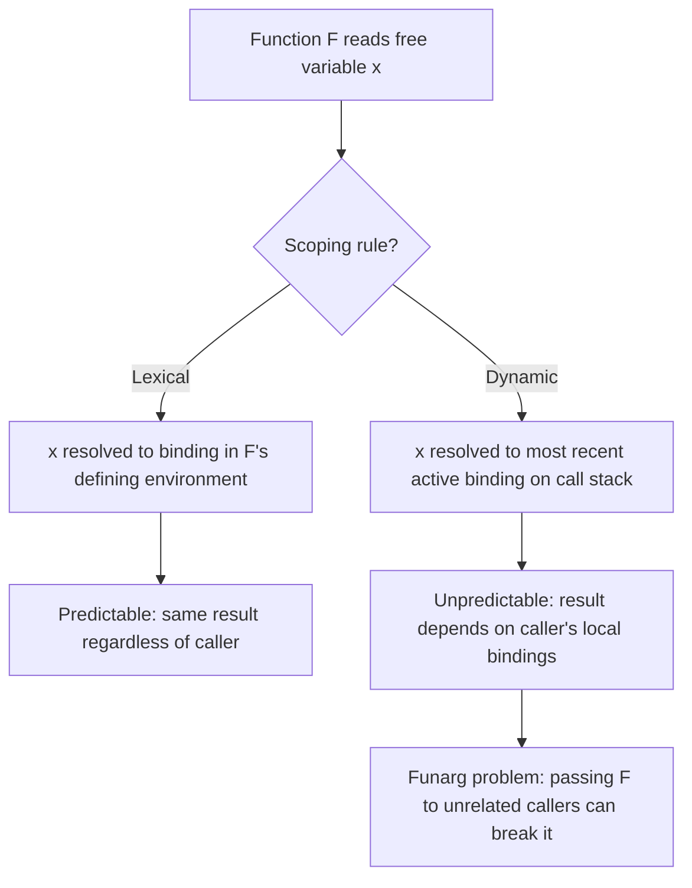

## Dynamic Versus Lexical Scoping

### Overview

Scoping rules determine how a free variable reference inside a function body is resolved to a specific binding. The two dominant models — **lexical (static) scoping** and **dynamic scoping** — produce different answers to the same question: "which binding of `x` does this reference to `x` refer to?" Lisp's history is unusually tied to this debate, since early Lisp (Lisp 1.5 and most 1960s–70s implementations) used dynamic scoping by default, while later standardized dialects — Scheme (1975 onward) and Common Lisp (1984) — adopted lexical scoping as the default, with Common Lisp retaining dynamic scoping as an explicit, opt-in feature via **special variables**.

### Lexical Scoping

Under lexical scoping, a free variable reference is resolved according to where the function was **defined** (its enclosing text/source structure), not where it is called. The binding is determined statically, at compile time or read time, by textual nesting.

```lisp
(defun make-adder (n)
  (lambda (x) (+ x n)))   ; n refers to the parameter of make-adder

(defvar add5 (make-adder 5))
(funcall add5 10)          ; => 15
```

Here, `n` inside the returned lambda refers to the `n` bound in `make-adder`'s parameter list, because that is where the lambda expression is textually nested — regardless of where or when `add5` is later called. This is what enables **closures**: a function that "closes over" variables from its defining environment and carries them along wherever it is invoked.

**Key Points**
- Variable resolution depends on the static structure of the source code.
- Enables closures as a natural, predictable consequence of the scoping rule.
- The vast majority of modern languages (C, Python, JavaScript, Java, Scheme, and Common Lisp's default `lexical` variables) use lexical scoping.

### Dynamic Scoping

Under dynamic scoping, a free variable reference is resolved according to the **most recent, still-active binding** at the time the function is **called**, following the runtime call stack rather than the source text.

```lisp
;; Illustrative dynamic-scoping pseudocode (not lexical Common Lisp semantics)
(defun show-x () (print x))

(defun caller-a ()
  (let ((x 1))
    (show-x)))   ; prints 1, because x=1 is active on the call stack

(defun caller-b ()
  (let ((x 2))
    (show-x)))   ; prints 2, because x=2 is active on the call stack
```

In a purely dynamically scoped language, `show-x` has no fixed idea of which `x` it refers to — the answer depends entirely on which caller most recently established a binding for `x`, traced back through the active call chain. This is the behavior early Lisp implementations exhibited for all variables, since environments were commonly implemented as a single stack of bindings (an "A-list" or binding stack) rather than as nested closures over lexical environments.

**Key Points**
- Variable resolution depends on the runtime call history, not the source text.
- A function's behavior can change unpredictably depending on which callers are active, since any caller can shadow a variable the callee reads.
- Historically simpler to implement with a single global binding stack, which is one reason early Lisp defaulted to it.

### Why the Debate Happened

The debate emerged because dynamic scoping, while easy to implement, produces a well-known correctness hazard: the **funarg problem**. If a function (or a "functional argument," hence the name) is passed around and invoked far from where it was created, its free variables can accidentally capture unrelated bindings that happen to be active at the call site.



**Example**

```lisp
;; Dynamic-scoping hazard (illustrative)
(defun adder (n)
  (lambda (x) (+ x n)))     ; intends to capture caller's n

(defun broken-caller ()
  (let ((n 100))             ; unrelated local n
    (funcall (adder 5) 10))) ; if dynamically scoped, inner lambda might
                              ; see n=100 instead of n=5, depending on
                              ; which binding is "most recent" at call time
```

Under dynamic scoping, the closure's reference to `n` is not guaranteed to be the `n` passed to `adder`; it can instead pick up whatever `n` binding happens to be active on the stack at the moment the lambda is finally called. This made passing functions as values ("funargs") fragile and was a central motivation for Scheme's designers (Guy Steele and Gerald Sussman, mid-1970s) to adopt lexical scoping and proper closures, directly citing the funarg problem as a solved issue.

### Common Lisp's Resolution: Both, Explicitly

Common Lisp resolved the tension pragmatically rather than picking one model exclusively:

- **Lexical scoping is the default** for all variables introduced by `let`, `defun` parameters, and `lambda`.
- **Dynamic scoping is available explicitly** via **special variables**, declared with `defvar`, `defparameter`, or a local `declare special` form.

```lisp
(defvar *current-log-level* :info)   ; a special (dynamically scoped) variable

(defun log-message (msg)
  (when (eq *current-log-level* :debug)
    (format t "[DEBUG] ~a~%" msg)))

(defun run-with-debug-logging (thunk)
  (let ((*current-log-level* :debug))  ; dynamically rebinds for this call and its callees
    (funcall thunk)))
```

Calling `(run-with-debug-logging (lambda () (log-message "hello")))` causes `log-message` to see `*current-log-level*` as `:debug`, even though `log-message` is defined far from `run-with-debug-logging`, because the `let` rebinding of a special variable is visible to every function called while that binding is active — the defining feature of dynamic scope. Once `run-with-debug-logging` returns, the binding reverts.

**Key Points**
- Common Lisp convention marks special variables with asterisks (`*earmuffs*`) precisely so programmers can visually distinguish dynamically scoped variables from lexical ones.
- Dynamic scoping remains useful for context-dependent configuration (logging levels, current I/O streams like `*standard-output*`, condition-handling context) where "ambient" state should flow implicitly through a call chain without being threaded as an explicit parameter.
- Mixing the two models deliberately gives programmers lexical scoping's predictability by default, with dynamic scoping as a targeted tool.

### Practical Trade-offs

**Key Points**
- **Lexical scoping** favors local reasoning: a function's behavior can be understood by looking at its definition and enclosing environment alone, independent of call sites. This is generally considered easier to reason about and safer for large codebases.
- **Dynamic scoping** favors flexible, context-sensitive configuration: it allows a caller to influence the behavior of deeply nested callees without modifying their signatures, at the cost of making a callee's behavior depend on global call-stack state that isn't visible from its own definition.
- [Inference] The near-universal adoption of lexical scoping as the *default* across modern general-purpose languages reflects a broad consensus that predictability and local reasoning outweigh dynamic scoping's configuration convenience for most code, with dynamic-scoping-like mechanisms (e.g., thread-local variables, React context, dependency injection containers) reintroduced in modern languages only as narrowly-scoped, opt-in tools rather than the default variable resolution rule.

### Conclusion

The dynamic-versus-lexical scoping debate was not merely academic: it directly shaped the divergence between early, dynamically-scoped Lisp dialects and their lexically-scoped successors (Scheme, Common Lisp). The funarg problem — closures behaving unpredictably under dynamic scoping — was the concrete technical failure that drove the shift. Common Lisp's dual approach, defaulting to lexical scope while preserving dynamic scope for special variables, stands as a historically influential compromise, acknowledging that both models solve real, distinct problems rather than declaring one universally superior.

**Related Topics**
- The funarg problem and the history of closures in Scheme
- Common Lisp special variables and `let`-based dynamic rebinding
- Lexical closures and the implementation of environments (environment chains vs. binding stacks)
- Dynamic scoping in other languages (Emacs Lisp, Bash variable scoping, Perl's `local`)
- Thread-local storage and context-propagation patterns as modern analogues to dynamic scope
- Variable capture and hygiene in macro systems