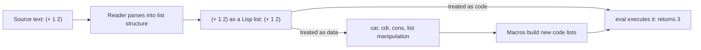

## Macros and Code-as-Data Manipulation

### Overview

Lisp's defining structural feature is **homoiconicity**: Lisp source code is written as Lisp data (nested lists, symbols, numbers), so a Lisp program can read, construct, and transform other Lisp programs using the exact same list-manipulation tools it uses for ordinary data. This property, often summarized as "**code is data**," is what makes Lisp **macros** fundamentally more powerful than the text-substitution macros found in languages like C.

### Homoiconicity: The Foundation

A Lisp expression like `(+ 1 2)` is simultaneously:

- **Code** — when evaluated, it invokes `+` with arguments `1` and `2`, producing `3`.
- **Data** — it is literally a list of three elements: the symbol `+`, the number `1`, and the number `2`.

```lisp
(car '(+ 1 2))    ; => +      (the symbol, treated as data)
(cadr '(+ 1 2))   ; => 1
(eval '(+ 1 2))   ; => 3      (the same structure, treated as code)
```

Because the quote (`'`) suppresses evaluation, `'(+ 1 2)` is just a three-element list that can be inspected, taken apart with `car`/`cdr`, or reassembled with `cons`/`list`, exactly like any other list of data. `eval` reverses this, taking a list structure and executing it as code. This dual nature — the same syntax tree serves as both the abstract syntax representation and the concrete surface syntax — is what "homoiconic" means, and few mainstream languages outside the Lisp family share it in as direct a form.



### Macros Versus Functions

A **function** receives already-evaluated argument values and returns a value. A **macro** receives the unevaluated **source forms** (as data) passed to it, and returns a new form (also as data) that is substituted in place of the macro call before evaluation proceeds. This happens at **macro-expansion time**, prior to normal evaluation.

```lisp
(defmacro my-if (condition then-branch else-branch)
  (list 'cond
        (list condition then-branch)
        (list t else-branch)))

(my-if (> 5 3) (print "yes") (print "no"))
```

When this macro call is expanded, `my-if` receives the *unevaluated* forms `(> 5 3)`, `(print "yes")`, and `(print "no")` as literal list/symbol data — not their values — and constructs a new list:

```lisp
(cond ((> 5 3) (print "yes"))
      (t (print "no")))
```

This expansion then replaces the original `my-if` call and is evaluated normally. Critically, `my-if`'s body used ordinary list-construction functions (`list`) to build a piece of code, exactly as it would build any other data structure.

**Key Points**
- Functions operate on values; macros operate on unevaluated syntax.
- Macro expansion happens once, before runtime evaluation of the expanded form.
- Because macro bodies are ordinary Lisp code operating on list data, the full power of the language — conditionals, loops, recursion, calling other functions — is available for generating code, not just simple substitution patterns.

### Quasiquotation: Practical Code Templates

Constructing code with `list`, `cons`, and `car`/`cdr` directly is verbose. **Quasiquotation** (the backquote/comma syntax) provides a template notation for building list structures with selective evaluation.

```lisp
(defmacro my-if (condition then-branch else-branch)
  `(cond (,condition ,then-branch)
         (t ,else-branch)))
```

Here, the backquote (`` ` ``) begins a template that is mostly literal data, while each comma (`,`) marks a "hole" where the following expression should be evaluated and its result spliced in. This produces the same expansion as the earlier `list`-based version but reads far closer to the shape of the generated code, making macros substantially easier to write and review.

**Key Points**
- Backquote (`` ` ``) starts a quasiquoted template; unquote (`,`) evaluates and inserts a single value; unquote-splicing (`,@`) evaluates an expression producing a list and splices its elements directly into the surrounding list (rather than inserting the list itself as one element).
- Quasiquotation is a readability convenience — it compiles down to the same `list`/`cons`/`append` construction a macro author could write by hand.

### A More Substantial Example: A Looping Macro

```lisp
(defmacro my-while (condition &body body)
  `(loop
     (unless ,condition (return))
     ,@body))

(let ((i 0))
  (my-while (< i 3)
    (print i)
    (incf i)))
```

Expansion of the `my-while` call produces:

```lisp
(loop
  (unless (< i 3) (return))
  (print i)
  (incf i))
```

Note the use of `,@body`: `body` is bound to the list `((print i) (incf i))` — the list of body forms passed to the macro — and `,@` splices each element of that list directly into the surrounding `loop` form, rather than inserting the sublist as a single nested element. This lets `my-while` accept an arbitrary number of body expressions, just like a built-in control-flow construct would.

### Why This Matters: Extending the Language Itself

Because macros run at expansion time and can execute arbitrary code to produce their expansion, Lisp programmers can introduce genuinely new syntactic constructs — not merely parameterized code snippets — that look and behave like native language features. Common Lisp's own `defun`, `defstruct`, `loop`, and `with-open-file` are themselves ordinary macros defined in terms of more primitive special forms, not compiler built-ins requiring privileged status.

**Key Points**
- This is often summarized as macros allowing programmers to "extend the language" or write **domain-specific languages (DSLs)** embedded directly in Lisp syntax.
- Because expansion happens before evaluation, a macro can perform compile-time computation (e.g., unrolling a fixed-size loop, generating repetitive boilerplate from a compact specification) with zero runtime cost for the code-generation step itself.
- This capability is a direct structural consequence of homoiconicity: languages whose syntax trees are not represented as manipulable data in the language itself (most C-family languages, for instance) cannot offer macros with comparable expressive power without external preprocessing tools.

### Hazards: Variable Capture and Multiple Evaluation

Because macro expansions are spliced textually into the call site, careless macro writing can introduce two classic bugs.

**Example — multiple evaluation**

```lisp
(defmacro my-square-bad (x)
  `(* ,x ,x))

(my-square-bad (progn (print "side effect!") 5))
```

Since `x` appears twice in the template, the expansion evaluates `(progn (print "side effect!") 5)` twice, printing `"side effect!"` twice and potentially causing problems if the expression has side effects or is expensive to compute.

**Example — variable capture**

```lisp
(defmacro my-or-bad (a b)
  `(let ((temp ,a))
     (if temp temp ,b)))

(let ((temp 100))
  (my-or-bad nil temp))   ; intends to yield 100, but may not
```

The macro's internally-introduced `temp` can accidentally shadow a caller's own variable named `temp`, silently changing the meaning of `,b` when it is spliced into the expansion. [Inference] This general class of hazard is why "hygienic macro" systems (notably Scheme's `syntax-rules` and `syntax-case`) were developed — to automatically rename macro-introduced identifiers and avoid such accidental capture, whereas Common Lisp macros are unhygienic by default and rely on programmer discipline (commonly using `gensym` to generate guaranteed-unique symbol names for internal bindings) to avoid these issues.

```lisp
(defmacro my-or-good (a b)
  (let ((temp-sym (gensym)))
    `(let ((,temp-sym ,a))
       (if ,temp-sym ,temp-sym ,b))))
```

**Key Points**
- Multiple evaluation bugs arise when a macro parameter is inserted more than once into the expansion without first binding it to a temporary variable.
- Variable capture bugs arise when a macro's internally-generated identifiers collide with identifiers already in scope at the call site.
- `gensym` produces a fresh, guaranteed-unique symbol on each call, commonly used to name macro-internal temporary bindings safely.

### Conclusion

Macros in Lisp are a direct expression of homoiconicity: because code is represented as ordinary list data, a macro is simply a function from unevaluated code (as data) to new code (as data), executed before normal evaluation. This allows Lisp to be extended with new syntactic forms using the full power of the language itself, a capability that gave rise to much of Lisp's historical reputation for extensibility, and that continues to distinguish Lisp-family languages from those relying on text-based preprocessors or fixed syntax.

**Related Topics**
- `defmacro` versus `defun`: expansion-time versus call-time semantics
- Quasiquotation internals: how backquote/comma compiles to `list`/`append`/`cons`
- Hygienic macros: Scheme's `syntax-rules` and `syntax-case`
- `gensym` and avoiding variable capture
- Reader macros and customizing the Lisp reader itself
- Compiler macros and compile-time optimization in Common Lisp
- Domain-specific language (DSL) design using macros