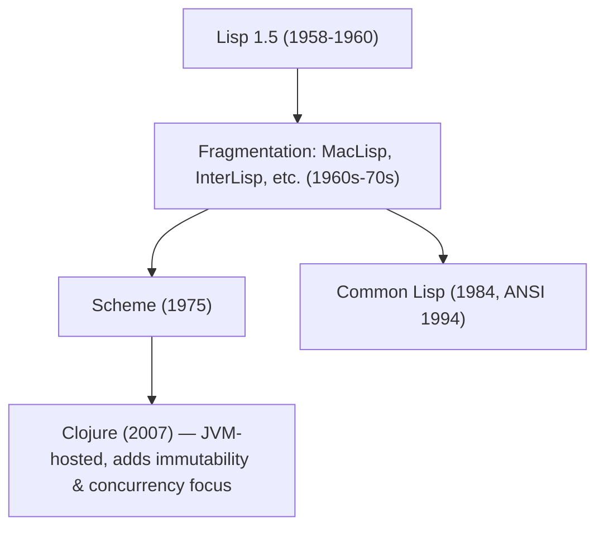

## Dialects: Scheme, Common Lisp, Clojure

### Overview

"Lisp" is not a single language but a family. After the original Lisp 1.5 (1958–1960), the family fragmented into numerous incompatible dialects throughout the 1960s–70s, prompting two major standardization/unification efforts — **Common Lisp** (1984, formally ANSI-standardized in 1994) and **Scheme** (1975, later standardized as R5RS, R6RS, R7RS) — and much later a third major branch, **Clojure** (2007), which reimagined Lisp for the JVM with a strong functional and concurrency-oriented design. Comparing these three illuminates both what remains constant across the Lisp family (S-expression syntax, macros, list-centric data) and where design philosophies diverge sharply (scoping defaults, standard library scope, type systems, mutability, and target runtime).



### Scheme: Minimalism and Lexical Scope

Scheme, created by Guy Steele and Gerald Sussman at MIT, was designed as a deliberately **minimal** dialect, intended to demonstrate that a small set of orthogonal primitives could express everything more complex constructs need, rather than providing a large built-in standard library.

**Key Points**
- **Lexical scoping by default**, and historically the dialect that introduced this as the norm within the Lisp family, directly motivated by solving the funarg problem.
- **Single namespace ("Lisp-1")**: functions and variables share the same namespace, so a symbol like `list` cannot simultaneously name a function and an unrelated variable without shadowing.
- **Tail-call optimization is guaranteed by the standard** (proper tail calls), making recursion a viable and idiomatic replacement for iteration constructs.
- **Minimal core, small standard library**: the language specification (e.g., R7RS-small) intentionally omits many conveniences left to libraries or specific implementations (Racket, Guile, Chicken Scheme, etc.), leading to fragmentation of practical libraries across implementations despite a unified core syntax.
- Continuations are first-class via `call/cc` (call-with-current-continuation), a distinctive and powerful (if rarely used in everyday code) control-flow feature not standard in Common Lisp or Clojure.

```scheme
;; Scheme example: tail-recursive factorial, relies on guaranteed TCO
(define (factorial n acc)
  (if (= n 0)
      acc
      (factorial (- n 1) (* n acc))))

(factorial 5 1)  ; => 120
```

### Common Lisp: A Large, Practical, Multi-Paradigm Language

Common Lisp emerged from an effort to unify the fragmented MacLisp-descended dialects (Zetalisp, NIL, Spice Lisp, etc.) into a single industrial-strength standard, prioritizing practicality, backward compatibility with existing large systems, and comprehensiveness over Scheme's minimalism.

**Key Points**
- **Lexically scoped by default**, but explicitly supports dynamically scoped **special variables** (`defvar`/`defparameter`) as a first-class, intentional feature — see the dynamic-versus-lexical scoping discussion for detail.
- **Lisp-2**: separate namespaces for functions and variables, meaning a symbol can simultaneously be bound as a variable and as a function name without collision (`(defun list (x) ...)` and a variable `list` can coexist, accessed via `funcall`/`function` versus direct reference).
- **Large standard library** specified by ANSI, including a condition system (structured exception handling more expressive than typical try/catch), CLOS (Common Lisp Object System) for object-oriented and generic-function-based programming, an extensive `loop` macro DSL, and format directives for text output.
- **No guaranteed tail-call optimization** in the standard itself, though many implementations (SBCL, CCL) perform it in practice; portable code should not rely on it as a language guarantee.
- Designed with large-system, long-lived software development in mind — package systems, condition/restart-based error handling, and an image-based development workflow (interactively modifying a running Lisp image) are emphasized more than in Scheme.

```lisp
;; Common Lisp example: CLOS generic functions and classes
(defclass animal ()
  ((name :initarg :name :accessor animal-name)))

(defgeneric speak (a))

(defmethod speak ((a animal))
  (format t "~a makes a sound.~%" (animal-name a)))

(speak (make-instance 'animal :name "Generic Beast"))
```

### Clojure: Immutability, Concurrency, and the JVM

Clojure, created by Rich Hickey and released in 2007, is a much more recent Lisp dialect designed from the outset to run on the **Java Virtual Machine** (with later ClojureScript and Clojure CLR variants targeting JavaScript and .NET), and to address concurrent/multi-core programming as a central design concern rather than an afterthought.

**Key Points**
- **Persistent, immutable data structures by default**: Clojure's core collections (lists, vectors, maps, sets) are immutable; "modifying" a structure returns a new structure that structurally shares unchanged parts with the original (structural sharing), rather than copying the whole structure or mutating in place.
- **Concurrency primitives built into the language**: atoms, refs (with software transactional memory), agents, and vars provide distinct, well-defined models for managing shared, changing state safely across threads, reflecting the JVM's inherently multi-threaded environment.
- **Hosted language**: Clojure interoperates directly with Java libraries and the JVM object model, trading some of the "batteries-included" self-containment of Common Lisp for access to the entire Java ecosystem.
- **Different literal syntax for core collections**: `[1 2 3]` for a vector, `{:a 1 :b 2}` for a map, and `#{1 2 3}` for a set are built-in reader syntax, alongside traditional list syntax `(1 2 3)`, whereas Common Lisp and Scheme rely far more heavily on the list as the universal literal structure.
- Strong emphasis on functional programming style (pure functions, immutable data, sequence abstractions like `map`/`filter`/`reduce` operating uniformly over many collection types) as the idiomatic default, distinguishing it from Common Lisp's explicitly multi-paradigm (functional + object-oriented + imperative) stance.

```clojure
;; Clojure example: immutable data and structural sharing
(def original-vec [1 2 3])
(def new-vec (conj original-vec 4))

original-vec  ; => [1 2 3]      (unchanged)
new-vec       ; => [1 2 3 4]    (new structure, shares underlying nodes)

;; Concurrency primitive: an atom for safe shared mutable state
(def counter (atom 0))
(swap! counter inc)
@counter  ; => 1
```

### Comparative Summary

| Aspect | Scheme | Common Lisp | Clojure |
|---|---|---|---|
| Namespace model | Lisp-1 (shared) | Lisp-2 (separate) | Lisp-1 (shared) |
| Default scoping | Lexical | Lexical (dynamic via special vars) | Lexical |
| Tail-call optimization | Guaranteed by standard | Not guaranteed (implementation-dependent) | [Unverified] Generally relies on explicit `recur` rather than guaranteed general TCO, due to JVM stack constraints |
| Mutability default | Mutable pairs/vectors available | Mutable by default | Immutable/persistent by default |
| Standard library size | Deliberately minimal core | Large, comprehensive (ANSI standard) | Large, JVM-interop-enabled |
| Primary runtime target | Native/various (implementation-specific) | Native (implementation-specific) | JVM (also JS via ClojureScript) |
| Object system | Not standardized | CLOS (built-in) | Not class-based by default; uses protocols/multimethods |
| Concurrency model | Implementation-dependent | Implementation-dependent | Built-in (atoms, refs/STM, agents) |

[Unverified] Clojure's `recur` special form performs explicit, guaranteed tail-call-like self-recursion (looping back to the nearest enclosing function or `loop` form) rather than the JVM providing general automatic tail-call optimization for arbitrary function calls; this is a workaround for a JVM-level limitation rather than a stylistic choice, and specifics may vary with JVM version and Clojure compiler improvements.

### Why the Divergence Happened

**Key Points**
- Scheme's minimalism reflects an academic, pedagogical, and research-oriented origin (demonstrating lambda calculus and continuation concepts cleanly), prioritizing a small formal core over a large practical library.
- Common Lisp's comprehensiveness reflects its origin as an industry/DARPA-driven unification effort meant to consolidate existing large, deployed Lisp systems (symbolic AI research, expert systems) into one interoperable standard, valuing practicality and stability for large codebases over minimalism.
- Clojure's design reflects a 21st-century context: the JVM as a mature, widely deployed runtime with a huge library ecosystem, and a period where multi-core hardware made safe concurrency a pressing, mainstream concern that older Lisp standards (predating widespread multi-core hardware) had not centrally addressed.

### Conclusion

Scheme, Common Lisp, and Clojure share the family's core inheritance — S-expression syntax, powerful macros, and list-centric data manipulation — but represent three distinct answers to "what should a practical Lisp look like," shaped by the era and context of their creation: Scheme's academic minimalism, Common Lisp's industrial comprehensiveness, and Clojure's JVM-hosted, concurrency-first, immutability-first modernization. Understanding these differences is essential before generalizing any claim about "how Lisp works," since a statement true of one dialect (guaranteed tail calls in Scheme, dynamic special variables in Common Lisp, persistent data structures in Clojure) may not hold for the others.

**Related Topics**
- Lisp-1 versus Lisp-2 namespace models in depth
- CLOS and generic-function-based object orientation
- Software transactional memory and Clojure's ref/STM model
- ClojureScript and cross-platform Lisp on JavaScript runtimes
- `call/cc` and first-class continuations in Scheme
- Racket as a Scheme-descended research and teaching-oriented dialect
- Historical Lisp dialects predating standardization (MacLisp, InterLisp, Zetalisp)