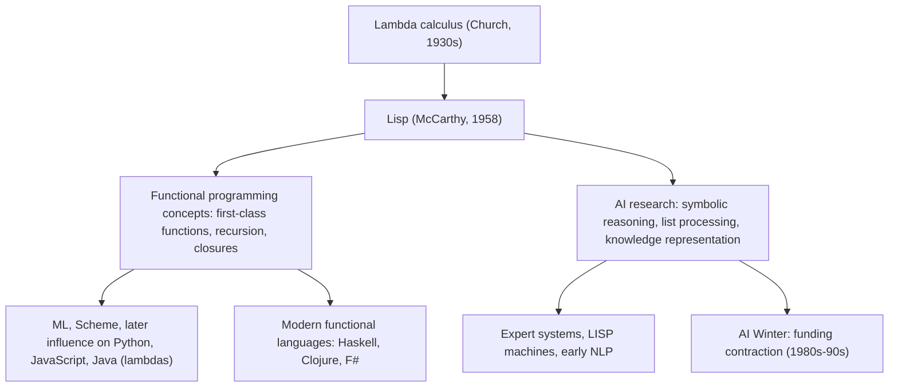

## Influence on Functional Programming and AI Research

### Overview

Lisp's influence extends far beyond its own family of dialects. As the second-oldest high-level programming language still in active use (after Fortran), and the first language built around symbolic list processing, recursion, and functions as first-class values, Lisp shaped both the theoretical development of functional programming as a paradigm and the practical trajectory of artificial intelligence research for several decades. These two influences are historically intertwined: Lisp was created specifically as a tool for AI research, and many of its language features that later became central to functional programming emerged directly from the symbolic-reasoning problems AI researchers were trying to solve.



### Foundations: Lambda Calculus Made Practical

Lisp was directly inspired by Alonzo Church's **lambda calculus**, a formal system from the 1930s for expressing computation purely in terms of function definition and application. John McCarthy's key insight was that lambda calculus's notion of functions as mathematical objects could be given a concrete, executable syntax using S-expressions, and that a small set of primitive operations (`cons`, `car`, `cdr`, `cond`, `atom`, `eq`, and `lambda` itself) could serve as a universal basis for computation over symbolic data.

**Key Points**
- Lisp is often cited as the first language to make **functions first-class values** in a practical, widely-used implementation — functions could be passed as arguments, returned from other functions, and stored in data structures, not merely defined and called by name.
- The `lambda` keyword in modern languages (Python's `lambda`, Java's lambda expressions, C++11's lambda syntax) traces its name and conceptual lineage directly to Lisp's adoption of Church's notation.
- McCarthy's 1960 paper describing Lisp also demonstrated that a Lisp interpreter (`eval`) could itself be written concisely in Lisp — a self-hosting property that became a recurring theme in language design and a common pedagogical exercise (the "metacircular evaluator").

### Contributions to Functional Programming as a Paradigm

**Key Points**
- **Recursion as a primary control structure**: Lisp popularized recursive function definitions as the natural way to process list-structured data, an approach that predates and heavily influenced later purely functional languages such as ML, Haskell, and Erlang.
- **Higher-order functions**: functions like `mapcar`/`map`, `reduce`, and `apply`, which take other functions as arguments, appeared early in the Lisp family and became a defining feature of the functional style, later standard in nearly every modern general-purpose language (Python's `map`/`filter`, JavaScript's `Array.prototype.map`, Java's Streams API).
- **Closures**, formalized cleanly once Scheme adopted lexical scoping (see the dynamic-versus-lexical scoping discussion), demonstrated a practical, efficient mechanism for functions to carry state from their defining environment — a pattern now ubiquitous in JavaScript callback-heavy code, Python decorators, and functional-style APIs generally.
- **Treating code as data** (homoiconicity) and macros influenced later metaprogramming facilities in other languages, though few mainstream languages replicate Lisp's approach directly; instead, ideas like syntax extension and DSL embedding echo in more restricted forms (Ruby's blocks and metaprogramming, Rust's macro system, Elixir's macros — itself directly Lisp-influenced via its Erlang/BEAM heritage and explicit homoiconicity).
- [Inference] The persistent, immutable-by-default data structures popularized by Clojure represent a direct modern lineage from these functional-programming ideas, applied to address concurrency concerns that earlier Lisp dialects did not centrally emphasize.

```lisp
;; Higher-order function example, illustrating a pattern later ubiquitous
;; across functional-influenced mainstream languages
(mapcar (lambda (x) (* x x)) '(1 2 3 4))
;; => (1 4 9 16)
```

### Lisp as the Language of Early AI Research

Lisp was created by John McCarthy explicitly to support work at the intersection of symbolic computation and what he termed "artificial intelligence" (a term he also coined, at the 1956 Dartmouth Conference). Its data model — nested lists as a universal representation for symbolic structures — mapped naturally onto the problems early AI researchers cared about: representing logical statements, search trees, natural-language parse structures, and rule-based knowledge.

**Key Points**
- **Symbolic manipulation over numeric computation**: unlike Fortran, designed for numerical scientific computing, Lisp was built around manipulating symbols and lists, directly suited to representing and transforming logical expressions, grammars, and knowledge structures rather than primarily arrays of numbers.
- **Automatic memory management** (garbage collection, pioneered practically in Lisp — see the garbage collection discussion) freed AI researchers from manual memory bookkeeping while working with highly dynamic, unpredictably-sized symbolic data structures such as search trees of varying depth.
- **Rapid prototyping and interactive development**: Lisp's read-eval-print loop (REPL) and image-based development style let researchers interactively modify and extend running programs, well suited to the exploratory nature of AI research where problem structure was often not fully understood in advance.
- **Expert systems** (rule-based AI systems encoding domain expert knowledge as if-then rules), a dominant AI paradigm through the 1970s–80s, were commonly implemented in Lisp; systems such as MYCIN and DENDRAL were built in Lisp-family environments, and the broader expert-systems industry of the era relied heavily on Lisp tooling.
- **Lisp machines**: specialized workstation hardware (from companies including Symbolics and Lisp Machines Inc.) was built in the late 1970s–80s with instruction sets and memory architectures optimized specifically for running Lisp efficiently, reflecting how central Lisp had become to AI research infrastructure at the time. [Unverified] Specific performance figures and market details for these systems vary across sources and are best verified against dedicated historical accounts if precise figures are needed.

### The AI Winter and Lisp's Decline in AI Prominence

**Key Points**
- The **AI Winter** (roughly late 1980s–early 1990s) — a period of reduced funding and interest in AI research following unmet expectations from earlier expert-systems hype — coincided with, and contributed to, a decline in Lisp's dominant position specifically within AI, as the specialized Lisp-machine hardware market collapsed and general-purpose workstations (running C-based systems) became more cost-effective.
- [Inference] This period is commonly cited as reducing Lisp's visibility as "the AI language," although Lisp and its descendants (particularly Common Lisp and Scheme) continued to be used in various research and industry contexts outside the peak-hype expert-systems niche.
- The resurgence of AI research from the mid-2000s onward centered heavily around statistical machine learning and, later, deep learning, which is predominantly implemented today in Python (with performance-critical components in C++/CUDA) rather than Lisp — reflecting a shift in AI's technical center of gravity from symbolic/rule-based reasoning (Lisp's strength) toward numerical optimization over large datasets (a domain where Python's numerical ecosystem, not Lisp, became dominant).

### Lasting Influence Beyond Direct Usage

**Key Points**
- Even where Lisp itself is no longer the implementation language of choice, its conceptual contributions persist: garbage collection, first-class functions, closures, recursion as a primary tool, REPL-driven interactive development, and dynamic typing with runtime type checks are all now standard features across mainstream languages that owe a documented conceptual debt to Lisp.
- Modern functional languages (Haskell, OCaml/F#, Erlang/Elixir, Clojure) each carry forward and further formalize ideas Lisp introduced practically, whether or not their surface syntax resembles Lisp's parenthesized S-expressions.
- Symbolic AI's decline in prominence relative to statistical/deep-learning approaches does not erase Lisp's continued relevance in areas still valuing symbolic reasoning, rapid prototyping, or macro-based language extension (some robotics research, certain planning systems, and hobbyist/academic Lisp communities), though [Inference] its overall market share and industry visibility in AI today is substantially smaller than during its 1960s–80s peak.

### Conclusion

Lisp's dual legacy — as an early vehicle for realizing lambda calculus as a practical programming paradigm, and as the primary language of the first several decades of AI research — means its influence is visible today in two largely separate but historically connected places: the functional-programming features (first-class functions, closures, recursion, higher-order functions) now standard across mainstream languages, and the conceptual and infrastructural groundwork (symbolic representation, rapid prototyping via REPLs, garbage-collected dynamic memory) that shaped how AI research was conducted before the field's later shift toward statistical and deep-learning methods implemented predominantly in other languages.

**Related Topics**
- Lambda calculus and its formal relationship to Lisp's `lambda`
- Expert systems and rule-based AI in historical Lisp environments
- Lisp machines and specialized AI-research hardware of the 1980s
- The AI Winter: causes and effects on research funding and language choice
- Metacircular evaluators: implementing a Lisp interpreter in Lisp
- Comparing symbolic AI and modern statistical/deep-learning approaches
- Elixir and Erlang: BEAM-based languages carrying forward Lisp-influenced macro and functional concepts