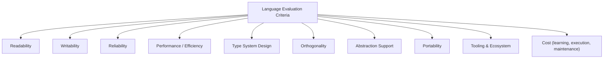

## Criteria for Evaluating Programming Languages

### Overview

Evaluating a programming language means judging it against a set of dimensions that determine how well it serves particular goals: writing correct programs efficiently, executing them fast enough, maintaining them over time, and fitting the constraints of a given problem domain or team. No language dominates on every axis simultaneously — language design is fundamentally a set of trade-offs, and different languages (including the Lisp family discussed in earlier topics) make deliberately different choices along these dimensions. This topic surveys the standard criteria used in programming-language theory and practice to compare languages systematically.

### Readability

Readability measures how easily a person (not the original author) can understand what a piece of code does by inspection.

**Key Points**
- Influenced by syntax clarity, consistency of notation, and how closely surface syntax maps to the underlying semantics.
- Lisp's uniform S-expression syntax is a case study in a trade-off: extremely simple and regular grammar (every form is `(operator operand...)`), but critics argue heavy parenthesization reduces readability for newcomers, while proponents argue the uniformity actually aids readability once internalized, since there is only one syntactic pattern to learn regardless of construct.
- Features that hurt readability include excessive operator overloading, deeply implicit type coercion, and unrestricted global mutable state, since bugs and behavior often hide in what is *not* visible at the call site.
- Features that help include explicit naming, static type annotations that document intent, and consistent indentation/formatting conventions (whether enforced by the language, as in Python, or by strong community tooling, as in `gofmt` or Lisp-family editor auto-indentation).

### Writability

Writability measures how easily a language allows a programmer to express a solution to a given problem, for a given problem domain and level of experience.

**Key Points**
- Closely related to but distinct from readability: a language can be fast to write in while producing code that is hard for others (or the same author, later) to read — dense one-liners in Perl or golfed code are a common example.
- Writability benefits from higher-level abstraction facilities (garbage collection removing manual memory management, higher-order functions removing boilerplate loops), concise standard libraries, and — in the Lisp family specifically — macros, which allow the language's own surface syntax to be extended to fit a problem's natural vocabulary (see the macros discussion).
- Simplicity and orthogonality (see below) both support writability: fewer, more composable constructs generally make it easier to express solutions without needing to memorize many special-case rules.

### Reliability

Reliability measures how likely a program written in the language is to behave as intended and how well the language helps catch mistakes before they cause harm.

**Key Points**
- **Type checking** (static or dynamic) is a primary reliability tool: catching a category of error (e.g., calling a method that doesn't exist on a given value) automatically, either before execution (static) or as soon as the offending code path runs (dynamic).
- **Exception/condition handling** facilities affect reliability by determining how gracefully a program can respond to and recover from error conditions rather than crashing or silently corrupting data. Common Lisp's condition system, which separates signaling a condition from deciding how to handle it (via restarts), is frequently cited as an unusually expressive reliability-oriented design compared to simpler try/catch models.
- **Aliasing control**: languages that make it hard to reason about whether two references point to the same mutable object (aliasing) tend to be more error-prone, since a mutation through one reference can silently affect code holding the other reference.
- Read-only/immutable-by-default data (as in Clojure's persistent data structures) is a modern design response specifically aimed at improving reliability in concurrent and large codebases, by eliminating a broad class of aliasing and shared-mutable-state bugs by construction.

### Performance and Efficiency

**Key Points**
- Encompasses execution speed, memory footprint, and how predictably a program's performance behaves (e.g., whether garbage-collection pauses are bounded or can spike unpredictably — see the garbage collection discussion on generational and incremental strategies).
- A language's performance is not solely determined by the language specification itself but heavily by the quality of a given **implementation** (compiler/interpreter); this is why statements like "Lisp is slow" are frequently [Unverified]/imprecise, since compiled Common Lisp implementations such as SBCL can produce code with performance in a similar range to statically compiled languages for many workloads, while a naive interpreter for the same language could be far slower — the distinction is implementation quality, not an inherent property of the language specification alone.
- Compiled versus interpreted execution models, whether the language permits low-level control over memory layout, and the sophistication of just-in-time (JIT) compilation available all factor into practical performance.

### Type System Design

**Key Points**
- **Static versus dynamic typing**: static typing (type-checked before execution) tends to catch a class of errors earlier and can enable more aggressive compiler optimization, at some cost to writability/flexibility during rapid prototyping; dynamic typing (checked at runtime, as in most traditional Lisp dialects, Python, and Ruby) tends to favor rapid iteration and flexible, generic code, at the cost of deferring certain error detection to runtime.
- **Strong versus weak typing**: independent of static/dynamic, this axis concerns how strictly the language enforces type boundaries at all (e.g., whether it silently coerces a string to a number in an arithmetic context, or raises an error).
- **Type inference** (as in Haskell, OCaml, or Common Lisp implementations with optional type declarations for optimization) can offer much of static typing's safety benefit without requiring the programmer to write out every type annotation explicitly.
- [Inference] The historical association of Lisp with dynamic typing reflects the exploratory, symbolic-computation research context it was designed for (see the AI research influence discussion), where problem structure and data shapes were often not known in advance, rather than dynamic typing being an inherent, unchangeable property of the Lisp family — some modern Lisp-influenced or Lisp-adjacent systems do incorporate optional or gradual static typing.

### Orthogonality

Orthogonality measures how independently a language's features can be combined — whether a small number of primitive constructs combine predictably and without surprising special-case interactions to express a wide range of programs.

**Key Points**
- A highly orthogonal language has few, general-purpose constructs that compose cleanly; a poorly orthogonal language has many special-case rules and exceptions that must be memorized individually.
- Lisp is frequently cited as a historically influential example of a highly orthogonal design: a small set of primitives (`cons`, `car`, `cdr`, `cond`, `lambda`, `eq`, `atom` in McCarthy's original formulation) combine to express essentially all of the language's higher-level constructs, many of which (as noted in the macros discussion) are themselves defined as ordinary macros rather than special, privileged compiler behavior.
- High orthogonality generally supports both writability (fewer rules to learn) and readability (fewer surprising exceptions to keep in mind), though extremely minimal orthogonal cores (as in Scheme, see the dialects discussion) can shift complexity onto library design instead of eliminating it entirely.

### Abstraction Support

**Key Points**
- Measures how well a language allows programmers to define new, reusable abstractions — new types, new control structures, new data structures — that behave as naturally as the language's own built-in facilities.
- Encompasses support for functions and procedures (universal), user-defined data types, module/namespace systems for organizing large codebases, and, in some languages, the ability to extend the language's own syntax (Lisp macros being an unusually powerful example, discussed in the macros topic).
- Object-oriented features (classes, inheritance, generic functions as in CLOS) and functional features (higher-order functions, closures) represent two major, sometimes-combined approaches to abstraction support, with different languages emphasizing one, the other, or both.

### Portability

**Key Points**
- Measures how easily a program written in the language can run on different platforms/hardware/operating systems without modification.
- Influenced by whether the language is defined by a strict, implementation-independent standard (ANSI Common Lisp, ISO Scheme reports) versus tied closely to a specific implementation's behavior, and by how much the standard library depends on platform-specific facilities.
- Bytecode-based or virtual-machine-hosted languages (Java on the JVM, Clojure also on the JVM — see the dialects discussion) trade some native performance for strong cross-platform portability by targeting a common intermediate runtime rather than native machine code directly.

### Tooling and Ecosystem

**Key Points**
- Includes the quality of compilers/interpreters, debuggers, package/dependency managers, editor and IDE support, and the size and health of the community producing third-party libraries.
- [Inference] This criterion is often underweighted in purely academic language comparisons but frequently dominates real-world adoption decisions, since even a technically excellent language with weak tooling or a small library ecosystem can be impractical to adopt for production work compared to a technically less elegant language with mature tooling.
- Interactive development environments — Lisp's REPL-driven, image-based workflow is a historically influential example — represent a tooling philosophy distinct from purely batch-compiled edit-compile-run cycles, with implications for how quickly a developer can experiment and iterate.

### Cost

**Key Points**
- Total cost of a language choice spans several distinct phases: **learning cost** (time for programmers to become proficient), **writing cost** (time to implement a given program), **compile/execution cost** (computational resources consumed), and **maintenance cost** (ongoing cost of fixing bugs and extending the system over its lifetime).
- These costs frequently trade off against each other: a language that is fast to learn and write in (favoring rapid initial development) may impose higher maintenance costs later if it lacks strong reliability guarantees (e.g., weak or absent static typing catching fewer errors before deployment).
- [Inference] Language selection in practice is rarely a matter of optimizing a single criterion in isolation; it typically reflects a judgment about which costs and trade-offs are most tolerable for a specific team, project timeline, and domain, which is why no single language is judged "best" universally across the software industry.

### Applying These Criteria: A Worked Comparison

Consider comparing Common Lisp and a statically-typed, compiled language such as C for a hypothetical AI research prototype versus a safety-critical embedded system:

**Key Points**
- For rapid AI research prototyping, Common Lisp's dynamic typing, REPL-driven interactivity, garbage collection, and macro-based extensibility historically scored well on writability and abstraction support, at some cost to raw predictability of performance — a trade-off well-suited to exploratory research (see the AI research discussion).
- For safety-critical embedded systems, C's static typing, direct memory control, minimal runtime overhead, and predictable performance characteristics are typically weighted far more heavily than writability or abstraction convenience, since reliability guarantees and performance predictability dominate the cost calculation in that domain.
- This illustrates the central point of language evaluation: the criteria themselves are stable and general, but their relative *weighting* is domain-specific, which is why "best language" questions are typically only answerable relative to a specific problem context rather than in the abstract.

### Conclusion

Evaluating a programming language requires weighing multiple, often competing criteria — readability, writability, reliability, performance, type system design, orthogonality, abstraction support, portability, tooling, and total cost — against the specific demands of a problem domain, team, and project lifecycle, rather than seeking a single "best" language in the abstract. The Lisp family, examined throughout earlier topics, offers a clear illustration of how deliberate trade-offs (dynamic typing for research flexibility, high orthogonality via a minimal primitive core, macros for extensibility at some cost to newcomer readability) reflect specific design priorities rather than universal superiority or inferiority relative to other language families.

**Related Topics**
- Static versus dynamic typing trade-offs in depth
- Language standardization processes (ANSI, ISO, RnRS reports) and portability
- Domain-specific language design as an abstraction-support strategy
- Total cost of ownership in language selection for industry projects
- Comparative case studies: Lisp versus C versus Python for specific problem domains
- The role of community and ecosystem maturity in language adoption
- Formal semantics as a tool for precisely specifying language behavior