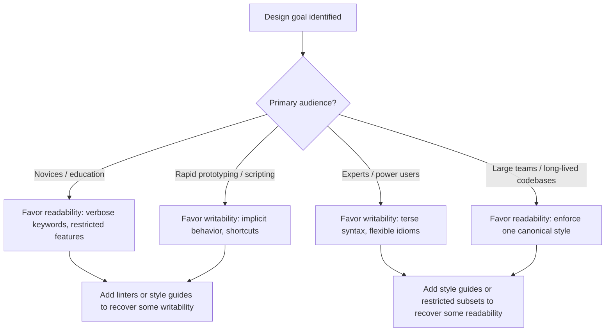

## Readability Versus Writability Tensions

### Defining the Two Qualities

Readability is the ease with which a person can understand code by reading it — recognizing what it does, why, and how it fits into a larger system. Writability is the ease with which a person can express a solution in the language — how quickly and directly an idea in the programmer's head becomes working code.

These are not opposites by necessity, but many concrete design decisions force a trade-off between them, because the features that make writing terse and fast often make reading ambiguous or context-dependent, and the features that make reading unambiguous often make writing verbose.

### Why the Tension Exists

Code is written once but read many times — during debugging, code review, onboarding, and maintenance. This asymmetry means most language design guidance leans toward readability. However, writability still matters: a language that is painful to write in discourages experimentation, slows initial development, and pushes programmers toward workarounds that can themselves harm readability.

The core tension arises from a few structural sources:

- **Compactness versus explicitness**: shorter syntax is faster to write but often requires the reader to infer meaning from context.
- **Flexibility versus predictability**: features that let programmers express the same idea in many ways speed up writing but make reading harder, since the reader must recognize each variant.
- **Abstraction versus transparency**: high-level constructs let writers state *what* they want without stating *how*, but readers lose visibility into the underlying mechanism.

### Key Points

- Readability and writability are both dimensions of *usability*, not opposites of correctness or performance.
- A single feature can be evaluated on both axes independently; some features score high on both (e.g., well-chosen keywords), some low on both (e.g., excessive punctuation-based operators), and many trade one for the other.
- Language designers must choose a target audience and use-case profile (scripting versus systems programming, novice versus expert users) before optimizing either quality, since the "right" balance is not universal. [Inference]

### Case Study: Operator Density and Symbolic Notation

Languages that favor terse symbolic operators over word-based constructs illustrate the trade-off directly.

**Example**

```apl
V←+/⍳10
```

This APL expression computes the sum of integers from 1 to 10. It is highly writable — a trained APL programmer types very little to express a non-trivial computation — but it has low readability for anyone unfamiliar with the symbol set, since each glyph carries dense, non-obvious semantic weight.

Compare this to an equivalent in a word-oriented language:

```python
total = sum(range(1, 11))
```

The Python version is longer to type in raw keystrokes relative to information density, but it is far more readable: `sum` and `range` are recognizable English words, and the structure mirrors natural-language description of the task.

[Inference] The general pattern — symbolic density increasing writability speed for experts while decreasing readability for non-experts — is well documented in language design discussions, but the specific magnitude of the trade-off (how much faster, how much less readable) is not something that has been rigorously quantified across languages.

### Case Study: Operator Overloading

Operator overloading allows a symbol like `+` to be redefined for user-defined types.

- **Writability gain**: code expressing operations on custom types (e.g., matrix addition, complex numbers, big-number arithmetic) reads syntactically like built-in arithmetic, and requires no new method names to remember.
- **Readability cost**: the reader can no longer assume `+` means numeric addition. In languages with unrestricted overloading, `+` could be redefined to perform an entirely unrelated operation, such as list concatenation with side effects, forcing the reader to check the type and its overload definition before trusting the meaning of the expression.

C++ permits essentially unrestricted operator overloading, including on operators like `,` (comma) and `&&`. Python permits overloading through "dunder" methods (`__add__`, `__eq__`, etc.) but discourages surprising redefinitions by convention. Go omits operator overloading entirely, trading writability for guaranteed operator meaning.

### Case Study: Implicit Type Conversion

Implicit (automatic) type coercion — where a language silently converts one type to another during an operation — is a direct writability-for-readability trade.

```javascript
"5" + 3   // "53" (string concatenation wins)
"5" - 3   // 2   (numeric subtraction wins)
```

JavaScript's implicit coercion means a programmer rarely needs to write explicit conversion calls, which speeds up writing simple scripts. However, the reader cannot determine the result of an expression from its surface form alone; they must know the coercion rules for every operator and operand-type combination.

Languages with strict, explicit typing (Haskell, Rust) require the programmer to write conversion calls explicitly:

```rust
let x: i32 = "5".parse::<i32>().unwrap();
```

This is more verbose — lower writability in the narrow sense of keystrokes — but the reader can determine the type of every value from the code itself, without consulting a coercion table.

### Case Study: Naming and Verbosity Conventions

Verbose, descriptive naming (favored in Java, COBOL-derived style) versus short, terse naming (favored in mathematical and scripting contexts) is a readability/writability trade at the naming level rather than the syntax level.

```java
public class CustomerAccountBalanceCalculator {
    public BigDecimal calculateTotalOutstandingBalance(Customer customer) {
        // ...
    }
}
```

versus

```python
def calc_bal(c):
    # ...
```

The verbose form is slower to type but self-documents intent, reducing the need for external comments or documentation lookups. The terse form is faster to type but pushes the burden of understanding onto comments, external documentation, or the reader's memory of context that may not persist across a large codebase.

### Case Study: Syntactic Sugar and Multiple Ways to Express the Same Idea

A feature that improves writability by offering shortcuts can reduce readability if it multiplies the number of valid surface forms a reader must recognize.

Python's list comprehensions are a case where writability and readability largely align for simple uses:

```python
squares = [x**2 for x in range(10)]
```

This is both fast to write and easy to read for programmers familiar with the idiom. But nested or conditional comprehensions push the balance the other way:

```python
result = [x*y for x in range(10) for y in range(10) if x != y if (x+y) % 2 == 0]
```

Here writability remains high (it is one line, quickly typed by an experienced user) while readability drops sharply, since the reader must mentally unroll two nested loops and two filter conditions from a single dense line.

Perl is frequently cited as a language that maximizes flexible writability — its motto "There's more than one way to do it" (TMTWTDI) is explicit design philosophy — at a documented cost to readability, since a reader must recognize every idiom a given author chose to use, not just one canonical form. [Unverified: the TMTWTDI phrase and philosophy are well-attested as part of Perl's cultural identity, but its precise, measurable effect on defect rates or maintenance time relative to more constrained languages is not something with strong empirical benchmarking.]

### Case Study: Significant Whitespace

Python's use of indentation to delimit blocks, instead of braces or `begin`/`end` keywords, is a design choice explicitly aimed at improving readability by forcing the visual structure of code to match its logical structure.

```python
if x > 0:
    print("positive")
else:
    print("non-positive")
```

versus a brace-delimited equivalent where indentation and actual block structure can diverge:

```c
if (x > 0)
    printf("positive");
    printf("this always runs, despite the indentation");
```

The C example is a classic readability trap: the second `printf` is not actually inside the `if` block despite its visual indentation, because C's block structure is determined by braces, not whitespace. Python's design removes this class of bug by making the visual and logical structure identical, at a writability cost: programmers must maintain consistent indentation manually, and cannot use whitespace freely to compress code onto fewer lines for quick, throwaway writing.

### Visualizing the Trade-off Space

<svg xmlns="http://www.w3.org/2000/svg" viewBox="0 0 640 460" font-family="Helvetica, Arial, sans-serif">
  <text x="320" y="30" text-anchor="middle" font-size="18" font-weight="bold" fill="#1a1a1a">Readability vs. Writability Trade-off Space (svg_diagram)</text>

  
  <line x1="80" y1="400" x2="580" y2="400" stroke="#333" stroke-width="2" />
  <line x1="80" y1="400" x2="80" y2="60" stroke="#333" stroke-width="2" />

  <text x="330" y="430" text-anchor="middle" font-size="14" fill="#333">Writability (ease of writing) →</text>
  <text x="30" y="230" text-anchor="middle" font-size="14" fill="#333" transform="rotate(-90 30 230)">Readability (ease of reading) →</text>

  
  <line x1="330" y1="60" x2="330" y2="400" stroke="#ccc" stroke-dasharray="4,4" />
  <line x1="80" y1="230" x2="580" y2="230" stroke="#ccc" stroke-dasharray="4,4" />

  
  <circle cx="480" cy="330" r="7" fill="#c0392b" />
  <text x="490" y="335" font-size="12" fill="#c0392b">APL (dense symbols)</text>

  <circle cx="470" cy="310" r="7" fill="#e67e22" />
  <text x="480" y="305" font-size="12" fill="#e67e22">JS implicit coercion</text>

  <circle cx="200" cy="120" r="7" fill="#27ae60" />
  <text x="210" y="115" font-size="12" fill="#27ae60">Verbose Java naming</text>

  <circle cx="180" cy="150" r="7" fill="#2980b9" />
  <text x="190" y="165" font-size="12" fill="#2980b9">Explicit Rust conversion</text>

  <circle cx="330" cy="150" r="7" fill="#8e44ad" />
  <text x="340" y="145" font-size="12" fill="#8e44ad">Python (simple comprehension)</text>

  <circle cx="440" cy="360" r="7" fill="#8e44ad" />
  <text x="450" y="375" font-size="12" fill="#8e44ad">Python (nested comprehension)</text>

  <circle cx="260" cy="100" r="7" fill="#16a085" />
  <text x="270" y="95" font-size="12" fill="#16a085">Significant whitespace</text>

  
  <text x="150" y="80" font-size="12" font-style="italic" fill="#888">Low writability, high readability</text>
  <text x="380" y="80" font-size="12" font-style="italic" fill="#888">High writability, high readability</text>
  <text x="150" y="395" font-size="12" font-style="italic" fill="#888">Low writability, low readability</text>
  <text x="380" y="395" font-size="12" font-style="italic" fill="#888">High writability, low readability</text>
</svg>

[Inference] The placements on this diagram reflect qualitative, commonly discussed positioning of these features relative to one another in language design literature, not measured coordinates from any empirical study.

### How Language Designers Manage the Tension



This illustrates a recurring pattern: rather than resolving the tension purely inside the language grammar, many ecosystems recover balance through tooling — linters, formatters, and style guides — layered on top of a language that leans toward one side by default. ESLint configurations restricting JavaScript's implicit coercion, or `rustfmt`/`clippy` enforcing consistent idiom choice in Rust, are examples of this pattern. [Inference] The framing of tooling as a "recovery mechanism" for a language's inherent lean is an interpretive synthesis of common practice, not a claim from a single authoritative source.

### Measuring the Trade-off: Approximate Cost Models

Some researchers and practitioners have proposed treating writability and readability as approximately inversely related costs for a given task, though no single formula is standard. A simplified conceptual relationship sometimes used in discussion is:

$$C_{\text{total}} = w_1 \cdot C_{\text{write}} + w_2 \cdot C_{\text{read}} \cdot n_{\text{reads}}$$

where $C_{\text{write}}$ is the one-time cost of authoring the code, $C_{\text{read}}$ is the per-instance cost of reading it, and $n_{\text{reads}}$ estimates how many times the code will be read over its lifetime. [Speculation] This formula is a pedagogical simplification for illustrating why $n_{\text{reads}} \gg 1$ in most production software tends to favor weighting readability more heavily; it is not a validated or widely standardized metric in software engineering research.

Because $n_{\text{reads}}$ is typically much larger than 1 for maintained software, this framing is often used informally to argue that readability should dominate design choices for general-purpose languages, while writability may dominate for one-off scripts, REPL exploration, or competitive programming, where $n_{\text{reads}} \approx 1$.

### Conclusion

Readability and writability are both legitimate design goals, but many concrete syntactic and semantic choices — operator symbols versus words, implicit versus explicit conversion, flexible versus canonical idioms, symbolic density, and whitespace significance — force designers to favor one over the other for a given feature. There is no universally correct balance; the appropriate trade-off depends on the target audience, the expected lifetime and reading frequency of the code, and whether tooling exists to recover ground lost on either side after the language itself has made its choice.

**Related Topics**

- Language Design Principles and Trade-offs — Reliability versus flexibility (implicit type systems, runtime checks, exception handling)
- Language Design Principles and Trade-offs — Orthogonality and feature interaction
- Syntax Design — Keyword-based versus symbol-based syntax
- Type Systems — Static versus dynamic typing trade-offs
- Language Design Principles and Trade-offs — Cost of language implementation versus cost of language use
- Code Style and Linting — Tooling as a mitigation for language-level trade-offs
- Domain-Specific Languages — Optimizing writability for narrow domains at the expense of general readability