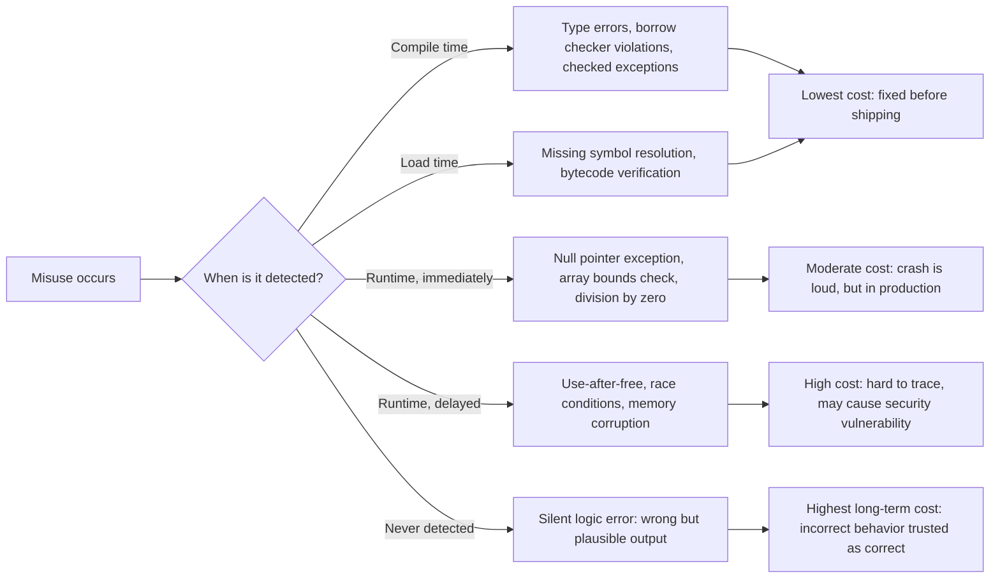

## Reliability and the Cost of Language Misuse

### Defining Reliability in Language Design

Reliability, as a language design goal, refers to how well a language prevents programs from behaving in unintended or unsafe ways — both by catching errors before runtime and by limiting the damage a mistake can cause when it does occur. A language is more reliable when it makes incorrect programs harder to write, easier to detect, or less catastrophic in their effects, rather than relying on programmer discipline alone.

"Cost of language misuse" refers to the practical consequences when a programmer uses a language feature incorrectly, unsafely, or in a way the language permits but does not intend to encourage. This cost can manifest as compile-time friction, runtime crashes, silent data corruption, security vulnerabilities, or long-term maintenance burden.

### Key Points

- Reliability is closely tied to, but distinct from, readability and writability: a language can be reliable while being verbose (Ada) or reliable while being terse (Rust's borrow checker plus concise syntax).
- Misuse costs are not symmetric — some misuses fail fast and loudly (a null pointer dereference crash), while others fail silently and are discovered much later (a buffer overflow corrupting unrelated memory).
- Language designers make explicit choices about **when** errors should surface — compile-time, load-time, or runtime — and each choice trades early detection against implementation complexity or runtime overhead.

### Sources of Unreliability in Language Design

Several recurring language features are historically associated with unreliability, because they permit misuse that the compiler or runtime cannot detect:

- **Type coercion and weak typing**: silently converting between incompatible types can mask logic errors.
- **Explicit pointer arithmetic**: allows the program to compute and dereference arbitrary memory addresses.
- **Uninitialized variables**: reading a variable before it has an assigned, meaningful value.
- **Manual memory management**: dependent entirely on the programmer to free memory exactly once, no more and no less.
- **Unchecked exceptions or missing error-handling enforcement**: allows errors to be silently ignored rather than surfaced.
- **Aliasing**: multiple references to the same mutable data, which can produce hard-to-trace effects when one alias mutates shared state.

[Inference] This list reflects commonly cited categories in programming language and software engineering literature discussing reliability, but the relative severity ranking between these categories is context-dependent and not something with a single authoritative ordering.

### Case Study: Manual Memory Management

C and C++ give programmers direct control over memory allocation and deallocation via `malloc`/`free` and `new`/`delete`. This grants performance and flexibility, but the cost of misuse is severe and often delayed.

```c
int *ptr = malloc(sizeof(int));
*ptr = 42;
free(ptr);
printf("%d\n", *ptr);   // use-after-free: undefined behavior
```

The above compiles and may even appear to run correctly on some systems, since freed memory is not always immediately overwritten. The defect can surface much later, in an unrelated part of the program, when the freed memory region is reused for something else — making the actual bug extremely difficult to trace back to its origin.

```c
int *arr = malloc(3 * sizeof(int));
free(arr);
// forgot to set arr = NULL
free(arr);   // double free: undefined behavior
```

Both examples compile without warning under a standard C compiler. The reliability cost is deferred entirely to runtime, and in the worst case, to a runtime environment far removed from the code that caused the error.

Rust addresses this specific misuse category structurally, through its ownership and borrowing system, enforced at compile time:

```rust
fn main() {
    let ptr = Box::new(42);
    drop(ptr);
    println!("{}", ptr); // compile-time error: value used after move
}
```

The equivalent use-after-free pattern is rejected before the program can run at all. [Inference] This is a widely cited example of Rust's design goal, though "compile-time enforcement eliminates a class of bugs" is a claim about the mechanism's intent and general effect, not a guarantee that all memory-safety bugs are impossible in all Rust code, particularly code using `unsafe` blocks.

### Case Study: Null References

Tony Hoare, who introduced null references in ALGOL W, later referred to the null reference as his "billion-dollar mistake" in a retrospective talk. Hoare stated that he introduced null references simply because they were easy to implement, and this design choice has since caused innumerable errors, vulnerabilities, and system crashes, likely contributing to a billion dollars of pain and damage over the following decades.

```java
String s = getStringOrNull();
int len = s.length();  // NullPointerException if s is null
```

This compiles cleanly. The Java compiler has no way to distinguish, from the type `String` alone, whether a given reference might be null. The cost of misuse — forgetting a null check — is deferred entirely to runtime, and manifests as a crash potentially far from where the null value originated.

Languages designed after this lesson often make nullability part of the type system itself, forcing the reliability check to compile time:

```kotlin
var s: String = getStringOrNull() // compile-time error: type mismatch
var s: String? = getStringOrNull() // must explicitly handle null
println(s?.length ?: 0)
```

Kotlin's `String?` versus `String` distinction, Rust's `Option<T>`, and Swift's optionals all represent the same design response: making "this value might be absent" an explicit, checked part of the type, rather than an implicit possibility for every reference type.

### Case Study: Implicit Type Coercion as a Reliability Risk

Beyond the writability convenience discussed in readability/writability trade-offs, implicit coercion is also a reliability concern, because it can mask logic errors that a stricter type system would catch at compile time.

```javascript
function isAdult(age) {
    return age >= 18;
}
isAdult("20");   // true  — coerced correctly
isAdult("");     // false — "" coerced to 0
isAdult(null);   // false — null coerced to 0
isAdult(undefined); // false, but via NaN comparison, not "0 >= 18"
isAdult([]);     // false — [] coerced to 0
isAdult([20]);   // true  — [20] coerced to "20" then to 20
```

Each of these calls runs without error, but several represent likely programmer mistakes — passing the wrong type entirely — that a statically typed language would reject at compile time rather than silently coercing.

```typescript
function isAdult(age: number): boolean {
    return age >= 18;
}
isAdult("20"); // compile-time error: string is not assignable to number
```

TypeScript's static type layer over JavaScript is a direct response to this reliability gap: it does not change JavaScript's runtime coercion behavior, but it catches many misuse cases before the code ever executes.

### Case Study: Unchecked Exceptions and Silent Failure

Some languages allow errors to propagate silently unless explicitly checked, which shifts the cost of misuse from "code won't compile" to "code fails unpredictably in production."

```python
import json
def parse_config(path):
    with open(path) as f:
        return json.load(f)

config = parse_config("missing_file.json")
# raises FileNotFoundError, uncaught: crashes the whole program
```

Python does not force the caller to handle exceptions; an uncaught exception propagates up the call stack and terminates the program if never caught. This is a deliberate design trade-off: it keeps the language simpler and more writable, at a reliability cost that is fully deferred to runtime and testing coverage.

Java's checked exceptions represent an attempt to move this cost to compile time:

```java
public String readFile(String path) throws IOException {
    return Files.readString(Path.of(path));
}
```

A caller of `readFile` must either catch `IOException` or declare it in their own `throws` clause, or the code will not compile. [Unverified: whether checked exceptions net-improve reliability in practice is a genuinely disputed question in the software engineering community] — critics argue checked exceptions often lead to reflexive, meaningless `catch` blocks that swallow errors just to satisfy the compiler, which can make reliability *worse* in practice than an unchecked model paired with disciplined testing and error-handling conventions.

### The Detection-Time Spectrum



The general principle guiding reliability-focused language design is to shift detection as far left on this spectrum as possible — from "never detected" toward "compile time" — because the cost of a defect typically grows the later it is discovered. [Inference] This "shift-left" framing is a common heuristic in software engineering discourse; the specific cost multipliers sometimes cited for later-stage defect discovery vary significantly across studies and are not treated here as precise figures.

### Visualizing Misuse Cost Versus Restriction Level

<svg xmlns="http://www.w3.org/2000/svg" viewBox="0 0 640 420" font-family="Helvetica, Arial, sans-serif">
  <text x="320" y="30" text-anchor="middle" font-size="18" font-weight="bold" fill="#1a1a1a">Misuse Cost vs. Language Restriction (svg_diagram)</text>

  <line x1="80" y1="360" x2="580" y2="360" stroke="#333" stroke-width="2" />
  <line x1="80" y1="360" x2="80" y2="60" stroke="#333" stroke-width="2" />

  <text x="330" y="390" text-anchor="middle" font-size="14" fill="#333">Language restriction / strictness →</text>
  <text x="30" y="210" text-anchor="middle" font-size="14" fill="#333" transform="rotate(-90 30 210)">Cost when misused →</text>

  
  <polyline points="90,90 200,110 300,170 400,260 500,330 570,345" fill="none" stroke="#c0392b" stroke-width="3" />

  <circle cx="120" cy="95" r="6" fill="#2980b9" />
  <text x="130" y="90" font-size="12" fill="#2980b9">Rust ownership</text>

  <circle cx="230" cy="120" r="6" fill="#2980b9" />
  <text x="240" y="115" font-size="12" fill="#2980b9">Java checked exceptions</text>

  <circle cx="330" cy="185" r="6" fill="#8e44ad" />
  <text x="340" y="180" font-size="12" fill="#8e44ad">Python (unchecked exceptions)</text>

  <circle cx="440" cy="280" r="6" fill="#e67e22" />
  <text x="360" y="300" font-size="12" fill="#e67e22">JavaScript (implicit coercion)</text>

  <circle cx="540" cy="335" r="6" fill="#c0392b" />
  <text x="470" y="355" font-size="12" fill="#c0392b">C (manual memory, raw pointers)</text>
</svg>

[Inference] This curve is a conceptual illustration of an inverse relationship commonly discussed in language design — more compile-time restriction generally correlates with lower runtime misuse cost — not a plot of any measured empirical dataset.

### The Trade-off: Reliability Versus Flexibility and Performance

Reliability mechanisms are rarely free. Common costs incurred to gain reliability include:

- **Development friction**: stricter type systems and borrow checkers require the programmer to satisfy the compiler before code runs at all, which can slow initial development, especially for programmers unfamiliar with the model. [Inference] The magnitude of this friction, and whether it nets out as a long-term time cost or savings, is contested and likely varies by team and problem domain.
- **Runtime overhead**: bounds checking, null checks inserted automatically, and garbage collection all consume CPU cycles and memory that manual, unchecked approaches can avoid.
- **Expressiveness restriction**: some valid, safe programs are rejected by conservative static analysis (for example, Rust's borrow checker historically rejected some patterns that are actually memory-safe, because proving their safety was beyond what the checker could verify at the time).

This is why systems languages historically favored raw pointers and manual memory management despite the reliability cost: the performance and flexibility gain was considered worth the misuse risk for the target domain (operating systems, embedded systems, performance-critical applications). Application-level and scripting languages more often favor reliability and safety by default, accepting runtime overhead in exchange for eliminating entire classes of misuse.

### Mitigating Misuse Cost Without Changing the Language

Where a language itself does not enforce a reliability property, ecosystems frequently develop external tooling to recover some of the lost safety:

- **Static analyzers and linters** (Clang Static Analyzer, ESLint, Pylint) catch likely-misuse patterns before runtime without changing the language's semantics.
- **Sanitizers** (AddressSanitizer, UndefinedBehaviorSanitizer) instrument compiled C/C++ binaries to detect memory misuse at runtime during testing, at a performance cost unsuitable for production.
- **Fuzz testing** deliberately feeds malformed or unexpected input to a program to surface misuse-triggered crashes before release.
- **Style guides and code review conventions** encode institutional knowledge about which language features are misuse-prone and should be avoided or used only in restricted patterns.

[Inference] Framing these tools collectively as compensating for a language's inherent reliability gaps is an interpretive synthesis based on common industry practice, rather than a claim sourced from a single reference.

### Conclusion

Reliability in language design is fundamentally about deciding where and when the cost of a programmer's mistake becomes visible — ideally at compile time, tolerably at runtime with a clear failure signal, and never silently. Every major class of historical software defect — use-after-free, null dereference, type confusion, unhandled errors — has a documented lineage of language design responses attempting to move detection earlier, and each response carries its own cost in verbosity, performance, or restricted expressiveness. No language eliminates misuse entirely; design in this space is a continuous negotiation between how much a language should protect programmers from themselves and how much control and performance it should preserve for those who need it.

**Related Topics**

- Language Design Principles and Trade-offs — Readability versus writability tensions
- Type Systems — Static versus dynamic typing trade-offs
- Memory Management Models — Manual, garbage-collected, and ownership-based approaches
- Error Handling Paradigms — Exceptions, error codes, and result types
- Language Design Principles and Trade-offs — Cost of language implementation versus cost of language use
- Formal Verification — Proving program correctness beyond type-checking
- Null Safety Mechanisms — Optionals, nullable types, and the billion-dollar mistake