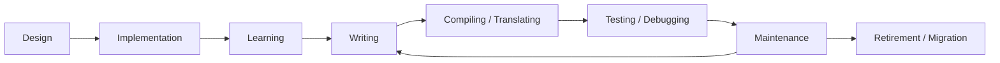
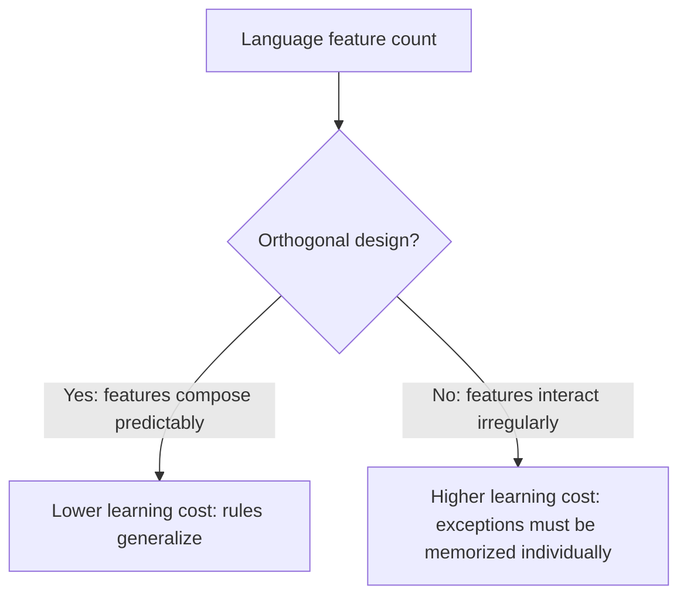

## Cost Across the Language Life Cycle

### Defining the Life Cycle Cost Model

A programming language's total cost is not incurred at a single point in time but accumulates across distinct phases: design, implementation, learning, writing, debugging, maintaining, and eventually retiring or migrating away from the language. Language design decisions made early — often for reasons of simplicity or implementation speed — can shift cost forward into later phases, sometimes multiplying it. Evaluating a language design choice only by its immediate effect (how hard is this to implement, how fast can I write this) without considering downstream phases produces an incomplete picture of its true cost.

This life-cycle framing is a lens for organizing many of the trade-offs already discussed in readability/writability and reliability, viewed instead through the dimension of *when* the cost is paid rather than *what kind* of cost it is.

### Key Points

- The same design decision can appear cheap in one phase and expensive in another; a feature that reduces implementation cost for compiler writers can increase debugging cost for end users indefinitely afterward.
- Costs paid earlier in the life cycle (design, compiler implementation) are paid once; costs paid later (debugging, maintenance) are paid repeatedly, by potentially many different people, across the software's entire operational lifetime.
- A rational cost-minimization strategy for a language intended for long-lived, widely used software favors shifting cost toward the earliest phases possible, even if that makes those early phases individually harder.

### The Phases of Language Cost

Note the feedback loop from Maintenance back to Writing: most software spends far more of its life cycle being modified than being originally authored, meaning the "Writing" phase recurs continuously throughout a language's practical use, long after initial release. [Inference] The claim that maintenance dominates the life cycle in time and cost is a widely repeated observation in software engineering literature, though exact proportions vary significantly by project type and are not universal constants.

### Design Cost

Design cost is paid by the small group of people who create the language specification. It includes the effort of resolving ambiguities, choosing a grammar, deciding on semantics for edge cases, and, ideally, anticipating how features will interact.

Design cost is the cheapest phase to fix a mistake in, because a change here affects a specification document rather than existing running code. A design decision reconsidered before a language has users costs relatively little. The same decision reconsidered after the language has an ecosystem of dependent code becomes vastly more expensive, because it now requires either breaking backward compatibility or living with the original design permanently.

**Example**

Python's transition from Python 2 to Python 3 illustrates the cost of a design correction made after widespread adoption. Changes such as making `print` a function rather than a statement, and changing the default string type to Unicode, were considered improvements to the language's design, but because they broke backward compatibility, the migration cost was distributed across the entire existing ecosystem — every maintained Python 2 codebase, every library, every deployed system — rather than being absorbed once by the language's original designers.

### Implementation Cost

Implementation cost is paid by whoever builds the compiler, interpreter, or runtime. Some design choices are attractive specifically because they are cheap to implement, even if that cheapness is later paid for by users.

[Inference] Tony Hoare's own account of introducing null references — because they were easy to implement — is a documented historical example of implementation cost being prioritized over the downstream reliability cost eventually paid by every subsequent user of ALGOL-descended languages; this is discussed further under reliability trade-offs.

Garbage collection is a case where a feature costly to implement well (a performant, low-pause garbage collector is a substantial engineering undertaking) is chosen specifically because it eliminates a much larger, recurring cost in later phases — namely, the debugging cost of manual memory management errors described previously.

### Learning Cost

Learning cost is paid by every new programmer who adopts the language, and is paid once per person but multiplied across the entire population of people who ever learn the language.

Languages with a small, orthogonal, well-documented core tend to have lower learning cost than languages with a large surface area of special cases, historical accretions, and multiple overlapping ways to do the same thing.

[Inference] The general claim that orthogonality reduces learning cost is a widely held design principle, but "learning cost" itself is difficult to measure objectively, and comparative claims between specific languages' learning curves are often based on practitioner consensus rather than controlled study.

### Writing Cost

Writing cost corresponds closely to writability, discussed previously: how much time and mental effort it takes to translate an intended solution into working code. This is paid every time new code is authored, which — given the maintenance feedback loop above — happens far more often across a language's life than a one-time "initial development" framing suggests.

### Compilation and Translation Cost

This is a comparatively narrow but real cost category: how long it takes to translate source code into an executable or intermediate form, and how much tooling infrastructure (build systems, incremental compilation, caching) is needed to keep that cost tolerable as codebases grow. Languages with expressive but computationally expensive type systems, heavy use of templates or macros, or complex module resolution can incur substantial compilation cost, which is paid repeatedly by every developer on every build, throughout the entire active development period.

[Unverified: specific compiler performance comparisons between named languages change frequently with compiler version and are not treated here as fixed facts] — but the general pattern that more powerful compile-time guarantees often correlate with slower compilation is a widely discussed trade-off in language design and tooling communities.

### Testing and Debugging Cost

This is the cost of discovering that code does not do what was intended, and of tracing the discrepancy back to its source. As discussed under reliability, this cost varies enormously depending on how early the language surfaces the underlying defect.

**Example**

Reconsider the use-after-free example type discussed previously: a defect introduced during writing may not manifest as an observable failure until testing, or worse, until production, at which point the debugging cost includes not just fixing the code but reconstructing the conditions that caused the failure — a process that can take substantially longer than the original mistake took to make.

### Maintenance Cost

Maintenance cost is the ongoing, recurring cost of modifying existing code — fixing defects discovered after release, adapting to changed requirements, and updating dependencies — over the software's entire operational lifetime, which for widely used systems can span decades.

Maintenance cost is where readability, discussed in the prior trade-off, has its largest life-cycle impact: code is written once but read and modified many times during maintenance, so a language or codebase optimized for writability at the expense of readability shifts cost from a one-time writing phase into a recurring, indefinitely repeated maintenance phase.

[Inference] The oft-cited claim that maintenance constitutes the majority of total software lifetime cost is a long-standing figure in software engineering discourse, but the specific percentage attributed to it varies across sources and study methodologies, and is not treated here as a single precise number.

### Retirement and Migration Cost

Eventually, a language, a major version of a language, or a specific codebase may need to be retired or migrated to something else — due to end-of-life support, security concerns, hiring difficulty, or the emergence of a better-suited alternative. This cost includes rewriting or translating existing code, retraining staff, and the risk of introducing new defects during the transition.

**Example**

The Python 2 to Python 3 migration discussed earlier under design cost is simultaneously a case study in migration cost: many organizations delayed migration for years due to the cost and risk of rewriting production code, and some legacy systems remained on Python 2 well past its official end-of-life date, accepting security risk rather than absorbing migration cost.

COBOL presents a longer-horizon example: [Inference] widely reported industry discussion has noted that a significant amount of COBOL code, some written decades ago, remains in active use in institutions such as banks and government systems, largely because migration cost is judged to exceed the cost of continuing to maintain and staff for the legacy system — though precise current figures for "how much COBOL is still in production" vary by source and are difficult to verify exactly.

### Visualizing Cost Distribution Across Phases

<svg xmlns="http://www.w3.org/2000/svg" viewBox="0 0 640 420" font-family="Helvetica, Arial, sans-serif">
  <text x="320" y="30" text-anchor="middle" font-size="18" font-weight="bold" fill="#1a1a1a">Approximate Cost Weight by Life-Cycle Phase (svg_diagram)</text>

  <line x1="70" y1="370" x2="600" y2="370" stroke="#333" stroke-width="2" />
  <line x1="70" y1="370" x2="70" y2="60" stroke="#333" stroke-width="2" />
  <text x="335" y="400" text-anchor="middle" font-size="13" fill="#333">Life-cycle phase →</text>
  <text x="25" y="220" text-anchor="middle" font-size="13" fill="#333" transform="rotate(-90 25 220)">Relative cumulative cost →</text>

  <rect x="90" y="330" width="50" height="40" fill="#2980b9" />
  <text x="115" y="385" text-anchor="middle" font-size="11" fill="#333">Design</text>

  <rect x="160" y="310" width="50" height="60" fill="#2980b9" />
  <text x="185" y="385" text-anchor="middle" font-size="11" fill="#333">Impl.</text>

  <rect x="230" y="290" width="50" height="80" fill="#16a085" />
  <text x="255" y="385" text-anchor="middle" font-size="11" fill="#333">Learning</text>

  <rect x="300" y="250" width="50" height="120" fill="#16a085" />
  <text x="325" y="385" text-anchor="middle" font-size="11" fill="#333">Writing</text>

  <rect x="370" y="300" width="50" height="70" fill="#8e44ad" />
  <text x="395" y="385" text-anchor="middle" font-size="11" fill="#333">Compile</text>

  <rect x="440" y="200" width="50" height="170" fill="#e67e22" />
  <text x="465" y="385" text-anchor="middle" font-size="11" fill="#333">Debug</text>

  <rect x="510" y="100" width="60" height="270" fill="#c0392b" />
  <text x="540" y="385" text-anchor="middle" font-size="11" fill="#333">Maintain</text>

  <text x="335" y="70" text-anchor="middle" font-size="12" font-style="italic" fill="#888">Bar height = illustrative relative cost weight, not measured data</text>
</svg>

[Speculation] The relative bar heights in this diagram are illustrative of the commonly discussed principle that maintenance dominates total life-cycle cost for long-lived software; they do not represent measured proportions from any specific dataset and should not be read as quantitatively precise.

### Design Strategies for Minimizing Total Life-Cycle Cost

Given that later-phase costs tend to be paid repeatedly while earlier-phase costs are paid once, several recurring design strategies aim to shift cost earlier:

- **Investing in compile-time checking** to catch errors before the debugging and maintenance phases, even at the cost of implementation complexity and some writing friction.
- **Prioritizing orthogonal, consistent design** to reduce learning cost multiplied across every future user, even if that requires more design-phase deliberation to get the core abstractions right initially.
- **Committing to backward compatibility guarantees early**, or explicitly versioning breaking changes, to avoid the kind of ecosystem-wide migration cost seen in the Python 2 to 3 transition.
- **Providing rich tooling (linters, formatters, language servers) alongside the language**, treating tooling investment as a way to reduce writing and debugging cost across the entire user base rather than requiring each user to independently develop the same defensive habits.

[Inference] These strategies represent a synthesis of recurring themes in language design discourse rather than a canonical, universally agreed-upon list; different language design communities weigh these strategies differently depending on their target domain.

### Conclusion

Viewing language design decisions across the full life cycle — design, implementation, learning, writing, compiling, debugging, maintaining, and eventual retirement — reveals that many trade-offs already discussed under readability, writability, and reliability are really disagreements about *when* a cost should be paid and *by whom*, rather than *whether* a cost exists at all. A choice that appears to minimize cost when viewed only through the lens of initial implementation or initial writing can dramatically increase total cost once the recurring, multiplied nature of learning, debugging, and maintenance is taken into account. Responsible language design requires evaluating a decision's cost across every phase it will touch, not only the phase in which the decision is made.

**Related Topics**

- Language Design Principles and Trade-offs — Readability versus writability tensions
- Language Design Principles and Trade-offs — Reliability and the cost of language misuse
- Software Maintenance — Legacy system management and technical debt
- Language Evolution and Versioning — Managing backward compatibility and breaking changes
- Compiler Design — Compile-time checking versus compilation speed trade-offs
- Developer Tooling — Linters, formatters, and language servers as cost-reduction infrastructure
- Case Study: Python 2 to Python 3 Migration