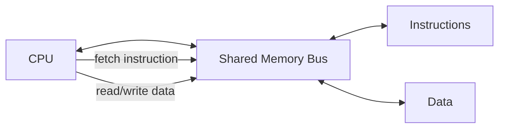
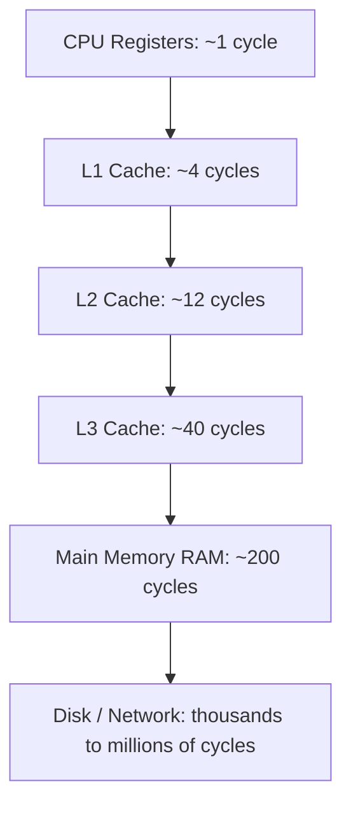

## Influence of Computer Architecture on Language Design

### The Core Relationship

Programming languages do not exist independently of the machines that execute them. The dominant computer architecture of a given era — how memory is organized, how instructions are fetched and executed, how data moves between storage and computation — has repeatedly shaped which language features were feasible, efficient, or even conceivable at the time a language was designed. This influence runs in both directions historically: early languages were shaped tightly around the machine (assembly-like thinking), and later languages were designed partly as a reaction against being too close to the machine, seeking portability and abstraction instead.

### Key Points

- The von Neumann architecture — a single memory space holding both instructions and data, accessed sequentially by a central processing unit — is the dominant model that shaped most widely used imperative languages.
- Architectural features that are expensive or awkward to execute directly discourage corresponding language features, while architectural features that are cheap encourage languages to expose them.
- As architecture evolved (multi-core processors, deep memory hierarchies, GPUs, vector units), language design has had to evolve in response, often decades after the hardware change first appeared.

### The von Neumann Bottleneck and Imperative Languages

Most widely used general-purpose languages — C, Java, Python, Pascal, Fortran — are described as imperative languages: they express computation as a sequence of statements that change program state, executed one after another. This design maps directly onto von Neumann architecture, where a program counter steps through memory fetching and executing instructions sequentially, and variables correspond to named memory locations that can be overwritten.



This shared bus between instructions and data — and between the CPU and memory generally — is often referred to as the "von Neumann bottleneck," because the CPU can execute instructions far faster than data can be moved across this single channel. Assignment statements, loops that repeatedly overwrite a variable, and array indexing are all language-level constructs that map naturally and efficiently onto this architecture, which is part of why imperative languages became dominant: they were a natural, low-overhead fit for the hardware that existed when they were designed.

[Inference] The characterization of the von Neumann bottleneck as a significant influence on the dominance of imperative language paradigms is a widely repeated observation in programming language history and design literature (notably associated with John Backus's Turing Award lecture critiquing von Neumann-style languages), though the precise causal weight of architecture versus other factors (familiarity, tooling, momentum) in explaining imperative language dominance is not something reducible to a single quantifiable claim.

### Functional Languages as an Architectural Counter-Reaction

Functional programming languages — which avoid mutable state and instead compute by evaluating expressions and applying functions — were, in part, motivated by a desire to escape the von Neumann model's emphasis on sequential state mutation.

```haskell
sumList :: [Int] -> Int
sumList [] = 0
sumList (x:xs) = x + sumList xs
```

This style expresses computation without explicit, sequential overwriting of memory locations. Historically, functional languages ran less efficiently on von Neumann machines precisely because their execution model does not map as directly onto the hardware's sequential fetch-execute cycle and mutable memory model; techniques like tail-call optimization, lazy evaluation strategies, and specialized runtime systems were developed specifically to close this efficiency gap.

[Inference] John Backus's 1977 Turing Award lecture, "Can Programming Be Liberated from the von Neumann Style?", is frequently cited as an influential, explicit articulation of the argument that language design should move away from architectures modeled directly on von Neumann principles; the lecture's specific arguments and its long-term influence on functional language research are documented in programming language history discussions, though characterizing its precise causal impact on subsequent language adoption trends involves some interpretive judgment.

### Memory Hierarchy and Language-Level Data Structures

Modern architectures do not treat memory as a single uniform pool; they use a hierarchy — registers, multiple levels of cache, main memory, and disk or network storage — with dramatically different latencies at each level. Language and library design has increasingly had to account for this hierarchy explicitly.



[Unverified: specific cycle-count figures vary substantially across processor generations and models, and the numbers above are illustrative order-of-magnitude approximations rather than fixed specifications for any particular chip.]

Languages like C and C++ expose data layout control — the programmer can choose contiguous arrays over pointer-chasing linked structures specifically to exploit cache locality, because sequential memory access patterns are dramatically faster than scattered access on modern hierarchical memory. This is a direct case of architecture shaping which language features (manual layout control, pointer arithmetic, structure packing) are considered valuable enough to expose, despite the reliability costs discussed under language misuse.

**Example**

```c
// Array of structs: fields for one element are contiguous
struct Particle { float x, y, z; };
struct Particle particles[1000];

// vs. Struct of arrays: better cache behavior for operations
// that touch only one field across many elements
struct ParticleSystem {
    float x[1000], y[1000], z[1000];
};
```

The "struct of arrays" pattern exists specifically because of cache-line behavior on real hardware: if an operation only needs the `x` values, the array-of-structs layout wastes cache bandwidth loading `y` and `z` values alongside each `x`, while the struct-of-arrays layout keeps all relevant data contiguous. [Inference] This is a well-documented performance pattern in systems and high-performance computing programming, though the actual performance delta depends heavily on the specific access pattern, data size, and target hardware, and is not a fixed universal constant.

Higher-level languages like Python or Java abstract this concern away entirely by default, trading potential performance for the programmer never needing to reason about cache lines — a direct instance of the readability/writability and reliability trade-offs discussed previously, now viewed through an architectural lens.

### Word Size, Integer Types, and Portability

Early languages, including early C, tied integer sizes closely to the underlying machine's native word size, since this mapped most efficiently onto hardware registers and arithmetic units. This created a portability problem: the same source code could behave differently — or overflow at different thresholds — on machines with different word sizes (16-bit, 32-bit, 64-bit).

```c
int x = 40000; // behavior differs: fits in 32-bit int, overflows a 16-bit int
```

Later language design responses to this architectural dependency include fixed-width integer types (`int32_t`, `int64_t` in C's `stdint.h`) that decouple the language-level type from whatever the underlying machine's "natural" word happens to be, and languages like Java that mandate specific bit-widths for primitive types (`int` is always 32 bits) as a language specification guarantee, regardless of the underlying hardware.

### Multi-Core Architecture and Concurrency Primitives

For decades, single-core CPU performance improved steadily through increasing clock speed, which allowed sequential imperative languages to become faster over time with essentially no changes to language design — a program simply ran faster on newer hardware. When clock-speed scaling slowed and chip manufacturers shifted toward increasing the number of cores per processor instead, this created pressure on language design that had not existed previously: sequential programs no longer automatically became faster on new hardware, because most sequential code cannot use additional cores without being restructured to run concurrently.

This architectural shift is a major factor behind renewed language-level interest in concurrency primitives:

```go
func worker(id int, jobs <-chan int, results chan<- int) {
    for j := range jobs {
        results <- j * 2
    }
}
```

Go's goroutines and channels, Rust's ownership-based data-race prevention at compile time, and Erlang's actor-based concurrency model (which predates the multi-core shift but became newly relevant because of it) each represent language-level responses to an architectural reality: hardware performance gains increasingly come from parallelism rather than raw sequential speed, so languages designed or popularized after this shift have needed to make concurrent programming more tractable and less error-prone than earlier thread-and-lock models offered.

[Inference] The framing of the "multi-core shift" as a specific historical inflection point — often associated with the slowing of Dennard scaling in the mid-2000s — is a well-documented narrative in computer architecture and language design discussions, though the precise timeline and the degree to which any single language's concurrency features were a direct causal response to this shift, versus a more general ongoing interest in concurrency, involves some interpretive framing rather than being a strictly verifiable single causal chain.

### GPU and Vector Architectures Shaping Specialized Languages

Architectures that diverge significantly from the general-purpose von Neumann CPU model have produced entire specialized language ecosystems rather than just new features bolted onto general-purpose languages. GPUs, with their architecture built around executing the same instruction across thousands of data lanes simultaneously (a model often described as SIMD, single instruction multiple data, at large scale), are poorly suited to languages built around sequential, branching control flow, which led to the development of specialized languages and language extensions.

```cuda
__global__ void addVectors(float *a, float *b, float *c, int n) {
    int i = blockIdx.x * blockDim.x + threadIdx.x;
    if (i < n) c[i] = a[i] + b[i];
}
```

CUDA and OpenCL exist specifically because expressing this style of massively parallel, data-uniform computation efficiently in a general-purpose sequential language like C would require the compiler to somehow infer parallelism the language was never designed to express explicitly. Instead, these languages expose the architecture's execution model — thread blocks, grids, warps — directly as language-level concepts, illustrating a case where the architecture's divergence from the general-purpose CPU model was significant enough to justify entirely new languages rather than incremental extensions to existing ones.

### Visualizing the Bidirectional Influence

<svg xmlns="http://www.w3.org/2000/svg" viewBox="0 0 640 380" font-family="Helvetica, Arial, sans-serif">
  <text x="320" y="30" text-anchor="middle" font-size="18" font-weight="bold" fill="#1a1a1a">Architecture and Language Design: Bidirectional Influence (svg_diagram)</text>

  <rect x="60" y="70" width="220" height="90" rx="10" fill="#2980b9" opacity="0.15" stroke="#2980b9" stroke-width="2" />
  <text x="170" y="100" text-anchor="middle" font-size="14" font-weight="bold" fill="#2980b9">Computer Architecture</text>
  <text x="170" y="125" text-anchor="middle" font-size="12" fill="#333">von Neumann model,</text>
  <text x="170" y="142" text-anchor="middle" font-size="12" fill="#333">memory hierarchy, multi-core, SIMD</text>

  <rect x="360" y="70" width="220" height="90" rx="10" fill="#c0392b" opacity="0.15" stroke="#c0392b" stroke-width="2" />
  <text x="470" y="100" text-anchor="middle" font-size="14" font-weight="bold" fill="#c0392b">Language Design</text>
  <text x="470" y="125" text-anchor="middle" font-size="12" fill="#333">Imperative statements, pointer</text>
  <text x="470" y="142" text-anchor="middle" font-size="12" fill="#333">arithmetic, concurrency primitives</text>

  <path d="M 280 100 L 355 100" stroke="#333" stroke-width="2" marker-end="url(#arrow1)" />
  <text x="317" y="90" text-anchor="middle" font-size="11" fill="#333">enables / constrains</text>

  <path d="M 355 145 L 280 145" stroke="#333" stroke-width="2" marker-end="url(#arrow2)" />
  <text x="317" y="165" text-anchor="middle" font-size="11" fill="#333">demands new hardware features</text>

  <text x="320" y="220" text-anchor="middle" font-size="13" font-style="italic" fill="#555">Example cycle:</text>
  <text x="320" y="245" text-anchor="middle" font-size="12" fill="#333">Multi-core hardware appears → sequential languages underuse it →</text>
  <text x="320" y="265" text-anchor="middle" font-size="12" fill="#333">languages add concurrency primitives → programmers demand better</text>
  <text x="320" y="285" text-anchor="middle" font-size="12" fill="#333">hardware support for those primitives (e.g. atomic instructions,</text>
  <text x="320" y="305" text-anchor="middle" font-size="12" fill="#333">transactional memory experiments) → architecture responds</text>
</svg>

[Inference] This diagram's characterization of a feedback cycle between architecture and language design is a synthesized conceptual model reflecting recurring patterns discussed in computer architecture and programming language history, not a claim of a single documented formal model.

### Conclusion

Computer architecture has never been a neutral backdrop to programming language design; it has actively shaped which abstractions were efficient enough to be practical, which were rejected as too costly, and which entirely new language paradigms emerged specifically to bridge or exploit a divergence from the dominant general-purpose CPU model. The von Neumann architecture's sequential, mutable-memory model shaped the dominance of imperative languages and motivated functional languages as a deliberate counter-reaction; memory hierarchies shaped data-layout-conscious language features; word-size variation drove portability-focused type design; and the shift toward multi-core and specialized architectures like GPUs has driven, and continues to drive, ongoing language-level innovation in concurrency and parallel computation models. Understanding a language's design choices in isolation from the hardware environment that produced them gives an incomplete picture of why those choices were made.

**Related Topics**

- Language Design Principles and Trade-offs — Readability versus writability tensions
- Language Design Principles and Trade-offs — Reliability and the cost of language misuse
- Programming Paradigms — Imperative versus functional versus declarative models
- Concurrency and Parallelism Models — Threads, actors, and channel-based approaches
- Memory Management Models — Manual, garbage-collected, and ownership-based approaches
- Domain-Specific Languages — GPU and vectorized computation languages (CUDA, OpenCL, SIMD intrinsics)
- History of Programming Languages — Key influential languages and their design motivations