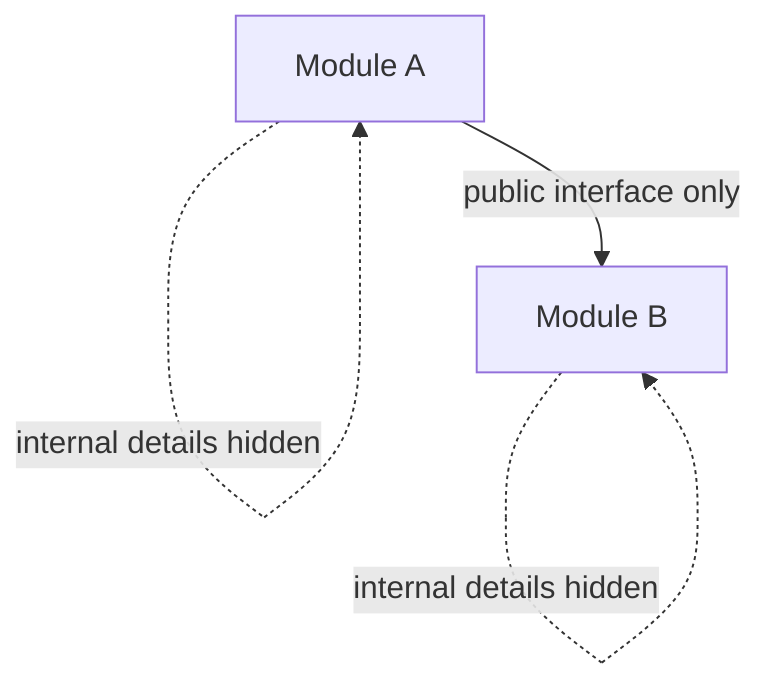
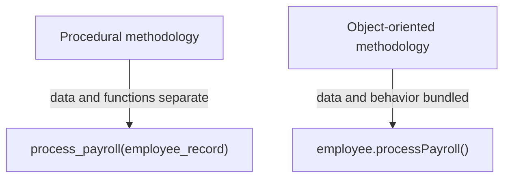
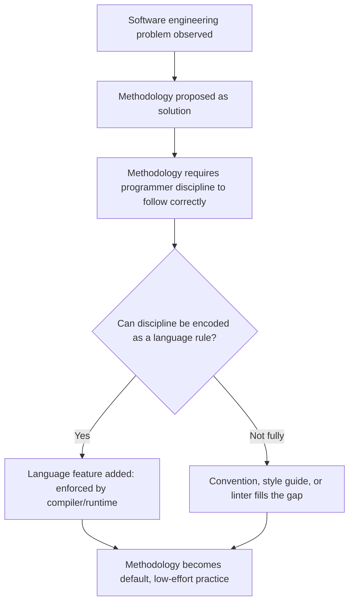

## Influence of Programming Methodologies on Design

### The Core Relationship

Programming languages are shaped not only by the hardware they run on but by the prevailing beliefs, at the time of their design, about how software *should* be built — the methodologies and disciplines that structure how programmers think about decomposing problems, organizing code, and managing complexity. As dominant methodologies have shifted over the decades — from unstructured flow-driven coding, to structured programming, to object orientation, to more recent agile and functional-influenced practices — language designers have repeatedly built new features, or entire new languages, specifically to make the currently favored methodology easier to practice and harder to violate accidentally.

### Key Points

- A methodology is a set of beliefs and practices about *how to organize the process of programming*; a language feature is often a direct attempt to encode a methodology's rules into the compiler or runtime, so that following good practice becomes the path of least resistance rather than a matter of individual discipline.
- The relationship runs both directions: methodologies inspire language features, but the availability of new language features also enables new methodologies to become practical at scale.
- Because methodologies reflect the software engineering problems of their era (unreliable large-scale software, need for code reuse, need for testability, need for rapid iteration), the language features tied to them reveal what problems the field was most urgently trying to solve at each point in history.

### Structured Programming and the Rejection of `goto`

In the earliest widely used high-level languages, control flow was often expressed with unrestricted `goto` statements, allowing a jump from any point in a program to almost any other point.

```basic
10 PRINT "START"
20 IF X > 5 THEN GOTO 50
30 PRINT "SMALL"
40 GOTO 60
50 PRINT "BIG"
60 END
```

As programs grew larger, this style produced what came to be called "spaghetti code" — control flow so tangled that understanding a program's behavior required mentally tracing jumps scattered arbitrarily throughout the source. Edsger Dijkstra's 1968 letter, published under the title "Go To Statement Considered Harmful," argued that unrestricted `goto` made it fundamentally difficult to reason about a program's correctness, because the relationship between a program's static text and its dynamic execution sequence became arbitrarily complex.

This methodological argument — that programs should be built exclusively from a small set of structured control constructs (sequence, selection, iteration) rather than arbitrary jumps — became known as structured programming, and it directly shaped subsequent language design:

```pascal
if x > 5 then
  writeln('BIG')
else
  writeln('SMALL');
```

Pascal, designed by Niklas Wirth partly as a teaching language for structured programming principles, deliberately omitted unrestricted `goto` in typical use and centered its control-flow constructs around `if`/`then`/`else`, `while`, `for`, and `case` — structured equivalents that make the kind of arbitrary jump Dijkstra criticized syntactically awkward or unavailable, rather than merely discouraged by convention. Many later mainstream languages, including C, Java, and Python, followed this same methodological lineage: `goto` is either absent entirely (Python, Java) or present but rarely idiomatic (C), with structured constructs treated as the default, expected way to express control flow.

[Inference] Dijkstra's letter is a well-documented, frequently cited historical artifact in programming language history, and its influence on subsequent language design toward structured control constructs is widely discussed; the precise degree of direct causal influence on any single specific language's design, versus broader contemporaneous consensus forming independently, involves some interpretive judgment.

### Modular Programming and Information Hiding

As software systems grew beyond what a single programmer could hold in mind at once, a methodological shift emphasized decomposing programs into separate modules with well-defined boundaries, each hiding its internal implementation details from the rest of the system. David Parnas's writing on modularization and information hiding argued that modules should be organized around design decisions likely to change, so that a change to one module's internals would not ripple outward into unrelated parts of the system.

Language designers responded by building explicit module systems and visibility controls directly into languages:



```java
public class BankAccount {
    private double balance; // hidden implementation detail

    public void deposit(double amount) { // public interface
        balance += amount;
    }
}
```

Java's `private`, `public`, and `protected` access modifiers, C++'s analogous visibility keywords, and dedicated module systems in languages like Modula-2 (designed by Wirth specifically to formalize modular decomposition as a language-level construct) all represent a methodology — information hiding — being converted from a design guideline that a disciplined programmer might follow, into a compiler-enforced rule that the language will not let a programmer violate accidentally, regardless of discipline.

### Object-Oriented Programming as a Methodological Shift

The rise of object-oriented programming as a dominant methodology represented a more comprehensive reorganization of how programmers were taught to think about decomposing problems: rather than organizing a program primarily around procedures that operate on data, object orientation organizes a program around objects that bundle data and the operations on that data together, with relationships expressed through inheritance and polymorphism.



Languages designed explicitly to embody this methodology — Smalltalk, and later C++, Java, and C# — built inheritance, encapsulation, and polymorphism directly into their type systems and syntax, rather than leaving programmers to simulate these ideas manually within a procedural language (which earlier programmers sometimes did, using techniques like function pointers stored in structs to approximate what object orientation would later formalize as a first-class language feature).

**Example**

```cpp
class Shape {
public:
    virtual double area() const = 0; // methodology: define interface, defer implementation
};

class Circle : public Shape {
    double radius;
public:
    double area() const override { return 3.14159 * radius * radius; }
};
```

The `virtual` function mechanism exists specifically to support the object-oriented methodological principle of polymorphism — code written against the general `Shape` interface should work correctly with any specific subclass, without modification — encoded as a language-enforced dispatch mechanism rather than a pattern the programmer must implement manually through conditional checks on a type tag.

[Inference] The historical narrative connecting Smalltalk's design (and earlier, Simula's introduction of class-based concepts) to the subsequent widespread adoption of object-oriented methodology in mainstream languages is well documented in programming language history, though the relative influence of specific academic versus industrial adoption pressures in driving this shift is a matter of historical interpretation rather than a single verifiable causal claim.

### Design by Contract and Formal Specification Methodologies

Some methodologies emphasize specifying precisely what a piece of code is required to do — its preconditions, postconditions, and invariants — as a first-class part of the program rather than as separate documentation. Bertrand Meyer's design-by-contract methodology, most directly embodied in the Eiffel language, treats these specifications as enforceable, checkable language constructs.

```eiffel
withdraw (amount: INTEGER) is
  require
    amount > 0
    amount <= balance
  do
    balance := balance - amount
  ensure
    balance = old balance - amount
end
```

Here, `require` and `ensure` are not comments but language-enforced conditions, checked at runtime in typical configurations: violating a precondition or postcondition raises a language-level contract violation, converting what might otherwise be an implicit assumption buried in documentation or a comment into a first-class, checkable part of the program's structure. [Inference] This is a well-documented core feature of Eiffel's design as originally conceived by Meyer; the extent to which design-by-contract has been adopted as a mainstream methodology outside of Eiffel and a handful of libraries in other languages (such as assertion libraries) is more limited and contested compared to object orientation's broader adoption.

### Agile Methodologies and the Push Toward Rapid Feedback

More recent methodological movements — agile development practices, test-driven development, and continuous integration — emphasize short feedback loops, frequent small changes, and extensive automated testing over large, upfront, waterfall-style design phases. These methodologies have shaped language and tooling design less through core language syntax and more through runtime and ecosystem features that support rapid iteration.

- **Read-eval-print loops (REPLs)** in languages like Python, Clojure, and Racket support the agile emphasis on immediate feedback by letting a programmer evaluate small pieces of code interactively, rather than requiring a full compile-run cycle to test an idea.
- **Built-in or first-class testing support**, such as Python's `unittest` and `pytest` ecosystem or Rust's built-in `#[test]` attribute and `cargo test` command, reflect test-driven development's methodological emphasis on treating tests as a routine, low-friction part of the development cycle rather than a separate, burdensome activity.

```rust
#[test]
fn test_addition() {
    assert_eq!(2 + 2, 4);
}
```

Rust building test declaration directly into the language via an attribute, rather than requiring a separate external testing framework to be integrated manually, reflects a methodological assumption — that automated testing should be a default, expected practice — being made structurally convenient at the language level, similar in spirit to how structured programming made `goto`-avoidance structurally convenient decades earlier.

[Inference] The framing of REPLs and built-in testing support as direct responses to agile and test-driven development methodologies is a reasonable interpretive connection given the documented historical emergence and stated goals of both movements, though it is presented here as an interpretive synthesis rather than a claim that any single language feature was designed with explicit, sole reference to a named methodology.

### Functional Programming's Methodological Resurgence

Functional programming, discussed previously in the context of computer architecture, has also experienced renewed mainstream interest for reasons more tied to methodology than to hardware: the methodological argument that avoiding mutable shared state makes code easier to reason about, easier to test in isolation, and easier to parallelize safely, has gained renewed traction as codebases have grown larger and more concurrent.

```javascript
// Imperative, mutating style
function addItem(cart, item) {
    cart.items.push(item);
    return cart;
}

// Functional, immutable style
function addItem(cart, item) {
    return { ...cart, items: [...cart.items, item] };
}
```

Mainstream multi-paradigm languages have responded by adding functional-influenced features — immutable data structures, first-class functions, pattern matching — without requiring a wholesale shift to a purely functional language, reflecting a methodological compromise: adopt the reasoning benefits of functional style selectively, within otherwise imperative or object-oriented codebases, rather than requiring teams to fully commit to a different paradigm.

### Visualizing the Methodology-to-Feature Pipeline



This pipeline recurs across every example discussed here: unstructured control flow was recognized as a problem, structured programming was proposed as the methodological solution, and structured control-flow constructs were added to languages to make the discipline nearly automatic rather than optional; the same pattern repeats for information hiding becoming access modifiers, and for automated testing becoming a built-in language feature. [Inference] This pipeline is a generalized conceptual model synthesized from the recurring pattern across the specific historical examples discussed, rather than a documented formal theory with that exact structure in the source literature.

### Conclusion

Programming methodologies and language design exist in a continuous feedback relationship: each era's dominant beliefs about how software should be organized — structured control flow, modular decomposition, object-oriented modeling, contractual specification, agile feedback loops, and functional reasoning about state — has left a visible trace in the specific language features designed to make that methodology's discipline easier to follow and harder to violate by accident. Examining a language feature in isolation from the methodological problem it was built to solve, in the same way that examining it in isolation from the hardware constraints that shaped it, gives only a partial account of why that feature exists in its particular form.

**Related Topics**

- Language Design Principles and Trade-offs — Readability versus writability tensions
- Language Design Principles and Trade-offs — Reliability and the cost of language misuse
- Language Design Principles and Trade-offs — Influence of computer architecture on language design
- Programming Paradigms — Imperative, object-oriented, functional, and declarative models
- Software Engineering Practices — Test-driven development and continuous integration
- History of Programming Languages — Key influential languages and their design motivations
- Modularity and Encapsulation — Information hiding as a design principle