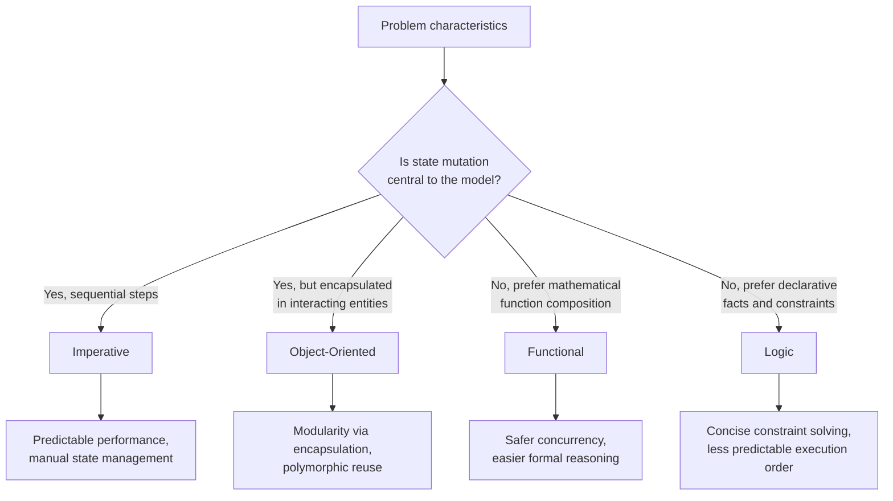

## Language Categories: Imperative, Functional, Logic, Object-Oriented


### Overview

Programming language paradigms are conceptual frameworks that dictate how a program is structured, how computation proceeds, and how the programmer expresses solutions. The four categories covered here — imperative, functional, logic, and object-oriented — represent distinct answers to the question "what is a program?" Most modern languages are multi-paradigm, blending features from several categories, but understanding each in its pure form clarifies the trade-offs a language designer makes.

**Key Points**

- Paradigms differ primarily in their model of *state*, *control flow*, and *computation*.
- The categories are not mutually exclusive; a single language (e.g., Python, Scala, Rust) can support multiple paradigms simultaneously.
- Paradigm choice affects reasoning about correctness, concurrency safety, and code reuse.

---

### Imperative Programming

Imperative programming models computation as a sequence of statements that change program state. It is the closest paradigm to the underlying machine model (the von Neumann architecture), where a CPU executes instructions one at a time, reading from and writing to memory.

#### Core Characteristics

- **Explicit state mutation**: Variables are containers whose values change over time via assignment.
- **Sequential control flow**: Statements execute in order, modified by control structures (`if`, `while`, `for`, `goto`).
- **Commands over expressions**: The programmer specifies *how* to compute a result, step by step, rather than *what* the result is.

#### Example

```c
int sum = 0;
for (int i = 1; i <= 10; i++) {
    sum = sum + i;
}
```

Here, `sum` and `i` are mutable variables whose values change across loop iterations. The program's meaning is defined by the sequence of state transitions, not by a mathematical description of the sum.

#### Sub-paradigms

- **Procedural programming**: Organizes imperative code into reusable procedures/functions (C, Pascal). Introduces abstraction over raw instruction sequences without object encapsulation.
- **Structured programming**: A discipline within imperative programming (advocated by Dijkstra) that restricts control flow to sequence, selection, and iteration, avoiding unrestricted `goto` to improve readability and provability.

#### Trade-offs

- *Advantages*: Maps directly to hardware execution, making performance characteristics predictable; intuitive for beginners since it mirrors step-by-step instructions.
- *Disadvantages*: Mutable shared state makes concurrent programs harder to reason about; side effects can make testing and debugging more complex, since a function's behavior may depend on external state.

---

### Functional Programming

Functional programming treats computation as the evaluation of mathematical functions, avoiding mutable state and side effects where possible. Its theoretical foundation is the **lambda calculus**, formalized by Alonzo Church.

#### Core Characteristics

- **Pure functions**: Given the same input, a pure function always returns the same output and produces no observable side effects. Formally, a function $f$ is pure if $f(x) = f(x)$ holds for all calls regardless of program history.
- **Immutability**: Data structures are not modified after creation; "changes" produce new structures.
- **First-class and higher-order functions**: Functions can be passed as arguments, returned from other functions, and stored in variables.
- **Declarative style**: Programs describe *what* to compute, often via recursion and composition, rather than *how* via mutation.
- **Referential transparency**: An expression can be replaced with its evaluated value without changing program behavior — a direct consequence of purity.

#### Example

```haskell
sumList :: [Int] -> Int
sumList [] = 0
sumList (x:xs) = x + sumList xs
```

This recursive definition expresses summation as a mathematical relationship rather than a loop with mutable accumulators. No variable is ever reassigned.

A higher-order function example using `map` and `filter`:

```haskell
evenSquares :: [Int] -> [Int]
evenSquares xs = map (^2) (filter even xs)
```

`filter` and `map` both accept functions as arguments, composing behavior declaratively.

#### Key Concepts

- **Recursion over iteration**: Since variables cannot be mutated in place, loops are typically replaced by recursion. Many functional languages perform **tail-call optimization**, transforming tail-recursive calls into iterative machine code to avoid stack growth.
- **Lazy vs. eager evaluation**: Languages like Haskell evaluate expressions only when their results are needed (lazy evaluation), which allows working with infinite data structures. Languages like Scheme and OCaml default to eager (strict) evaluation, computing values immediately.
- **Monads**: An abstraction for sequencing computations that involve context (such as I/O, optionality, or state) while preserving purity. [Inference — the practical necessity of monads is debated among practitioners; some functional languages (e.g., Clojure) achieve similar ends via different mechanisms, so their treatment as "core" to functional programming varies by language community.]

#### Trade-offs

- *Advantages*: Absence of shared mutable state makes concurrent and parallel execution safer, since pure functions have no data races on shared memory. Easier to test and formally reason about, since functions correspond closely to mathematical proofs.
- *Disadvantages*: Recursion-heavy code can be less intuitive for programmers trained imperatively; immutable data structures may introduce performance overhead from copying unless the language provides persistent/structural-sharing data structures. [Unverified — actual performance impact varies significantly by runtime implementation, garbage collector design, and workload, so no single quantitative figure applies universally.]

---

### Logic Programming

Logic programming expresses computation as a set of logical relationships (facts and rules), and a program is "run" by querying the system for values that satisfy those relationships. Execution is handled by an inference engine rather than an explicit instruction sequence. Prolog is the archetypal logic programming language.

#### Core Characteristics

- **Declarative relationships**: The programmer states facts and rules; the runtime determines *how* to derive answers via automated deduction.
- **Unification**: The core matching mechanism, where the system attempts to make two logical terms syntactically identical by substituting variables.
- **Backtracking**: When a query path fails to satisfy constraints, the engine automatically retreats to a previous choice point and tries alternative solutions.
- **Horn clauses**: Most logic languages are built on a restricted subset of first-order logic — Horn clauses — of the general form:

$$H \leftarrow B_1 \land B_2 \land \dots \land B_n$$

meaning "$H$ is true if $B_1$ through $B_n$ are all true."

#### Example

```prolog
% Facts
parent(tom, bob).
parent(bob, ann).

% Rule
grandparent(X, Z) :- parent(X, Y), parent(Y, Z).

% Query
?- grandparent(tom, ann).
true.
```

The programmer never specifies traversal steps; the Prolog engine unifies variables `X`, `Y`, `Z` against the fact database and backtracks through possible `Y` bindings until `grandparent(tom, ann)` is proven or disproven.

#### Trade-offs

- *Advantages*: Extremely well-suited to problems naturally expressed as constraints or relationships (parsers, expert systems, symbolic AI, theorem proving); concise expression of complex search problems, since backtracking search is built into the language runtime.
- *Disadvantages*: Performance can be difficult to predict, since execution order depends on the resolution strategy (e.g., SLD resolution in Prolog) rather than explicit programmer control; the paradigm has a steep conceptual learning curve for programmers accustomed to imperative or functional thinking. [Inference — this difficulty is commonly reported anecdotally in programming-language pedagogy but is not backed here by a specific controlled study.]

---

### Object-Oriented Programming

Object-oriented programming (OOP) models a program as a collection of interacting **objects**, each bundling state (fields/attributes) with behavior (methods). It emerged partly from Simula 67 and was popularized by Smalltalk, later mainstreamed by C++, Java, and others.

#### Core Characteristics

- **Encapsulation**: Internal state is hidden behind a public interface, restricting direct external access and enforcing invariants.
- **Inheritance**: A class can derive from another class, inheriting and optionally overriding its attributes and behavior, forming hierarchical taxonomies.
- **Polymorphism**: Objects of different underlying types can be used interchangeably through a shared interface; a call to the same method name can produce type-specific behavior (dynamic dispatch).
- **Abstraction**: Complex implementation details are hidden behind simplified interfaces (abstract classes, interfaces/protocols).

#### Example

```java
abstract class Shape {
    abstract double area();
}

class Circle extends Shape {
    double radius;
    Circle(double radius) { this.radius = radius; }
    double area() { return Math.PI * radius * radius; }
}

class Rectangle extends Shape {
    double width, height;
    Rectangle(double w, double h) { this.width = w; this.height = h; }
    double area() { return width * height; }
}
```

A caller holding a `Shape` reference can invoke `area()` without knowing whether the underlying object is a `Circle` or `Rectangle` — dynamic dispatch resolves the correct implementation at runtime.

#### Key Concepts

- **Classes vs. prototypes**: Class-based OOP (Java, C++) defines object structure via a class blueprint; prototype-based OOP (JavaScript, Lua) allows objects to inherit directly from other objects without a class hierarchy.
- **SOLID principles**: A set of design guidelines (Single Responsibility, Open/Closed, Liskov Substitution, Interface Segregation, Dependency Inversion) commonly associated with maintainable OOP design. [Inference — these are widely taught heuristics, not formally provable laws, so their applicability is context-dependent and debated in some engineering communities.]
- **Message passing**: In the original Smalltalk conception, objects communicate purely by sending messages to one another, a more general model than direct method calls.

#### Trade-offs

- *Advantages*: Encapsulation supports modular design and information hiding; inheritance and polymorphism enable code reuse and extensible designs; the object metaphor maps intuitively onto many real-world domains (simulations, GUIs, domain models).
- *Disadvantages*: Deep inheritance hierarchies can create tight coupling and fragile base-class problems, where changes to a parent class unexpectedly break subclasses; mutable object state shared across a program can introduce many of the same reasoning difficulties as imperative programming. [Inference — the severity of these issues is highly dependent on codebase design discipline rather than being an inherent, unavoidable property of OOP itself.]

---

### Comparative Summary

| Paradigm | Unit of Computation | State Model | Control Flow | Representative Languages |
| --- | --- | --- | --- | --- |
| Imperative | Statement/instruction | Mutable | Explicit sequence | C, Pascal, Fortran |
| Functional | Function application | Immutable (preferred) | Recursion/composition | Haskell, OCaml, Erlang |
| Logic | Fact/rule | Declarative facts | Unification + backtracking | Prolog, Datalog |
| Object-Oriented | Object/message | Encapsulated mutable | Method dispatch | Smalltalk, Java, C++ |

### Paradigm Relationships (svg_diagram)

<svg xmlns="http://www.w3.org/2000/svg" viewBox="0 0 760 460">
<text x="380" y="28" text-anchor="middle" font-size="18" font-weight="bold" fill="#1a1a1a">Paradigm Relationships (svg_diagram)</text>
<circle cx="220" cy="180" r="110" fill="#4a90d9" fill-opacity="0.25" stroke="#4a90d9" stroke-width="2" />
<text x="220" y="90" text-anchor="middle" font-size="15" font-weight="bold" fill="#1a1a1a">Imperative</text>
<text x="220" y="180" text-anchor="middle" font-size="12" fill="#333">Mutable state,</text>
<text x="220" y="198" text-anchor="middle" font-size="12" fill="#333">sequential steps</text>
<circle cx="480" cy="180" r="110" fill="#e07b39" fill-opacity="0.25" stroke="#e07b39" stroke-width="2" />
<text x="480" y="90" text-anchor="middle" font-size="15" font-weight="bold" fill="#1a1a1a">Object-Oriented</text>
<text x="480" y="180" text-anchor="middle" font-size="12" fill="#333">Encapsulated state</text>
<text x="480" y="198" text-anchor="middle" font-size="12" fill="#333">+ message passing</text>
<circle cx="220" cy="360" r="110" fill="#5cb85c" fill-opacity="0.25" stroke="#5cb85c" stroke-width="2" />
<text x="220" y="270" text-anchor="middle" font-size="15" font-weight="bold" fill="#1a1a1a">Functional</text>
<text x="220" y="360" text-anchor="middle" font-size="12" fill="#333">Pure functions,</text>
<text x="220" y="378" text-anchor="middle" font-size="12" fill="#333">immutable data</text>
<circle cx="480" cy="360" r="110" fill="#9b59b6" fill-opacity="0.25" stroke="#9b59b6" stroke-width="2" />
<text x="480" y="270" text-anchor="middle" font-size="15" font-weight="bold" fill="#1a1a1a">Logic</text>
<text x="480" y="360" text-anchor="middle" font-size="12" fill="#333">Facts, rules,</text>
<text x="480" y="378" text-anchor="middle" font-size="12" fill="#333">unification</text>

<text x="350" y="270" text-anchor="middle" font-size="11" fill="#555" font-style="italic">Both declarative:</text>

<text x="350" y="285" text-anchor="middle" font-size="11" fill="#555" font-style="italic">describe "what," not "how"</text>

<text x="350" y="130" text-anchor="middle" font-size="11" fill="#555" font-style="italic">Both hold explicit,</text>

<text x="350" y="145" text-anchor="middle" font-size="11" fill="#555" font-style="italic">manipulable state</text>

</svg>

### Paradigm Selection Flow



### Multi-Paradigm Languages

Most contemporary languages do not enforce a single paradigm strictly:

- **Python**: Primarily imperative/OOP, with functional constructs (`lambda`, `map`, `filter`, comprehensions).
- **Scala**: Explicitly designed to unify object-oriented and functional programming on the JVM.
- **Rust**: Imperative/systems-level with strong functional influences (pattern matching, closures, iterators) and no traditional class-based inheritance.
- **JavaScript**: Prototype-based OOP combined with first-class functions enabling functional-style code.

[Inference — the boundary of "which paradigm a language belongs to" is often a matter of degree and design emphasis rather than a strict categorical fact, since language designers frequently borrow constructs across paradigm lines.]

### Related Topics

- Type systems and their interaction with paradigm choice (static/dynamic, strong/weak typing)
- Concurrency and parallelism models (shared-memory threads, actor model, software transactional memory)
- Memory management strategies (manual, garbage-collected, ownership/borrowing)
- Domain-specific languages (DSLs) as paradigm-focused subsets
- Formal semantics: operational, denotational, and axiomatic semantics of programming languages
- History and evolution of programming paradigms (structured programming movement, rise of OOP in the 1980s–90s, functional programming resurgence)