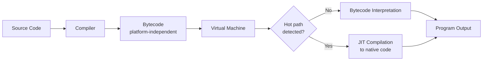

## Implementation Methods: Compilation, Interpretation, Hybrid

### Overview

A programming language's *specification* defines its syntax and semantics, but a language's *implementation* determines how source code actually becomes executable behavior. The three major implementation strategies — compilation, interpretation, and hybrid approaches — represent different trade-offs between translation time, execution speed, portability, and runtime flexibility. Critically, "compiled" and "interpreted" describe properties of an *implementation*, not inherently of a language itself, since most languages have been implemented using multiple strategies. [Inference — this framing is standard in language-implementation literature, though colloquial usage often labels languages as "compiled" or "interpreted" based on their dominant/reference implementation.]

**Key Points**

- Compilation translates source code into another form (typically machine code) ahead of execution.
- Interpretation executes source code (or a representation of it) directly, without a separate ahead-of-time translation phase producing standalone machine code.
- Hybrid approaches combine both, most commonly via an intermediate bytecode representation executed by a virtual machine, often augmented with just-in-time (JIT) compilation.

---

### Compilation

Compilation translates source code written in a high-level language into a lower-level target language — typically native machine code for a specific instruction set architecture (ISA) — before the program is run.

#### Core Characteristics

- **Ahead-of-time (AOT) translation**: The entire program is analyzed and translated before execution begins.
- **Direct hardware execution**: The output is typically native machine code that the CPU executes directly, without an intervening runtime layer for basic instruction dispatch.
- **Static analysis**: Compilers can perform whole-program (or whole-module) analysis, enabling aggressive optimization, since the full source is available before execution.

#### Compilation Pipeline


#### Example

```c
#include <stdio.h>
int main() {
    int sum = 0;
    for (int i = 1; i <= 5; i++) sum += i;
    printf("%d\n", sum);
    return 0;
}
```

Compiling with `gcc program.c -o program` produces a standalone binary (`program`) containing x86-64 (or other target ISA) machine instructions. Running `./program` executes those instructions directly on the CPU, with no C source or compiler present at runtime.

#### Optimization Opportunities

Because compilers see the full program (or translation unit) before execution, they can apply optimizations such as:

- **Constant folding**: Replacing `2 + 3` with `5` at compile time.
- **Dead code elimination**: Removing code whose results are never used.
- **Inlining**: Replacing a function call with the function's body to avoid call overhead.
- **Loop unrolling**: Reducing loop-control overhead by duplicating loop bodies.
- **Register allocation**: Assigning frequently used variables to CPU registers rather than memory.

#### Trade-offs

- *Advantages*: Typically faster execution since no translation overhead occurs at runtime; enables aggressive whole-program optimization; does not require the source language's toolchain to be present on the end user's machine.
- *Disadvantages*: Slower development iteration, since each change requires a full (or partial) recompilation step before testing; produces platform-specific binaries, requiring recompilation (or cross-compilation) for each target architecture/OS; compile times can be substantial for large codebases. [Inference — the magnitude of compile-time cost varies enormously by language, compiler design, and codebase size, so no universal figure applies.]

---

### Interpretation

Interpretation executes source code (or a parsed representation of it) directly, translating and running program logic in a single continuous process rather than emitting a separate standalone executable.

#### Core Characteristics

- **No standalone native binary produced**: The interpreter itself is the program that runs; it reads and executes the target program's instructions.
- **Line-by-line or tree-walking execution**: Simpler interpreters evaluate an abstract syntax tree (AST) directly, node by node.
- **Runtime translation overhead**: Each execution re-incurs some translation/interpretation cost, since there is no persistent compiled artifact from a prior run.

#### Interpretation Models

- **Tree-walking interpreters**: Directly traverse and evaluate an AST. Conceptually simple but generally the slowest interpretation strategy, since the same tree nodes are re-analyzed on every execution/loop iteration.
- **Bytecode interpreters**: Source is first compiled to a compact intermediate instruction set (bytecode), which a virtual machine then interprets. This is faster than tree-walking because bytecode is a flatter, more machine-friendly representation. (This overlaps substantially with the "hybrid" category below.)

#### Example

```python
sum_val = 0
for i in range(1, 6):
    sum_val += i
print(sum_val)
```

When executed via `python program.py`, the CPython interpreter parses the source, compiles it to bytecode internally, and then interprets that bytecode — all as part of a single `python` process invocation. No separate machine-code executable is produced for the user.

#### Trade-offs

- *Advantages*: Faster development cycles, since code can be run immediately without a separate build step; naturally supports interactive REPLs (Read-Eval-Print Loops) for exploratory programming; source code (or bytecode) is generally portable across platforms wherever a compatible interpreter/runtime exists.
- *Disadvantages*: Generally slower execution than compiled native code, since translation work is repeated or performed at runtime rather than once ahead of time; the interpreter/runtime must be present on the machine running the program; some classes of errors (e.g., type errors, undefined variables) that a static compiler would catch before execution may only surface when the relevant code path actually runs. [Inference — the performance gap between interpreted and compiled execution varies widely depending on interpreter sophistication, workload, and whether JIT techniques are involved, so specific multiples should not be treated as universal.]

---

### Hybrid Approaches

Hybrid implementations combine compilation and interpretation, most commonly by compiling source code to an intermediate, platform-independent **bytecode**, which is then executed by a **virtual machine (VM)**. Many hybrid systems further apply **just-in-time (JIT) compilation** to convert hot (frequently executed) bytecode paths into native machine code during execution.

#### Bytecode + Virtual Machine Model



#### Core Characteristics

- **Platform-independent intermediate code**: Bytecode is not tied to a specific CPU architecture; only the VM implementation needs to be ported to new platforms ("write once, run anywhere").
- **Just-in-time (JIT) compilation**: The VM monitors execution and compiles frequently executed code paths ("hot spots") to native machine code at runtime, combining interpretation's flexibility with compiled code's speed for hot paths.
- **Adaptive optimization**: Some JIT compilers use runtime profiling data (actual observed types, branch behavior) to apply optimizations a static AOT compiler could not know were valid in advance — and can *deoptimize* (fall back to interpretation) if runtime assumptions are later violated.

#### Example: Java

```java
public class Sum {
    public static void main(String[] args) {
        int sum = 0;
        for (int i = 1; i <= 5; i++) sum += i;
        System.out.println(sum);
    }
}
```

1. `javac Sum.java` compiles the source to `Sum.class`, containing JVM bytecode.
2. `java Sum` launches the Java Virtual Machine (JVM), which initially interprets the bytecode.
3. If the JVM's JIT compiler (e.g., HotSpot's C1/C2 compilers) detects that a method is executed frequently, it compiles that method to native machine code, replacing the interpreted version for subsequent calls.

#### Example: JavaScript (V8)

Modern JavaScript engines such as V8 (used in Chrome and Node.js) similarly parse source to an intermediate representation, initially interpret it (via an interpreter such as Ignition), and use a JIT compiler (such as TurboFan) to optimize frequently executed functions based on observed runtime type information. [Inference — exact internal pipeline stages and component names are implementation details specific to V8's version history and may change across releases, so this describes the general architecture rather than a fixed specification.]

#### Trade-offs

- *Advantages*: Combines cross-platform portability (bytecode runs anywhere the VM is available) with near-native performance for hot code paths; adaptive/profile-guided optimization can outperform static AOT compilation in some workloads since it uses actual runtime behavior rather than static estimates.
- *Disadvantages*: Startup time can be slower than AOT-compiled native code, since initial execution may run in interpreted mode before JIT compilation "warms up"; VM/runtime must be present on the target machine (though some hybrid systems support AOT-compiling bytecode to native code as an alternative deployment mode); added implementation complexity in the runtime itself (garbage collector, JIT compiler, deoptimization logic). [Unverified — specific startup-time or throughput comparisons depend heavily on the specific VM, JIT tier configuration, and workload, so no fixed quantitative claim is made here.]

---

### Comparative Summary

| Aspect | Compilation | Interpretation | Hybrid (Bytecode + JIT) |
| --- | --- | --- | --- |
| Translation timing | Entirely ahead-of-time | At/during execution | Ahead-of-time to bytecode; native code generated at runtime |
| Execution speed | Fastest (native code) | Slowest (repeated translation) | Near-native for hot paths after warm-up |
| Portability | Low (per-target binaries) | High (source/runtime portable) | High (bytecode portable; VM ported per platform) |
| Startup latency | Low (already native) | Low to moderate | Can be higher (interpretation + JIT warm-up) |
| Development iteration | Slower (rebuild required) | Fast (run immediately) | Fast (bytecode compilation is typically quick) |
| Representative systems | GCC/Clang (C/C++), Rust (rustc) | Original Perl/awk-style interpreters, some Ruby (MRI) execution | JVM (Java, Kotlin), CLR (.NET), V8 (JavaScript), CPython+PyPy |

### Implementation Strategy Landscape (svg_diagram)

<svg xmlns="http://www.w3.org/2000/svg" viewBox="0 0 760 380">
<text x="380" y="28" text-anchor="middle" font-size="18" font-weight="bold" fill="#1a1a1a">Implementation Strategy Landscape (svg_diagram)</text>
<line x1="60" y1="200" x2="700" y2="200" stroke="#888" stroke-width="2" />
<text x="60" y="225" font-size="12" fill="#555">Slower dev cycle</text>
<text x="620" y="225" font-size="12" fill="#555">Faster dev cycle</text>
<text x="60" y="180" font-size="12" fill="#555">Faster execution</text>
<text x="620" y="180" font-size="12" fill="#555">Slower execution*</text>
<circle cx="130" cy="200" r="55" fill="#4a90d9" fill-opacity="0.3" stroke="#4a90d9" stroke-width="2" />
<text x="130" y="195" text-anchor="middle" font-size="13" font-weight="bold" fill="#1a1a1a">Compilation</text>
<text x="130" y="212" text-anchor="middle" font-size="11" fill="#333">C, C++, Rust</text>
<circle cx="380" cy="200" r="65" fill="#5cb85c" fill-opacity="0.3" stroke="#5cb85c" stroke-width="2" />
<text x="380" y="195" text-anchor="middle" font-size="13" font-weight="bold" fill="#1a1a1a">Hybrid (Bytecode+JIT)</text>
<text x="380" y="212" text-anchor="middle" font-size="11" fill="#333">Java, C#, JavaScript</text>
<circle cx="630" cy="200" r="55" fill="#e07b39" fill-opacity="0.3" stroke="#e07b39" stroke-width="2" />
<text x="630" y="195" text-anchor="middle" font-size="13" font-weight="bold" fill="#1a1a1a">Interpretation</text>
<text x="630" y="212" text-anchor="middle" font-size="11" fill="#333">Tree-walkers, shells</text>

<text x="380" y="330" text-anchor="middle" font-size="11" fill="#555" font-style="italic">*Relative to native compiled code; varies by JIT maturity and workload</text>

</svg>

### Why Languages Are Not Inherently "Compiled" or "Interpreted"

The same language can have multiple implementations occupying different points on this spectrum:

- **Python**: CPython (bytecode-interpreted), PyPy (bytecode + JIT), Cython/Nuitka (ahead-of-time compiled to C/native code).
- **JavaScript**: V8 and other modern engines (bytecode + JIT), historically simpler tree-walking interpreters in early browsers.
- **C**: Almost universally compiled (GCC, Clang, MSVC), but interpreters for C also exist (e.g., for scripting/debugging use cases). [Inference — such C interpreters are comparatively niche relative to compiled C toolchains, so this reflects common practice rather than a language restriction.]

This is why implementation strategy is more accurately described as a property of a specific *toolchain/runtime*, not an immutable property of the language specification itself.

### Related Topics

- Just-in-time (JIT) compilation internals: tiered compilation, profile-guided optimization, deoptimization
- Ahead-of-time (AOT) compilation for VM-based languages (e.g., GraalVM native-image, .NET Native)
- Abstract syntax trees (AST) and intermediate representations (IR) in compiler design
- Garbage collection strategies and their interaction with runtime/VM design
- Cross-compilation and target-architecture portability
- Bootstrapping compilers (compilers written in the language they compile)