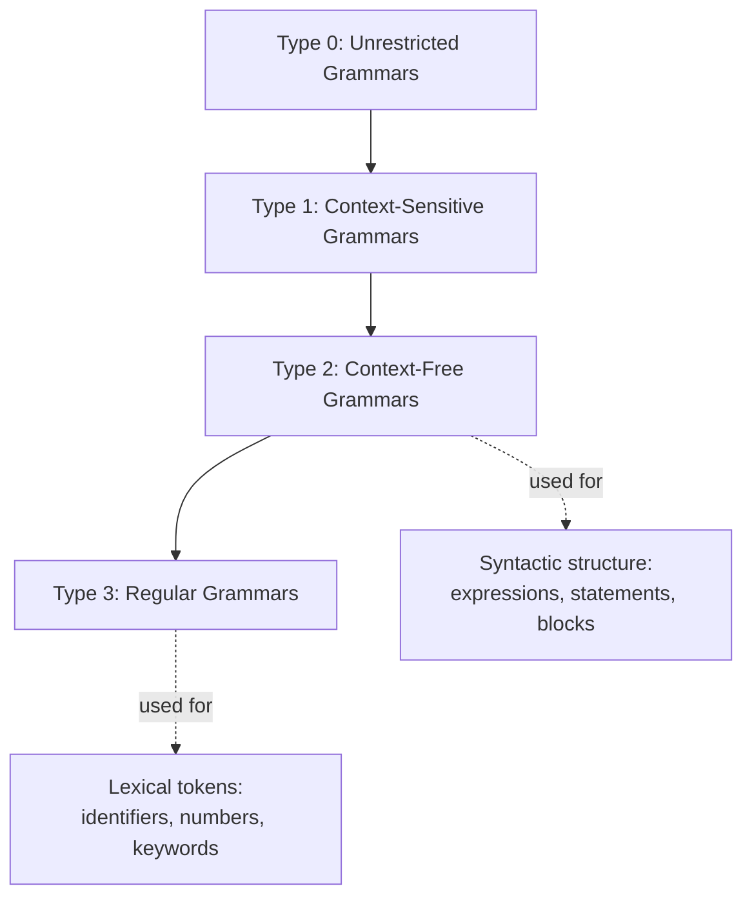
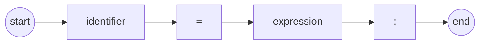

## The General Problem of Describing Syntax

### Overview

Before a programming language can be implemented, its **syntax** — the rules governing which sequences of symbols form valid programs — must be precisely and unambiguously defined. Describing syntax is a foundational problem in language design because informal, natural-language descriptions ("a statement can be an if, a loop, or an assignment") are imprecise and cannot be mechanically processed by a compiler or interpreter. Formal syntax description provides the basis for building lexical analyzers, parsers, and ultimately for reasoning about a language's structure independent of any single implementation.

**Key Points**

- Syntax concerns the *form* of valid programs; semantics concerns their *meaning*. The two are distinct but related problems.
- A **language**, formally, is a (possibly infinite) set of valid strings (sentences) over some alphabet.
- Formal grammars provide a finite, precise mechanism for specifying a potentially infinite language.

---

### Syntax vs. Semantics

- **Syntax**: The structure/form of legal expressions, statements, and programs — essentially, "what does valid code look like?"
- **Semantics**: The meaning of syntactically valid constructs — "what does this code actually do when executed?"

A string can be syntactically valid but semantically meaningless (or vice versa be semantically intended but syntactically malformed). For example:

```c
int x = "hello";
```

This is syntactically valid in many C-like grammars (an assignment of an expression to a declared variable) but may be semantically invalid depending on the language's type system, since a string literal cannot be implicitly converted to an `int`. Distinguishing these two concerns allows language designers to specify structure and meaning using separate, specialized formal tools.

---

### Formal Language Foundations

#### Alphabets, Strings, and Languages

- An **alphabet** ($\Sigma$) is a finite set of symbols (e.g., ASCII characters, or in a compiler's later stages, the set of valid tokens).
- A **string** is a finite sequence of symbols drawn from $\Sigma$.
- A **language** $L$ is a subset of $\Sigma^*$ (the set of all possible finite strings over $\Sigma$), i.e., $L \subseteq \Sigma^*$.

Since $\Sigma^*$ is generally infinite, and $L$ may also be infinite (a programming language imposes no fixed upper bound on program length), a language cannot be defined by simply listing its members. This is the central motivation for **generative grammars**: a finite set of rules that can generate (or recognize) every string belonging to $L$, and no others.

#### The Chomsky Hierarchy

Linguist Noam Chomsky classified formal grammars into four nested categories of increasing expressive power, commonly used as a reference framework in language design and compiler theory:

| Type | Grammar Class | Recognized By | Typical Use in Language Design |
| --- | --- | --- | --- |
| Type 3 | Regular grammars | Finite automata | Lexical structure (tokens, identifiers, literals) |
| Type 2 | Context-free grammars (CFG) | Pushdown automata | Syntactic structure (expressions, statements, nesting) |
| Type 1 | Context-sensitive grammars | Linear-bounded automata | Rarely used directly; some semantic-adjacent constraints |
| Type 0 | Unrestricted (recursive enumerable) grammars | Turing machines | Theoretical upper bound; not practical for language description |

Each level in the hierarchy is strictly more expressive than the one above it, meaning every regular language is context-free, every context-free language is context-sensitive, and so on. Programming language syntax is predominantly described using **context-free grammars**, since they strike a practical balance: expressive enough to capture nested and recursive structures (like matched parentheses or nested blocks) while remaining efficiently parsable.



---

### Why Regular Grammars Are Insufficient for Full Syntax

Regular grammars (and the finite automata that recognize them) cannot express **unbounded nested structures**, such as matching parentheses or balanced `begin`/`end` blocks, because finite automata have no memory mechanism to count arbitrarily deep nesting.

Consider the language $L = \{a^n b^n \mid n \geq 0\}$ — strings of $n$ `a`s followed by exactly $n$ `b`s (analogous to `n` open parentheses followed by `n` close parentheses):

$$L = \{\, \varepsilon,\ ab,\ aabb,\ aaabbb,\ \dots \,\}$$

This language is **not regular** — it can be proven so using the pumping lemma for regular languages, since any finite automaton attempting to recognize it would need unbounded memory to track how many `a`s it has seen before verifying an equal count of `b`s. However, $L$ *is* context-free, since a pushdown automaton's stack can track nesting depth. This is precisely why real language grammars use context-free rules for expressions and block structures, reserving regular grammars for simpler, non-nested lexical tokens.

---

### Context-Free Grammars (CFGs)

A context-free grammar is formally a 4-tuple $G = (N, \Sigma, P, S)$ where:

- $N$ is a finite set of **non-terminal** symbols (syntactic categories, e.g., `<expr>`, `<statement>`)
- $\Sigma$ is a finite set of **terminal** symbols (actual tokens/lexemes, e.g., `+`, `if`, identifiers)
- $P$ is a finite set of **production rules**, each of the form $A \rightarrow \alpha$ where $A \in N$ and $\alpha \in (N \cup \Sigma)^*$
- $S \in N$ is the **start symbol**

The grammar is "context-free" because each production rule replaces a single non-terminal regardless of the surrounding symbols — the left-hand side is always exactly one non-terminal, never a string requiring surrounding context to trigger the rule.

#### Backus-Naur Form (BNF) and Extended BNF (EBNF)

**BNF**, introduced by John Backus and Peter Naur for the Algol 60 report, is the classical concrete notation for context-free grammars used in programming language specification. Non-terminals are conventionally written in angle brackets, and `::=` means "is defined as."



```
<assignment>  ::= <identifier> = <expression> ;
<expression>  ::= <expression> + <term>
| <expression> - <term>
| <term>
<term>        ::= <term> * <factor>
| <term> / <factor>
| <factor>
<factor>      ::= ( <expression> )
| <identifier>
| <number>
```

**EBNF** extends BNF with additional notational conveniences that do not increase expressive power but improve readability: `{...}` for zero-or-more repetition, `[...]` for optional elements, and `|` for alternation. For example:



```
<if_statement> ::= "if" "(" <expression> ")" <statement> [ "else" <statement> ]
<block>        ::= "{" { <statement> } "}"
```

The `{ <statement> }` notation directly expresses "zero or more statements" without requiring an auxiliary recursive non-terminal, which pure BNF would require.

---

### Derivations and Parse Trees

A **derivation** is the process of applying production rules, starting from the start symbol $S$, to generate a string of terminals. Each derivation corresponds to a **parse tree** (also called a syntax tree), whose internal nodes are non-terminals and whose leaves, read left to right, form the derived string.

#### Example Derivation

Using the grammar above, deriving `a = b + c ;`:



```
<assignment> 
  => <identifier> = <expression> ;
  => a = <expression> ;
  => a = <expression> + <term> ;
  => a = <term> + <term> ;
  => a = <factor> + <term> ;
  => a = b + <term> ;
  => a = b + <factor> ;
  => a = b + c ;
```

#### Corresponding Parse Tree (svg_diagram)

<svg xmlns="http://www.w3.org/2000/svg" viewBox="0 0 700 420">
<text x="350" y="28" text-anchor="middle" font-size="18" font-weight="bold" fill="#1a1a1a">Parse Tree for "a = b + c ;" (svg_diagram)</text>
<circle cx="350" cy="70" r="26" fill="#4a90d9" fill-opacity="0.3" stroke="#4a90d9" stroke-width="2" />
<text x="350" y="75" text-anchor="middle" font-size="12" fill="#1a1a1a">assignment</text>
<line x1="350" y1="96" x2="180" y2="150" stroke="#888" stroke-width="1.5" />
<line x1="350" y1="96" x2="300" y2="150" stroke="#888" stroke-width="1.5" />
<line x1="350" y1="96" x2="430" y2="150" stroke="#888" stroke-width="1.5" />
<line x1="350" y1="96" x2="560" y2="150" stroke="#888" stroke-width="1.5" />
<rect x="150" y="150" width="60" height="30" fill="#f5f5f5" stroke="#999" />
<text x="180" y="170" text-anchor="middle" font-size="12">identifier</text>
<rect x="270" y="150" width="60" height="30" fill="#f5f5f5" stroke="#999" />
<text x="300" y="170" text-anchor="middle" font-size="12">"="</text>
<circle cx="430" cy="165" r="30" fill="#5cb85c" fill-opacity="0.3" stroke="#5cb85c" stroke-width="2" />
<text x="430" y="170" text-anchor="middle" font-size="12" fill="#1a1a1a">expression</text>
<rect x="530" y="150" width="60" height="30" fill="#f5f5f5" stroke="#999" />
<text x="560" y="170" text-anchor="middle" font-size="12">";"</text>
<rect x="130" y="200" width="60" height="30" fill="#fce8b2" stroke="#c9971e" />
<text x="160" y="220" text-anchor="middle" font-size="12">a</text>
<line x1="180" y1="180" x2="160" y2="200" stroke="#888" stroke-width="1.5" />
<line x1="430" y1="195" x2="370" y2="240" stroke="#888" stroke-width="1.5" />
<line x1="430" y1="195" x2="440" y2="240" stroke="#888" stroke-width="1.5" />
<line x1="430" y1="195" x2="510" y2="240" stroke="#888" stroke-width="1.5" />
<circle cx="370" cy="255" r="26" fill="#5cb85c" fill-opacity="0.2" stroke="#5cb85c" stroke-width="1.5" />
<text x="370" y="260" text-anchor="middle" font-size="11" fill="#1a1a1a">term</text>
<rect x="415" y="240" width="50" height="30" fill="#f5f5f5" stroke="#999" />
<text x="440" y="260" text-anchor="middle" font-size="12">"+"</text>
<circle cx="510" cy="255" r="26" fill="#e07b39" fill-opacity="0.2" stroke="#e07b39" stroke-width="1.5" />
<text x="510" y="260" text-anchor="middle" font-size="11" fill="#1a1a1a">term</text>
<circle cx="370" cy="310" r="26" fill="#e07b39" fill-opacity="0.2" stroke="#e07b39" stroke-width="1.5" />
<text x="370" y="315" text-anchor="middle" font-size="11" fill="#1a1a1a">factor</text>
<line x1="370" y1="281" x2="370" y2="284" stroke="#888" stroke-width="1.5" />
<rect x="340" y="345" width="60" height="30" fill="#fce8b2" stroke="#c9971e" />
<text x="370" y="365" text-anchor="middle" font-size="12">b</text>
<line x1="370" y1="336" x2="370" y2="345" stroke="#888" stroke-width="1.5" />
<circle cx="510" cy="310" r="26" fill="#e07b39" fill-opacity="0.2" stroke="#e07b39" stroke-width="1.5" />
<text x="510" y="315" text-anchor="middle" font-size="11" fill="#1a1a1a">factor</text>
<line x1="510" y1="281" x2="510" y2="284" stroke="#888" stroke-width="1.5" />
<rect x="480" y="345" width="60" height="30" fill="#fce8b2" stroke="#c9971e" />
<text x="510" y="365" text-anchor="middle" font-size="12">c</text>
<line x1="510" y1="336" x2="510" y2="345" stroke="#888" stroke-width="1.5" />
</svg>

---

### Ambiguity

A grammar is **ambiguous** if some string in its language has two or more distinct parse trees (equivalently, two or more distinct leftmost — or rightmost — derivations). Ambiguity is a serious problem for language design, because it means a syntactically valid program's structure — and therefore potentially its meaning — is not uniquely determined by the grammar alone.

#### Classic Example: The "Dangling Else" Problem



```
<if_statement> ::= "if" <expr> "then" <statement>
| "if" <expr> "then" <statement> "else" <statement>
```

Given: `if E1 then if E2 then S1 else S2`, it is ambiguous whether `else S2` attaches to the inner `if E2` or the outer `if E1`, since both derivations are grammatically valid under this rule. Most languages resolve this via a disambiguation convention (commonly: `else` binds to the nearest unmatched `if`), enforced either by a grammar rewrite (restructuring rules to eliminate the ambiguity) or by rule-based tie-breaking in the parser implementation, rather than in the base CFG itself.

#### Operator Precedence and Associativity Ambiguity

A naive grammar such as:



```
<expr> ::= <expr> + <expr> | <expr> * <expr> | <number>
```

is ambiguous, because `2 + 3 * 4` can be parsed as either $(2+3) \times 4$ or $2 + (3 \times 4)$, corresponding to different parse trees. This is resolved by rewriting the grammar into precedence-layered non-terminals (as shown in the `<expression>`/`<term>`/`<factor>` grammar above), which structurally encodes that multiplication binds more tightly than addition and enforces a consistent associativity (e.g., left-associative subtraction) through the recursive rule shape.

---

### Attribute Grammars: Bridging Syntax and Semantics

Pure context-free grammars describe *structure* but cannot express context-dependent constraints, such as "a variable must be declared before use" or "the types of both operands of `+` must be compatible." **Attribute grammars**, introduced by Donald Knuth, extend CFGs by associating **attributes** (values) with grammar symbols and **semantic rules** (or predicates) with each production, enabling static semantic checking to be layered on top of syntactic parsing.

- **Synthesized attributes**: Computed from a node's children (flow upward in the parse tree).
- **Inherited attributes**: Computed from a node's parent and/or siblings (flow downward/sideways).

For instance, a type-checking attribute grammar rule for `<expr> ::= <expr1> + <expr2>` might synthesize `<expr>.type` as valid only if `<expr1>.type` and `<expr2>.type` are compatible numeric types, propagating a type error attribute otherwise. [Inference — attribute grammars are a well-established formalism in compiler theory, but the extent to which any specific production compiler implementation uses formal attribute-grammar machinery (versus ad hoc semantic-analysis code) varies by implementation.]

---

### Syntax Diagrams (Railroad Diagrams)

An alternative, visual notation equivalent in expressive power to BNF for many practical purposes is the **syntax diagram** (or "railroad diagram"), which represents grammar rules as flowcharts that a valid string must be traceable through from start to end.



Syntax diagrams were historically used in language reference manuals (notably Pascal's) as a more approachable, visual alternative to raw BNF for human readers, while remaining formally equivalent to the underlying context-free rules. [Inference — their popularity has declined in modern language documentation relative to BNF/EBNF, though this is an observation about common practice rather than a strict rule.]

---

### Trade-offs in Syntax Description Choices

- *BNF/EBNF*: Precise, tool-friendly (directly usable by parser generators like Yacc/Bison, ANTLR), but can be visually dense for large grammars.
- *Syntax diagrams*: More approachable for human readers unfamiliar with formal grammar notation, but less directly machine-processable and more cumbersome to maintain for very large grammars.
- *Attribute grammars*: Enable formal specification of context-sensitive constraints beyond pure CFG power, but add notational and implementation complexity beyond basic syntax description. [Inference — the practical maintenance cost of full attribute-grammar formalism versus hand-written semantic-analysis code is implementation- and tooling-dependent.]

### Related Topics

- Lexical analysis and regular expressions for tokenization
- Parsing algorithms: top-down (recursive descent, LL) vs. bottom-up (LR, LALR) parsing
- Parser generator tools (Yacc/Bison, ANTLR, PEG-based parsers)
- Abstract syntax trees (AST) vs. concrete/parse trees
- Formal semantics: operational, denotational, and axiomatic approaches
- Static semantic analysis: scope resolution, type checking