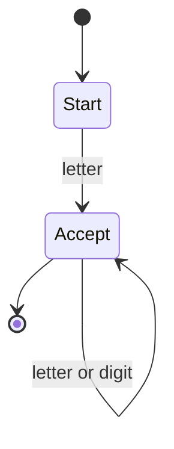
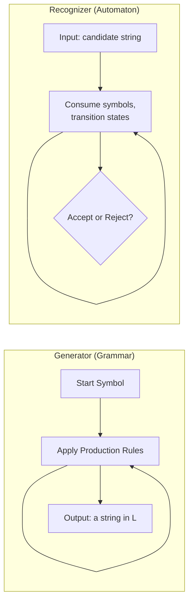
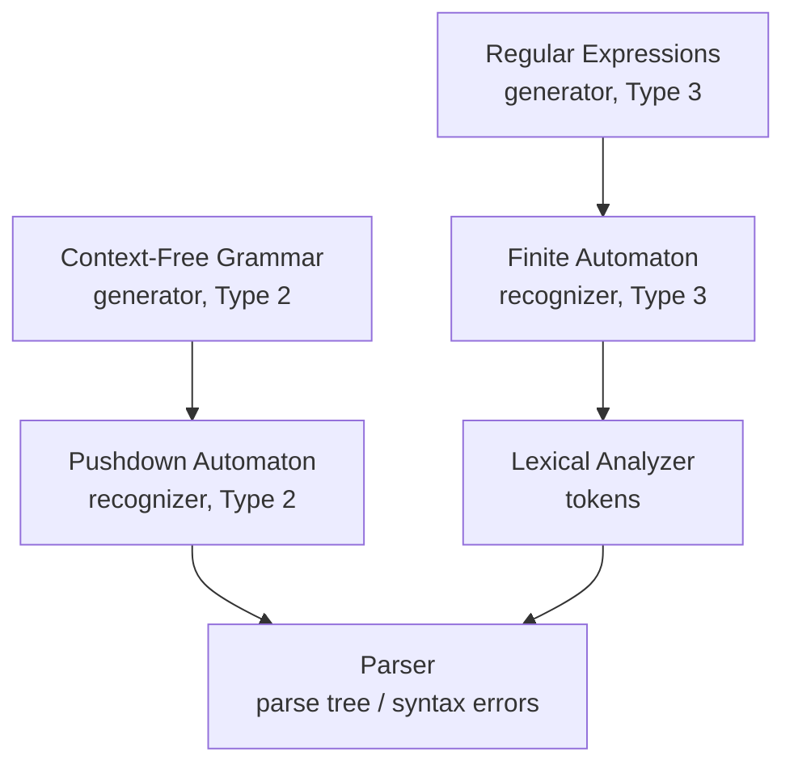

## Formal Languages and Language Generators Versus Recognizers

### Overview

A formal language can be characterized in two dual ways: through **generators**, which produce every valid string in the language via rewriting rules, and through **recognizers**, which accept a string as input and determine whether it belongs to the language. This generator/recognizer distinction underlies the entire theory connecting grammars to automata, and it directly maps onto the two halves of a language implementation: a grammar (generator) specifies what a language *is*, while a parser built from an automaton (recognizer) determines whether a *given* program conforms to it.

**Key Points**

- A **generator** (grammar) builds strings of the language from the start symbol outward via production rules.
- A **recognizer** (automaton) consumes an input string and decides membership in the language.
- For each class in the Chomsky hierarchy, there exists a computationally equivalent automaton class — this equivalence is a central theorem of formal language theory.
- Compilers use generators (grammars) to *specify* a language and recognizers (parsers, built from automata) to *implement* language processing.

---

### Formal Languages: A Recap

Recall that a **formal language** $L$ is a set of strings over a finite alphabet $\Sigma$, i.e., $L \subseteq \Sigma^*$. Because $\Sigma^*$ is generally infinite, $L$ cannot be defined by exhaustive enumeration; it must instead be defined **intensionally** — by a rule or procedure that characterizes membership. Generators and recognizers are the two complementary mechanisms for doing so.

$$L = \{ w \in \Sigma^* \mid P(w) \}$$

where $P(w)$ is some predicate or process determining membership — expressed either as generative rules (a grammar) or as an acceptance procedure (an automaton).

---

### Language Generators

A **generator** defines a language constructively: starting from a designated start symbol, it repeatedly applies production (rewriting) rules until only terminal symbols remain. The set of all strings derivable this way *is* the language.

#### Grammars as Generators

A grammar $G = (N, \Sigma, P, S)$ generates a language $L(G)$ defined as:

$$L(G) = \{ w \in \Sigma^* \mid S \Rightarrow^{*} w \}$$

where $S \Rightarrow^{*} w$ means "$w$ is derivable from the start symbol $S$ through zero or more applications of production rules in $P$."

#### Example: A Simple Generator

Consider the grammar for $L = \{a^n b^n \mid n \geq 0\}$:



```
S ::= a S b | ε
```

Generating a member of the language means repeatedly rewriting $S$:



```
S => a S b => a a S b b => a a ε b b = aabb
```

This process is inherently **constructive/productive**: it builds a string outward, symbol by symbol, without ever consuming an input. There is no notion of "checking" a pre-existing string in the pure generative process — the grammar *creates* valid strings.

#### Generators in Language Design

In programming language design, the grammar (typically expressed in BNF/EBNF, as previously covered) serves as the **authoritative generative specification** of what strings constitute valid programs. A language reference manual's grammar section is, formally, a generator: it does not describe an algorithm for checking programs, but rather characterizes the complete, precise set of strings the language permits.

---

### Language Recognizers

A **recognizer** takes the opposite approach: given a candidate string as input, it determines — via some computational procedure — whether that string belongs to the language, typically producing a binary accept/reject answer.

#### Automata as Recognizers

An automaton processes an input string symbol by symbol, transitioning between internal **states** according to a transition function, and accepts the string if it ends in a designated **accepting state**. Formally, for a deterministic finite automaton (DFA):

$$M = (Q, \Sigma, \delta, q_0, F)$$

where $Q$ is a finite set of states, $\Sigma$ is the alphabet, $\delta: Q \times \Sigma \rightarrow Q$ is the transition function, $q_0 \in Q$ is the start state, and $F \subseteq Q$ is the set of accepting states. The automaton **recognizes** (accepts) the language:

$$L(M) = \{ w \in \Sigma^* \mid \hat{\delta}(q_0, w) \in F \}$$

where $\hat{\delta}$ is the extended transition function applied over the full input string.

#### Example: A Simple Recognizer

A DFA recognizing identifiers matching the pattern "a letter, followed by zero or more letters or digits":



Given the input string `x1y`, the recognizer consumes `x` (transitioning `Start → Accept`), then `1` (staying in `Accept`), then `y` (staying in `Accept`), and since the automaton ends in the accepting state, it reports `x1y` as a valid member of the language. This is fundamentally a **consumptive/analytic** process: it takes a fully-formed string and reduces it to a yes/no verdict, rather than constructing new strings.

---

### Generators vs. Recognizers: A Duality



| Aspect | Generator (Grammar) | Recognizer (Automaton) |
| --- | --- | --- |
| Direction of process | Produces strings from a start symbol outward | Consumes a given string, symbol by symbol |
| Question answered | "What strings are in $L$?" | "Is this specific string $w$ in $L$?" |
| Formal object | Production rules $P$ | States $Q$ and transition function $\delta$ |
| Typical implementation role | Language specification (BNF/EBNF in a reference manual) | Lexical analyzer, parser |
| Output | A string (or, over all derivations, the entire language) | A boolean accept/reject decision (or a parse tree, for a parser) |

Despite this apparent difference in direction, generators and recognizers are **two views of the same underlying language** — a central result of formal language theory is that, for each level of the Chomsky hierarchy, generator and recognizer formalisms of matching power exist and are provably equivalent in the languages they can define/accept.

---

### The Equivalence Theorem

For each grammar class, there exists a corresponding automaton class such that the set of languages generated by grammars of that class is exactly the set of languages accepted by automata of the corresponding class:

| Chomsky Type | Generator (Grammar Class) | Equivalent Recognizer (Automaton Class) |
| --- | --- | --- |
| Type 3 | Regular grammars | Finite automata (DFA/NFA) |
| Type 2 | Context-free grammars (CFG) | Pushdown automata (PDA) |
| Type 1 | Context-sensitive grammars | Linear-bounded automata (LBA) |
| Type 0 | Unrestricted grammars | Turing machines |

This equivalence means that, in principle, any language describable by a regular grammar can also be recognized by *some* finite automaton, and vice versa — the two formalisms have identical expressive power at each hierarchy level, even though their operational character (generative vs. consumptive) differs substantially. [Inference — while this equivalence is a rigorously proven theorem of automata theory, the practical *construction* of an automaton from an arbitrary grammar of a given class (or vice versa) can require nontrivial algorithmic transformation, so equivalence in expressive power does not imply the two representations are equally convenient to work with directly.]

---

### Practical Implications for Language Implementation

#### Lexical Analysis: Regular Generators, Finite Recognizers

Programming language **tokens** (identifiers, keywords, numeric literals, operators) are typically specified using regular expressions — a compact, generator-oriented notation for regular languages — and then implemented via a **lexical analyzer** built from a finite automaton, the corresponding recognizer.



```
identifier ::= letter (letter | digit)*
```

This regular expression *generates* all valid identifier strings; the lexer compiles it (via standard regex-to-NFA-to-DFA construction algorithms) into a finite automaton that *recognizes* whether a given character sequence in the source code matches a valid identifier.

#### Syntax Analysis: Context-Free Generators, Pushdown Recognizers

Similarly, a language's context-free grammar generates the set of syntactically valid programs, while a **parser** — built conceptually on pushdown automaton principles (even when implemented via table-driven or recursive-descent techniques rather than an explicit PDA) — serves as the recognizer that determines whether a given token stream conforms to that grammar, typically also producing a parse tree as a byproduct.



#### Why This Duality Matters in Compiler Construction

Compiler front-ends are structured explicitly around this generator/recognizer split: language designers write the language specification as a **generator** (BNF grammar, regex rules) because it is the natural, declarative way to define "what counts as valid," while tool builders implement **recognizers** (via parser generator tools such as Yacc/Bison, ANTLR, or hand-written recursive-descent parsers) because recognition — not generation — is the operation actually needed at compile time, when a specific program must be checked against the language's rules. [Inference — this framing describes the standard rationale in compiler-construction pedagogy; specific tool architectures may blend or automate parts of this pipeline differently.]

---

### Beyond Membership: Recognizers That Also Parse

A pure recognizer only answers a yes/no membership question. In practice, compiler recognizers (parsers) are typically extended to also produce a **parse tree** or **abstract syntax tree (AST)** as a byproduct of successful recognition, since simply knowing "this program is syntactically valid" is insufficient — the compiler also needs the program's derived structure to proceed to semantic analysis and code generation. This extended recognizer, which both accepts/rejects and constructs a structural representation, is sometimes distinguished from a "bare" recognizer by calling it a **parser** specifically, though the underlying automaton-theoretic recognition mechanism is the same. [Inference — terminology distinguishing "recognizer" from "parser" in this stricter sense varies somewhat across textbooks; some treat the terms as broadly interchangeable, while others reserve "recognizer" for the pure accept/reject case.]

### Related Topics

- Regular expressions and finite automata construction (Thompson's construction, subset construction)
- Pushdown automata and their relationship to context-free parsing
- Top-down vs. bottom-up parsing algorithms (recursive descent, LL, LR, LALR)
- The pumping lemma and proofs of non-regularity/non-context-freeness
- Turing machines and the limits of decidability in language recognition
- Parser generator tools (Yacc/Bison, ANTLR) and their grammar-to-recognizer compilation process