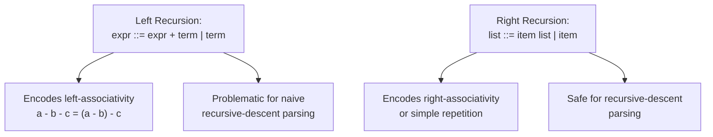

## Backus-Naur Form Fundamentals

### Overview

**Backus-Naur Form (BNF)** is a formal notation for expressing context-free grammars, developed by John Backus and later refined by Peter Naur to specify the syntax of Algol 60. BNF became the foundational metalanguage for describing programming language syntax, and its influence persists in virtually every modern language reference manual, whether used directly or through one of its extended variants (EBNF, ABNF). Understanding BNF's core mechanics — non-terminals, terminals, productions, and recursion — is prerequisite to reading, writing, or reasoning about any formal language specification.

**Key Points**

- BNF is a concrete syntactic notation for context-free grammars (Type 2 in the Chomsky hierarchy).
- Every BNF grammar consists of **terminals**, **non-terminals**, **production rules**, and a **start symbol**.
- Recursion within production rules is the mechanism that gives BNF grammars the ability to describe unbounded, nested structures.

---

### Historical Origin

BNF originated with John Backus's notation for describing the syntax of the IAL/Algol language, and was subsequently used (with notational refinements attributed to Peter Naur) in the official Algol 60 report. This report is widely regarded as the first rigorous, formal syntactic specification of a programming language, marking a shift away from purely prose-based language descriptions toward precise, machine-processable grammars. [Inference — the exact division of credit between Backus's original notation and Naur's specific refinements is a matter of some historical nuance, though both names are consistently attached to the notation in standard references.]

---

### Core Components of BNF

#### Terminals

**Terminal symbols** are the actual, literal tokens that appear in valid programs — they cannot be further expanded or rewritten. Terminals include keywords, operators, punctuation, and literal values.

Examples: `if`, `+`, `;`, `(`, `)`

#### Non-terminals

**Non-terminal symbols** represent syntactic categories or abstractions — placeholders that stand for a class of constructs and are defined in terms of other non-terminals and/or terminals via production rules. In classical BNF notation, non-terminals are conventionally enclosed in angle brackets.

Examples: `<statement>`, `<expression>`, `<identifier>`

#### Production Rules

A **production rule** defines how a non-terminal may be rewritten (expanded) in terms of a sequence of terminals and/or non-terminals. The general form is:



```
<non-terminal> ::= <replacement-sequence>
```

The symbol `::=` is read as "is defined as" or "can be replaced by." Multiple alternative expansions for the same non-terminal are separated by the vertical bar `|`, meaning "or":



```
<boolean> ::= true | false
```

This single rule states that `<boolean>` can be rewritten as either the terminal `true` or the terminal `false`.

#### The Start Symbol

Every BNF grammar designates one non-terminal as the **start symbol** — the root from which all valid derivations begin. It typically represents the highest-level syntactic construct of the language, such as `<program>`.

---

### A Complete Minimal Example

Consider a BNF grammar for simple arithmetic assignment statements:



```
<program>     ::= <statement-list>
<statement-list> ::= <statement>
| <statement> <statement-list>
<statement>   ::= <identifier> = <expression> ;
<expression>  ::= <expression> + <term>
| <expression> - <term>
| <term>
<term>        ::= <term> * <factor>
| <term> / <factor>
| <factor>
<factor>      ::= ( <expression> )
| <identifier>
| <number>
<identifier>  ::= a | b | c | x | y | z
<number>      ::= 0 | 1 | 2 | 3 | 4 | 5 | 6 | 7 | 8 | 9
```

This grammar defines:

- `<program>` (the start symbol) as a list of statements.
- `<statement-list>` as recursively either one statement, or one statement followed by another (possibly empty-terminating) statement list.
- `<statement>` as an assignment: identifier, `=`, expression, semicolon.
- `<expression>`, `<term>`, and `<factor>` as a precedence-layered hierarchy encoding standard operator precedence (multiplication/division bind tighter than addition/subtraction).
- `<identifier>` and `<number>` as terminal alternatives (a simplified finite set, for illustration; a real grammar would typically delegate these to lexical/regular rules rather than enumerate them).

---

### Recursion in BNF

Recursion is the essential mechanism by which BNF grammars express **unbounded** structure — nested expressions, arbitrarily long statement lists, deeply nested blocks — using only a *finite* set of production rules.

#### Left Recursion

A rule is **left-recursive** if the non-terminal being defined appears as the leftmost symbol of its own replacement:



```
<expression> ::= <expression> + <term> | <term>
```

Left recursion naturally encodes **left-associativity**: `a - b - c` parses as $(a - b) - c$, matching the conventional mathematical reading of subtraction. However, left recursion is problematic for certain parsing strategies — a naive recursive-descent parser implementing this rule directly would recurse infinitely without consuming any input, since expanding `<expression>` immediately calls the `<expression>`-handling function again before any terminal is matched. [Inference — this is a well-established practical parsing concern; the specific severity depends on the parsing algorithm chosen, since bottom-up parsers such as LR parsers generally handle left recursion without difficulty, unlike naive top-down recursive-descent parsers.]

#### Right Recursion

A rule is **right-recursive** if the non-terminal appears as the rightmost symbol:



```
<statement-list> ::= <statement> <statement-list> | <statement>
```

Right recursion is safe for straightforward recursive-descent implementation (since a terminal or a distinct non-terminal is consumed before the recursive call), but it naturally encodes **right-associativity** when used for operators — which is why right recursion is typically reserved for genuinely right-associative constructs (such as exponentiation in some languages, or nested statement/list structures where associativity is not semantically meaningful) rather than for left-associative arithmetic operators.



#### Recursion and Unbounded Nesting

Recursion is what allows a finite grammar to generate the infinite language of, for example, arbitrarily deeply parenthesized expressions:



```
<factor> ::= ( <expression> ) | <identifier> | <number>
```

Since `<factor>` can expand to `( <expression> )`, and `<expression>` can eventually expand back down to `<factor>`, this **mutual recursion** between `<expression>` and `<factor>` permits derivations like `((((x))))` with any depth of nesting — a capability that, as established previously, exceeds what a regular (Type 3) grammar can express, and is a defining strength of context-free (Type 2) grammars.

---

### Derivation Order: Leftmost and Rightmost

When more than one non-terminal appears in a working string during derivation, a convention is needed to decide which to expand next. Two standard conventions exist:

- **Leftmost derivation**: At each step, the leftmost non-terminal in the current string is expanded first.
- **Rightmost derivation**: At each step, the rightmost non-terminal is expanded first.

Both conventions, applied consistently, can derive the same string and correspond to the same parse tree for an unambiguous grammar — they represent different *orders* of construction, not different *results*. Leftmost derivations correspond naturally to top-down (recursive-descent) parsing strategies, while rightmost derivations (in reverse) correspond naturally to bottom-up (LR) parsing strategies. [Inference — this correspondence between derivation order and parsing strategy is a standard pedagogical framing in compiler theory, describing typical practice rather than a strict logical necessity.]

---

### BNF's Expressive Limits and Verbosity

Pure BNF, while fully sufficient to describe any context-free language, can become notationally verbose for common patterns:

- **Optional elements** require an explicit alternative with an empty (epsilon, $\varepsilon$) production:



```
  <else-part> ::= else <statement> | ε
```

- **Repetition** (zero or more, one or more) requires auxiliary recursive non-terminals, as seen in `<statement-list>` above, rather than a single compact operator.

This verbosity was the primary motivation for **Extended BNF (EBNF)**, which introduces notational shorthand — `{ }` for repetition, `[ ]` for optionality, and grouping parentheses — without increasing the underlying expressive power beyond what plain BNF (and, transitively, context-free grammars) can already describe. The same `<else-part>` rule in EBNF style:



```
<if-statement> ::= "if" <expression> <statement> [ "else" <statement> ]
```

expresses optionality directly, with no auxiliary epsilon-producing non-terminal required.

---

### BNF's Role in Language Specification

BNF (and its descendants) serves several distinct practical purposes in language design and implementation:

- **Authoritative specification**: The grammar section of a language reference manual (e.g., the Algol 60 report, the ISO C standard's syntax summary, the Java Language Specification's grammar) defines precisely which token sequences are syntactically legal.
- **Parser generator input**: Tools such as Yacc/Bison and ANTLR accept grammars in BNF-like notations (often extended with semantic action hooks) and mechanically generate parser code, directly connecting the generative specification to a working recognizer implementation.
- **Communication tool**: BNF provides an unambiguous, shared notation for language designers, implementers, and readers of documentation to discuss syntax precisely, avoiding the ambiguity of prose descriptions.

### Related Topics

- Extended BNF (EBNF) and Augmented BNF (ABNF) notational conventions
- Ambiguity in context-free grammars and disambiguation strategies
- Parse trees and derivation strategies (leftmost, rightmost)
- Left-recursion elimination algorithms for recursive-descent parser construction
- Parser generator tools (Yacc/Bison, ANTLR) and grammar-to-parser compilation
- Operator precedence and associativity encoding in grammar design