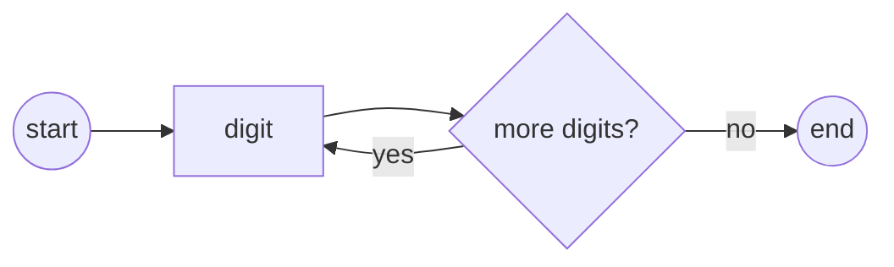

## Extended BNF Notation

### Overview

Extended Backus-Naur Form (EBNF) is a family of notations used to formally express context-free grammars — the syntax rules that define which strings of symbols form valid programs in a language. EBNF extends the original Backus-Naur Form (BNF) introduced by John Backus and Peter Naur for describing ALGOL 60, adding notational conveniences (repetition, optionality, grouping) that make grammars shorter and easier to read without changing their expressive power.

### Relationship to BNF

**Key Points**
- BNF and EBNF are equivalent in expressive power: both describe exactly the class of context-free languages.
- EBNF adds syntactic sugar — repetition operators, optional-element brackets, grouping parentheses — that let a single EBNF rule replace several BNF rules.
- Any EBNF grammar can be mechanically rewritten as an equivalent BNF grammar, and vice versa.

In classic BNF, a rule takes the form:

```
<symbol> ::= expression
```

Repetition in BNF must be expressed through recursion. For example, a list of one or more digits in BNF:

```
<digit-list> ::= <digit> | <digit> <digit-list>
```

EBNF collapses this into a single line using a repetition operator, removing the need for an auxiliary recursive rule.

### Core Notation Elements

There is no single universal EBNF standard — ISO/IEC 14977 defines one formal variant, and many languages (e.g., the Python and C# reference grammars) use their own house dialects. However, most dialects share a common core of symbols and conventions.

**Terminals and Nonterminals**
- A **terminal** is a literal symbol that appears in the actual source text (keywords, punctuation, operators). Terminals are usually written in quotes: `"if"`, `"("`, `";"`.
- A **nonterminal** is a named syntactic category defined by further rules, often written in angle brackets or plain lowercase-with-hyphens: `<expression>` or `expression`.

**Production Rules**

A production defines a nonterminal in terms of terminals and other nonterminals:

```
identifier = letter , { letter | digit } ;
```

This reads: an `identifier` is a `letter` followed by zero or more repetitions of a `letter` or a `digit`.

**Common Operators**

| Notation | Meaning | Example |
|---|---|---|
| `=` or `::=` | "is defined as" | `digit = "0" | "1" ;` |
| `,` | sequencing (concatenation) | `a , b` means `a` followed by `b` |
| `|` | alternation ("or") | `"+" | "-"` |
| `[ ... ]` | optional (zero or one occurrence) | `[ sign ]` |
| `{ ... }` | repetition (zero or more occurrences) | `{ digit }` |
| `( ... )` | grouping | `( "a" | "b" ) , "c"` |
| `" ... "` or `' ... '` | terminal literal | `"while"` |
| `;` | end of rule (ISO EBNF) | — |
| `(* ... *)` | comment | `(* this is ignored *)` |

Some dialects (notably W3C's EBNF used in the XML specification, and many textbook variants) use `?` for optional, `*` for zero-or-more, and `+` for one-or-more — borrowing regular-expression conventions rather than bracket/brace notation. Both styles are common; which one a given specification uses is a matter of the author's chosen dialect rather than a technical distinction.

### Worked Example: Arithmetic Expressions

A small grammar for arithmetic expressions with addition, multiplication, and parentheses, illustrating precedence through rule layering:

```
expression = term , { ( "+" | "-" ) , term } ;
term       = factor , { ( "*" | "/" ) , factor } ;
factor     = number | "(" , expression , ")" ;
number     = digit , { digit } ;
digit      = "0" | "1" | "2" | "3" | "4" | "5" | "6" | "7" | "8" | "9" ;
```

**Example**

Parsing the string `2 + 3 * 4` against this grammar:
- `expression` matches a `term` (`2`), then sees `+`, then matches another `term` (`3 * 4`).
- The second `term` matches `factor` (`3`), sees `*`, then matches another `factor` (`4`).

Because `term` is built from `factor` and `expression` is built from `term`, multiplication binds tighter than addition — precedence emerges from the grammar's structure rather than from any explicit precedence declaration. This layering technique (expression → term → factor → atom) is the standard EBNF idiom for encoding operator precedence.

### Derivation Trees

A derivation (or parse tree) shows how a string is produced by repeatedly applying production rules starting from a nonterminal.

<svg xmlns="http://www.w3.org/2000/svg" viewBox="0 0 640 320">
\<style\>
  .node-text { font-family: monospace; font-size: 14px; fill: var(--text-primary, #1a1a1a); }
  .edge { stroke: var(--border-color, #888); stroke-width: 1.5; }
  .box { fill: var(--bg-secondary, #f0f0f0); stroke: var(--border-color, #888); stroke-width: 1; }
\</style\>
<text x="320" y="20" text-anchor="middle" class="node-text" font-weight="bold">Derivation tree for "2 + 3 * 4" (svg_diagram)</text>

<rect class="box" x="280" y="35" width="90" height="26" rx="4" />
<text x="325" y="53" text-anchor="middle" class="node-text">expression</text>

<line class="edge" x1="325" y1="61" x2="140" y2="100" />
<line class="edge" x1="325" y1="61" x2="325" y2="100" />
<line class="edge" x1="325" y1="61" x2="500" y2="100" />

<rect class="box" x="95" y="100" width="90" height="26" rx="4" />
<text x="140" y="118" text-anchor="middle" class="node-text">term</text>

<rect class="box" x="300" y="100" width="50" height="26" rx="4" />
<text x="325" y="118" text-anchor="middle" class="node-text">"+"</text>

<rect class="box" x="455" y="100" width="90" height="26" rx="4" />
<text x="500" y="118" text-anchor="middle" class="node-text">term</text>

<line class="edge" x1="140" y1="126" x2="140" y2="165" />
<rect class="box" x="95" y="165" width="90" height="26" rx="4" />
<text x="140" y="183" text-anchor="middle" class="node-text">factor</text>

<line class="edge" x1="140" y1="191" x2="140" y2="230" />
<rect class="box" x="95" y="230" width="90" height="26" rx="4" />
<text x="140" y="248" text-anchor="middle" class="node-text">number "2"</text>

<line class="edge" x1="500" y1="126" x2="420" y2="165" />
<line class="edge" x1="500" y1="126" x2="500" y2="165" />
<line class="edge" x1="500" y1="126" x2="580" y2="165" />

<rect class="box" x="375" y="165" width="90" height="26" rx="4" />
<text x="420" y="183" text-anchor="middle" class="node-text">factor</text>

<rect class="box" x="475" y="165" width="50" height="26" rx="4" />
<text x="500" y="183" text-anchor="middle" class="node-text">"*"</text>

<rect class="box" x="535" y="165" width="90" height="26" rx="4" />
<text x="580" y="183" text-anchor="middle" class="node-text">factor</text>

<line class="edge" x1="420" y1="191" x2="420" y2="230" />
<rect class="box" x="375" y="230" width="90" height="26" rx="4" />
<text x="420" y="248" text-anchor="middle" class="node-text">number "3"</text>

<line class="edge" x1="580" y1="191" x2="580" y2="230" />
<rect class="box" x="535" y="230" width="90" height="26" rx="4" />
<text x="580" y="248" text-anchor="middle" class="node-text">number "4"</text>
</svg>

### EBNF vs. Railroad Diagrams

Many specifications (e.g., JSON's grammar, SQLite's grammar) pair EBNF with **railroad diagrams** (also called syntax diagrams) — a visual notation where paths through a diagram represent valid derivations. The two are interchangeable: any EBNF rule can be drawn as a railroad diagram and vice versa. Railroad diagrams are often preferred in end-user-facing documentation because they read left-to-right like a flowchart, while EBNF is preferred in specifications because it is compact and text-searchable.



### Left Recursion and Ambiguity Concerns

EBNF describes *what* strings belong to a language but says nothing about *how* a parser should recognize them. This distinction matters practically:

- A grammar written with left recursion (e.g., `expression = expression , "+" , term | term ;`) is perfectly valid EBNF but causes infinite recursion in a naive recursive-descent parser. [Inference] Grammars intended for hand-written recursive-descent parsers are typically restructured to avoid left recursion, though parser-generator tools like Bison handle left recursion natively and even prefer it for efficiency.
- A grammar can be **ambiguous** — allowing more than one derivation tree for the same string — regardless of whether it's written in BNF or EBNF. The classic example is the dangling-else problem in C-like languages, where nested `if`/`else` without braces can be parsed two ways. Ambiguity is a property of the grammar's language-theoretic structure, not of the BNF/EBNF notation used to write it down.

### EBNF in Real Specifications

**Example**

The ISO/IEC 14977 standard formalizes EBNF itself using EBNF (a self-describing definition). Excerpts of its own syntax include constructs for defining a syntax rule, alternation, and repetition using the `,` `|` `{ }` `[ ]` conventions shown above.

Other widely referenced dialects:
- **W3C EBNF** (used for XML, XML Schema): uses `?`, `*`, `+` suffix operators and `#xHH` for character code points.
- **ANTLR grammar notation**: closely resembles EBNF but is embedded in a tool-specific `.g4` file format that also encodes lexer/parser separation and action code.
- **Python's Grammar/Grammar file** (historically) and **PEG-based grammar** (used since Python 3.9's PEG parser): PEG (Parsing Expression Grammar) looks similar to EBNF but resolves alternation deterministically (`/` instead of `|`, first match wins), which changes semantics even though the surface notation is similar. [Unverified — dialect-specific parsing behavior should be checked against the current reference grammar for the language version in use.]

### Common Pitfalls

- **Confusing `=` with assignment**: In EBNF, `=` (or `::=`) means "is defined as" at the grammar level, not runtime assignment.
- **Treating EBNF as a complete language specification**: EBNF captures *syntax* (context-free structure) but not *semantics* (meaning) or *context-sensitive* rules like "a variable must be declared before use." Such rules are typically layered on top via static semantic checks, not the grammar itself.
- **Assuming one true EBNF**: because dialects vary in symbol choice (`::=` vs `=`, `{}` vs `*`), always check the notational key or preamble of a given specification before reading its grammar.
- **Overlooking whitespace/lexical rules**: Most EBNF grammars for programming languages describe the *parser* grammar (built from tokens), with a separate, often implicit, lexical grammar handling whitespace and comments between tokens.

### Related Topics

- Backus-Naur Form (BNF) and its historical origins in ALGOL 60
- Context-free grammars and the Chomsky hierarchy
- Parsing Expression Grammars (PEG) and packrat parsing
- Recursive-descent parsing and eliminating left recursion
- LL(1) and LR(1) grammar classes and parser generator tools (Yacc, Bison, ANTLR)
- Railroad/syntax diagrams as a visual grammar notation
- Abstract syntax trees (AST) versus concrete parse trees
- Lexical grammar vs. syntactic grammar (tokenization vs. parsing)