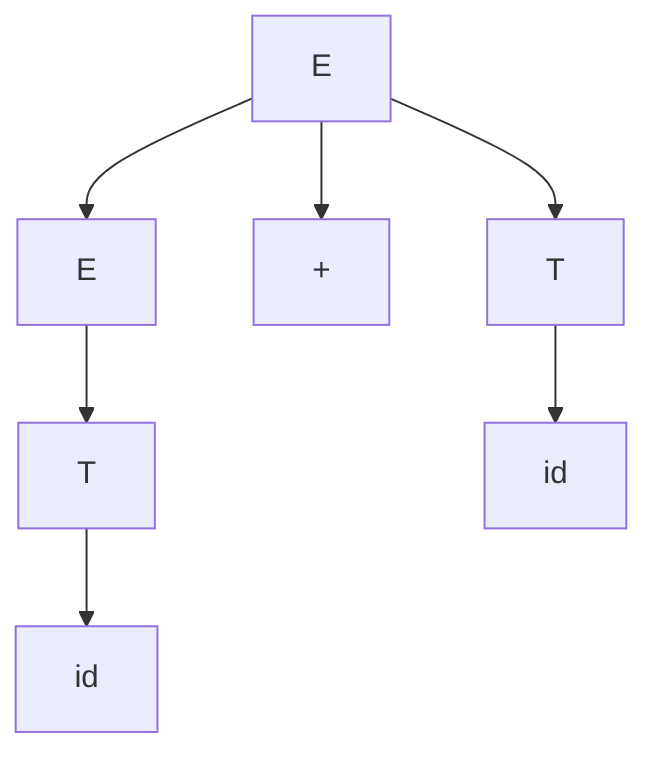
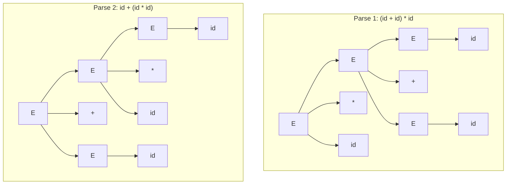

## Grammars and Derivations

### Overview

A **grammar** is a finite set of rules that generates the strings of a formal language. A **derivation** is the step-by-step process of applying those rules, starting from a designated start symbol, to produce a specific string. Together, grammars and derivations provide the formal machinery underlying how programming language syntax is defined and how parsers determine whether — and how — a piece of source code conforms to that syntax.

### Formal Definition of a Grammar

A context-free grammar is formally a 4-tuple $G = (N, \Sigma, P, S)$ where:

- $N$ is a finite set of **nonterminal** symbols (syntactic categories like `expression` or `statement`)
- $\Sigma$ is a finite set of **terminal** symbols (the actual tokens of the language, disjoint from $N$)
- $P$ is a finite set of **production rules**, each of the form $A \rightarrow \alpha$ where $A \in N$ and $\alpha \in (N \cup \Sigma)^*$
- $S \in N$ is the **start symbol**

**Key Points**
- Terminals are the "leaves" of any derivation — they cannot be rewritten further.
- Nonterminals are placeholders that get expanded by applying productions.
- The language generated by $G$, written $L(G)$, is the set of all terminal strings derivable from $S$.

### Derivations

A derivation is a sequence of rule applications that transforms the start symbol into a string of terminals (or an intermediate string called a **sentential form**).

Consider this small grammar:

```
S = "a" , S , "b" | "" ;
```

This says: `S` is either `a`, followed by `S`, followed by `b`, or the empty string. A derivation of `aabb`:

$$S \Rightarrow aSb \Rightarrow aaSbb \Rightarrow aabb$$

Each $\Rightarrow$ step applies one production to one nonterminal in the current sentential form. This particular grammar generates the language $\{a^n b^n \mid n \geq 0\}$ — a classic example of a language that is context-free but not regular.

### Leftmost and Rightmost Derivations

When a sentential form contains more than one nonterminal, a choice must be made about which one to expand next. Two conventional strategies:

- **Leftmost derivation**: always expand the leftmost nonterminal first.
- **Rightmost derivation**: always expand the rightmost nonterminal first.

**Example**

Using the arithmetic grammar:

```
E = E , "+" , T | T ;
T = "id" ;
```

For the string `id + id`, a leftmost derivation:

$$E \Rightarrow E + T \Rightarrow T + T \Rightarrow id + T \Rightarrow id + id$$

A rightmost derivation of the same string:

$$E \Rightarrow E + T \Rightarrow E + id \Rightarrow T + id \Rightarrow id + id$$

Both derivations use the same production rules in the same grammar and both produce the same final string and the same parse tree shape — they differ only in the order nonterminals are expanded. This distinction matters directly to parsing strategy: LL parsers construct a leftmost derivation, while LR parsers construct a rightmost derivation in reverse.

### Parse Trees (Derivation Trees)

A parse tree represents a derivation graphically: the root is the start symbol, each internal node is a nonterminal expanded by one production, and the leaves (read left to right) spell out the derived string.



**Key Points**
- Multiple derivations (leftmost vs. rightmost) can correspond to the *same* parse tree, since the tree only encodes structure, not expansion order.
- A parse tree is distinct from an **abstract syntax tree (AST)**: a parse tree includes every grammar symbol used (including redundant grouping nonterminals), while an AST typically strips those away and keeps only semantically relevant structure.

### Ambiguous Grammars

A grammar is **ambiguous** if some string in its language has two or more distinct parse trees (equivalently, two or more distinct leftmost derivations).

**Example**

The classic ambiguous grammar for arithmetic:

```
E = E , "+" , E | E , "*" , E | "id" ;
```

The string `id + id * id` has two different parse trees under this grammar, depending on whether `+` or `*` is treated as the outer (later-applied) operation:



This ambiguity is exactly why real language grammars use the layered `expression → term → factor` structure (as in the EBNF example for arithmetic) — restructuring the grammar to bake in precedence and associativity removes the ambiguity without changing the generated language, $L(G)$.

Not every ambiguous grammar can be rewritten as an unambiguous one, however: some context-free languages are **inherently ambiguous**, meaning no unambiguous grammar exists for them at all. [Unverified — establishing inherent ambiguity for a specific language is a nontrivial theoretical result and should be confirmed against a formal reference rather than assumed from a single example.]

### Sentential Forms and the Chomsky Hierarchy

A **sentential form** is any string of terminals and nonterminals reachable from the start symbol during a derivation (intermediate or final). A string composed entirely of terminals is called a **sentence** of the grammar.

Context-free grammars sit within the **Chomsky hierarchy**, a classification of grammar types by the restrictions placed on their production rules:

| Type | Name | Production restriction | Recognizer |
|---|---|---|---|
| Type 0 | Unrestricted | No restriction | Turing machine |
| Type 1 | Context-sensitive | $\alpha A \beta \rightarrow \alpha \gamma \beta$, $\|\gamma\| \geq 1$ | Linear-bounded automaton |
| Type 2 | Context-free | $A \rightarrow \gamma$ (single nonterminal on left) | Pushdown automaton |
| Type 3 | Regular | $A \rightarrow aB$ or $A \rightarrow a$ | Finite automaton |

Most programming language syntax is specified with **Type 2 (context-free)** grammars, since they strike a practical balance between expressive power and efficient parsing (linear or near-linear time for the subclasses used in real parsers, such as LL and LR grammars). Genuinely context-sensitive rules in real languages — e.g., "a variable must be declared before it is used" — are usually enforced separately, outside the grammar, during semantic analysis rather than by moving to a Type 1 grammar. [Inference] This is a pragmatic engineering convention rather than a strict theoretical necessity, since Type 1 grammars can express such constraints directly but are far more expensive to parse in general.

### Derivation Order and Parsing Algorithm Correspondence

**Key Points**
- **LL parsers** ("Left-to-right, Leftmost derivation") build the parse tree top-down, predicting which production to apply next by looking ahead at upcoming tokens.
- **LR parsers** ("Left-to-right, Rightmost derivation in reverse") build the parse tree bottom-up, shifting tokens onto a stack and reducing them according to grammar rules, effectively reconstructing a rightmost derivation backward.
- The `LL(k)` / `LR(k)` naming indicates how many tokens of lookahead the parsing algorithm uses.

Not every context-free grammar is LL or LR parseable — grammars must satisfy additional structural constraints (such as being unambiguous and free of certain forms of left recursion for LL) to fall into these more restrictive, efficiently parseable subclasses.

### Common Pitfalls

- **Confusing a grammar with a specific derivation**: a grammar defines the full (possibly infinite) set of derivable strings; a derivation is one concrete path to one specific string.
- **Assuming parse trees are always unique**: they are unique only for unambiguous grammars — checking a grammar for ambiguity is a necessary step before relying on "the" parse tree of a construct.
- **Equating parse trees with ASTs**: tooling (compilers, interpreters) generally operates on ASTs, not raw parse trees, because parse trees retain grammar artifacts (like grouping nonterminals) irrelevant to meaning.
- **Assuming leftmost and rightmost derivations of a string always differ**: for a string derivable via only one production sequence overall (i.e., trivial cases with a single nonterminal expansion), leftmost and rightmost coincide.

### Related Topics

- Extended BNF notation and grammar-writing conventions
- Eliminating ambiguity via operator precedence and associativity rules
- Left recursion and its elimination for recursive-descent parsers
- LL(1) vs. LR(1)/LALR parsing algorithms and parser generators
- Pushdown automata and their equivalence to context-free grammars
- Abstract syntax trees vs. concrete parse trees
- Context-sensitive semantic analysis (type checking, scope resolution)