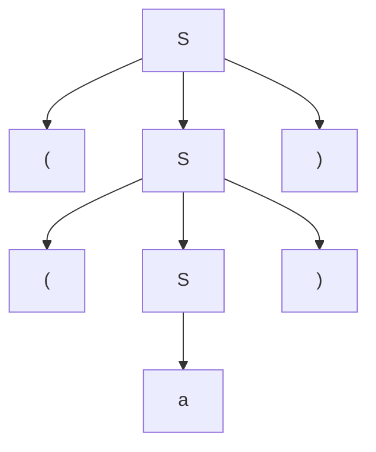
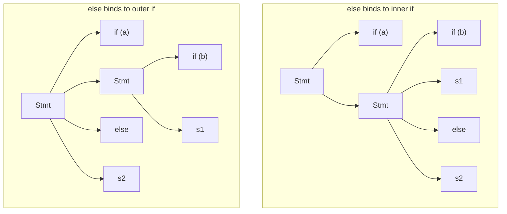

## Parse Trees and Ambiguity

### Overview

A parse tree makes the structure of a derivation explicit, showing exactly how a string decomposes into the nonterminals and terminals of a grammar. Ambiguity arises when a grammar permits more than one distinct parse tree for the same string, which is a structural property of the grammar itself rather than of any particular string or parser. Understanding both concepts is essential to designing grammars that parsers can process deterministically and that reflect a language's intended meaning.

### Anatomy of a Parse Tree

**Key Points**
- The **root** is always the grammar's start symbol.
- Each **internal node** is a nonterminal, and its children represent the right-hand side of the production used to expand it.
- Each **leaf** is a terminal symbol; reading the leaves left to right yields the derived string (the **yield** of the tree).
- A parse tree captures structure only — it discards the order in which nonterminals were expanded, which is why both leftmost and rightmost derivations of an unambiguous string produce the identical tree.

Given the grammar:

```
S = "(" , S , ")" | "a" ;
```

the string `((a))` produces this parse tree:



### Defining Ambiguity Formally

A context-free grammar $G$ is **ambiguous** if there exists at least one string $w \in L(G)$ for which two or more distinct parse trees exist. Equivalently, $w$ has two or more distinct leftmost derivations (or, equivalently, two or more distinct rightmost derivations).

**Key Points**
- Ambiguity is a property of the *grammar*, not of the language it generates — the same language can often be described by both an ambiguous grammar and an unambiguous one.
- A single ambiguous string is sufficient to make the whole grammar classified as ambiguous, even if every other string in the language has a unique tree.
- Detecting ambiguity in the general case is undecidable: there is no algorithm that, given an arbitrary context-free grammar, always correctly determines whether it is ambiguous. [Unverified — this is a foundational result in formal language theory and should be cross-checked against a formal computability reference if precision matters for the use case.] In practice, ambiguity is usually caught either by inspection of small grammars or by conflict reports from parser-generator tools.

### Classic Source 1: Operator Precedence

The most common source of ambiguity in expression grammars is a "flat" rule that treats all operators identically:

```
E = E , "+" , E | E , "*" , E | "num" ;
```

`num + num * num` has two parse trees, one grouping `+` before `*` and one grouping `*` before `+`, as shown in the previous discussion of grammars and derivations. The standard fix is to introduce one nonterminal layer per precedence level:

```
E = E , "+" , T | T ;
T = T , "*" , F | F ;
F = "num" | "(" , E , ")" ;
```

Here, `F` (factor) binds tightest, `T` (term) next, and `E` (expression) loosest — the grammar's nesting depth directly encodes precedence, eliminating the ambiguity without shrinking or growing $L(G)$.

### Classic Source 2: The Dangling-Else Problem

**Example**

A frequently cited real-world ambiguity in C-family languages arises from optional `else` clauses:

```
Stmt = "if" , "(" , Expr , ")" , Stmt
| "if" , "(" , Expr , ")" , Stmt , "else" , Stmt
| OtherStmt ;
```

For the input:

```
if (a) if (b) s1 else s2
```

it is ambiguous whether `else s2` attaches to the inner `if (b)` or the outer `if (a)`, since the grammar alone doesn't specify a preference:



Most languages resolve this by convention rather than by rewriting the grammar into something more complex: the **"dangling else binds to the nearest unmatched if"** rule, enforced either by the parser implementation directly or by a disambiguated grammar variant that distinguishes "matched" from "unmatched" statements:

```
Stmt        = MatchedStmt | UnmatchedStmt ;
MatchedStmt = "if" , "(" , Expr , ")" , MatchedStmt , "else" , MatchedStmt
| OtherStmt ;
UnmatchedStmt = "if" , "(" , Expr , ")" , Stmt
| "if" , "(" , Expr , ")" , MatchedStmt , "else" , UnmatchedStmt ;
```

This rewritten grammar generates the same language but admits only one parse tree per string, formally encoding the "nearest if" convention.

### Inherent Ambiguity

Some context-free *languages* — not just specific grammars — have the property that **every** possible grammar generating them is ambiguous. Such languages are called **inherently ambiguous**.

**Key Points**
- Inherent ambiguity is a property of the language $L$, stronger than saying "this particular grammar is ambiguous."
- A commonly cited example in formal language theory is a language combining two overlapping pattern families, such as $\{a^i b^j c^k \mid i = j \text{ or } j = k\}$. [Unverified — the specific example and proof of inherent ambiguity should be verified against a formal language theory textbook, as constructions vary and proofs are non-trivial.]
- Practical programming language grammars are essentially never inherently ambiguous by design — language designers actively construct grammars to avoid this, since an inherently ambiguous grammar cannot be fixed by restructuring alone and would force disambiguation to happen entirely outside the grammar (e.g., in the parser or a post-processing pass).

### How Parser Generators Detect Ambiguity

Tools like Yacc, Bison, and ANTLR do not solve the general (undecidable) ambiguity problem; instead, they detect specific **local symptoms** of ambiguity or non-determinism during table construction:

- **Shift-reduce conflicts**: the parser cannot decide whether to shift the next token or reduce using a completed rule (the classic symptom of the dangling-else and operator-precedence problems in LR parsing).
- **Reduce-reduce conflicts**: the parser has two applicable rules to reduce a substring by, with no basis to choose.

**Key Points**
- Most parser generators resolve these conflicts using default heuristics (e.g., Bison and Yacc default to shift-over-reduce and pick the earliest-declared rule to break reduce-reduce ties) rather than refusing to generate a parser.
- Relying on default conflict resolution is generally considered fragile practice: it can silently produce a parser that accepts input differently than intended, so most style guides recommend eliminating conflicts by grammar restructuring or explicit precedence/associativity declarations instead. [Inference] This is a widely repeated best practice in parser-construction literature, though the acceptable tolerance for relying on defaults varies by project and tool.

### Disambiguation Strategies Summary

| Strategy | How it works | Typical use case |
|---|---|---|
| Grammar layering | Introduce one nonterminal per precedence level | Arithmetic expression precedence |
| Grammar splitting (matched/unmatched) | Split a nonterminal into sub-cases that structurally forbid the ambiguous reading | Dangling-else problem |
| Precedence/associativity declarations | Annotate tokens with precedence outside the raw grammar (used by Yacc/Bison-style tools) | Operator-heavy grammars where full layering is verbose |
| Parser-level convention | Resolve non-determinism procedurally without rewriting the grammar (e.g., "prefer shift") | Quick fixes; considered less robust |

### Common Pitfalls

- **Assuming ambiguity is always visible from a small example**: a grammar might be unambiguous for all short test strings but ambiguous for some longer or more complex string.
- **Confusing "the parser produced an answer" with "the grammar is unambiguous"**: parser generators' default conflict resolution can mask ambiguity rather than eliminate it — the grammar remains formally ambiguous even though the generated parser behaves deterministically.
- **Over-layering a grammar unnecessarily**: introducing precedence levels for operators that don't actually need disambiguation adds needless nonterminals and parsing overhead.
- **Treating inherent ambiguity as fixable by rewriting**: if a language is inherently ambiguous, no amount of grammar restructuring removes the ambiguity — only external disambiguation (outside the context-free grammar formalism) can resolve it.

### Related Topics

- Extended BNF notation and grammar-writing conventions
- Grammars and derivations (leftmost/rightmost, sentential forms)
- LL(1) and LR(1) parsing algorithms and conflict resolution
- Operator precedence parsing and precedence climbing
- Abstract syntax trees vs. concrete parse trees
- Parser generator tools (Yacc, Bison, ANTLR) and conflict reports
- Undecidability results in formal language theory