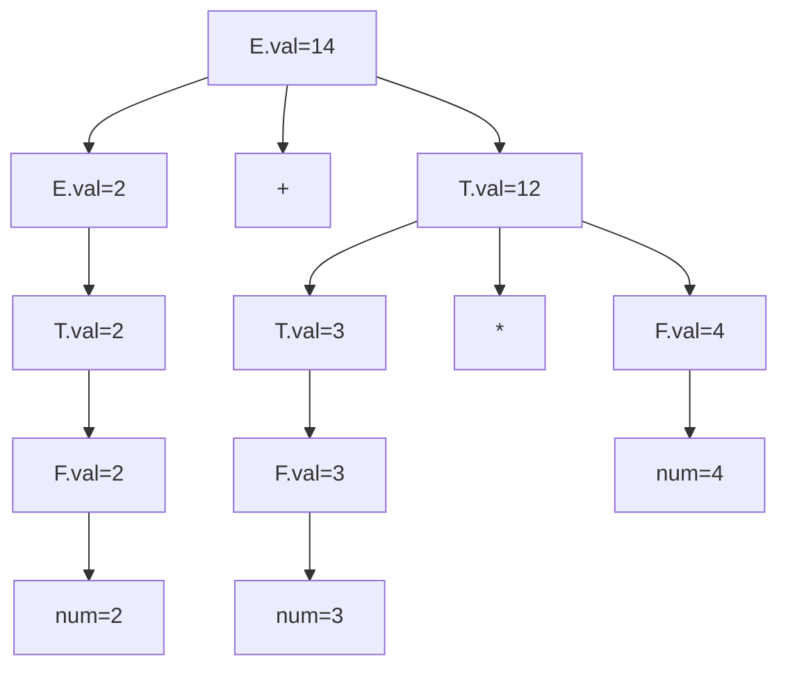

## Attribute Grammars and Static Semantics

### Overview

A context-free grammar defines the *syntactic* structure of a language — which strings of tokens are well-formed — but it cannot, by itself, express rules like "a variable must be declared before use" or "the operands of `+` must have compatible types." **Attribute grammars** extend context-free grammars with semantic information attached to grammar symbols, providing a formal mechanism for specifying **static semantics**: the compile-time-checkable meaning and constraints of a program that go beyond pure syntax.

### Why Context-Free Grammars Are Not Enough

**Key Points**
- Context-free grammars (Type 2 in the Chomsky hierarchy) cannot natively express context-sensitive constraints, such as requiring a name to match a prior declaration elsewhere in the program.
- Constraints like type compatibility, scope resolution, and "variable declared before use" are all **context-sensitive** in nature — they depend on relationships between distant parts of the parse tree, not just local production structure.
- Rather than moving to a full context-sensitive grammar (Type 1), which is far more expensive to parse, real compilers keep the grammar context-free and layer semantic checks on top during a separate **semantic analysis** phase.

Attribute grammars formalize exactly this layering: they let semantic rules be attached directly to the productions of an otherwise ordinary context-free grammar.

### Structure of an Attribute Grammar

An attribute grammar augments each grammar symbol with a set of **attributes** (values) and augments each production with **semantic rules** (also called semantic functions) that compute those attributes.

**Key Points**
- **Synthesized attributes** are computed from a node's children and passed *upward* to its parent.
- **Inherited attributes** are computed from a node's parent and/or siblings and passed *downward* or *sideways*.
- The combination of synthesized and inherited attributes allows information to flow in any direction through the parse tree, which is necessary for many realistic semantic checks (e.g., a declared type needing to flow down to all uses of a variable within its scope).

### Worked Example: Synthesized Attributes for Expression Evaluation

A minimal attribute grammar computing the value of an arithmetic expression, where each nonterminal carries a synthesized attribute `val`:

| Production | Semantic Rule |
|---|---|
| `E -> E1 "+" T` | `E.val = E1.val + T.val` |
| `E -> T` | `E.val = T.val` |
| `T -> T1 "*" F` | `T.val = T1.val * F.val` |
| `T -> F` | `T.val = F.val` |
| `F -> "(" E ")"` | `F.val = E.val` |
| `F -> num` | `F.val = num.lexval` |

**Example**

For the input `2 + 3 * 4`, attribute evaluation proceeds bottom-up along the parse tree, since every attribute here is synthesized (computed only from children):



A grammar in which every attribute is synthesized is called an **S-attributed grammar**. S-attributed grammars are compatible with simple bottom-up (LR-style) parsing, since each attribute can be computed the moment its production's right-hand side is fully recognized.

### Worked Example: Inherited Attributes for Type Declarations

Some checks require information to flow *down* the tree — for instance, propagating a declared type to every identifier in a declaration list.

```
D -> T L
L -> L1 "," id
L -> id
T -> "int"
T -> "float"
```

| Production | Semantic Rule |
|---|---|
| `D -> T L` | `L.inh_type = T.type` |
| `L -> L1 "," id` | `L1.inh_type = L.inh_type`; `addtype(id.entry, L.inh_type)` |
| `L -> id` | `addtype(id.entry, L.inh_type)` |
| `T -> "int"` | `T.type = int` |
| `T -> "float"` | `T.type = float` |

Here, `L.inh_type` is an **inherited attribute**: `L` receives its type not from its own children but from its parent `D` (and passes it sideways to its own child `L1`). Grammars mixing inherited and synthesized attributes are more expressive but require more careful evaluation-order analysis, since attributes can no longer always be computed in a single bottom-up pass.

### Attribute Evaluation Order

**Key Points**
- For an attribute grammar to be usable, there must exist some order of evaluating semantic rules such that every attribute is computed only after all attributes it depends on.
- This dependency structure is captured by a **dependency graph** built from the parse tree: one node per attribute instance, with an edge from attribute $a$ to attribute $b$ if $b$'s rule uses $a$'s value.
- An attribute grammar is **well-defined** (non-circular) if this dependency graph contains no cycles for any parse tree the grammar can generate. [Inference] Detecting circularity for all possible parse trees in general is computationally expensive, so practical tools often restrict attention to well-behaved subclasses (like S-attributed or L-attributed grammars) rather than checking full generality.
- An **L-attributed grammar** restricts inherited attributes so that each one depends only on attributes of the parent or of siblings *to its left* — this restriction permits attribute evaluation in a single left-to-right depth-first traversal, making L-attributed grammars practical for evaluation during single-pass, top-down (LL-style) parsing.

### Static Semantics vs. Dynamic Semantics

| Aspect | Static Semantics | Dynamic Semantics |
|---|---|---|
| When checked/defined | Compile time | Run time |
| Typical concerns | Type checking, scope resolution, declaration-before-use | Actual computation, control flow execution, memory effects |
| Formal tools | Attribute grammars, type systems | Operational, denotational, or axiomatic semantics |
| Example violation | Using an undeclared variable | Dividing by zero at runtime |

Attribute grammars are specifically a tool for specifying **static semantics** — properties checkable without executing the program. They are not typically used to define a language's dynamic (runtime) behavior, which instead uses separate formalisms.

### Practical Role in Compiler Construction

**Key Points**
- Real compilers rarely implement a literal, formal attribute grammar evaluator; instead, the *concepts* of synthesized/inherited attributes are realized informally through the action code embedded in a parser generator's grammar file (e.g., Yacc/Bison `{ }` action blocks or ANTLR's embedded actions), or through explicit passes over an AST during semantic analysis.
- Common static-semantic checks implemented this way include: **type checking** (verifying operand and expression types are compatible), **scope resolution** (matching identifier uses to declarations and enforcing visibility rules), and **declaration consistency** (detecting duplicate declarations, undeclared identifiers, or arity mismatches in function calls).
- [Inference] Symbol tables — data structures mapping identifiers to their declared attributes (type, scope, storage location) — are the typical runtime data structure used to implement the "addtype" and lookup operations that attribute grammar rules describe abstractly, though the exact implementation varies significantly by compiler architecture.

### Common Pitfalls

- **Treating attribute grammars as executable specifications directly**: most real implementations translate the *idea* of attribute flow into hand-written semantic-analysis code rather than running a generic attribute-evaluator engine, though generator tools for attribute grammars do exist.
- **Assuming all semantic rules can be synthesized-only**: many realistic checks (scoping, type propagation into nested contexts) genuinely require inherited attributes; forcing an S-attributed-only design can make some checks awkward or impossible to express cleanly.
- **Confusing static semantic errors with syntax errors**: a program can be syntactically well-formed (parses successfully) yet still violate static semantic rules (e.g., `int x = "hello";` may parse fine but fail a type check) — these are reported as distinct error classes in most compilers.
- **Ignoring evaluation-order constraints**: introducing an inherited attribute that depends on a later-computed sibling attribute can make the grammar circular or unevaluable in a single pass, requiring redesign of the attribute dependencies.

### Related Topics

- Grammars and derivations (context-free grammar foundations)
- Parse trees and ambiguity in grammars
- Symbol tables and scope resolution
- Type systems and type checking algorithms
- Semantic analysis phases in compiler pipelines
- Syntax-directed translation and intermediate code generation
- Operational, denotational, and axiomatic semantics (dynamic semantics formalisms)