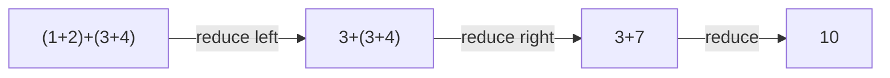
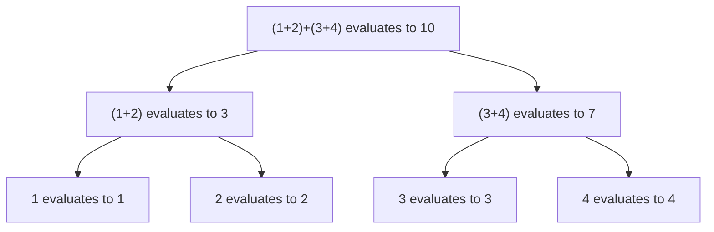

## Operational Semantics

### Overview

**Operational semantics** defines the meaning of a programming language by specifying how programs execute — as a sequence of computational steps over an abstract machine, rather than by mapping programs to mathematical objects (as denotational semantics does) or by specifying provable properties (as axiomatic semantics does). It answers the question "what does this program *do*?" by formalizing the step-by-step process a machine or interpreter would follow.

### Why Formal Semantics Matters

**Key Points**
- A grammar (syntax) says which programs are well-formed; semantics says what a well-formed program *means* or *does*.
- Without a formal semantics, a language's behavior is defined only by "whatever the reference implementation does," which makes correctness proofs, compiler optimizations, and cross-implementation consistency difficult to establish rigorously.
- Operational semantics is generally considered the most intuitive of the three major semantic formalisms because it closely mirrors how an interpreter is actually built, making it a common teaching and prototyping tool. [Inference] This intuitiveness is a widely cited pedagogical advantage in programming language theory texts, though "most intuitive" is inherently a comparative judgment rather than a measurable fact.

### Two Major Styles: Small-Step and Big-Step

**Small-Step (Structural) Operational Semantics**

Small-step semantics, often abbreviated **SOS** (Structural Operational Semantics), defines execution as a relation $\rightarrow$ between individual configurations, where each step captures one atomic computation. A full execution is a chain of such steps:

$$c_0 \rightarrow c_1 \rightarrow c_2 \rightarrow \cdots \rightarrow c_n$$

where each $c_i$ is a **configuration** — typically a pair of a remaining program (or expression) and a state (e.g., a variable-to-value mapping).

**Big-Step (Natural) Operational Semantics**

Big-step semantics, also called **natural semantics**, instead defines a relation directly between a starting configuration and its final result, skipping over the intermediate steps:

$$c \Downarrow v$$

read as "configuration $c$ evaluates to final value $v$."

| Aspect | Small-step | Big-step |
|---|---|---|
| Granularity | One atomic computation per step | Entire evaluation to a final result |
| Captures non-termination directly | Yes (an infinite chain of steps) | Awkward — non-termination shows up as "no derivation exists," not as an explicit object |
| Suited to modeling | Concurrency, interleaving, intermediate program states | Straightforward evaluators, quick semantic definitions |
| Typical notation | $\rightarrow$ | $\Downarrow$ |

### Worked Example: Small-Step Semantics for Arithmetic Expressions

Consider a minimal language of arithmetic expressions with addition. Define configurations as expressions, and specify a single-step reduction relation $\rightarrow$ using **inference rules**:

$$\dfrac{}{n_1 + n_2 \rightarrow n} \quad \text{(where } n = n_1 + n_2 \text{ as numerals)}$$

$$\dfrac{e_1 \rightarrow e_1'}{e_1 + e_2 \rightarrow e_1' + e_2}$$

$$\dfrac{e_2 \rightarrow e_2'}{n_1 + e_2 \rightarrow n_1 + e_2'}$$

**Example**

Evaluating `(1 + 2) + (3 + 4)` step by step, using the leftmost-innermost reduction strategy these rules encode:

$$(1+2) + (3+4) \rightarrow 3 + (3+4) \rightarrow 3 + 7 \rightarrow 10$$

Each arrow corresponds to applying exactly one of the three inference rules above. The first rule is the **base case** (a redex — reducible expression — collapses to a value); the second and third rules are **congruence rules**, propagating reduction into subexpressions in a fixed order (left operand first, in this rule set).

### Worked Example: Big-Step Semantics for the Same Language

The same language expressed in big-step style skips the intermediate configurations entirely:

$$\dfrac{}{n \Downarrow n}$$

$$\dfrac{e_1 \Downarrow n_1 \quad e_2 \Downarrow n_2 \quad n = n_1 + n_2}{e_1 + e_2 \Downarrow n}$$

For `(1 + 2) + (3 + 4)`, a single derivation tree directly proves the final result:

Notice there is no notion of "the expression after one step" in this style — the derivation tree proves the whole evaluation at once.

### Configurations and State

For languages with mutable variables, a configuration typically pairs an expression or statement with a **store** (or environment/state) $\sigma$ mapping variable names to values.

**Example**

A small-step rule for variable assignment in an imperative language:

$$\dfrac{}{\langle x := n, \sigma \rangle \rightarrow \langle \text{skip}, \sigma[x \mapsto n] \rangle}$$

This reads: executing `x := n` in store $\sigma$ produces the terminal statement `skip` and an updated store where $x$ now maps to $n$, with all other bindings in $\sigma$ unchanged. Sequencing is then handled by rules like:

$$\dfrac{\langle s_1, \sigma \rangle \rightarrow \langle s_1', \sigma' \rangle}{\langle s_1 ; s_2, \sigma \rangle \rightarrow \langle s_1' ; s_2, \sigma' \rangle}$$

$$\dfrac{}{\langle \text{skip} ; s_2, \sigma \rangle \rightarrow \langle s_2, \sigma \rangle}$$

### Modeling Control Flow: Conditionals and Loops

**Example**

Big-step rules for `if` naturally split into two cases based on the guard's evaluated truth value:

$$\dfrac{\langle b, \sigma \rangle \Downarrow \text{true} \quad \langle s_1, \sigma \rangle \Downarrow \sigma'}{\langle \text{if } b \text{ then } s_1 \text{ else } s_2, \sigma \rangle \Downarrow \sigma'}$$

$$\dfrac{\langle b, \sigma \rangle \Downarrow \text{false} \quad \langle s_2, \sigma \rangle \Downarrow \sigma'}{\langle \text{if } b \text{ then } s_1 \text{ else } s_2, \sigma \rangle \Downarrow \sigma'}$$

Loops are typically defined by unrolling one iteration into an equivalent conditional-and-sequence form:

$$\dfrac{}{\langle \text{while } b \text{ do } s, \sigma \rangle \Downarrow \langle \text{if } b \text{ then } (s ; \text{while } b \text{ do } s) \text{ else skip}, \sigma \rangle}$$

**Key Points**
- Non-terminating loops correspond to derivations that never complete in big-step semantics — there is no finite proof tree for `while true do skip`, which is why big-step semantics struggles to *directly* represent non-termination as a first-class object, unlike small-step semantics, where the infinite step sequence itself is the representation.

### Determinism and the Structure of Inference Rules

**Key Points**
- A set of small-step rules defines a **deterministic** semantics if, for every configuration, at most one rule (with a specific choice of subterm) applies — meaning the "next step" is always uniquely determined.
- Rule sets with overlapping applicability (e.g., allowing either operand of `+` to reduce first, non-deterministically) model languages or evaluation orders where multiple valid execution paths exist — relevant for specifying concurrency or unspecified evaluation order (such as C's historically unspecified order of function-argument evaluation).
- [Unverified — evaluation order guarantees vary significantly by language and by language version; any specific claim about a language's argument evaluation order should be checked against that language's current specification rather than assumed from general operational-semantics theory.]

### Relationship to Interpreters and Abstract Machines

**Key Points**
- Small-step operational semantics maps closely onto how a **tree-walking interpreter** or **abstract machine** (e.g., a stack-based virtual machine) is implemented: each inference rule roughly corresponds to one case in an interpreter's step function.
- This closeness is often cited as operational semantics' primary practical advantage: a formal small-step specification can often be transliterated nearly directly into interpreter code, making it useful both for language reference documents and as an implementation guide. [Inference] The degree of "nearly direct" translation varies significantly with language complexity — simple expression languages transliterate cleanly, while languages with complex control-flow or concurrency features require substantially more engineering beyond the formal rules.

### Comparison with Denotational and Axiomatic Semantics

| Formalism | Defines meaning as | Best suited for |
|---|---|---|
| Operational | Execution steps over an abstract machine | Interpreter construction, step-by-step reasoning, concurrency modeling |
| Denotational | A mathematical function from programs to values/domains | Compositional reasoning, compiler correctness proofs, abstract mathematical properties |
| Axiomatic | Logical assertions (pre/postconditions) about program states | Program verification, proving correctness against a specification |

**Key Points**
- The three formalisms are not mutually exclusive — a language specification may use operational semantics for its core execution model while using axiomatic-style reasoning (e.g., Hoare logic) for verification tooling built on top of it.
- Establishing that an operational semantics and a denotational semantics for the same language *agree* (produce consistent results) is itself a nontrivial theoretical exercise, generally called an **adequacy** or **soundness** proof.

### Common Pitfalls

- **Conflating small-step and big-step as interchangeable in all respects**: while many languages can be given both forms consistently, they emphasize different properties (intermediate states vs. final results) and are not always trivially interconvertible, especially in the presence of non-termination or concurrency.
- **Treating operational semantics as language-implementation-independent**: because it is defined in terms of an abstract machine and stepping relation, subtle choices (like which congruence rules exist) can bake in evaluation-order decisions that a language specification may or may not intend to guarantee.
- **Assuming determinism by default**: a set of inference rules is only deterministic if it's carefully constructed to be so; naively written rules can accidentally allow multiple derivations for the same configuration.
- **Ignoring the role of the store/environment**: for any language beyond pure arithmetic expressions, configurations must carry state explicitly, and forgetting this makes rules for assignment, scoping, or mutation impossible to express correctly.

### Related Topics

- Denotational semantics and domain theory
- Axiomatic semantics and Hoare logic
- Attribute grammars and static semantics
- Abstract machines and virtual machine design (e.g., SECD machine, stack machines)
- Type soundness proofs (progress and preservation)
- Concurrency semantics and interleaving models
- Structural induction and inference rule systems