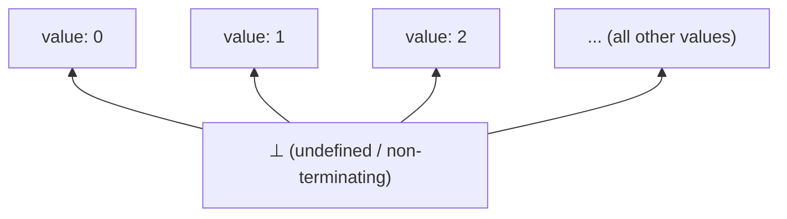

## Denotational Semantics

### Overview

**Denotational semantics** defines the meaning of a program by mapping it to a mathematical object — typically a function, set, or element of an abstractly defined domain — rather than by describing execution steps (as operational semantics does) or logical assertions about states (as axiomatic semantics does). Under this approach, every syntactic construct is assigned a **denotation**: a precise mathematical value that represents "what the construct means," independent of any particular machine or execution model.

### The Core Idea: Meaning as Mathematical Objects

**Key Points**
- The denotational meaning of a program is written using **semantic brackets**, conventionally $[\![ \cdot ]\!]$, so that $[\![ e ]\!]$ denotes the mathematical value corresponding to expression $e$.
- Denotational semantics is fundamentally **compositional**: the denotation of a compound construct is defined strictly in terms of the denotations of its immediate syntactic parts, never by referring back to the syntax itself.
- This approach was pioneered by Christopher Strachey and Dana Scott in the late 1960s and early 1970s, with Scott's development of **domain theory** providing the mathematical foundation needed to give rigorous meaning to constructs like recursion and non-termination.

### Compositionality in Practice

**Example**

For a simple arithmetic expression language, denotational semantic equations map each syntax rule to a mathematical definition:

$$[\![ n ]\!] = n$$

$$[\![ e_1 + e_2 ]\!] = [\![ e_1 ]\!] + [\![ e_2 ]\!]$$

$$[\![ e_1 \times e_2 ]\!] = [\![ e_1 ]\!] \times [\![ e_2 ]\!]$$

Here, the `+` and `×` on the left-hand side are syntax (grammar symbols), while the `+` and `×` on the right-hand side are the actual mathematical operations on numbers. The denotation of `2 + 3 * 4` is computed purely by substitution:

$$[\![ 2 + 3 \times 4 ]\!] = [\![ 2 ]\!] + [\![ 3 \times 4 ]\!] = 2 + ([\![ 3 ]\!] \times [\![ 4 ]\!]) = 2 + (3 \times 4) = 14$$

**Key Points**
- Notice this computation never mentions "steps" or "configurations" — it is a direct mathematical equation, evaluated the way any algebraic expression would be simplified.
- This is the central contrast with operational semantics: denotational semantics answers "what mathematical value does this program correspond to?" while operational semantics answers "what sequence of actions does this program perform?"

### Domains: Handling State and Functions

For languages beyond pure arithmetic, denotations must capture richer meanings — the meaning of a statement that mutates variables, or of a function that can be passed around as a value.

**Key Points**
- A **state** (or store) is denoted as a mathematical function from variable names to values: $\sigma : \text{Var} \rightarrow \text{Value}$.
- The denotation of a statement `s` is then a function from states to states: $[\![ s ]\!] : \Sigma \rightarrow \Sigma$, where $\Sigma$ is the set of all possible states.
- The denotation of an assignment `x := e` is defined as a state-transformer function:

$$[\![ x := e ]\!]（\sigma) = \sigma[x \mapsto [\![ e ]\!]\sigma]$$

read as: the new state is identical to $\sigma$, except that $x$ now maps to the value of $e$ evaluated in $\sigma$.

**Example**

Sequencing is denoted as ordinary function composition:

$$[\![ s_1 ; s_2 ]\!] = [\![ s_2 ]\!] \circ [\![ s_1 ]\!]$$

This states that running `s1` followed by `s2` corresponds exactly to composing their respective state-transformer functions — a direct reuse of a standard mathematical operation, requiring no new machinery.

### The Problem of Recursion and Non-Termination

**Key Points**
- A `while` loop or a recursive function definition poses a fundamental difficulty for naive compositional definitions: the "meaning" of a loop appears to depend on its own meaning, since unrolling `while b do s` produces `if b then (s; while b do s) else skip` — an equation, not a direct definition.
- Denotational semantics resolves this using **fixed-point theory**: the meaning of a recursive construct is defined as the **least fixed point** of a functional (a function on functions) built from the loop or recursive definition's structure.

$$[\![ \text{while } b \text{ do } s ]\!] = \text{fix}(F) \quad \text{where } F(g)(\sigma) = \begin{cases} g([\![ s ]\!]\sigma) & \text{if } [\![ b ]\!]\sigma = \text{true} \\ \sigma & \text{if } [\![ b ]\!]\sigma = \text{false} \end{cases}$$

Here, $\text{fix}(F)$ denotes the least fixed point of the functional $F$ — the "smallest" function $g$ satisfying $g = F(g)$, in a precise mathematical sense defined by domain theory.

- Crucially, this requires the underlying mathematical space (the **domain**) to be structured so that least fixed points are guaranteed to exist. This is precisely what Scott domains provide: **complete partial orders (CPOs)** equipped with a **bottom element** $\bot$ representing "undefined" or "non-terminating," together with a guarantee (via the Knaster–Tarski fixed-point theorem, adapted to CPOs) that every continuous function on such a domain has a least fixed point.

### Domain Theory Essentials

| Concept | Meaning |
|---|---|
| Partial order | A set with a relation $\sqsubseteq$ ("approximates" or "is no more defined than") that is reflexive, transitive, antisymmetric |
| Complete partial order (CPO) | A partial order where every directed subset has a least upper bound (supremum) |
| Bottom element $\bot$ | The least element of a CPO, representing a completely undefined or non-terminating computation |
| Continuous function | A function preserving least upper bounds of directed sets — the technical condition needed for fixed points to be well-behaved |
| Least fixed point | The smallest $g$ (in the $\sqsubseteq$ ordering) such that $g = F(g)$, guaranteed to exist for continuous $F$ on a CPO |

**Key Points**
- The bottom element $\bot$ is what allows non-termination to be given a genuine mathematical denotation: a non-terminating program denotes $\bot$, rather than having no denotation at all.
- This is a key structural difference from big-step operational semantics, where non-termination corresponds to the *absence* of a derivation rather than to an explicit value.

### Handling Higher-Order Functions

**Key Points**
- Languages with first-class functions (functions that can be passed as arguments, returned as results, or stored in variables) require **function domains** — spaces whose elements are themselves functions between other domains.
- Naively, a function domain $D \rightarrow D$ can be "larger" than $D$ itself in a way that creates circularity issues for languages allowing functions to take other functions as arguments (relevant to modeling constructs like the untyped lambda calculus). Dana Scott's key technical contribution was constructing domains $D$ satisfying $D \cong D \rightarrow D$ (up to appropriate isomorphism) using **continuous functions** rather than arbitrary set-theoretic functions, resolving this circularity. [Unverified — the precise construction (e.g., Scott's $P_\omega$ or inverse-limit constructions) is a specialized topic in domain theory and should be verified against a domain theory reference for technical accuracy.]

### Denotational vs. Operational: A Direct Comparison

| Aspect | Denotational | Operational |
|---|---|---|
| Meaning defined as | Mathematical object (function, domain element) | Sequence of execution steps or final-result relation |
| Compositionality | Built in by construction | Not automatic — must be proven, if desired |
| Handling of non-termination | Explicit value ($\bot$) via fixed-point theory | Absence of a derivation (big-step) or an infinite step sequence (small-step) |
| Best suited for | Compiler correctness proofs, reasoning about program equivalence, abstract interpretation foundations | Interpreter design, step-by-step debugging intuition, concurrency modeling |
| Mathematical prerequisites | Domain theory, order theory, fixed-point theorems | Inference rule systems, structural induction |

**Key Points**
- Compositionality is often cited as denotational semantics' chief practical benefit: because a compound expression's meaning depends only on its parts' meanings, denotational definitions support strong equational reasoning — e.g., proving that two syntactically different programs are semantically equivalent by showing their denotations are equal.
- This same compositionality is also cited as making denotational semantics a natural mathematical foundation for compiler optimization correctness proofs (a rewriting is safe exactly when it preserves denotation), though building out this connection in full rigor for a real-world language is a substantial undertaking. [Inference] This connection is a well-established motivation in the semantics literature, though the practical effort required scales sharply with language complexity.

### Adequacy: Relating Denotational and Operational Semantics

**Key Points**
- Given both an operational and a denotational semantics for the same language, a natural question is whether they agree — whether the denotational meaning of a program correctly predicts its operational behavior (e.g., whether a program denoting $\bot$ is exactly the set of programs that fail to terminate operationally).
- Such an agreement result is called an **adequacy theorem** (or, in the stronger direction, **full abstraction**), and proving one rigorously for a non-trivial language is generally a substantial undertaking, historically motivating a large body of research connecting the two formalisms.

### Common Pitfalls

- **Assuming denotational semantics gives an execution recipe**: unlike operational semantics, a denotational specification does not by itself describe *how* to compute a program's meaning efficiently — it defines *what* the meaning is mathematically, which is a distinct concern from evaluation strategy or implementation.
- **Underestimating the mathematical prerequisites**: meaningfully working with denotational semantics for anything beyond simple arithmetic languages requires genuine familiarity with order theory and domain theory — informally treating "least fixed point" as just "the loop's result" glosses over real technical content.
- **Conflating $\bot$ with an error value**: $\bot$ specifically denotes non-termination/undefinedness in the domain-theoretic sense, not a runtime exception or error condition, which would typically be modeled with a separate, explicit domain element.
- **Assuming a straightforward translation to code**: because denotational semantics is not step-based, translating a denotational specification directly into an interpreter is far less direct than for operational semantics, and is not typically how interpreters are built in practice.

### Related Topics

- Operational semantics (small-step and big-step)
- Axiomatic semantics and Hoare logic
- Domain theory and complete partial orders
- Fixed-point theorems (Knaster–Tarski, Kleene)
- Lambda calculus and higher-order function models
- Type soundness and semantic type systems
- Program equivalence and compiler optimization correctness