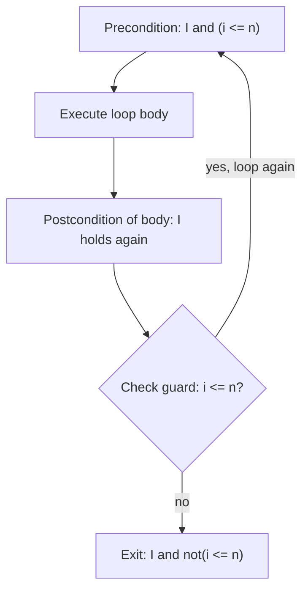

## Axiomatic Semantics and Program Correctness

### Overview

**Axiomatic semantics** defines the meaning of a program not by describing execution steps (operational semantics) or mapping it to a mathematical object (denotational semantics), but by specifying **logical assertions** about the states before and after a program runs. Rather than asking "what does this program compute?", axiomatic semantics asks "what properties are guaranteed to hold if this program runs correctly?" This formalism underlies formal **program verification** — mathematically proving that a program meets its specification.

### Hoare Logic: The Core Framework

Axiomatic semantics for imperative languages is most commonly formalized via **Hoare logic**, introduced by C.A.R. Hoare in 1969. Its central construct is the **Hoare triple**:

$$\{P\} \; s \; \{Q\}$$

read as: "if precondition $P$ holds before executing statement $s$, and $s$ terminates, then postcondition $Q$ holds afterward."

**Key Points**
- $P$ (the **precondition**) is a logical assertion about the program state *before* execution.
- $Q$ (the **postcondition**) is a logical assertion about the program state *after* execution.
- This is a **partial correctness** claim by default: it says nothing about whether $s$ actually terminates — only that *if* it terminates, $Q$ holds. A stronger variant, **total correctness**, additionally guarantees termination and is typically written with different bracket notation, such as $[P] \; s \; [Q]$.

### Inference Rules for Hoare Logic

Hoare logic defines one inference rule per language construct, allowing triples for compound statements to be derived from triples for their parts — mirroring the compositional style of denotational semantics, but operating on logical assertions rather than mathematical domains.

**Assignment Axiom**

$$\{P[e/x]\} \; x := e \; \{P\}$$

This is the most distinctive rule in Hoare logic: it works *backward*. To find the precondition guaranteeing $P$ holds after `x := e`, substitute $e$ for every free occurrence of $x$ in $P$.

**Example**

To prove $\{P\} \; x := x + 1 \; \{x > 0\}$, apply the assignment axiom by substituting `x + 1` for `x` in the postcondition `x > 0`:

$$P = (x + 1 > 0) \quad \text{i.e.} \quad P = (x > -1)$$

So $\{x > -1\} \; x := x + 1 \; \{x > 0\}$ is a valid triple, derived directly from the axiom without needing to "run" the assignment at all.

**Sequencing Rule**

$$\dfrac{\{P\} \; s_1 \; \{R\} \quad \{R\} \; s_2 \; \{Q\}}{\{P\} \; s_1 ; s_2 \; \{Q\}}$$

If executing $s_1$ takes $P$ to an intermediate assertion $R$, and executing $s_2$ takes $R$ to $Q$, then the sequence $s_1 ; s_2$ takes $P$ directly to $Q$.

**Conditional Rule**

$$\dfrac{\{P \wedge b\} \; s_1 \; \{Q\} \quad \{P \wedge \neg b\} \; s_2 \; \{Q\}}{\{P\} \; \text{if } b \text{ then } s_1 \text{ else } s_2 \; \{Q\}}$$

Both branches must independently establish the same postcondition $Q$, each starting from $P$ strengthened by the branch's guard condition.

**Consequence Rule**

$$\dfrac{P \Rightarrow P' \quad \{P'\} \; s \; \{Q'\} \quad Q' \Rightarrow Q}{\{P\} \; s \; \{Q\}}$$

This rule allows *weakening* the postcondition or *strengthening* the precondition using ordinary logical implication, connecting Hoare logic derivations to standard first-order logic reasoning.

### Loop Invariants: The Hardest Part

**Key Points**
- Loops require an **invariant** $I$: an assertion that holds before the loop starts, is preserved by every iteration, and (combined with the loop's exit condition) implies the desired postcondition.
- Finding a correct and sufficiently strong loop invariant is widely regarded as the central intellectual difficulty of manual Hoare-logic proofs — unlike the other rules, there is no mechanical procedure guaranteed to produce one. [Inference] This difficulty is a near-universal observation in program verification literature and practice, though "hardest part" is a qualitative characterization rather than a formally measured claim.

**While Rule**

$$\dfrac{\{I \wedge b\} \; s \; \{I\}}{\{I\} \; \text{while } b \text{ do } s \; \{I \wedge \neg b\}}$$

**Example**

Consider proving a loop that computes the sum $1 + 2 + \cdots + n$ into variable `sum`, using loop counter `i`:

```
sum := 0;
i := 1;
while (i <= n) do
  sum := sum + i;
  i := i + 1
```

A suitable loop invariant is $I: \text{sum} = \frac{(i-1) \cdot i}{2} \wedge i \leq n + 1$, expressing that at the top of each iteration, `sum` correctly holds the sum of all integers up to $i - 1$. Verifying this invariant is preserved by one iteration, combined with the exit condition $\neg(i \leq n)$, i.e., $i = n+1$, yields the postcondition $\text{sum} = \frac{n(n+1)}{2}$ — the closed-form sum formula.



### Partial vs. Total Correctness

| Aspect | Partial Correctness | Total Correctness |
|---|---|---|
| Notation | $\{P\} \; s \; \{Q\}$ | $[P] \; s \; [Q]$ |
| Guarantees | $Q$ holds *if* $s$ terminates | $s$ terminates *and* $Q$ holds |
| Extra proof obligation | None beyond the triple itself | A **variant** (or ranking function) — an expression that strictly decreases on each loop iteration and is bounded below, proving termination |
| Vacuous case | An infinite loop trivially satisfies any $\{P\}\;s\;\{Q\}$, since it never terminates | An infinite loop cannot satisfy any total-correctness claim |

**Key Points**
- Proving total correctness requires an additional termination argument on top of the invariant: typically, exhibiting a **variant function** mapping the program state to a well-founded ordering (commonly natural numbers) that strictly decreases with every loop iteration, since a strictly decreasing sequence of natural numbers cannot be infinite.
- This "invariant plus variant" pairing appears repeatedly across formal verification tools and techniques beyond raw Hoare logic, since it addresses the two orthogonal proof obligations (correctness of result, and guaranteed termination) that together constitute total correctness.

### Weakest Preconditions

An alternative, closely related formulation, introduced by Edsger Dijkstra, defines the **weakest precondition** $wp(s, Q)$: the *least restrictive* precondition $P$ such that $\{P\} \; s \; \{Q\}$ holds (in the total-correctness sense).

**Key Points**
- $wp(s, Q)$ can be computed *mechanically* for many language constructs by working backward from $Q$ through the structure of $s$, which is precisely why weakest-precondition calculation is amenable to automated tool support, unlike the invariant-discovery problem in forward Hoare-logic reasoning.
- This backward, calculational style forms the theoretical basis of many practical program verification tools and languages designed with built-in specification support (e.g., annotation-driven verifiers that generate proof obligations, sometimes called **verification conditions**, from source-level pre/postcondition annotations). [Unverified — specific tool names and their exact underlying algorithms change over time and should be checked against current documentation if a particular tool's behavior is being relied upon.]

### Relationship to Software Engineering: Design by Contract

**Key Points**
- Axiomatic semantics' precondition/postcondition structure directly inspired the **Design by Contract** methodology, where functions/methods are annotated with preconditions (what the caller must guarantee) and postconditions (what the function guarantees in return), along with **class invariants** for object-oriented state.
- Design by Contract treats these annotations as a specification contract between caller and callee, conceptually mirroring a Hoare triple even when the underlying tooling does not perform full formal verification (some implementations only check contracts at runtime via assertions, which is a distinct and weaker guarantee than a compile-time or proof-based verification).

### Comparison with Operational and Denotational Semantics

| Aspect | Axiomatic | Operational | Denotational |
|---|---|---|---|
| Defines meaning via | Logical assertions (pre/postconditions) | Execution steps | Mathematical functions/domains |
| Primary use case | Program verification, correctness proofs | Interpreter construction | Compiler correctness, equivalence reasoning |
| Handles non-termination | Separately, via partial vs. total correctness distinction | Naturally (absence of derivation, or infinite steps) | Explicitly, via $\bot$ and fixed-point theory |
| Requires | First-order logic, invariant/variant discovery | Inference rule systems | Domain theory, order theory |

**Key Points**
- The three formalisms are complementary rather than competing: a language's core execution model is often given operationally or denotationally, while axiomatic semantics is layered on top specifically to support verification-oriented reasoning about specific programs written in that language.
- Establishing that a language's axiomatic semantics is **sound** relative to its operational or denotational semantics (i.e., that every provable Hoare triple is actually true of program executions) is itself a substantial soundness proof, paralleling the adequacy question between operational and denotational semantics.

### Common Pitfalls

- **Forgetting partial correctness's blind spot**: a Hoare triple proof alone says nothing about termination — an infinite loop satisfies any postcondition vacuously, so partial-correctness proofs must be explicitly paired with a termination argument if total correctness is the actual goal.
- **Choosing too weak a loop invariant**: an invariant that is preserved by the loop but too weak to imply the desired postcondition on exit makes the proof unprovable at the final consequence step, even though the invariant itself is technically correct.
- **Applying the assignment axiom in the wrong direction**: because the rule substitutes into the *postcondition* to derive the precondition, working forward intuitively (as one might read code top to bottom) can lead to substitution errors — the safest approach is always to work backward from the desired postcondition.
- **Confusing runtime contract checking with formal verification**: Design-by-Contract assertions checked only at runtime catch violations after the fact for the specific inputs tested; they do not constitute a proof that the contract holds for all possible inputs, which is the stronger guarantee genuine axiomatic-semantics-based verification aims for.

### Related Topics

- Operational semantics (small-step and big-step)
- Denotational semantics and domain theory
- Loop invariants and program verification techniques
- Weakest precondition calculus and verification condition generation
- Design by Contract and formal specification languages
- Type systems as a lightweight complement to formal verification
- Termination analysis and well-founded orderings