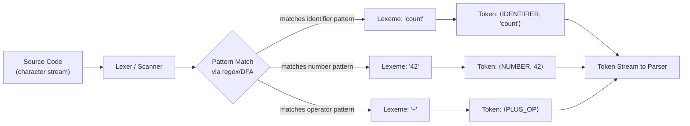

## Lexemes and Tokens

### Definitions

A **lexeme** is a sequence of characters in source code that matches the pattern for a token — the raw substring as it appears in the program text. A **token** is the categorized output produced by the lexical analyzer (lexer/scanner) after recognizing a lexeme: it pairs a token type (or tag) with an optional attribute value.

Formally, the lexer performs a mapping:

$$\text{lexeme} \xrightarrow{\text{lexical analysis}} \langle \text{token-type}, \text{attribute-value} \rangle$$

For example, given the source fragment `count = count + 1;`, the lexeme `count` (both occurrences) maps to the token `⟨IDENTIFIER, "count"⟩`, the lexeme `=` maps to `⟨ASSIGN_OP⟩`, and the lexeme `1` maps to `⟨NUMBER, 1⟩`.

### Lexeme vs Token — the Distinction

The distinction matters because many different lexemes can map to the same token type, while a single token type abstracts away the specific text:

| Lexeme (raw text) | Token type | Attribute value |
|---|---|---|
| `total` | `IDENTIFIER` | `"total"` |
| `x1` | `IDENTIFIER` | `"x1"` |
| `42` | `NUMBER` | `42` |
| `3.14` | `NUMBER` | `3.14` |
| `"hello"` | `STRING_LITERAL` | `"hello"` |
| `if` | `KEYWORD_IF` | — |
| `+` | `PLUS_OP` | — |

Keywords are a special case: the lexeme `if` is fixed and always produces the same token type (`KEYWORD_IF`), so no separate attribute value is typically needed — the token type itself carries all the information the parser requires. Identifiers, numbers, and string literals, by contrast, have infinitely many possible lexemes, so the attribute value preserves the specific text or numeric value for later phases (semantic analysis, code generation).

### Why This Separation Exists

The parser, which consumes the lexer's output, operates on token types alone — it builds syntax trees based on grammatical structure, not literal text. Passing raw lexemes to the parser would force grammar rules to enumerate every possible identifier name or numeric literal, which is intractable. By reducing lexemes to a small, finite set of token types, the grammar for the parsing phase stays compact (typically dozens of terminal symbols rather than an unbounded set of strings).

The attribute value is retained separately so that later compiler phases (symbol table construction, type checking, code generation) still have access to the original information the lexeme carried — this is often stored as a pointer or index into a symbol table rather than the literal string itself, for efficiency.

### The Lexical Analysis Pipeline

### Structural Anatomy of a Token (svg_diagram)

<svg xmlns="http://www.w3.org/2000/svg" viewBox="0 0 640 260">
  \<style\>
    .lbl { font-family: monospace, monospace; font-size: 14px; fill: #222; }
    .small { font-family: sans-serif; font-size: 12px; fill: #555; }
    .title { font-family: sans-serif; font-size: 15px; font-weight: bold; fill: #111; }
    .box { fill: #f4f4f4; stroke: #333; stroke-width: 1.5; }
    .accent { fill: #e8f0fe; stroke: #2c5cc5; stroke-width: 1.5; }
  \</style\>

  <text x="20" y="24" class="title">Token Structure Anatomy (svg_diagram)</text>

  
  <text x="20" y="60" class="lbl">Source lexeme:</text>
  <rect x="180" y="42" width="80" height="26" class="box" />
  <text x="220" y="60" class="lbl" text-anchor="middle">count</text>

  
  <line x1="220" y1="70" x2="220" y2="100" stroke="#333" stroke-width="1.5" marker-end="url(#arrow)" />

  <rect x="80" y="110" width="480" height="90" class="accent" rx="6" />
  <text x="320" y="132" class="title" text-anchor="middle">Token</text>

  <rect x="110" y="145" width="180" height="36" class="box" rx="4" />
  <text x="200" y="168" class="lbl" text-anchor="middle">type: IDENTIFIER</text>

  <rect x="330" y="145" width="200" height="36" class="box" rx="4" />
  <text x="430" y="168" class="lbl" text-anchor="middle">value: "count"</text>

  <text x="120" y="192" class="small">token type (category)</text>
  <text x="340" y="192" class="small">attribute value (payload)</text>

  
  <text x="20" y="230" class="small">Lexeme = raw text matched. Token = classified pair (type, value) consumed by the parser.</text>
</svg>

### Attribute Values in Practice

Not every token carries an attribute value. A practical division:

- **No attribute needed**: punctuation (`;`, `,`, `(`), fixed keywords (`while`, `return`), and single-spelling operators (`+`, `*`) — the token type alone fully determines meaning.
- **Attribute required**: identifiers (need the name for symbol table lookup), numeric/string/character literals (need the value), and sometimes operators that overload symbols in context-sensitive lexers.

[Inference] Some lexer implementations attach a source-position attribute (line/column number) to every token regardless of type, primarily to support error reporting — this is an engineering convention rather than a requirement of lexical analysis theory.

### Lexeme Boundaries and Maximal Munch

A lexer must decide where one lexeme ends and the next begins. The standard strategy is **maximal munch** (longest match): the lexer consumes the longest possible sequence of characters that still matches some token pattern. This resolves ambiguity such as distinguishing `<=` (single operator lexeme) from `<` followed by `=` (two separate lexemes) — maximal munch always prefers the longer match when both are valid prefixes recognized by the lexer's rules.

This also explains why `foobar` is scanned as a single `IDENTIFIER` lexeme rather than being split at `foo` and `bar`, even though `foo` alone might independently be a valid identifier.

### Whitespace and Comments

Whitespace and comments are typically scanned and discarded by the lexer — they are recognized (matched against a pattern) but do not produce tokens passed to the parser. [Inference] In whitespace-sensitive languages (e.g., Python, Haskell's offside rule), indentation is instead converted into explicit `INDENT`/`DEDENT` tokens by the lexer, meaning whitespace is not always discarded — it can itself be the source of meaningful lexemes, depending on the language's grammar design.

### Common Token Categories

- **Identifiers** — variable, function, class names (`total`, `calculateSum`)
- **Keywords/Reserved words** — language-defined fixed lexemes (`if`, `class`, `return`)
- **Literals** — numeric, string, character, boolean constants (`42`, `"text"`, `'a'`, `true`)
- **Operators** — arithmetic, relational, logical symbols (`+`, `==`, `&&`)
- **Punctuators/Delimiters** — structural symbols (`{`, `}`, `;`, `,`)
- **Comments** — usually discarded, not tokenized

**Key Points**
- A lexeme is the raw text; a token is the classified `(type, value)` pair derived from it.
- Many lexemes can map to one token type (all identifiers → `IDENTIFIER`); this abstraction keeps the parser's grammar finite and manageable.
- Attribute values preserve information the parser's grammar doesn't need but later compiler phases do (e.g., symbol table entries, literal values).
- Maximal munch governs lexeme boundary decisions to avoid ambiguous tokenization.
- Whitespace/comments are usually matched and discarded, though indentation-sensitive languages are a documented exception where they become meaningful tokens.

**Related Topics**
- Regular expressions and finite automata (DFA/NFA) as the formal basis for lexeme pattern matching
- Lexer generators (Lex/Flex, ANTLR lexer rules) and how token patterns are specified
- Symbol tables and how token attribute values are stored/referenced
- Tokenization ambiguity and lexer states (e.g., handling string interpolation, nested comments)
- Indentation-sensitive lexing (Python's INDENT/DEDENT mechanism)
- The role of tokens as input to syntax analysis (parsing) and context-free grammars