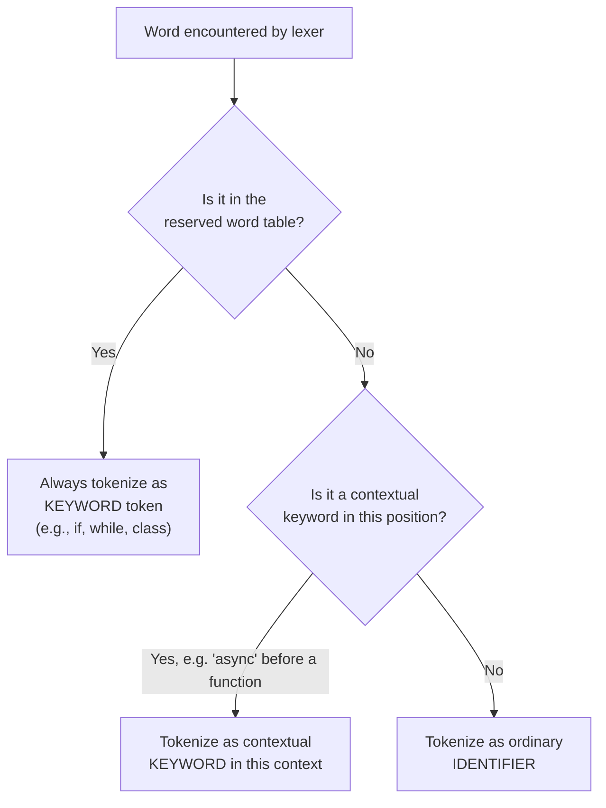

## Reserved Words versus Keywords

### Definitions

A **keyword** is a word in a programming language that has a predefined syntactic or semantic meaning within some context. A **reserved word** is a word that the language grammar forbids from being used as a user-defined identifier (variable, function, class name), regardless of context. The two terms overlap heavily in casual usage but are not strictly synonymous — the distinction lies in whether the special-meaning word can ever be reused as an identifier.

$$\text{Keywords} \cap \text{Reserved Words} \neq \varnothing, \quad \text{Keywords} \neq \text{Reserved Words}$$

Some languages have keywords that are *not* reserved (contextual keywords), and by definition every reserved word restricts identifier use, but not every keyword does.

### The Core Distinction

| Property | Keyword | Reserved Word |
|---|---|---|
| Has special meaning to the compiler/interpreter | Yes | Not necessarily on its own |
| Can be used as a variable/function name | Sometimes (if contextual) | Never |
| Recognized by the lexer as a fixed token | Yes | Yes |
| Meaning depends on surrounding context | Possible (contextual keywords) | Typically no — fixed token type everywhere |

A word can be:
1. **Reserved and a keyword** — e.g., `if`, `while`, `class` in most C-family languages: fixed meaning, never usable as an identifier.
2. **A keyword but not reserved (contextual keyword)** — e.g., `async` in some language versions, where it carries meaning in specific syntactic positions but remains legal as an identifier elsewhere.
3. **Reserved but arguably not a "keyword" in the traditional sense** — e.g., words reserved for future language expansion that currently have no defined behavior (some languages reserve words like `goto` or `const` for compatibility or future use even in early states of the language before full semantics were assigned).

### Why Languages Distinguish Them

Reserving every keyword outright is the simplest lexer design — the scanner just maintains a fixed lookup table of words that always produce a keyword token rather than an `IDENTIFIER` token. However, strict reservation has a cost: it permanently forbids that word as a name, which can break backward compatibility if a language later wants to introduce a new keyword (existing programs using that word as a variable name would suddenly fail to compile).

Contextual keywords exist specifically to avoid this problem — introducing new syntax without reserving new words, by making the lexer or parser interpret a word as special *only* in specific grammatical positions, and as an ordinary identifier everywhere else.



### Language-Specific Patterns

[Unverified] Exact keyword/reserved-word lists and their contextual status vary by language version and are subject to change through language evolution — the general mechanisms below describe common design patterns rather than a single canonical rule set.

- **C / C++**: keywords such as `int`, `return`, `struct` are fully reserved. C++ has historically added words like `override` and `final` as **contextual keywords** — they have special meaning only in specific declaration positions (e.g., after a member function signature) and remain valid identifiers elsewhere, specifically to avoid breaking existing code that already used those words as names.
- **Python**: keywords like `def`, `class`, `import` are reserved and cannot be used as identifiers at all — attempting `def = 5` is a syntax error. Python also has **soft keywords** (`match`, `case`, `type`, `_`), which behave as keywords only in specific statement positions and are otherwise valid identifiers.
- **JavaScript**: has both reserved words (`if`, `function`, `var`) and words reserved only in strict mode (`implements`, `interface`, `package`, `private`, `public` — a category historically called "future reserved words," reserved for possible future syntax).
- **Java**: reserves words like `goto` and `const`, which are not currently used for any operation in the language, purely to prevent them from being repurposed as identifiers in code that might later run on a version where they gain meaning.

### Soft/Contextual Keyword Example

```python
# 'match' and 'case' are soft keywords — meaningful here:
match command:
    case "start":
        begin()
    case "stop":
        halt()

# but legal as ordinary identifiers elsewhere:
match = 5          # valid: 'match' used as a variable name
case = "value"     # valid: 'case' used as a variable name
```

This dual behavior is only possible because Python's parser determines keyword-ness from grammatical position (immediately after certain statement starts) rather than from a blanket reservation in the lexer.

### Reserved-Word Table as a Lexer Structure (svg_diagram)

<svg xmlns="http://www.w3.org/2000/svg" viewBox="0 0 640 260">
  \<style\>
    .lbl { font-family: monospace, monospace; font-size: 13px; fill: #222; }
    .small { font-family: sans-serif; font-size: 12px; fill: #555; }
    .title { font-family: sans-serif; font-size: 15px; font-weight: bold; fill: #111; }
    .box { fill: #f4f4f4; stroke: #333; stroke-width: 1.5; }
    .reserved { fill: #fde8e8; stroke: #c53030; stroke-width: 1.5; }
    .contextual { fill: #fff8e1; stroke: #b7791f; stroke-width: 1.5; }
    .free { fill: #e8f5e9; stroke: #2e7d32; stroke-width: 1.5; }
  \</style\>

  <text x="20" y="24" class="title">Word Classification Table (svg_diagram)</text>

  <rect x="20" y="45" width="600" height="34" class="reserved" rx="4" />
  <text x="30" y="67" class="lbl">Reserved: if, while, class, return</text>
  <text x="470" y="67" class="small">never usable as identifier</text>

  <rect x="20" y="90" width="600" height="34" class="contextual" rx="4" />
  <text x="30" y="112" class="lbl">Contextual: match, override, async</text>
  <text x="470" y="112" class="small">keyword in position only</text>

  <rect x="20" y="135" width="600" height="34" class="free" rx="4" />
  <text x="30" y="157" class="lbl">Ordinary: total, calculate, myVar</text>
  <text x="470" y="157" class="small">always IDENTIFIER token</text>

  <text x="20" y="195" class="small">Reserved words shrink the space of legal identifiers permanently;</text>
  <text x="20" y="212" class="small">contextual keywords add syntax without shrinking that space.</text>
</svg>

### Practical Consequences for Language Design

Choosing to reserve a word versus making it contextual is a language-evolution trade-off:

- **Reserving outright** is simpler to implement and reason about, but it is a breaking change if the word was previously unreserved and already in use as an identifier in existing codebases.
- **Making it contextual** preserves backward compatibility but adds parser complexity, since keyword-ness must be resolved based on surrounding grammar rather than a simple table lookup at the lexer stage.

[Inference] This is likely why newer syntactic features in mature, widely-deployed languages (Python's `match`, C++'s `override`) tend to be introduced as contextual/soft keywords, while a language's original core control-flow words (`if`, `for`, `return`) are established as fully reserved from the outset, since there is no legacy code to break at that stage.

**Key Points**
- Every reserved word restricts identifier use; not every keyword is reserved — contextual/soft keywords are the exception.
- Reservation is a lexer-level, position-independent restriction; contextual keyword status is resolved at the parser level based on grammatical position.
- Language designers introduce contextual keywords specifically to add new syntax without breaking backward compatibility with existing identifier usage.
- Exact classification (reserved vs. contextual vs. future-reserved) is language- and version-specific.

**Related Topics**
- Lexemes and tokens (prerequisite concept — how the lexer classifies raw text)
- Contextual/soft keyword parsing strategies and parser lookahead
- Backward compatibility strategies in language evolution
- Identifier naming rules and valid identifier grammar
- Strict mode vs. non-strict mode reserved words (JavaScript case study)
- Future-reserved words and language versioning