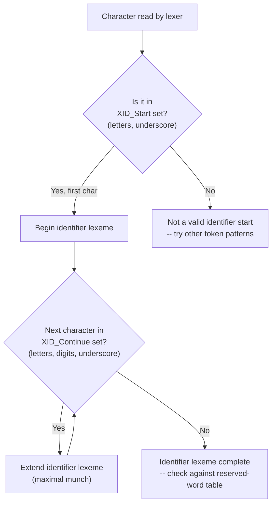

## Identifier Naming Rules Across Languages

### Definition

An **identifier** is a lexeme used to name a program entity — a variable, function, class, type, module, or label. Every language defines a grammar rule specifying which character sequences are valid identifiers; this rule is enforced at the lexical analysis stage, before parsing begins.

A generic identifier grammar, expressed in a simplified regular-expression-like form, is commonly:

$$\text{identifier} = [\text{letter}\ |\ \_]\ [\text{letter}\ |\ \text{digit}\ |\ \_]^*$$

This says: an identifier starts with a letter or underscore, followed by zero or more letters, digits, or underscores. Most C-family languages follow this core pattern, though the definition of "letter" varies significantly across languages, as discussed below.

### Common Structural Rules

Across the majority of mainstream languages, the following constraints recur:

- **Cannot start with a digit** — this avoids ambiguity with numeric literals (`123abc` would otherwise be indistinguishable from a malformed number token during maximal-munch scanning).
- **Case sensitivity** — most languages (C, C++, Java, Python, JavaScript, Rust, Go) treat `total` and `Total` as distinct identifiers. A minority of languages or environments are case-insensitive (e.g., traditional BASIC dialects, SQL keywords in many implementations, though SQL identifiers themselves are often case-insensitive too depending on the database engine).
- **No embedded whitespace** — since lexemes are bounded by whitespace/operator characters during scanning.
- **Reserved words excluded** — an identifier lexeme that matches the language's reserved-word table is tokenized as a keyword instead, not as an `IDENTIFIER`.

### Language-Specific Character Sets

[Unverified] Exact identifier rules are defined per language specification and can change across versions; the summary below reflects commonly documented behavior but implementers should consult the current language spec for edge cases.

| Language | Starts with | Body allows | Notable extension |
|---|---|---|---|
| C | letter, `_` | letters, digits, `_` | Implementation-defined limits on significant length in older standards |
| C++ | letter, `_` | letters, digits, `_` | Names starting with `_` followed by uppercase, or double underscore, are reserved for the implementation |
| Java | letter, `_`, `$` | letters, digits, `_`, `$`, Unicode letters | Full Unicode letter categories permitted by spec |
| Python | letter, `_`, Unicode | letters, digits, `_`, Unicode | Identifiers normalized via Unicode NFKC; non-ASCII letters (e.g., `変数`) are valid |
| JavaScript | letter, `_`, `$`, Unicode | letters, digits, `_`, `$`, Unicode | `$` is idiomatically used by libraries/frameworks |
| Go | Unicode letter, `_` | Unicode letters, digits, `_` | Case of the first letter controls export visibility (exported vs. package-private) |
| Rust | letter, `_`, Unicode (via XID) | letters, digits, `_` | A lone `_` is a special "discard" pattern, not a true identifier in binding contexts |
| Ruby | letter, `_` | letters, digits, `_` | Trailing `?` or `!` conventionally allowed on method names (`empty?`, `save!`) |

### Unicode Support: A Widening Trend

Older languages and specifications restricted identifiers to ASCII letters. Contemporary language specifications increasingly permit a broader Unicode range, using formal classifications such as the Unicode `XID_Start` and `XID_Continue` character properties (used by Python, Rust, and others) to define which characters may begin or continue an identifier — this avoids each language having to enumerate its own ad hoc Unicode rules and instead defers to a shared Unicode Standard Annex (UAX #31).

### Special-Meaning Prefixes and Suffixes

Several languages assign implicit meaning to specific characters within otherwise-legal identifiers, layered on top of the base lexical rule:

- **Go**: capitalization of the first letter of an identifier controls export visibility — `Total` (exported, package-public) versus `total` (unexported, package-private). This is a semantic rule, not a lexical one, but it means naming convention is load-bearing rather than purely stylistic.
- **Python**: leading underscores are a strong convention (not enforced by the lexer) signaling "internal use" (`_helper`), and a double leading underscore inside a class triggers **name mangling** at the semantic/compilation stage (`__private` becomes `_ClassName__private`).
- **C/C++**: identifiers with a leading underscore followed by an uppercase letter, or a leading double underscore, anywhere in global scope are reserved for the implementation (compiler/standard library) — user code that defines such names invokes undefined behavior per the standard, even though the identifier is lexically well-formed.
- **Ruby**: a trailing `?` conventionally marks a boolean-returning method (`empty?`) and a trailing `!` conventionally marks a mutating/"dangerous" variant (`sort!`) — these are community convention plus valid identifier characters at the language level, not separate token types.

### Identifier Length Limits

[Inference] Practical identifier length limits are largely a historical concern in modern mainstream languages, since most current specifications impose no meaningful upper bound, but this was not always true: older C standards guaranteed only a minimum number of significant characters (e.g., early standards guaranteeing as few as 31 or 63 significant characters for external identifiers), meaning characters beyond that limit could be silently ignored by a conforming but minimal implementation. Modern compilers for these languages typically support far longer names in practice, but relying on extremely long identifiers for cross-implementation portability carries [Unverified] risk depending on target toolchain compliance level.

### Identifier Grammar Comparison (svg_diagram)

<svg xmlns="http://www.w3.org/2000/svg" viewBox="0 0 640 240">
  \<style\>
    .lbl { font-family: monospace, monospace; font-size: 13px; fill: #222; }
    .small { font-family: sans-serif; font-size: 12px; fill: #555; }
    .title { font-family: sans-serif; font-size: 15px; font-weight: bold; fill: #111; }
    .box { fill: #f4f4f4; stroke: #333; stroke-width: 1.5; }
    .valid { fill: #e8f5e9; stroke: #2e7d32; stroke-width: 1.5; }
    .invalid { fill: #fde8e8; stroke: #c53030; stroke-width: 1.5; }
  \</style\>

  <text x="20" y="24" class="title">Identifier Validity Examples (svg_diagram)</text>

  <rect x="20" y="45" width="280" height="30" class="valid" rx="4" />
  <text x="30" y="65" class="lbl">total_count</text>
  <text x="320" y="65" class="small">valid: nearly all languages</text>

  <rect x="20" y="85" width="280" height="30" class="valid" rx="4" />
  <text x="30" y="105" class="lbl">$element</text>
  <text x="320" y="105" class="small">valid: JS; invalid: Python, C</text>

  <rect x="20" y="125" width="280" height="30" class="valid" rx="4" />
  <text x="30" y="145" class="lbl">変数名</text>
  <text x="320" y="145" class="small">valid: Python, Java, Rust (Unicode)</text>

  <rect x="20" y="165" width="280" height="30" class="invalid" rx="4" />
  <text x="30" y="185" class="lbl">2fast</text>
  <text x="320" y="185" class="small">invalid: nearly all languages</text>

  <rect x="20" y="205" width="280" height="30" class="invalid" rx="4" />
  <text x="30" y="225" class="lbl">my-var</text>
  <text x="480" y="225" class="small">invalid: hyphen not a continue char</text>
</svg>

### Why "my-var" Fails Lexically

The hyphen case above illustrates a cross-language ambiguity point: in most C-family and mainstream languages, `-` is the subtraction operator token, so `my-var` lexes as three separate tokens — `IDENTIFIER(my)`, `MINUS_OP`, `IDENTIFIER(var)` — rather than one identifier, because `-` is not in the identifier-continue character set. This is precisely why languages that idiomatically favor hyphenated names (e.g., Lisp dialects, CSS-adjacent DSLs) must either treat hyphen specially in their identifier grammar or use underscores/camelCase instead in languages that don't.

**Key Points**
- Identifier grammar is enforced at the lexer stage; a character sequence that fails the pattern either fails to tokenize as an identifier or splits into multiple tokens.
- The near-universal base rule is "letter/underscore start, letter/digit/underscore continue," with growing Unicode support (`XID_Start`/`XID_Continue`) replacing ASCII-only rules in modern specifications.
- Case sensitivity is the default in most mainstream languages; case-insensitivity is the exception.
- Some languages layer semantic meaning onto lexically valid identifiers (Go's export capitalization, Python's name mangling) — these are separate from the lexical validity rule itself.
- Reserved implementation-use prefixes (e.g., leading underscore + uppercase in C/C++) are lexically legal but off-limits by specification convention for user code.

**Related Topics**
- Reserved words versus keywords (how the reserved-word table interacts with identifier tokenization)
- Unicode Standard Annex #31 and `XID_Start`/`XID_Continue` properties
- Name mangling and symbol table representation
- Scope and visibility rules (Go's export-by-capitalization as a case study)
- Naming convention styles (camelCase, snake_case, PascalCase) as a distinct stylistic layer atop lexical rules
- Lexemes and tokens (prerequisite foundational concept)