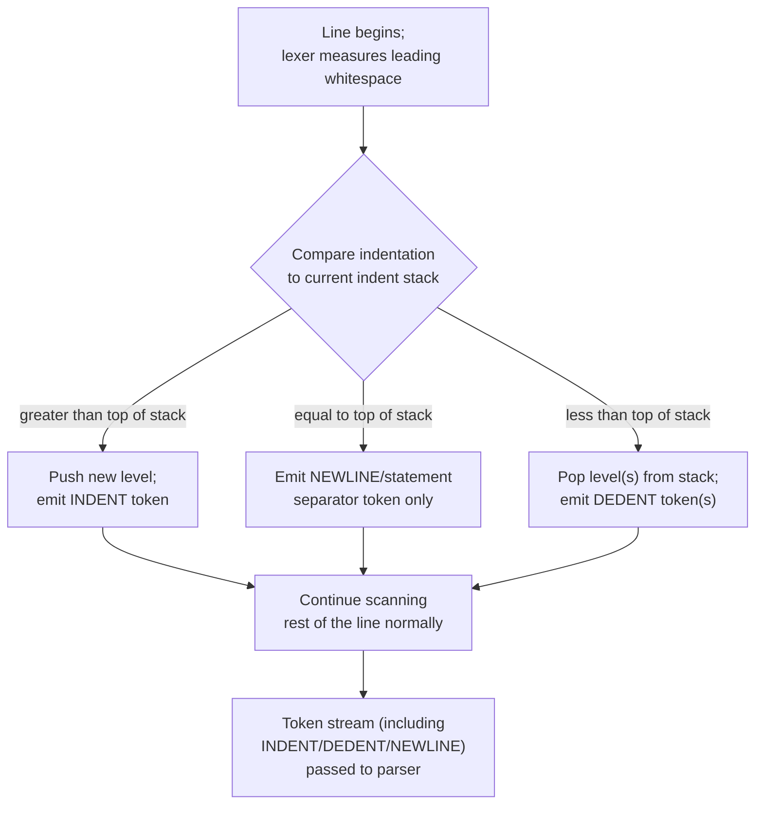

## Whitespace and Free-Form versus Layout-Sensitive Syntax

### Definition

**Free-form syntax** means whitespace (spaces, tabs, newlines) is not semantically significant beyond serving as a token separator — the lexer consumes and discards it, and program structure is instead delimited by explicit tokens (braces, keywords, terminators). **Layout-sensitive syntax** (also called **whitespace-sensitive** or **indentation-sensitive** syntax) means whitespace — particularly indentation and line breaks — carries grammatical meaning and is translated by the lexer into structural tokens that the parser consumes.

$$\text{Free-form: whitespace} \rightarrow \varnothing \text{ (discarded)} \qquad \text{Layout-sensitive: whitespace} \rightarrow \text{INDENT} \mid \text{DEDENT} \mid \text{NEWLINE (tokens)}$$

### Free-Form Languages

In free-form languages (C, C++, Java, JavaScript, Rust, Go's braces, SQL), block structure is delimited explicitly:

```c
if (x > 0) {
    printf("positive");
}
```

The following is lexically and syntactically identical to the compiler, despite radically different visual layout:

```c
if(x>0){printf("positive");}
```

Whitespace here exists purely for human readability; the lexer treats runs of spaces, tabs, and newlines as delimiters to be skipped, not as tokens forwarded to the parser. [Inference] This is likely why free-form languages tolerate arbitrary reformatting by automated tools (code formatters) without any risk of altering program behavior — the formatter is free to reflow whitespace since the grammar never references it.

### Layout-Sensitive Languages

In layout-sensitive languages (Python, Haskell, YAML as a data format, F#, Nim), indentation itself determines block boundaries — there is no equivalent brace-delimited construct required:

```python
if x > 0:
    print("positive")
    print("still in the if-block")
print("outside the if-block")
```

Here, the change in indentation level is not cosmetic — removing it or changing it inconsistently produces either a different program or a syntax error (`IndentationError` in Python's case).

### The Lexer's Role: Converting Layout into Tokens

The key mechanical point is that even in layout-sensitive languages, the *parser* still typically operates on a flat token stream and does not itself inspect column positions — the *lexer* is the phase responsible for converting indentation changes into explicit synthetic tokens (commonly named `INDENT` and `DEDENT`), and the parser's grammar rules then reference those tokens exactly as they would reference an explicit `{` or `}` in a free-form language.



### The Indent Stack Mechanism

Python's reference lexer behavior (and similar implementations elsewhere) tracks indentation using a stack of previously seen indentation widths, conceptually:

- Start with a stack containing a base indentation of `0`.
- On each new logical line, compare its leading whitespace width to the top of the stack.
- If greater, push the new width and emit `INDENT`.
- If equal, emit nothing extra (or a statement separator) — same block continues.
- If less, pop until the stack top matches the new width, emitting one `DEDENT` per pop; if no exact match is found, this is an indentation error.

[Inference] This stack-based approach is what allows nested blocks of arbitrary depth to be represented as a flat sequence of `INDENT`/`DEDENT` tokens without the parser needing any special awareness of column numbers, since each `INDENT` conceptually pairs with a later `DEDENT` the same way an opening brace pairs with a closing one.

### Indentation Stack Visualization (svg_diagram)

<svg xmlns="http://www.w3.org/2000/svg" viewBox="0 0 640 260">
  \<style\>
    .lbl { font-family: monospace, monospace; font-size: 13px; fill: #222; }
    .small { font-family: sans-serif; font-size: 12px; fill: #555; }
    .title { font-family: sans-serif; font-size: 15px; font-weight: bold; fill: #111; }
    .code { fill: #f4f4f4; stroke: #333; stroke-width: 1; }
    .stack { fill: #e8f0fe; stroke: #2c5cc5; stroke-width: 1.5; }
  \</style\>

  <text x="20" y="24" class="title">Source vs Indent Stack Over Time (svg_diagram)</text>

  <rect x="20" y="40" width="330" height="150" class="code" rx="4" />
  <text x="30" y="60" class="lbl">def f():</text>
  <text x="30" y="80" class="lbl">    if x:</text>
  <text x="30" y="100" class="lbl">        print(x)</text>
  <text x="30" y="120" class="lbl">    return x</text>
  <text x="30" y="140" class="lbl">print("done")</text>

  <text x="30" y="170" class="small">col 0 / 4 / 8 / 4 / 0</text>

  <rect x="380" y="40" width="240" height="150" class="stack" rx="4" />
  <text x="390" y="60" class="lbl">stack: [0]</text>
  <text x="390" y="80" class="lbl">→ INDENT → [0,4]</text>
  <text x="390" y="100" class="lbl">→ INDENT → [0,4,8]</text>
  <text x="390" y="120" class="lbl">→ DEDENT → [0,4]</text>
  <text x="390" y="140" class="lbl">→ DEDENT → [0]</text>

  <text x="20" y="215" class="small">Each INDENT/DEDENT is emitted as a synthetic token, mirroring how</text>
  <text x="20" y="232" class="small">free-form languages use explicit { and } tokens for the same structure.</text>
</svg>

### Hybrid and Edge Cases

Not all languages fall cleanly into one category:

- **Haskell's layout rule** is formally specified as a translation from indentation to explicit braces and semicolons (the "offside rule"), and the language additionally permits the programmer to bypass it entirely by writing explicit `{ ; }` braces manually — meaning Haskell supports both layout-sensitive and free-form expression of the same structure, with the layout algorithm essentially acting as syntactic sugar defined in terms of the explicit-brace grammar.
- **F#** is layout-sensitive by default (lightweight syntax) but historically also supported a verbose, brace/keyword-delimited mode in early versions. [Unverified] Current tooling and version support for the verbose mode may have changed since; this should be checked against current F# documentation for a specific version target.
- **CoffeeScript** and similar languages compile indentation-based source into a free-form target language (JavaScript), meaning the layout-sensitivity exists only in the source grammar, not in the semantics of the emitted code.

### Trade-offs

| Aspect | Free-form | Layout-sensitive |
|---|---|---|
| Visual formatting freedom | High — reformatting never changes meaning | Constrained — indentation *is* meaning |
| Explicit block delimiters needed | Yes (`{}`, `begin`/`end`, etc.) | No — indentation replaces them |
| Risk from mixed tabs/spaces | None (whitespace is cosmetic) | Real — inconsistent whitespace can cause errors or, worse, silently valid-but-wrong indentation |
| Copy-paste across contexts | Safe | Requires re-indentation to preserve meaning |
| Lexer complexity | Lower — simple skip rule | Higher — requires stateful indent-stack tracking |

[Inference] The mixed-tabs-and-spaces risk in layout-sensitive languages is a commonly cited practical drawback, since two lines that appear visually identical in some editors (due to differing tab-width settings) can have different actual column counts internally, motivating Python's decision in Python 3 to disallow mixing tabs and spaces in a way that produces ambiguous indentation, raising a `TabError` rather than guessing.

### Why the Parser Doesn't Need to Change

A useful conceptual takeaway: from the parser's point of view, there is often no fundamental difference between free-form and layout-sensitive grammars — both consume a flat sequence of tokens where block boundaries are marked by *some* token (`{`/`}` in one case, `INDENT`/`DEDENT` in the other). The complexity of layout sensitivity is concentrated almost entirely in the lexer, which is why it's typically discussed as a lexical structure topic rather than a parsing topic, even though its effects are ultimately syntactic (structural).

**Key Points**
- Free-form syntax discards whitespace after using it only as a token separator; layout-sensitive syntax converts whitespace changes into explicit `INDENT`/`DEDENT`/`NEWLINE` tokens.
- The indent-stack algorithm is the standard mechanism for translating column-position changes into a flat, parser-consumable token stream.
- Layout sensitivity is a lexer-level responsibility; the parser's grammar treats synthetic indentation tokens the same way it would treat explicit braces.
- Some languages (Haskell) formally define their layout rule as sugar over an equivalent explicit-brace grammar, supporting both styles.
- The main practical trade-off is formatting freedom and copy-paste safety (favoring free-form) versus reduced visual clutter and enforced consistent structure (favoring layout-sensitive).

**Related Topics**
- Lexemes and tokens (prerequisite — INDENT/DEDENT are synthetic tokens)
- Reserved words versus keywords
- Haskell's offside rule and layout algorithm formalization
- Lexer state and stateful scanning (indent-stack as an example of lexer state beyond simple regex matching)
- Parser grammar design for block-structured languages
- Code formatting tools and their relationship to free-form vs. layout-sensitive grammars