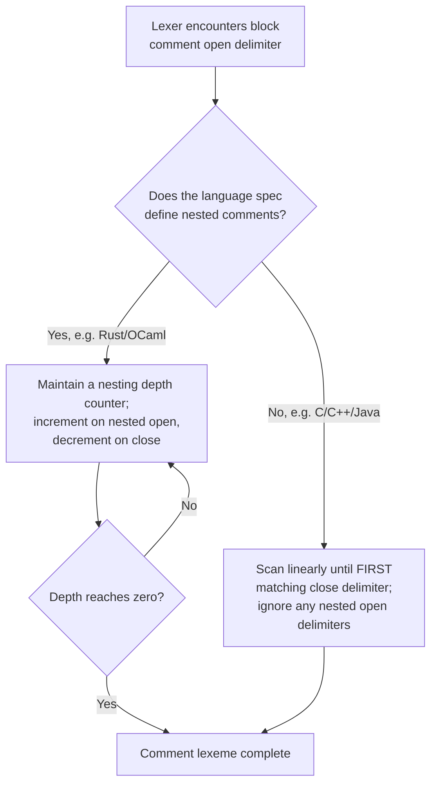

## Comment Conventions

### Definition

A **comment** is source text intended for human readers that is excluded from the executable meaning of the program. Lexically, comments are recognized and matched by the lexer according to a defined pattern, then typically discarded rather than forwarded as a token to the parser — comments are lexemes without a corresponding meaningful token in the language's grammar.

### The Two Fundamental Forms

Nearly all mainstream languages implement one or both of two comment styles:

- **Line comments** — begin with a fixed delimiter and extend to the end of the physical line (terminated implicitly by the newline character).
- **Block comments** — begin with an opening delimiter and end with a matching closing delimiter, potentially spanning multiple lines.

$$\text{line-comment} = \text{delimiter} \cdot [\text{any char except newline}]^* \cdot \text{newline}$$
$$\text{block-comment} = \text{open-delim} \cdot [\text{any char}]^* \cdot \text{close-delim}$$

### Delimiter Survey Across Languages

| Language | Line comment | Block comment |
|---|---|---|
| C | — (C89 lacked line comments) | `/* ... */` |
| C++ / C99+ / Java / JavaScript / Go / Rust | `//` | `/* ... */` |
| Python | `#` | none native (triple-quoted strings often used as a convention) |
| Ruby | `#` | `=begin` / `=end` |
| Haskell | `--` | `{- ... -}` |
| SQL | `--` | `/* ... */` |
| Lisp/Scheme | `;` | `#| ... |#` (implementation-dependent) |
| Assembly (x86, various) | `;` | varies by assembler |

[Unverified] Exact comment syntax availability can vary across language standard versions and vendor-specific extensions (e.g., some assemblers or SQL dialects support additional comment forms); the table reflects commonly documented mainstream behavior.

### Why Block Comments Typically Cannot Nest

A common lexical trap: in most C-family languages, block comments do **not** nest, because the lexer's matching rule for `/* ... */` is typically a simple "scan until the first occurrence of the closing delimiter," not a balanced-pair counter:

```c
/* outer comment
   /* inner comment */
   this code is now UNCOMMENTED and will be parsed as real code
*/
```

The lexer matches the *first* `*/` it encounters (after the inner comment), closing the block comment there — the text `this code is now UNCOMMENTED...*/` is left outside the comment and gets tokenized as ordinary source code, typically producing a syntax error or, worse, silently valid-but-unintended code. [Inference] This non-nesting behavior is likely a deliberate simplicity trade-off in the lexer's regular-expression-based matching, since implementing nested-comment matching requires tracking a nesting depth counter rather than a simple linear scan — a small added complexity that most C-derived language designers chose to avoid.

Some languages deliberately support nested block comments as a documented feature, requiring the lexer to maintain a depth counter rather than scan-to-first-match: Rust's `/* ... */` block comments nest correctly, and OCaml's `(* ... *)` comments also nest.



### Documentation Comments: A Semantically Distinct Category

Many languages define a special comment subform recognized not just by the lexer for discarding, but also by external tooling (documentation generators) for extracting structured documentation. These occupy an interesting middle ground: lexically they are still comments (discarded from the executable token stream), but a specific delimiter variant signals to a separate tool that the content should be parsed as structured documentation.

- **Java**: `/** ... */` (Javadoc) — the double-asterisk opener is the trigger recognized by the Javadoc tool, distinct from an ordinary `/* ... */` block comment.
- **Rust**: `///` (outer doc comment, line-based) and `//!` (inner/module-level doc comment) are lexically comments but are additionally captured by the compiler itself as documentation attributes and can be rendered by `rustdoc`.
- **Python**: docstrings are not comments at all in the lexical sense — a string literal placed as the first statement in a module, function, or class body is an ordinary string literal token, retained at runtime as the object's `__doc__` attribute, not discarded like a `#` comment.
- **C#**: `///` triple-slash comments containing XML tags, parsed by the compiler/IDE tooling for structured documentation and IntelliSense generation.

This distinction matters lexically: a true comment lexeme is discarded before the parser ever sees it, while Python's docstring is a `STRING_LITERAL` token that survives into the parse tree and remains a runtime-accessible value — the two achieve a similar *documentation* purpose through entirely different lexical/token pathways.

### Comment Delimiter Anatomy (svg_diagram)

<svg xmlns="http://www.w3.org/2000/svg" viewBox="0 0 640 220">
  \<style\>
    .lbl { font-family: monospace, monospace; font-size: 13px; fill: #222; }
    .small { font-family: sans-serif; font-size: 12px; fill: #555; }
    .title { font-family: sans-serif; font-size: 15px; font-weight: bold; fill: #111; }
    .discard { fill: #fde8e8; stroke: #c53030; stroke-width: 1.5; }
    .keep { fill: #e8f5e9; stroke: #2e7d32; stroke-width: 1.5; }
  \</style\>

  <text x="20" y="24" class="title">Comment vs Docstring Token Fate (svg_diagram)</text>

  <rect x="20" y="45" width="590" height="34" class="discard" rx="4" />
  <text x="30" y="67" class="lbl">// this explains the function     -&gt; discarded, no token emitted</text>

  <rect x="20" y="90" width="590" height="34" class="discard" rx="4" />
  <text x="30" y="112" class="lbl">/* block comment */              -&gt; discarded, no token emitted</text>

  <rect x="20" y="135" width="590" height="34" class="keep" rx="4" />
  <text x="30" y="157" class="lbl">"""Python docstring"""           -&gt; STRING_LITERAL token, kept</text>

  <text x="20" y="190" class="small">Doc-comment variants (///, /** */) are discarded from the code token stream</text>
  <text x="20" y="207" class="small">but re-captured separately by documentation tooling reading raw source text.</text>
</svg>

### Comments and Whitespace-Sensitive Languages

In layout-sensitive languages (see indentation-sensitive syntax), a comment occupying an entire line is typically excluded from indentation-level calculations — the lexer skips comment-only lines when determining `INDENT`/`DEDENT` boundaries, treating them as if blank, rather than letting a comment's own leading whitespace accidentally alter the indent stack. [Inference] This behavior follows naturally from comments being discarded before indentation analysis in most documented lexer implementations, though the precise order of operations (whether comment-stripping happens before or interleaved with indentation measurement) is an implementation detail that can differ between specific lexer designs.

### String Literals That Look Like Comment Delimiters

A subtlety worth noting for lexer implementers: comment delimiter sequences appearing inside a string literal must not be misinterpreted as starting a comment. A lexer must recognize and fully consume a `STRING_LITERAL` lexeme (respecting its own escape and quote rules) *before* it attempts to match comment-start patterns, or a correctly ordered rule precedence (e.g., matching the longer/more specific string pattern first) must ensure the string's contents are never re-scanned for comment delimiters:

```javascript
const url = "http://example.com"; // the // inside the string is NOT a comment start
```

This is generally handled by the lexer's rule precedence or maximal-munch behavior recognizing the opening quote and consuming the entire string lexeme atomically, rather than scanning character-by-character for `//` independently of string context.

**Key Points**
- Comments are lexemes matched and typically discarded by the lexer, producing no token consumed by the parser's grammar.
- Line comments extend to end-of-line; block comments require an explicit matching close delimiter.
- Most C-family block comments do not nest (first-match-wins scanning); some languages (Rust, OCaml) deliberately implement nested comment support via a depth counter.
- Documentation comment variants (`/** */`, `///`, `//!`) remain lexically discarded from the executable token stream but are separately captured by tooling for documentation generation.
- Python docstrings are lexically distinct from comments — they are `STRING_LITERAL` tokens retained through parsing and available at runtime, not discarded lexemes.
- String literal contents must be consumed atomically by the lexer so that comment-delimiter-like substrings inside strings are never misinterpreted as starting a comment.

**Related Topics**
- Lexemes and tokens (prerequisite — how comments are matched and discarded)
- String literal lexical rules and escape sequences
- Whitespace and layout-sensitive syntax (interaction between comment-only lines and indentation)
- Documentation generator tooling (Javadoc, rustdoc, Doxygen) and their comment-parsing conventions
- Lexer rule precedence and maximal munch
- Nested structure matching in lexical analysis (contrasted with parser-level balanced matching)