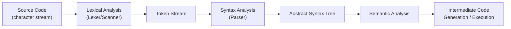
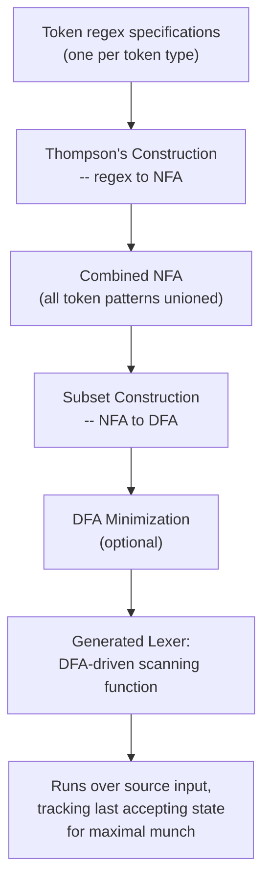

## Lexical Analysis and the Tokenization Process

### Definition

**Lexical analysis** (also called **scanning** or **tokenization**) is the first phase of a compiler or interpreter's front end. It consumes a raw stream of source characters and produces a stream of tokens — categorized lexical units — that the subsequent parsing phase consumes. The component performing this work is called a **lexer**, **scanner**, or **tokenizer** (terms used largely interchangeably, though some texts reserve "scanner" for the character-reading subcomponent and "lexer" for the whole phase).

$$\text{Lexical Analysis}: \Sigma^* \rightarrow \text{Token}^*$$

where $\Sigma^*$ is the set of all possible character strings over the source alphabet, and $\text{Token}^*$ is a sequence of `(type, value)` pairs.

### Position in the Compilation Pipeline

Lexical analysis is deliberately separated from parsing as its own phase (rather than having the parser read raw characters directly) for well-established engineering reasons: it simplifies the grammar the parser must handle (working over a small finite token alphabet rather than an unbounded character alphabet), allows independent optimization of the scanning process, and cleanly isolates concerns like whitespace/comment handling that are irrelevant to syntactic structure.

### The Core Algorithm: Pattern Matching via Regular Languages

Each token type is defined by a **regular expression** (or equivalently, recognized by a **finite automaton**), since the set of valid lexemes for any given token category — identifiers, numbers, operators — is a regular language. The lexer's job reduces to: at each position in the input, determine which regular expression(s) match, and select a lexeme according to two standard disambiguation rules:

1. **Maximal munch (longest match)** — among all patterns that match starting at the current position, choose the longest possible lexeme.
2. **Rule priority (first match wins on ties)** — if multiple patterns match the same longest lexeme, the pattern listed first in the lexer specification wins. This is precisely how keywords are distinguished from identifiers: both `if` and the general identifier pattern match the text `if`, but the keyword rule is given priority.

$$\text{selected lexeme} = \underset{p \in \text{Patterns}}{\arg\max}\ |\text{match}(p, \text{input}, \text{position})|$$

### Implementation via Finite Automata

Lexer generators (Lex, Flex, ANTLR's lexer, re2c) implement this matching process by converting the union of all token regular expressions into a single **deterministic finite automaton (DFA)**:

1. Each token's regex is converted to a nondeterministic finite automaton (NFA), typically via **Thompson's construction**.
2. The individual NFAs are combined and converted to an equivalent DFA via the **subset construction** algorithm, which eliminates nondeterminism by tracking sets of NFA states as single DFA states.
3. The DFA is optionally minimized to reduce the number of states while preserving the same accepted language.
4. The generated lexer runs this DFA over the input, tracking the last accepting state reached to implement maximal munch — the tokenizer advances character by character, remembering the most recent point where an accepting state was reached, and backtracks to that point when no further transition is possible.

### The Scanning Loop in Practice

At a conceptual level, a lexer's main loop performs:

1. Skip any characters matching whitespace/comment patterns (typically discarded, per the language's rules — see whitespace and comment convention topics).
2. From the current position, run the DFA, consuming characters and tracking the most recent accepting state and its position.
3. When no transition is possible (or input ends), backtrack to the last accepting state's position; the characters consumed up to there form the lexeme.
4. Emit the corresponding token (type + attribute value, e.g., extracting the numeric value from a `NUMBER` lexeme or the name from an `IDENTIFIER` lexeme).
5. Resume scanning from just after the consumed lexeme.
6. Repeat until the input is exhausted, at which point an `EOF` (end-of-file) token is typically emitted to signal completion to the parser.

### Handling Lexical Errors

When no pattern matches at the current input position (a character or sequence that fits no defined token pattern), the lexer must report a **lexical error**. Common recovery strategies include: skipping the single offending character and continuing (panic-mode-style recovery, allowing the lexer to continue reporting further errors in the same pass rather than halting immediately), or halting scanning and reporting the position immediately. [Inference] Modern lexers generally favor the skip-and-continue approach specifically to allow batch reporting of multiple lexical errors in one compilation pass, since stopping at the first error would force a user to fix and recompile repeatedly to discover subsequent unrelated errors.

### Lookahead and Context Sensitivity

Pure lexical analysis is theoretically context-free with respect to the parser — the lexer does not know the grammatical role a token will play. However, some tokenization decisions require lookahead beyond a single character:

- Distinguishing `<=` from `<` followed by `=` requires examining the character after `<`.
- Distinguishing a language's multi-character operators generally (`==`, `!=`, `->`, `::`) from their single-character prefixes requires bounded lookahead, which a DFA handles naturally since it simply continues consuming characters as long as a longer match remains possible.
- Some languages require lexer states beyond a simple DFA scan — for example, handling string interpolation (`f"value: {x}"` in Python) requires the lexer to switch between a "string content" mode and an "embedded expression" mode, effectively requiring a **stateful lexer** with multiple sub-automata rather than one flat DFA. [Inference] This kind of construct is a documented reason some lexer generators support explicit lexer states/modes as a first-class feature, rather than attempting to express the entire tokenization job as a single regular language, since interpolation nesting can be arbitrarily complex.

### DFA-Driven Scanning Walkthrough (svg_diagram)

<svg xmlns="http://www.w3.org/2000/svg" viewBox="0 0 640 260">
  \<style\>
    .lbl { font-family: monospace, monospace; font-size: 13px; fill: #222; }
    .small { font-family: sans-serif; font-size: 12px; fill: #555; }
    .title { font-family: sans-serif; font-size: 15px; font-weight: bold; fill: #111; }
    .state { fill: #e8f0fe; stroke: #2c5cc5; stroke-width: 1.5; }
    .accept { fill: #e8f5e9; stroke: #2e7d32; stroke-width: 2; }
  \</style\>

  <text x="20" y="24" class="title">DFA Trace for Input "&lt;=" (svg_diagram)</text>

  <circle cx="80" cy="120" r="30" class="state" />
  <text x="80" y="125" class="lbl" text-anchor="middle">S0</text>

  <line x1="110" y1="120" x2="200" y2="120" stroke="#333" stroke-width="1.5" marker-end="url(#a1)" />
  <text x="150" y="110" class="small" text-anchor="middle">'&lt;'</text>

  <circle cx="240" cy="120" r="30" class="accept" />
  <text x="240" y="125" class="lbl" text-anchor="middle">S1*</text>
  <text x="240" y="165" class="small" text-anchor="middle">accepts LT_OP</text>

  <line x1="270" y1="120" x2="380" y2="120" stroke="#333" stroke-width="1.5" marker-end="url(#a1)" />
  <text x="325" y="110" class="small" text-anchor="middle">'='</text>

  <circle cx="420" cy="120" r="30" class="accept" />
  <text x="420" y="125" class="lbl" text-anchor="middle">S2*</text>
  <text x="420" y="165" class="small" text-anchor="middle">accepts LE_OP</text>

  <text x="20" y="220" class="small">S1 is an accepting state (would emit LT_OP if input stopped there),</text>
  <text x="20" y="237" class="small">but scanning continues to S2 -- maximal munch prefers the longer LE_OP match.</text>
</svg>

### Lexical Analysis versus Later Phases: A Boundary Summary

| Concern | Handled by lexer? | Handled by parser/later phase? |
|---|---|---|
| Is this character sequence a valid identifier shape? | Yes | No |
| Is `if` a keyword or identifier here? | Yes (via rule priority) | No |
| Is this token sequence a syntactically valid statement? | No | Yes (parser) |
| Does this identifier refer to a declared variable? | No | Yes (semantic analysis) |
| Are matching parentheses balanced? | No (parentheses are just tokens to the lexer) | Yes (parser, via grammar rules) |
| Where does indentation-based block start/end? | Yes (INDENT/DEDENT emission) | No — parser just consumes the tokens |

This boundary is a foundational reason lexical analysis and syntax analysis are taught and implemented as separate, sequential phases: the lexer answers "what regular-language category does this substring belong to," while the parser answers "does this sequence of categories form a valid sentence in the language's context-free grammar" — two fundamentally different classes of formal language question (regular vs. context-free), each solved with tools suited to that class.

**Key Points**
- Lexical analysis converts a character stream into a token stream, using regular expressions/finite automata as the underlying formal model.
- Maximal munch and rule priority are the two standard disambiguation rules resolving cases where multiple token patterns could match.
- Lexer generators mechanically build a DFA from token regexes via Thompson's construction and subset construction, then minimize it.
- Some tokenization scenarios (string interpolation, layout sensitivity) require a stateful lexer with multiple modes rather than a single flat DFA.
- The lexer/parser boundary corresponds to the regular-language/context-free-language boundary in formal language theory — this is the theoretical justification for treating them as separate compilation phases.

**Related Topics**
- Lexemes and tokens (foundational vocabulary for this topic)
- Reserved words versus keywords (rule-priority disambiguation case study)
- Identifier naming rules across languages
- Whitespace and layout-sensitive syntax (stateful lexer example)
- Comment conventions (discarded-lexeme case study)
- Regular expressions, NFAs, DFAs, and Thompson's/subset construction algorithms
- Parser theory and context-free grammars (the next compilation phase)
- Lexer generator tools (Lex, Flex, ANTLR)