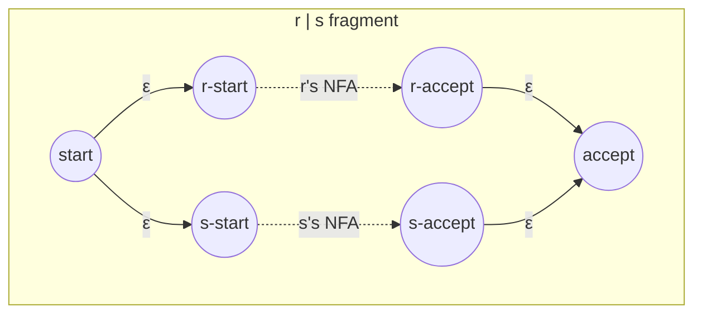
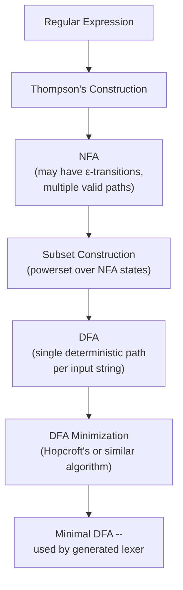

## Regular Expressions and Finite Automata for Lexers

### Definition

**Regular expressions** are a formal notation for describing patterns over strings, and the set of strings matched by a given regular expression is called a **regular language**. **Finite automata** (finite state machines) are the computational model that recognizes exactly the class of regular languages — the two formalisms are provably equivalent in expressive power. Lexical analysis relies on this equivalence: every token category is specified as a regular expression, then mechanically converted into a finite automaton that a lexer can execute efficiently over the source character stream.

$$\text{Regular Expressions} \equiv \text{Finite Automata} \equiv \text{Regular Languages}$$

### Regular Expression Building Blocks

A regular expression over an alphabet $\Sigma$ is built from a small set of primitive operations, each corresponding to a construction on the language (set of strings) it denotes:

- **Empty string**: $\varepsilon$ — matches the zero-length string.
- **Literal symbol**: $a$ (for $a \in \Sigma$) — matches exactly the single character $a$.
- **Concatenation**: $rs$ — matches a string formed by a match of $r$ immediately followed by a match of $s$.
- **Union (alternation)**: $r \mid s$ — matches any string matched by $r$ or by $s$.
- **Kleene star**: $r^*$ — matches zero or more concatenated repetitions of strings matched by $r$.

From these five primitives, common extensions used in practical lexer specifications are derived:

$$r^+ = rr^* \quad (\text{one or more repetitions})$$
$$r? = r \mid \varepsilon \quad (\text{zero or one occurrence})$$
$$[a\text{-}z] = a \mid b \mid \cdots \mid z \quad (\text{character class, sugar for a union})$$

### Example: Token Patterns as Regular Expressions

Common token categories, expressed formally:

$$\text{identifier} = [a\text{-}zA\text{-}Z\_] \, [a\text{-}zA\text{-}Z0\text{-}9\_]^*$$
$$\text{integer} = [0\text{-}9]^+$$
$$\text{float} = [0\text{-}9]^+ \, . \, [0\text{-}9]^+$$
$$\text{whitespace} = (\text{' '} \mid \text{'}\backslash t\text{'} \mid \text{'}\backslash n\text{'})^+$$

These closely mirror the identifier grammar discussed in the identifier naming rules topic — the informal "letter or underscore, then letters/digits/underscore" description is precisely what the regular expression above encodes formally.

### From Regex to NFA: Thompson's Construction

**Thompson's construction** is the standard algorithm converting a regular expression into an equivalent **nondeterministic finite automaton (NFA)**, built compositionally — each regex operator has a fixed NFA fragment template, and fragments are wired together to match the expression's structure:

- A literal $a$ becomes a two-state fragment with a single transition on $a$.
- Concatenation $rs$ chains the accepting state of $r$'s fragment to the start state of $s$'s fragment via an $\varepsilon$-transition.
- Union $r \mid s$ adds a new start state with $\varepsilon$-transitions branching to both $r$'s and $s$'s start states, and both accepting states $\varepsilon$-transition to a new shared accepting state.
- Kleene star $r^*$ wraps $r$'s fragment with $\varepsilon$-transitions allowing the machine to skip it entirely (zero repetitions) or loop back into it (repeat).

Because each construction step introduces $\varepsilon$-transitions and potentially multiple simultaneous valid paths, the resulting automaton is nondeterministic — at a given state and input symbol, more than one transition (or an $\varepsilon$-transition) may be available, and a naive execution would need to explore multiple possibilities at once, which is not directly executable as a simple, efficient single-path scanning loop.

### From NFA to DFA: Subset Construction

Because a nondeterministic automaton isn't directly suitable for efficient single-pass scanning, lexer generators apply the **subset construction algorithm** (also called the powerset construction) to produce an equivalent **deterministic finite automaton (DFA)**. The core idea: each state in the resulting DFA corresponds to a *set* of NFA states — specifically, the set of all NFA states reachable via $\varepsilon$-transitions from wherever the NFA could currently be, given the input consumed so far.

1. Compute the $\varepsilon$-closure of the NFA's start state — this becomes the DFA's start state.
2. For each DFA state (a set of NFA states) and each input symbol, compute the set of NFA states reachable by that symbol from any state in the set, then take the $\varepsilon$-closure of that result — this becomes a new DFA state (or an existing one, if the same set was already produced).
3. Repeat until no new DFA states are generated.
4. A DFA state is accepting if it contains at least one accepting NFA state.

$$\text{DFA state} = \varepsilon\text{-closure}\big(\{\, q \mid q \text{ reachable from some NFA state in the current set via input symbol } a \,\}\big)$$

This algorithm guarantees termination because the number of possible DFA states is bounded above by $2^{n}$, where $n$ is the number of NFA states — the DFA state space is exactly the power set of the NFA state space, which is finite.

### DFA Minimization

The subset construction can produce a DFA with more states than strictly necessary to recognize the same language. **DFA minimization** algorithms (such as **Hopcroft's algorithm**) merge states that are behaviorally indistinguishable — two states are equivalent if, for every possible remaining input suffix, they either both lead to acceptance or both lead to rejection. Minimization reduces memory footprint and can improve cache locality during scanning, though [Inference] the practical performance benefit for typical programming-language lexers (which have relatively small token alphabets compared to, say, natural-language pattern matching) is likely modest compared to the correctness and maintainability value of a canonical minimal representation.

### Why DFAs (Not NFAs) Are Used at Runtime

The entire regex → NFA → DFA pipeline exists because of a key complexity trade-off:

| Property | NFA | DFA |
|---|---|---|
| States needed to represent a pattern | Can be smaller (linear in regex size) | Can be exponentially larger in the worst case |
| Matching time per input symbol | Must track a set of possible current states | Exactly one current state — O(1) transition lookup |
| Practical execution | Requires simulating multiple paths, or backtracking | Simple table/array lookup per character |
| Suitability for high-throughput scanning | Poor without conversion | Well-suited |

A lexer must process every character of potentially large source files with minimal per-character overhead, which is precisely the strength a DFA offers: given the current state and next input character, a single array lookup determines the next state, with no branching search over multiple possibilities required.

### DFA Execution and Maximal Munch Together

During actual scanning, the DFA is driven forward one character at a time from the current input position. Because token patterns are typically closed under prefixes being non-accepting followed by longer accepting extensions (e.g., `<` alone is accepting for `LT_OP`, but the DFA can still continue if `=` follows, reaching a *different* accepting state for `LE_OP`), the scanner must remember the **last position at which an accepting state was reached**, continue consuming characters as long as transitions remain defined, and — upon reaching a dead state (no valid transition) or end of input — roll back the input pointer to that last remembered accepting position. This mechanical procedure is exactly what implements maximal munch in practice, as introduced in the lexical analysis and tokenization process topic.

### State Diagram for a Small Combined Lexer (svg_diagram)

<svg xmlns="http://www.w3.org/2000/svg" viewBox="0 0 640 260">
  \<style\>
    .lbl { font-family: monospace, monospace; font-size: 12px; fill: #222; }
    .small { font-family: sans-serif; font-size: 11px; fill: #555; }
    .title { font-family: sans-serif; font-size: 15px; font-weight: bold; fill: #111; }
    .state { fill: #e8f0fe; stroke: #2c5cc5; stroke-width: 1.5; }
    .accept { fill: #e8f5e9; stroke: #2e7d32; stroke-width: 2; }
  \</style\>

  <text x="20" y="24" class="title">Combined DFA: Identifier vs Integer (svg_diagram)</text>

  <circle cx="80" cy="140" r="28" class="state" />
  <text x="80" y="145" class="lbl" text-anchor="middle">q0</text>

  <line x1="106" y1="120" x2="200" y2="80" stroke="#333" stroke-width="1.5" marker-end="url(#a2)" />
  <text x="140" y="90" class="small">[a-zA-Z_]</text>

  <circle cx="240" cy="70" r="28" class="accept" />
  <text x="240" y="75" class="lbl" text-anchor="middle">qid*</text>
  <path d="M 240 42 A 20 20 0 1 1 239 42" fill="none" stroke="#333" stroke-width="1.2" marker-end="url(#a2)" />
  <text x="290" y="45" class="small">[a-zA-Z0-9_]</text>

  <line x1="106" y1="160" x2="200" y2="200" stroke="#333" stroke-width="1.5" marker-end="url(#a2)" />
  <text x="140" y="215" class="small">[0-9]</text>

  <circle cx="240" cy="210" r="28" class="accept" />
  <text x="240" y="215" class="lbl" text-anchor="middle">qnum*</text>
  <path d="M 240 182 A 20 20 0 1 1 239 182" fill="none" stroke="#333" stroke-width="1.2" marker-end="url(#a2)" />
  <text x="290" y="185" class="small">[0-9]</text>

  <text x="20" y="245" class="small">A single deterministic path per input: q0 branches once on the first character's</text>
  <text x="20" y="258" class="small">class, then stays within qid or qnum, illustrating the finite-state token boundary.</text>
</svg>

### Limits of Regular Expressions for Lexical Structure

Regular languages are not powerful enough to express arbitrarily nested or balanced structures — this is a formal limitation established by the **pumping lemma for regular languages**, which proves that no regular expression can match, for example, arbitrarily deeply nested balanced parentheses `(`, `((`, `(((`, etc. correctly paired with the right number of closing parens. This is precisely why balanced-parenthesis/brace matching, block comment nesting (in languages that support it), and overall program structure are pushed to the parser (using a context-free grammar) rather than attempted at the lexical level — nested block comments, discussed in the comment conventions topic, require a counter-based approach specifically because bounded regular expressions cannot represent unbounded nesting depth by themselves.

**Key Points**
- Regular expressions and finite automata are formally equivalent, which is the theoretical basis for compiling token patterns into executable scanners.
- Thompson's construction builds an NFA compositionally from a regex's structure; subset construction then converts that NFA into an equivalent DFA by tracking sets of NFA states as single DFA states.
- DFA minimization (e.g., Hopcroft's algorithm) merges behaviorally equivalent states to produce a canonical, smaller automaton.
- DFAs are preferred at runtime because they offer O(1) per-character transition lookup, unlike NFAs, which would require simulating multiple simultaneous paths.
- Maximal munch is implemented mechanically by tracking the last accepting DFA state reached and rolling back to it when no further transition applies.
- Regular languages cannot express unbounded nested structures (per the pumping lemma), which is the formal reason balanced/nested constructs are handled by the parser's context-free grammar rather than the lexer.

**Related Topics**
- Lexical analysis and the tokenization process (parent topic — where this formalism is applied)
- Context-free grammars and parsing (the next level of the Chomsky hierarchy, handling nested structure)
- Lexer generator tools (Lex, Flex, ANTLR) and their regex-to-DFA compilation pipelines
- The pumping lemma and formal language theory limits
- Comment conventions (nested block comment case study requiring a counter beyond regular expressions)
- Hopcroft's DFA minimization algorithm in detail
- Stateful/multi-mode lexers for context-sensitive tokenization (string interpolation, layout sensitivity)