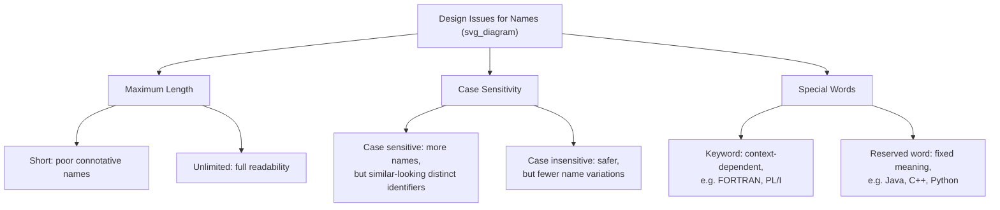

## Design Issues for Names

### Overview

When a programming language designer decides how names (identifiers) will work, several independent questions must be answered. These questions shape readability, writability, and the potential for naming-related errors. The central design issues are: maximum length, whether case is significant, and whether special words are reserved words or keywords.

### Maximum Length

**Key Points**
- If names can be too short, they cannot be connotative (meaningful), which hurts readability and writability.
- Language history shows a steady relaxation of length restrictions over time.

**Historical Progression**
- FORTRAN 95 allowed a maximum length of 31 characters.
- Early versions of BASIC allowed only two characters for a name.
- COBOL allowed up to 30 characters.
- C99 has a "significance" rule: only the first 63 characters of an identifier are significant, though the name can be longer.
- Java, C#, Ada, and Python impose no practical length limit on identifiers, and all characters are significant.

**Example**
A restrictive length limit forces programmers to choose cryptic names:

```
INTEGR   ! instead of INTEGRATOR (FORTRAN-era truncation)
```

Modern languages permit clear, self-documenting names instead:

```python
total_accumulated_interest = principal * rate * time
```

### Case Sensitivity

**Key Points**
- A language is case sensitive if names that differ only in the case of letters are considered distinct identifiers.
- Case sensitivity is a double-edged design choice: it increases the number of possible names but can seriously harm readability and writability.

**Readability Problem**
Case sensitivity creates two related issues:

1. Names that look similar but are technically different identifiers can be mistaken for one another, leading to subtle bugs.
2. If a language's predefined names (standard library identifiers, reserved words) are mixed-case, the programmer must remember the exact casing, which is harder than remembering an all-lowercase or case-insensitive name.

**Language Comparison**
- C, C++, Java, C#, and Python are case sensitive. In these languages, `rose`, `Rose`, and `ROSE` are three distinct names.
- Older languages such as classic BASIC and Pascal were not case sensitive (or treated identifiers as effectively insensitive).
- C# is a case-sensitive language whose predefined names use a mix of upper- and lowercase letters, which [Inference] is often cited as an ergonomic weakness compared to languages that keep predefined names entirely lowercase (such as C).

**Example**
```java
int count = 5;
int Count = 10;
int COUNT = 15;
// All three are legal, distinct variables in Java — a readability hazard
```

### Special Words: Reserved Words vs. Keywords

**Key Points**
- A special word is used by a programming language to aid readability by naming statements and structures, and by separating syntactic entities.
- The most important design question about special words is whether they are reserved words or merely keywords.

**Keyword**
A keyword is a word that is special only in certain contexts. It carries meaning as a language construct in specific positions but can otherwise be reused as an ordinary identifier elsewhere.

**Reserved Word**
A reserved word is a special word that cannot be used as a user-defined name under any circumstances. This is the stronger, safer form of restriction.

**Example — The FORTRAN Keyword Problem**
FORTRAN's use of keywords instead of reserved words created a well-known parsing ambiguity:

```
IF(cond) X = 1
```

Because `IF` is only a keyword (not reserved), FORTRAN allows this line to also be interpreted as an assignment to an array element:

```
IF(cond) = 1   ! IF used as an array name
```

The compiler must look ahead—sometimes significantly—to disambiguate whether `IF` is a control keyword or a variable name, which complicates compiler design and can confuse readers.

**Example — PL/I Keyword Problem**
PL/I made nearly all special words keywords rather than reserved words, permitting statements such as:

```
IF THEN THEN THEN = ELSE; ELSE ELSE = IF;
```

Here `THEN`, `ELSE`, and `IF` are simultaneously valid variable names and valid keywords depending on position — a construct that is legal but severely damages readability.

**Modern Practice**
Most contemporary languages, including Java, C++, C#, and Python, define their special words as reserved words. This design choice trades a small amount of naming flexibility (a programmer cannot name a variable `if` or `class`) for parsing simplicity and improved readability, since a reserved word always signals the same syntactic role wherever it appears.

### Design Comparison Diagram



### Conclusion

The design of names is not a single decision but a bundle of related trade-offs. Permissive maximum lengths favor readability and writability at essentially no cost in modern compilers. Case sensitivity increases naming flexibility but introduces readability risk through visually similar identifiers. Treating special words as reserved words, rather than mere keywords, sacrifices a small amount of naming freedom in exchange for eliminating dangerous parsing ambiguities like those seen in FORTRAN and PL/I. Together, these choices determine how easily a language's programs can be written correctly and read accurately.

**Related Topics**
- Variables: the six attributes (name, address, value, type, scope, lifetime)
- Binding and binding times (static vs. dynamic binding)
- The concept of type checking and type compatibility
- Scope and lifetime of variables (static scope vs. dynamic scope)
- Referencing environments
- Named constants