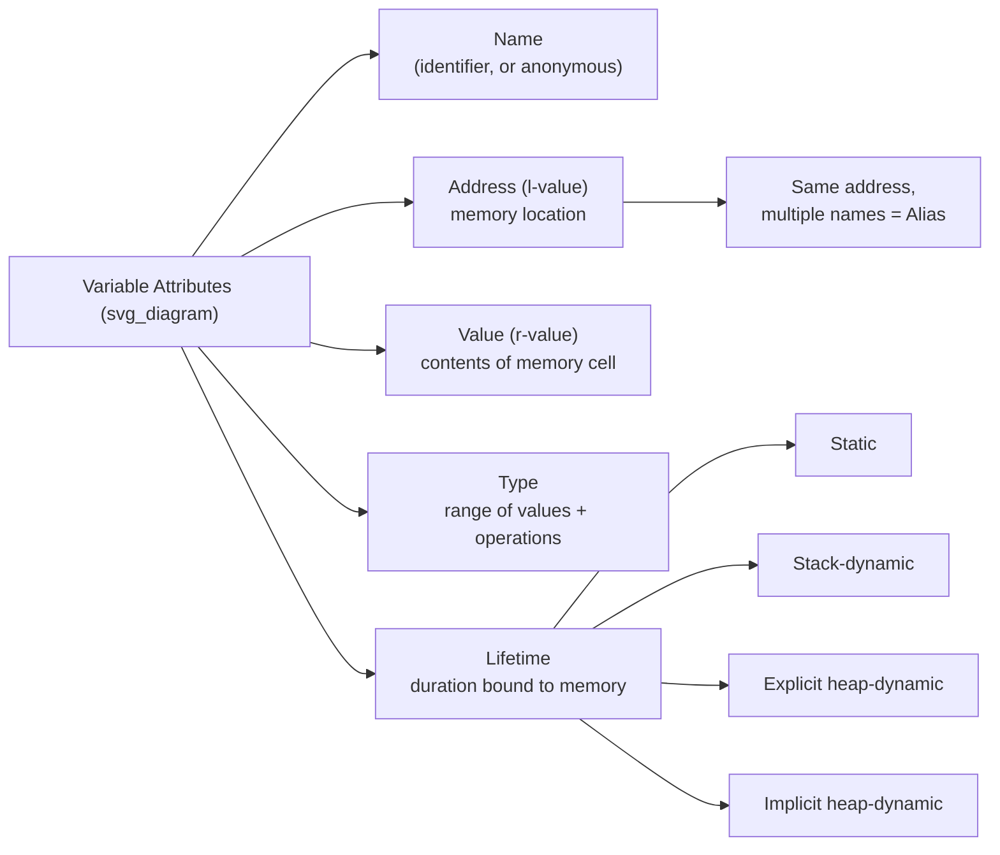

## Variables: Name, Address, Value, Type, Lifetime

### Overview

A variable in an imperative programming language can be characterized as a sextuple of attributes: name, address, value, type, scope, and lifetime. This section examines five of these — name, address, value, type, and lifetime — along with the related concepts of aliases, binding, and l-values/r-values that give these attributes their precise meaning.

### Name

**Key Points**
- Not all variables have names; some are anonymous.
- A variable's name is what most programmers think of first, but it is only one of several attributes that together define the variable.

**Explanation**
Most variables in a program are named through identifiers, following whatever design rules the language imposes (length, case sensitivity, reserved words, as discussed previously). However, some variables are unnamed, or *anonymous*. Anonymous variables are typically created dynamically and referenced only through pointers or references, never through an identifier.

**Example**
```java
int[] arr = new int[10];
// The array object created by `new int[10]` is anonymous;
// `arr` is a named reference (pointer) to it.
```

### Address

**Key Points**
- The address of a variable is the memory location with which it is associated.
- A variable's address is sometimes called its l-value, because the address is what is required when a variable appears on the left side of an assignment.

**Aliases**
It is possible for the same memory location — the same address — to be associated with more than one name in the same referencing environment. When this occurs, the multiple names are called **aliases**.

Aliases are generally considered detrimental to readability, since they allow a memory cell to be referred to by different names in different parts of a program, making it harder to trace what is being modified.

**How Aliases Arise**
- Pointer and reference variables can create aliasing by allowing multiple variables to point to the same memory cell.
- C and C++ `union` types can create aliases by allowing different typed fields to occupy the same address.
- Passing a variable as a parameter by reference can create an alias between the formal parameter and the actual argument.

**Example**
```c
int x = 5;
int *p = &x;
// x and *p are aliases: two names, one address
*p = 10;
printf("%d", x);   // prints 10
```

### Value

**Key Points**
- The value of a variable is the contents of the memory cell (or cells) associated with the variable.
- The value is sometimes referred to as the variable's r-value, because it is what is required when the variable's name appears on the right side of an assignment.

**Abstract Memory Cell**
To allow for machines with differently sized memory cells (bytes vs. words) and differently sized data representations, it is convenient to think in terms of an **abstract memory cell**, whose size matches the requirements of the variable it stores, rather than the physical cell size of the underlying hardware.

**Example**
```
x = 7        ! Requires the r-value of the literal 7,
             ! and the l-value (address) of x, to complete the assignment
```

### Type

**Key Points**
- The type of a variable determines the range of values the variable can store and the set of operations that are defined for values of that type.
- Type is one of the most consequential attributes because it also governs how much memory is allocated for the variable and how the bit pattern in that memory is interpreted.

**Example**
```python
count: int = 5      # type int: determines allowed operations (+, -, //, etc.)
name: str = "Ada"   # type str: determines allowed operations (concatenation, slicing, etc.)
```

An operation legal for one type is often illegal or has entirely different semantics for another:

```python
5 + 3        # 8   (int addition)
"5" + "3"    # "53" (str concatenation) — same operator, different type, different behavior
```

### Lifetime

**Key Points**
- The lifetime of a variable is the time during program execution in which the variable is bound to a specific memory cell.
- Lifetime is a runtime, execution-time concept, distinct from **scope**, which is a compile-time, textual concept.

**Categories of Variables by Lifetime**

1. **Static variables** — bound to a single memory cell for the entire execution of the program. Global variables and variables declared `static` in C are examples.
2. **Stack-dynamic variables** — storage is allocated when the declaration statement (or enclosing subprogram/block) is elaborated at runtime, and deallocated when that scope is exited. Local variables in most languages that do not specify `static` are stack-dynamic.
3. **Explicit heap-dynamic variables** — allocated and deallocated by explicit directives at runtime, referenced only through pointers or references (e.g., `new`/`delete` in C++, `malloc`/`free` in C).
4. **Implicit heap-dynamic variables** — bound to heap storage only when they are assigned a value; the storage is managed automatically by the runtime system. Many variables in Python and JavaScript behave this way.

**Example**
```c
void demo() {
    static int callCount = 0;   // static: lifetime = entire program execution
    int localVar = 5;           // stack-dynamic: lifetime = one call to demo()
    int *heapVar = malloc(sizeof(int));  // explicit heap-dynamic: lifetime controlled by malloc/free
    callCount++;
}
```

### Relationship Between Attributes



### Conclusion

Name, address, value, type, and lifetime together describe how a variable behaves as a program executes: what it is called, where it lives in memory, what it currently holds, what kind of data it can hold, and how long its binding to memory persists. Understanding these attributes separately clarifies phenomena such as aliasing (multiple names, one address) and explains why the same identifier can be associated with entirely different memory cells across different points in a program's execution, particularly for stack-dynamic and heap-dynamic variables.

**Related Topics**
- Scope and the referencing environment
- Binding and binding time (static vs. dynamic)
- Type checking and type compatibility
- Storage management for heap-dynamic variables (garbage collection)
- Pointer and reference types